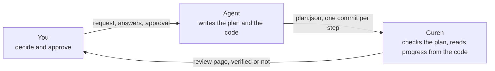
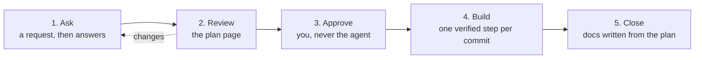

# Building with an Agent

In this course a coding agent (Claude Code) writes the code, and you decide what gets built. You make a meetup app in which users organize meetups and others register until a meetup is full. It takes two plans. You review each plan before any code exists, approve it, and then watch the agent build it one step at a time.

The course teaches the decisions, not the typing. The decisions are these:

- answering the questions the agent could not settle alone
- reading a plan and judging whether it describes what you want
- approving it, which is the moment the design is fixed
- accepting each step the agent commits
- deciding what to do when the application moves under a plan

If you would rather learn the framework itself first, start with [the Guren Tutorial](../tutorials/00-overview.md). This course assumes nothing from it.

## Who does what

The agent never reports its own progress. `guren plan:verify` reads it from the schema, the routes, the controllers and the test results. That is what lets you step away while the agent works: when it says a step is done, the framework has already checked.

## The loop

Every plan goes through the same five stages. Chapters 2 to 5 take the first plan through them, chapters 6 and 7 the second.

Each stage has a short checklist in its chapter. The checklists are what you take away: they work on any plan, whichever model wrote it.

## Chapters

| # | Chapter | Stage | Time |
|---|---|---|---|
| 1 | [An app the agent can work in](./01-setup.md) | setup | 20 min |
| 2 | [The first plan](./02-the-first-plan.md) | ask | 30 min |
| 3 | [Review and approve](./03-review-and-approve.md) | review, approve | 30 min |
| 4 | [One step at a time](./04-one-step-at-a-time.md) | build | 60 min |
| 5 | [Close the plan](./05-close-the-plan.md) | close | 20 min |
| 6 | [A plan that changes what exists](./06-changing-what-exists.md) | ask to approve | 40 min |
| 7 | [When the application moves](./07-when-the-application-moves.md) | build, close | 60 min |
| 8 | [Plans in CI](./08-plans-in-ci.md) | after | 20 min |

## Before you start

- **[Bun](https://bun.sh) 1.4.2** and **git.** The app uses SQLite, so there is no database server to install.
- **[Claude Code](https://claude.com/claude-code).** The prompts are written for it. The harness also supports Codex, Cursor, Copilot and OpenCode.
- **TypeScript.** You read the code the agent writes; you rarely write it.

Every step the agent takes also has a version you can run yourself, marked **Without an agent**. Those blocks build on each other, and they use a reference plan whose names (`AC-meetups-7`, `route.meetups.edit`) the chapters quote. Your agent's plan will use other names. Chapters 2 and 6 each end a plan's draft with a choice: keep your plan and read the quoted names as examples, or switch to the reference plan and follow the course exactly. With no agent at all, run every **Without an agent** block and you are on the reference path throughout.

## How the course stays correct

The framework's CI runs every chapter in order against the framework's current source, using the **Without an agent** version of each step, and ends each chapter with `bunx guren gate` and a build. A framework change that breaks a step fails the framework's build, not yours. The agent's output is never part of that run; the checklists and the gate judge it.
