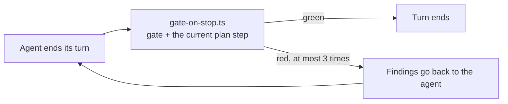

# Chapter 1: An App the Agent Can Work In

This chapter scaffolds the app, adds sign-in, and shows you the two parts of the harness that the rest of the course leans on. You write no application code.

**What you'll learn:**

- What `create-guren-app` installs for the agent, and where it lives
- The two skills that carry a plan: `plan-write` and `plan-implement`
- What the `Stop` hook does when the agent says it is done

## 1. Scaffold

```bash run
bunx create-guren-app guren-meetups --mode ssr --db sqlite --agents claude --git
```

```bash run
cd guren-meetups
```

Meetups belong to users, so the app needs accounts before anything else:

```bash run
bunx guren add auth
bun run db:migrate
```

`add auth` writes the `users` table, the sign-in and sign-up pages, and the session wiring. Check the result with the gate, the same one CI runs:

```bash run
bunx guren gate
```

Every stage should pass: codegen, typecheck, lint, `check`, `audit` and the tests. Codegen also refreshed the typed manifests under `.guren/`, so commit after the gate, not before:

```bash run
git add -A
git commit -m "feat: add sign-in"
```

## 2. What the agent reads

`--agents claude` installed a harness. Three parts of it matter here:

| Path | What it does |
|---|---|
| `CLAUDE.md` | The first thing the agent reads: which `guren` commands answer "what is in this app?" |
| `.claude/skills/` | Procedures the agent follows for a kind of task. `plan-write` and `plan-implement` are this course's |
| `.claude/hooks/gate-on-stop.ts` | Runs when the agent finishes a turn (below) |

```bash run
ls .claude/skills
```

**`plan-write`** turns a request into `docs/plans/<slug>/plan.json`. It asks you what it cannot decide, checks the plan against the app, and stops. It never approves.

**`plan-implement`** builds an approved plan one step at a time, with one commit per step.

### The Stop hook

When the agent ends a turn, `gate-on-stop.ts` runs `guren gate` on uncommitted work: codegen, typecheck, lint, `check`, `audit` and the tests. If a stage fails, the hook blocks the stop once and hands the findings back to the agent. During a plan it also verifies the step the agent is on, and sends the agent back up to three times while the step is not verified.



The gate is the one you ran in section 1. You will not configure any of this. It is why "the agent says it's done" and "it is done" come close to meaning the same thing.

Claude Code's own documentation covers each part: [CLAUDE.md](https://code.claude.com/docs/en/memory), [skills](https://code.claude.com/docs/en/skills), and [hooks](https://code.claude.com/docs/en/hooks), including the [`Stop`](https://code.claude.com/docs/en/hooks#stop) and [`SessionStart`](https://code.claude.com/docs/en/hooks#sessionstart) events this course relies on.

## 3. Start the agent

Open a second terminal in `guren-meetups` and start Claude Code:

```bash manual
claude
```

Leave it open. From chapter 2 on, each prompt appears in a code block introduced as a prompt for Claude Code; paste it into this session and send it.

## Where you are

- A scaffolded app with sign-in, committed.
- A harness the agent reads, with the two plan skills and the Stop hook.

## Common trip-ups

- **`bunx guren` is not found.** Run it inside `guren-meetups`, where `@guren/cli` is installed. The `guren` package on npm is a placeholder.
- **`db:migrate` fails with "no such file".** Run it from the app root, not the directory above it.

## Exercises

1. Open `.claude/skills/plan-write/SKILL.md`. Find the one command it tells the agent never to run, and the reason it gives.
2. Run `bunx guren context`. This is what the `SessionStart` hook injects into every agent session. Which of its sections would you read first before planning a change?

## Next

[Chapter 2: The First Plan](./02-the-first-plan.md) asks the agent for a plan and shows you how to read what comes back.
