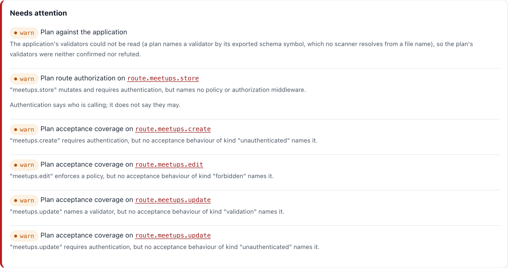

# Chapter 2: The First Plan

A plan is the design of a change, written as JSON before any code exists. In this chapter the agent writes the first one, for organizing meetups, and you read it on the review page Guren renders from it.

**What you'll learn:**

- What to put in the request, and what to leave for the agent to ask
- What a plan contains, section by section
- How to read the review page: the five things to check before anything else

## 1. Ask for the plan

In the Claude Code session from chapter 1, send this:

```text
Plan this feature with the plan-write skill: signed-in users organize meetups, each with a title, a start time and a capacity, and they can edit the meetups they organize. Nobody registers for a meetup yet; that comes in a later plan.
```

The request says **what** and **who**. It leaves out routes, tables and pages on purpose: those are the agent's first draft, and the review page is where you correct them.

Before it writes anything, the `plan-write` skill has the agent read the app (`bunx guren context`, `bunx guren model:list`) and then ask you what changes the design. Expect questions like these:

- Can a guest see meetups, or only signed-in users?
- Can an organizer delete a meetup?
- Is there an upper limit on capacity?

Answer the ones you have decided. A question you leave open is not lost: the agent writes it into the plan with the answer it assumed, and you settle it on the review page in chapter 3. In the reference plan below, "Can guests browse meetups?" was left open.

The agent then writes `docs/plans/meetups/plan.json` and runs `bunx guren plan:render --json` until no check fails.

**Without an agent:** write the plan yourself. It is long; you do not need to read it line by line, since the review page below is how you read it.

```bash run fallback
mkdir -p docs/plans/meetups
```

<details>
<summary>docs/plans/meetups/plan.json</summary>

```json file=docs/plans/meetups/plan.json fallback
{
  "planVersion": 1,
  "title": "Meetups",
  "summary": "Signed-in users organize meetups with a capacity and edit the ones they organize. Anyone can browse them.",
  "locale": "en",
  "scope": {"goals": ["Organize a meetup", "Edit your own meetup", "Browse meetups"], "nonGoals": ["Registering for a meetup", "Deleting a meetup"]},
  "assumptions": ["Meetups are listed soonest first"],
  "questions": [
    {
      "id": "Q-guests",
      "question": "Can guests browse meetups?",
      "options": [
        {"label": "yes", "consequence": "The list and the meetup page need no sign-in."},
        {"label": "no", "consequence": "The list and the meetup page sit behind the login wall."}
      ],
      "assumed": "yes",
      "affects": ["route.meetups.index", "route.meetups.show"]
    }
  ],
  "models": [
    {
      "id": "model.user",
      "change": {"kind": "existing"},
      "name": "User",
      "table": "users",
      "columns": [{"id": "column.user.id", "name": "id", "change": {"kind": "existing"}, "type": "integer", "nullable": false, "unique": false, "index": false, "primaryKey": true}],
      "relationships": [],
      "fillable": []
    },
    {
      "id": "model.meetup",
      "change": {"kind": "add"},
      "name": "Meetup",
      "table": "meetups",
      "columns": [
        {"id": "column.meetup.id", "name": "id", "change": {"kind": "add"}, "type": "integer", "nullable": false, "unique": false, "index": false, "primaryKey": true},
        {"id": "column.meetup.title", "name": "title", "change": {"kind": "add"}, "type": "string", "nullable": false, "unique": false, "index": false},
        {
          "id": "column.meetup.startsAt",
          "name": "startsAt",
          "columnName": "starts_at",
          "change": {"kind": "add"},
          "type": "string",
          "nullable": false,
          "unique": false,
          "index": true
        },
        {"id": "column.meetup.capacity", "name": "capacity", "change": {"kind": "add"}, "type": "integer", "nullable": false, "unique": false, "index": false},
        {
          "id": "column.meetup.organizerId",
          "name": "organizerId",
          "columnName": "organizer_id",
          "change": {"kind": "add"},
          "type": "integer",
          "nullable": false,
          "unique": false,
          "index": true,
          "references": {"model": "model.user", "column": "id", "onDelete": "cascade"}
        }
      ],
      "relationships": [{"name": "organizer", "type": "belongsTo", "target": "model.user"}],
      "fillable": ["title", "startsAt", "capacity"]
    }
  ],
  "validators": [
    {
      "id": "validator.meetup",
      "change": {"kind": "add"},
      "name": "MeetupPayloadSchema",
      "fields": [
        {"name": "title", "type": "string", "required": true, "rules": ["min 1", "max 120"]},
        {"name": "startsAt", "type": "string", "required": true, "rules": ["min 1"]},
        {"name": "capacity", "type": "integer", "required": true, "rules": ["min 1", "max 500"]}
      ]
    }
  ],
  "controllers": [
    {
      "id": "controller.meetups",
      "change": {"kind": "add"},
      "className": "MeetupController",
      "actions": [
        {
          "id": "action.meetups.index",
          "change": {"kind": "add"},
          "name": "index",
          "authorization": {"middleware": []},
          "response": {"kind": "inertia", "view": "view.meetups.index"},
          "rules": ["Upcoming meetups first."]
        },
        {
          "id": "action.meetups.show",
          "change": {"kind": "add"},
          "name": "show",
          "authorization": {"middleware": []},
          "response": {"kind": "inertia", "view": "view.meetups.show"},
          "rules": []
        },
        {
          "id": "action.meetups.create",
          "change": {"kind": "add"},
          "name": "create",
          "authorization": {"middleware": ["auth"]},
          "response": {"kind": "inertia", "view": "view.meetups.create"},
          "rules": []
        },
        {
          "id": "action.meetups.store",
          "change": {"kind": "add"},
          "name": "store",
          "body": "validator.meetup",
          "authorization": {"middleware": ["auth"]},
          "response": {"kind": "redirect", "to": "/meetups/:id"},
          "rules": ["The organizer is the signed-in user."]
        },
        {
          "id": "action.meetups.edit",
          "change": {"kind": "add"},
          "name": "edit",
          "authorization": {"middleware": ["auth"], "policy": {"id": "policy.meetup", "ability": "update"}},
          "response": {"kind": "inertia", "view": "view.meetups.edit"},
          "rules": []
        },
        {
          "id": "action.meetups.update",
          "change": {"kind": "add"},
          "name": "update",
          "body": "validator.meetup",
          "authorization": {"middleware": ["auth"], "policy": {"id": "policy.meetup", "ability": "update"}},
          "response": {"kind": "redirect", "to": "/meetups/:id"},
          "rules": []
        }
      ]
    }
  ],
  "routes": [
    {
      "id": "route.meetups.index",
      "change": {"kind": "add"},
      "method": "GET",
      "path": "/meetups",
      "name": "meetups.index",
      "action": "action.meetups.index",
      "middleware": [],
      "bind": []
    },
    {
      "id": "route.meetups.create",
      "change": {"kind": "add"},
      "method": "GET",
      "path": "/meetups/create",
      "name": "meetups.create",
      "action": "action.meetups.create",
      "middleware": ["auth"],
      "bind": []
    },
    {
      "id": "route.meetups.store",
      "change": {"kind": "add"},
      "method": "POST",
      "path": "/meetups",
      "name": "meetups.store",
      "action": "action.meetups.store",
      "middleware": ["auth"],
      "bind": []
    },
    {
      "id": "route.meetups.show",
      "change": {"kind": "add"},
      "method": "GET",
      "path": "/meetups/:id",
      "name": "meetups.show",
      "action": "action.meetups.show",
      "middleware": [],
      "bind": [{"param": "id", "model": "model.meetup"}]
    },
    {
      "id": "route.meetups.edit",
      "change": {"kind": "add"},
      "method": "GET",
      "path": "/meetups/:id/edit",
      "name": "meetups.edit",
      "action": "action.meetups.edit",
      "middleware": ["auth"],
      "bind": [{"param": "id", "model": "model.meetup"}]
    },
    {
      "id": "route.meetups.update",
      "change": {"kind": "add"},
      "method": "PUT",
      "path": "/meetups/:id",
      "name": "meetups.update",
      "action": "action.meetups.update",
      "middleware": ["auth"],
      "bind": [{"param": "id", "model": "model.meetup"}]
    }
  ],
  "views": [
    {
      "id": "view.meetups.index",
      "change": {"kind": "add"},
      "page": "meetups/Index",
      "purpose": "List upcoming meetups, soonest first.",
      "props": [{"name": "meetups", "type": "Data.Meetup[]", "resource": "resource.meetup"}],
      "actions": [{"label": "New meetup", "route": "route.meetups.create"}],
      "states": {"empty": "No meetups yet."}
    },
    {
      "id": "view.meetups.show",
      "change": {"kind": "add"},
      "page": "meetups/Show",
      "purpose": "Show a meetup and who organizes it.",
      "props": [{"name": "meetup", "type": "Data.Meetup", "resource": "resource.meetup"}],
      "actions": [{"label": "Edit", "route": "route.meetups.edit"}],
      "states": {}
    },
    {
      "id": "view.meetups.create",
      "change": {"kind": "add"},
      "page": "meetups/Create",
      "purpose": "Organize a meetup.",
      "props": [],
      "form": {
        "validator": "validator.meetup",
        "submitsTo": "route.meetups.store",
        "fields": [
          {"field": "title", "label": "Title", "input": "text"},
          {"field": "startsAt", "label": "Starts at", "input": "datetime"},
          {"field": "capacity", "label": "Capacity", "input": "number"}
        ]
      },
      "actions": [],
      "states": {}
    },
    {
      "id": "view.meetups.edit",
      "change": {"kind": "add"},
      "page": "meetups/Edit",
      "purpose": "Edit a meetup you organize.",
      "props": [{"name": "meetup", "type": "Data.Meetup", "resource": "resource.meetup"}],
      "form": {
        "validator": "validator.meetup",
        "submitsTo": "route.meetups.update",
        "fields": [
          {"field": "title", "label": "Title", "input": "text"},
          {"field": "startsAt", "label": "Starts at", "input": "datetime"},
          {"field": "capacity", "label": "Capacity", "input": "number"}
        ]
      },
      "actions": [],
      "states": {}
    }
  ],
  "resources": [
    {
      "id": "resource.meetup",
      "change": {"kind": "add"},
      "name": "MeetupResource",
      "model": "model.meetup",
      "fields": [{"name": "id", "type": "number"}, {"name": "title", "type": "string"}, {"name": "startsAt", "type": "string"}, {"name": "capacity", "type": "number"}]
    }
  ],
  "policies": [
    {
      "id": "policy.meetup",
      "change": {"kind": "add"},
      "name": "MeetupPolicy",
      "model": "model.meetup",
      "abilities": [{"name": "update", "rule": "The signed-in user organizes the meetup."}]
    }
  ],
  "tasks": [
    {
      "id": "task.meetups",
      "entity": "Meetup",
      "summary": "Organize a meetup and edit your own.",
      "covers": [
        "model.meetup",
        "validator.meetup",
        "controller.meetups",
        "route.meetups.index",
        "route.meetups.create",
        "route.meetups.store",
        "route.meetups.show",
        "route.meetups.edit",
        "route.meetups.update",
        "view.meetups.index",
        "view.meetups.show",
        "view.meetups.create",
        "view.meetups.edit",
        "resource.meetup",
        "policy.meetup"
      ],
      "acceptance": [
        {
          "id": "AC-meetups-1",
          "description": "A signed-in user can organize a meetup.",
          "kind": "success",
          "actor": "user",
          "route": "route.meetups.store",
          "given": [],
          "input": [{"name": "title", "json": "\"Bun night\""}, {"name": "startsAt", "json": "\"2026-10-20T19:00\""}, {"name": "capacity", "json": "20"}],
          "expect": {"status": 303, "database": [{"table": "meetups", "has": [{"name": "title", "json": "\"Bun night\""}]}]}
        },
        {
          "id": "AC-meetups-2",
          "description": "A meetup needs at least one seat.",
          "kind": "validation",
          "actor": "user",
          "route": "route.meetups.store",
          "given": [],
          "input": [{"name": "title", "json": "\"Bun night\""}, {"name": "startsAt", "json": "\"2026-10-20T19:00\""}, {"name": "capacity", "json": "0"}],
          "expect": {"status": 422, "errors": ["capacity"]}
        },
        {
          "id": "AC-meetups-3",
          "description": "A guest cannot organize a meetup.",
          "kind": "unauthenticated",
          "actor": "guest",
          "route": "route.meetups.store",
          "given": [],
          "expect": {"redirect": "/login"}
        },
        {
          "id": "AC-meetups-4",
          "description": "A user cannot edit someone else's meetup.",
          "kind": "forbidden",
          "actor": "user",
          "route": "route.meetups.update",
          "given": ["a meetup organized by another user exists"],
          "expect": {"status": 403}
        },
        {
          "id": "AC-meetups-5",
          "description": "Anyone can see the list of meetups.",
          "kind": "success",
          "actor": "guest",
          "route": "route.meetups.index",
          "given": ["a meetup exists"],
          "expect": {"status": 200}
        },
        {
          "id": "AC-meetups-6",
          "description": "A guest cannot open the edit form.",
          "kind": "unauthenticated",
          "actor": "guest",
          "route": "route.meetups.edit",
          "given": ["a meetup exists"],
          "expect": {"redirect": "/login"}
        },
        {
          "id": "AC-meetups-7",
          "description": "The organizer can edit their meetup.",
          "kind": "success",
          "actor": "user",
          "route": "route.meetups.update",
          "given": ["the user organizes a meetup"],
          "input": [{"name": "title", "json": "\"Bun night 2\""}, {"name": "startsAt", "json": "\"2026-10-20T19:00\""}, {"name": "capacity", "json": "30"}],
          "expect": {"status": 303, "database": [{"table": "meetups", "has": [{"name": "title", "json": "\"Bun night 2\""}]}]}
        }
      ]
    }
  ]
}
```

</details>

## 2. What is in a plan

| Section | Holds |
|---|---|
| `scope` | goals and non-goals, in a sentence each |
| `questions` | what the agent could not decide, with the answer it assumed |
| `models`, `validators`, `controllers`, `routes`, `views`, `resources`, `policies` | the design, one element per thing that changes |
| `tasks` | the acceptance behaviours: each one becomes a test |

Every element has an `id` (`route.meetups.store`) and a `change`: `add`, `alter`, `rename`, `drop`, or `existing` for something the plan only refers to. Here everything is `add` except `model.user`, which the meetups point at.

## 3. Render the review page

```bash run
bunx guren plan:render docs/plans/meetups/plan.json
```

It checks the plan against the app and writes `docs/plans/meetups/plan.html`. Open that file in your browser:

```bash manual
open docs/plans/meetups/plan.html
```

The page makes no network requests, so you can attach it to a review as it is.



## 4. Read it in this order

Five checks, top to bottom. Skip the element tabs on a first read; they are for checking a detail once you know what to check.

| # | Look at | Ask yourself |
|---|---|---|
| 1 | Goals and non-goals | Is this what I asked for, and nothing more? |
| 2 | Needs attention | Is anything `fail`? Each `warn`: is it a mistake, or a choice I agree with? |
| 3 | Questions | Do I agree with each assumed answer? |
| 4 | Tasks & acceptance | Is every rule I care about a behaviour? |
| 5 | Tasks & acceptance | Does every route behind a policy have a `success` behaviour for the user the policy lets in? |

The last two rows matter most. A rule that is not a behaviour has no test, and the loop in chapter 4 only counts what tests prove. "Only the organizer can edit" has to appear as a `forbidden` behaviour, or nothing checks it.

Row 5 is the one the page cannot help with. A policy that refuses everyone passes every `forbidden` test, so only a test of the user who *is* allowed catches it. The page warns about missing `forbidden`, `unauthenticated` and `validation` behaviours, but not about this one.

For this plan, the warnings say:

| Warning | Verdict |
|---|---|
| `meetups.store` names no policy | A choice: any signed-in user may organize a meetup. Keep it |
| `meetups.create` / `meetups.update` have no `unauthenticated` behaviour, `meetups.edit` no `forbidden`, `meetups.update` no `validation` | Mistakes. These are rules with no test yet |

Row 5 finds one more: `meetups.update` has a success behaviour for the organizer (`AC-meetups-7`), but `meetups.edit` has none.

You fix these in chapter 3, together with the open question.

## 5. Your plan, or this one

From here on, the chapters name elements of the reference plan above: `route.meetups.edit`, `AC-meetups-7`, the step `task/entity/model.meetup/http`. If your agent wrote the plan, its ids will differ. Choose one:

- **Keep your plan.** Read the names in later chapters as examples, and find the matching element in yours. The checklists work on any plan.
- **Switch to the reference plan.** Copy the **Without an agent** block above over `docs/plans/meetups/plan.json`. From then on every name, command and output in the course matches yours exactly.

If this is your first time through, switch. The **Without an agent** blocks build on each other, so this is the last easy point to join them until chapter 6.

## 6. Commit the draft

The draft is a document like any other. Commit it, so the review in chapter 3 starts from a clean tree:

```bash run
git add docs/plans
git commit -m "docs: draft the meetups plan"
```

## Where you are

- `docs/plans/meetups/plan.json`, a draft nobody has approved.
- A review page, rendered and ignored by git.
- A list of what to change: one open question, five missing behaviours.

## Common trip-ups

- **The agent starts writing code.** Stop it and say "only the plan". The skill ends at the plan, but an agent can drift into implementing if the request reads like a task.
- **`plan:render` prints a schema error.** The JSON does not match the plan schema. The message names the field; send it back to the agent.
- **The agent runs `plan:approve`.** It must not; approving is yours. Delete `approvals.json` and tell the agent so.

## Exercises

1. Filter the review page to one entity with the **Entity** menu, then turn on **Changes only**. What disappears, and why is that the view you want for a plan that mostly adds?
2. Pick one behaviour in **Tasks & acceptance** and write, in one sentence, the test it will become. Chapter 4 shows the real one.

## Next

[Chapter 3: Review and Approve](./03-review-and-approve.md) answers the question, adds the missing behaviours, and approves the plan.
