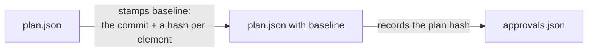

# Chapter 3: Review and Approve

Chapter 2 ended with a list: one open question, five missing behaviours. In this chapter you hand that review to the agent, check what it changed, and approve the plan. Approval is the one step in the loop that only you take.

**What you'll learn:**

- How the review page turns your decisions into feedback the agent can apply
- What `plan:revise` records, and why a revision carries a reason
- What approval fixes in place, and the checklist to run before it

## 1. Review on the page

Open `docs/plans/meetups/plan.html` again. Three kinds of input on it become feedback:

| On the page | Becomes |
|---|---|
| An option picked under a question | the answer; the plan must drop the question |
| **Approve** on an element | a lock: the element may change later only with a stated reason |
| **Request changes** plus a comment | a note the agent reads; nothing enforces it |

For this plan:

1. Under **Can guests browse meetups?**, keep **yes** selected and write "Yes, browsing is public." in the answer box.
2. On `route.meetups.store`, leave the policy warning alone. It is a choice you made in chapter 2.
3. Click **Copy feedback** at the bottom of the page.

## 2. Hand the review to the agent

Send this prompt to the Claude Code session:

```text
Apply my review of docs/plans/meetups/plan.json with plan:revise. Add a behaviour for each acceptance warning on the page: unauthenticated for meetups.create and meetups.update, forbidden for meetups.edit, validation for meetups.update. Also add a success behaviour for the organizer opening meetups.edit. Keep the meetups.store warning, since any signed-in user may organize a meetup. Here is the page's feedback:

<paste the copied feedback here>
```

The `plan-write` skill edits a copy of the plan outside the repository, then runs `bunx guren plan:revise` with the copy and your feedback. `plan:revise` refuses the copy if it still holds a question you answered, and it records each change with its reason in `docs/plans/meetups/revisions/0001.json`.

**Without an agent:** pass the changes as operations, each with its reason.

<details>
<summary>plan:revise with five new behaviours and the answered question</summary>

```bash run fallback
bunx guren plan:revise docs/plans/meetups/plan.json --ops - <<'EOF'
{
  "ops": [
    {"op": "remove", "id": "Q-guests", "reason": "Answered: guests can browse meetups."},
    {"op": "modify", "section": "plan", "element": {"title": "Meetups", "summary": "Signed-in users organize meetups with a capacity and edit the ones they organize. Anyone can browse them.", "scope": {"goals": ["Organize a meetup", "Edit your own meetup", "Browse meetups"], "nonGoals": ["Registering for a meetup", "Deleting a meetup"]}, "assumptions": ["Meetups are listed soonest first", "Guests can browse meetups"], "hints": [], "locale": "en"}, "reason": "Record the answer to Q-guests."},
    {"op": "add", "section": "acceptance", "parent": "task.meetups", "element": {"id": "AC-meetups-8", "description": "A guest cannot open the form for a new meetup.", "kind": "unauthenticated", "actor": "guest", "route": "route.meetups.create", "given": [], "expect": {"redirect": "/login"}}, "reason": "A rule on a route with no behaviour has no test."},
    {"op": "add", "section": "acceptance", "parent": "task.meetups", "element": {"id": "AC-meetups-9", "description": "A user cannot open the edit form of someone else's meetup.", "kind": "forbidden", "actor": "user", "route": "route.meetups.edit", "given": ["a meetup organized by another user exists"], "expect": {"status": 403}}, "reason": "A rule on a route with no behaviour has no test."},
    {"op": "add", "section": "acceptance", "parent": "task.meetups", "element": {"id": "AC-meetups-10", "description": "An edit needs at least one seat.", "kind": "validation", "actor": "user", "route": "route.meetups.update", "given": ["the user organizes a meetup"], "input": [{"name": "title", "json": "\"Bun night\""}, {"name": "startsAt", "json": "\"2026-10-20T19:00\""}, {"name": "capacity", "json": "0"}], "expect": {"status": 422, "errors": ["capacity"]}}, "reason": "A rule on a route with no behaviour has no test."},
    {"op": "add", "section": "acceptance", "parent": "task.meetups", "element": {"id": "AC-meetups-11", "description": "A guest cannot edit a meetup.", "kind": "unauthenticated", "actor": "guest", "route": "route.meetups.update", "given": ["a meetup exists"], "expect": {"redirect": "/login"}}, "reason": "A rule on a route with no behaviour has no test."},
    {"op": "add", "section": "acceptance", "parent": "task.meetups", "element": {"id": "AC-meetups-12", "description": "The organizer can open the edit form.", "kind": "success", "actor": "user", "route": "route.meetups.edit", "given": ["the user organizes a meetup"], "expect": {"status": 200}}, "reason": "A policy that denies everyone passes every forbidden test; only the allowed user fails it."}
  ]
}
EOF
```

</details>

## 3. Check what changed

Render the page again:

```bash run
bunx guren plan:render docs/plans/meetups/plan.json
```

Reload it in the browser. **Needs attention** now holds one warning: the `meetups.store` policy one you kept. **Tasks & acceptance** lists twelve behaviours.

The revision is on disk as data, so you can read exactly what the agent did:

```bash run
cat docs/plans/meetups/revisions/0001.json
```

Each op names an element and the reason for the change. Six months from now, "why does the plan have AC-meetups-9?" has an answer in the repository.

Commit the revised plan:

```bash run
git add docs/plans
git commit -m "docs: apply the review to the meetups plan"
```

## 4. Before you approve

| Check | Where |
|---|---|
| No check is `fail` | Needs attention |
| No question is open | Questions (the section is gone) |
| Every `warn` left is a choice you can name | Needs attention |
| Every rule you care about is a behaviour | Tasks & acceptance |
| Every route behind a policy has a `success` behaviour for the allowed user | Tasks & acceptance |
| The tree is clean | `git status` |

`plan:approve` enforces the first two and the last. The three in between are yours.

## 5. Approve

```bash run
bunx guren plan:approve docs/plans/meetups/plan.json
```

Approval does two things:



- **The baseline** records the commit and a hash of what the app held for each element. Chapter 7 shows what it is for: noticing when the app moves after approval.
- **The approval** records the plan's hash in `docs/plans/meetups/approvals.json`. Every command that builds the plan checks it, so an edit to `plan.json` after approval stops the build until someone approves again.

Commit both:

```bash run
git add docs/plans
git commit -m "docs: approve the meetups plan"
```

## Where you are

- An approved plan with twelve behaviours and no open question.
- `revisions/0001.json`, the review as data.
- `approvals.json`, which the build commands check.

## Common trip-ups

- **`plan:approve` says the tree is dirty.** Commit the revised plan first. Files the agent left at the app root (a copy of the plan, `feedback.json`) count too; move them out of the repository.
- **`plan:revise` refuses because an answered question is kept.** The copy still has the question in `questions`. The answer belongs in `assumptions`.
- **`plan:revise` says an element the feedback approved changes.** You clicked **Approve** on it. Either the change is wrong, or it needs `--reopens "<why>"`.

## Exercises

1. Edit one word in the approved `plan.json` and run `bunx guren plan:next docs/plans/meetups/plan.json`. Read the refusal, then restore the file with `git checkout docs/plans/meetups/plan.json`.
2. Read `approvals.json`. When you approve the plan in chapter 6, its approvals file also gets a `readings` field, which this one lacks. What does this plan have none of that the second plan will?

## Next

[Chapter 4: One Step at a Time](./04-one-step-at-a-time.md) hands the approved plan to the agent and follows it through five verified steps.
