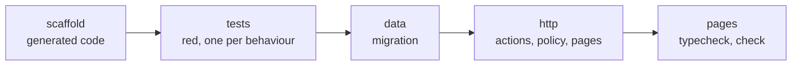
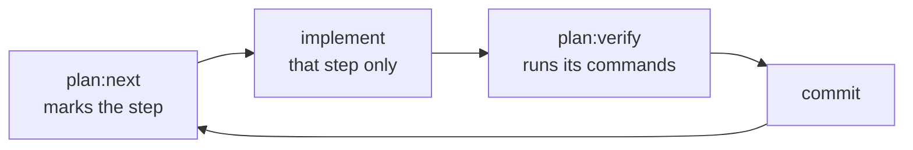

# Chapter 4: One Step at a Time

The plan is approved. In this chapter the agent builds it. Guren splits the plan into steps; the agent takes one, implements it, has it verified, and commits. Your part is to read each commit before the next one lands.

**What you'll learn:**

- How a plan becomes steps, and what each kind of step writes
- What "verified" means, and who decides it
- What to check in each step's commit

## 1. The steps

Guren derives the steps from the plan; nobody writes them. This plan has one entity, so it gets one task of five steps:



Every step runs the same loop:



`plan:verify` runs the step's commands (codegen, typecheck, `guren check`, the migration, the tests) and records the result under `.guren/plans/`, which git ignores. A step is **verified** when its commands pass and the plan elements it covers read as built in the code. The agent's opinion is not an input.

## 2. Start the agent

Send this prompt to the Claude Code session:

```text
Implement docs/plans/meetups/plan.json with the plan-implement skill. One commit per step. Stop when plan:next says every step is verified.
```

The agent now runs the loop by itself. When it tries to end its turn early, the Stop hook from chapter 1 verifies the marked step and sends the agent back if the step is not verified.

While it works, follow along in your own terminal:

```bash manual
git log --oneline
```

Each commit names its step in brackets. Read each one as it lands, using the checklist in section 4.

## 3. The steps, one by one

This section shows what each step produces. With an agent, you only read it. Without one, run each block.

### scaffold

```bash run fallback
bunx guren plan:next docs/plans/meetups/plan.json
bunx guren plan:scaffold docs/plans/meetups/plan.json --step task/entity/model.meetup/scaffold
bunx guren plan:verify docs/plans/meetups/plan.json --step task/entity/model.meetup/scaffold
git add -A
git commit -m "feat(meetups): scaffold [task/entity/model.meetup/scaffold]"
```

`plan:scaffold` writes the code the plan fully determines: the `meetups` table in `db/schema.ts`, the `Meetup` model, the validator, the resource, a policy that denies everything, a controller whose actions answer 501, and `routes/meetups.ts`, not yet mounted. Nobody writes these by hand, the agent included.

### tests

```bash run fallback
bunx guren plan:next docs/plans/meetups/plan.json
bunx guren plan:scaffold docs/plans/meetups/plan.json --step task/entity/model.meetup/tests
```

This writes `tests/plans/meetups/meetups.test.ts`: one test per behaviour, titled `[AC-meetups-1] …`, each with its request already written. What it cannot write is the setup, the rows and the signed-in user a behaviour assumes. Each test stops at a `given('…')` call naming that setup, and filling those in is the step's work.

<details>
<summary>tests/plans/meetups/meetups.test.ts, with the setup written</summary>

```ts file=tests/plans/meetups/meetups.test.ts fallback
import { beforeEach, describe, expect, test } from 'bun:test'
import { TestApp } from '@guren/testing'
import { resetDatabase } from '../../../config/database.js'
import { Meetup } from '../../../app/Models/Meetup.js'
import { User, type UserRecord } from '../../../app/Models/User.js'

let booted: Promise<TestApp> | undefined

function ready(): Promise<TestApp> {
  booted ??= import('../../../src/app.js').then(({ default: app }) => TestApp.fromApp(app))
  return booted
}

async function client(actor?: object): Promise<TestApp> {
  const http = actor === undefined ? await ready() : (await ready()).actingAs(actor)
  return http.withCsrf()
}

let ada: UserRecord
let grace: UserRecord

function meetupBy(organizer: UserRecord) {
  return Meetup.forceCreate({ title: 'Bun night', startsAt: '2026-10-20T19:00', capacity: 20, organizerId: organizer.id })
}

beforeEach(async () => {
  await ready()
  await resetDatabase()
  ada = await User.create({ name: 'Ada', email: 'ada@example.com', password: 'correct horse battery' })
  grace = await User.create({ name: 'Grace', email: 'grace@example.com', password: 'correct horse battery' })
})

describe('Meetup', () => {
  test('[AC-meetups-1] A signed-in user can organize a meetup.', async () => {
    await (await client(ada)).post('/meetups', { title: 'Bun night', startsAt: '2026-10-20T19:00', capacity: 20 }).assertStatus(303)
    const meetup = await Meetup.where({ title: 'Bun night' }).first()
    expect(meetup?.organizerId).toBe(ada.id)
  })

  test('[AC-meetups-2] A meetup needs at least one seat.', async () => {
    const response = await (await client(ada)).post('/meetups', { title: 'Bun night', startsAt: '2026-10-20T19:00', capacity: 0 }).assertStatus(422)
    const body = await response.json<{ errors?: Record<string, unknown> }>()
    expect(Object.keys(body.errors ?? {})).toEqual(expect.arrayContaining(['capacity']))
  })

  test('[AC-meetups-3] A guest cannot organize a meetup.', async () => {
    await (await client()).post('/meetups').assertRedirect('/login')
  })

  test('[AC-meetups-4] A user cannot edit someone else\'s meetup.', async () => {
    const meetup = await meetupBy(grace)
    await (await client(ada)).put(`/meetups/${meetup.id}`, { title: 'Taken over', startsAt: '2026-10-20T19:00', capacity: 20 }).assertStatus(403)
  })

  test('[AC-meetups-5] Anyone can see the list of meetups.', async () => {
    await meetupBy(grace)
    const response = await (await client()).get('/meetups').assertStatus(200)
    await response.assertBodyContains('Bun night')
  })

  test('[AC-meetups-6] A guest cannot open the edit form.', async () => {
    const meetup = await meetupBy(grace)
    await (await client()).get(`/meetups/${meetup.id}/edit`).assertRedirect('/login')
  })

  test('[AC-meetups-7] The organizer can edit their meetup.', async () => {
    const meetup = await meetupBy(ada)
    await (await client(ada)).put(`/meetups/${meetup.id}`, { title: 'Bun night 2', startsAt: '2026-10-20T19:00', capacity: 30 }).assertStatus(303)
    expect(await Meetup.where({ title: 'Bun night 2' }).first()).not.toBeNull()
  })

  test('[AC-meetups-8] A guest cannot open the form for a new meetup.', async () => {
    await (await client()).get('/meetups/create').assertRedirect('/login')
  })

  test('[AC-meetups-9] A user cannot open the edit form of someone else\'s meetup.', async () => {
    const meetup = await meetupBy(grace)
    await (await client(ada)).get(`/meetups/${meetup.id}/edit`).assertStatus(403)
  })

  test('[AC-meetups-10] An edit needs at least one seat.', async () => {
    const meetup = await meetupBy(ada)
    const response = await (await client(ada)).put(`/meetups/${meetup.id}`, { title: 'Bun night', startsAt: '2026-10-20T19:00', capacity: 0 }).assertStatus(422)
    const body = await response.json<{ errors?: Record<string, unknown> }>()
    expect(Object.keys(body.errors ?? {})).toEqual(expect.arrayContaining(['capacity']))
  })

  test('[AC-meetups-11] A guest cannot edit a meetup.', async () => {
    const meetup = await meetupBy(grace)
    await (await client()).put(`/meetups/${meetup.id}`).assertRedirect('/login')
  })

  test('[AC-meetups-12] The organizer can open the edit form.', async () => {
    const meetup = await meetupBy(ada)
    await (await client(ada)).get(`/meetups/${meetup.id}/edit`).assertStatus(200)
  })
})
```

</details>

```bash run fallback
bunx guren plan:verify docs/plans/meetups/plan.json --step task/entity/model.meetup/tests
git add -A
git commit -m "test(meetups): acceptance tests [task/entity/model.meetup/tests]"
```

This step is verified when every test **fails**. A test that passes before the code exists proves nothing.

### data

```bash run fallback
bunx guren plan:next docs/plans/meetups/plan.json
bun run db:make create_meetups
bunx guren plan:verify docs/plans/meetups/plan.json --step task/entity/model.meetup/data
git add -A
git commit -m "feat(meetups): migration [task/entity/model.meetup/data]"
```

`db:make` generates the migration from the table the scaffold step wrote, and `plan:verify` applies it.

### http

The routes file is mounted by a command, not by hand:

```bash run fallback
bunx guren plan:next docs/plans/meetups/plan.json
bunx guren plan:scaffold docs/plans/meetups/plan.json --step task/entity/model.meetup/http --mount
```

Then the stubs become real code. This is the one step where most of the writing happens.

<details>
<summary>app/Http/Controllers/MeetupController.ts</summary>

```ts file=app/Http/Controllers/MeetupController.ts fallback
import { Controller } from '@guren/core'
import { pages } from '@/.guren/pages.gen'
import { MeetupPayloadSchema } from '../Validators/MeetupValidator.js'
import { MeetupResource } from '../Resources/MeetupResource.js'
import { Meetup } from '../../Models/Meetup.js'
import type { UserRecord } from '../../Models/User.js'

export default class MeetupController extends Controller {
  async index(): Promise<Response> {
    const meetups = await Meetup.orderBy([['startsAt', 'asc']])
    return this.inertia(pages.meetups.Index, { meetups: meetups.map((meetup) => new MeetupResource(meetup).toArray()) })
  }

  async show(): Promise<Response> {
    const meetup = this.model(Meetup)
    return this.inertia(pages.meetups.Show, { meetup: new MeetupResource(meetup).toArray() })
  }

  async create(): Promise<Response> {
    return this.inertia(pages.meetups.Create, {})
  }

  async store(): Promise<Response> {
    const data = await this.validateBody(MeetupPayloadSchema)
    const user = await this.auth.userOrFail<UserRecord>()
    const meetup = await Meetup.forceCreate({ ...data, organizerId: user.id })
    return this.redirect(`/meetups/${meetup.id}`)
  }

  async edit(): Promise<Response> {
    const meetup = this.model(Meetup)
    await this.authorize('update', [Meetup, meetup])
    return this.inertia(pages.meetups.Edit, { meetup: new MeetupResource(meetup).toArray() })
  }

  async update(): Promise<Response> {
    const meetup = this.model(Meetup)
    await this.authorize('update', [Meetup, meetup])
    const data = await this.validateBody(MeetupPayloadSchema)
    await Meetup.update({ id: meetup.id }, data)
    return this.redirect(`/meetups/${meetup.id}`)
  }
}
```

</details>

<details>
<summary>app/Policies/MeetupPolicy.ts</summary>

```ts file=app/Policies/MeetupPolicy.ts fallback
import { Policy, type AuthUser } from '@guren/core'
import type { MeetupRecord } from '../Models/Meetup.js'

export class MeetupPolicy extends Policy {
  update(user: AuthUser | null, meetup: MeetupRecord): boolean {
    return user !== null && user.id === meetup.organizerId
  }
}
```

</details>

<details>
<summary>The four pages and the form they share</summary>

```tsx file=resources/js/components/MeetupForm.tsx fallback
import { useForm } from '@inertiajs/react'

export interface MeetupFormData {
  title: string
  startsAt: string
  capacity: number
}

interface Props {
  initial: MeetupFormData
  submit: (form: ReturnType<typeof useForm<MeetupFormData>>) => void
  label: string
}

const inputClass = 'mt-1 w-full rounded-g-ctl border border-g-line-strong bg-g-panel px-3 py-2 text-g-text'

export default function MeetupForm({ initial, submit, label }: Props) {
  const form = useForm<MeetupFormData>(initial)
  return (
    <form
      className="mt-6 space-y-4"
      onSubmit={(event) => {
        event.preventDefault()
        submit(form)
      }}
    >
      <label className="block text-sm font-bold text-g-heading">
        Title
        <input className={inputClass} value={form.data.title} onChange={(event) => form.setData('title', event.target.value)} />
      </label>
      {form.errors.title && <p className="text-sm text-g-danger">{form.errors.title}</p>}
      <label className="block text-sm font-bold text-g-heading">
        Starts at
        <input type="datetime-local" className={inputClass} value={form.data.startsAt} onChange={(event) => form.setData('startsAt', event.target.value)} />
      </label>
      {form.errors.startsAt && <p className="text-sm text-g-danger">{form.errors.startsAt}</p>}
      <label className="block text-sm font-bold text-g-heading">
        Capacity
        <input type="number" className={inputClass} value={form.data.capacity} onChange={(event) => form.setData('capacity', Number(event.target.value))} />
      </label>
      {form.errors.capacity && <p className="text-sm text-g-danger">{form.errors.capacity}</p>}
      <button type="submit" disabled={form.processing} className="rounded-g-ctl bg-g-accent px-4 py-2 font-bold text-white">
        {label}
      </button>
    </form>
  )
}
```

```tsx file=resources/js/pages/meetups/Index.tsx fallback
import { Head, Link } from '@inertiajs/react'
import Layout from '../../components/Layout.js'
import type { MeetupResourceData } from '@/app/Http/Resources/MeetupResource'

interface Props {
  meetups: MeetupResourceData[]
}

export default function Index({ meetups }: Props) {
  return (
    <Layout>
      <Head title="Meetups" />
      <div className="flex items-center justify-between">
        <h1 className="text-3xl font-bold text-g-heading">Meetups</h1>
        <Link href="/meetups/create" className="text-sm text-g-accent">New meetup</Link>
      </div>
      {meetups.length === 0 ? (
        <p className="mt-6 text-g-text-2">No meetups yet.</p>
      ) : (
        <ul className="mt-6 divide-y divide-g-line">
          {meetups.map((meetup) => (
            <li key={meetup.id} className="py-3">
              <Link href={`/meetups/${meetup.id}`} className="font-bold text-g-heading">{meetup.title}</Link>
              <p className="text-sm text-g-text-2">{meetup.startsAt} · {meetup.capacity} seats</p>
            </li>
          ))}
        </ul>
      )}
    </Layout>
  )
}
```

```tsx file=resources/js/pages/meetups/Show.tsx fallback
import { Head, Link } from '@inertiajs/react'
import Layout from '../../components/Layout.js'
import type { MeetupResourceData } from '@/app/Http/Resources/MeetupResource'

interface Props {
  meetup: MeetupResourceData
}

export default function Show({ meetup }: Props) {
  return (
    <Layout>
      <Head title={meetup.title} />
      <h1 className="text-3xl font-bold text-g-heading">{meetup.title}</h1>
      <p className="mt-2 text-g-text-2">{meetup.startsAt} · {meetup.capacity} seats</p>
      <Link href={`/meetups/${meetup.id}/edit`} className="mt-6 inline-block text-sm text-g-accent">Edit</Link>
    </Layout>
  )
}
```

```tsx file=resources/js/pages/meetups/Create.tsx fallback
import { Head } from '@inertiajs/react'
import Layout from '../../components/Layout.js'
import MeetupForm from '../../components/MeetupForm.js'

export default function Create() {
  return (
    <Layout>
      <Head title="New meetup" />
      <h1 className="text-3xl font-bold text-g-heading">New meetup</h1>
      <MeetupForm
        initial={{ title: '', startsAt: '', capacity: 20 }}
        submit={(form) => form.post('/meetups')}
        label="Create"
      />
    </Layout>
  )
}
```

```tsx file=resources/js/pages/meetups/Edit.tsx fallback
import { Head } from '@inertiajs/react'
import Layout from '../../components/Layout.js'
import MeetupForm from '../../components/MeetupForm.js'
import type { MeetupResourceData } from '@/app/Http/Resources/MeetupResource'

interface Props {
  meetup: MeetupResourceData
}

export default function Edit({ meetup }: Props) {
  return (
    <Layout>
      <Head title={`Edit ${meetup.title}`} />
      <h1 className="text-3xl font-bold text-g-heading">Edit meetup</h1>
      <MeetupForm
        initial={{ title: meetup.title, startsAt: meetup.startsAt, capacity: meetup.capacity }}
        submit={(form) => form.put(`/meetups/${meetup.id}`)}
        label="Save"
      />
    </Layout>
  )
}
```

</details>

```bash run fallback
bunx guren plan:verify docs/plans/meetups/plan.json --step task/entity/model.meetup/http
git add -A
git commit -m "feat(meetups): controller, policy, pages [task/entity/model.meetup/http]"
```

This step is verified when every behaviour's test **passes**.

### pages

The http step already needed the pages, since a controller cannot render a page that does not exist. This step checks them on their own: typecheck and `guren check`.

```bash run fallback
bunx guren plan:next docs/plans/meetups/plan.json
bunx guren plan:verify docs/plans/meetups/plan.json --step task/entity/model.meetup/pages
```

## 4. Read each commit

"Verified" means the tests pass. It does not mean the tests test the right thing, or that the code does only what the plan says. That part is yours, and a commit per step keeps it small:

```bash manual
git show --stat HEAD
```

| Step | Check |
|---|---|
| scaffold | The commit holds only generated files. The agent edited nothing by hand |
| tests | Every title still carries its `[AC-…]` id. Each setup creates what the behaviour's `given` says, and no more |
| data | The migration creates `meetups` and touches nothing else |
| http | `this.authorize('update', [Meetup, meetup])` passes the **record**, not just the class. `organizerId` comes from `this.auth`, never from the request. The policy compares ids |
| pages | Nothing, usually. The commands are the check |

The http row carries the rule most worth your attention. The scaffold writes a policy whose `update` returns `false` until someone writes the rule. An agent that fills in the controller and forgets the policy leaves a feature nobody can edit, and every `forbidden` test still passes, since refusing everyone refuses the wrong user too. Only `AC-meetups-7` and `AC-meetups-12`, the organizer's own success behaviours, fail on it. That is row 5 of the checklist in chapter 2, paying off.

## 5. Where the plan stands

```bash run
bunx guren plan:next docs/plans/meetups/plan.json
```

"Every step is verified." For the element-by-element view:

```bash run
bunx guren plan:status docs/plans/meetups/plan.json
```

Every element the plan adds reads `verified`: found in the code as planned, and covered by a step whose run still holds. The two it only refers to, `User` and `users.id`, read `present`. Change a file an element was verified from, and it reads `drifted` until the step is verified again.

Start the app and look at what was built:

```bash run background
bun run dev
```

Sign up at `/register`, then open `/meetups`.


```bash run stop-background
# Press Ctrl-C in the terminal running bun run dev.
```

## Where you are

- Five verified steps, and a commit for each of the four that wrote something.
- A meetups feature you did not type, with twelve passing tests you specified.
- A plan every step of which is verified, ready to close.

## Common trip-ups

- **Every test fails with "database has not been configured".** A `beforeEach` of your own touched the database before the app booted. Start it with `await ready()`, as the skeleton's header comment says and the reference test does.
- **`plan:next` refuses because the tree is dirty.** A step was left uncommitted. Commit it, or discard it, before asking for the next one.
- **The http step fails on `AC-meetups-7` or `AC-meetups-12` with a 403.** The policy still returns `false`, or the controller passes `Meetup` alone to `this.authorize` instead of `[Meetup, meetup]`. See the http row above.
- **The agent keeps retrying the same step.** After three blocked stops, the Stop hook records the step as stalled with the reason, and lets the agent stop. `plan:next` shows the stall. Read the reason before telling the agent to go on.

## Exercises

1. On a branch, change the policy to `return true` and run `plan:verify` for the http step. Which behaviours fail? Then switch back without committing.
2. Run `bunx guren plan:status docs/plans/meetups/plan.json --json` and find the entry for `policy.meetup`. What does it list under `files`, and why would a change to one of them mark it `drifted`?

<details>
<summary>Exercise 1: hint and an example answer</summary>

The `auth` middleware redirects a guest before the policy runs, and the organizer is let in either way. Only the behaviours where a signed-in user who is *not* the organizer must be refused depend on the policy.

Two fail: `AC-meetups-4` (the `PUT` on someone else's meetup answers 303, not 403) and `AC-meetups-9` (their edit form answers 200, not 403). The other ten pass. This is the mirror image of the scaffold's `return false`: the `forbidden` behaviours catch a policy that lets everyone in, and the organizer's `success` behaviours catch one that lets nobody in.

To go back, first discard the edit with `git restore app/Policies/MeetupPolicy.ts`, since an uncommitted change follows you across `git switch`. Then switch back. The failed run replaced the http step's record under `.guren/plans/`, which git ignores, so on your main branch run `bunx guren plan:verify docs/plans/meetups/plan.json --step task/entity/model.meetup/http` once more. Otherwise `plan:close` in chapter 5 refuses.

</details>

<details>
<summary>Exercise 2: hint and an example answer</summary>

`files` lists the files the element was found in. When the step that owns the element verifies, `plan:verify` records a hash of each of those files under `.guren/plans/`.

For `policy.meetup`, it lists the policy's own file, `app/Policies/MeetupPolicy.ts`. The http step owns the policy and recorded that file's hash when it verified. Change the file, and the hash no longer matches: the "verified" result describes code that is gone. So the element reads `drifted` until `plan:verify` runs the http step again.

</details>

## Next

[Chapter 5: Close the Plan](./05-close-the-plan.md) turns the finished plan into documentation that stays with the code.
