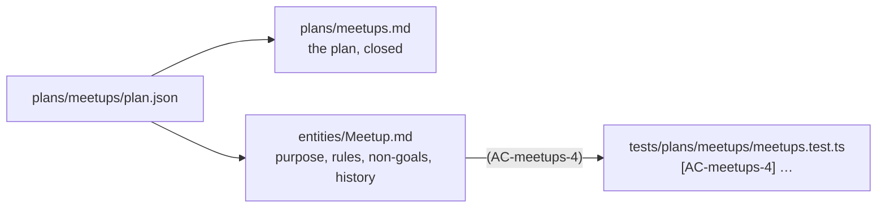

# Chapter 5: Close the Plan

Once a plan is built, `plan.json` goes quiet: nobody edits an approved plan to describe code that exists. What the plan knew (why the feature exists, which rules it must keep, what it deliberately left out) still matters, though. Closing a plan writes that knowledge into documents the next agent reads.

**What you'll learn:**

- What `plan:close` requires, and what it writes
- How a rule in a document stays tied to the test that proves it
- Where the next agent finds all of this

## 1. Close

```bash run
bunx guren plan:close docs/plans/meetups/plan.json
```

It refuses unless the plan is approved and every element is verified, or waived (chapter 7 explains waivers). This one is, so it writes two files:



Read the entity document:

```bash run
cat docs/entities/Meetup.md
```

Each rule ends with the ids of the behaviours behind it, `(AC-meetups-4)`. The same id sits in a test title. That pair is the link: a rule in prose, and the test that fails if the rule stops holding.

Everything `plan:close` writes sits between `<!-- guren:plan meetups … -->` markers. Text you add outside them is yours; a later plan that touches `Meetup` rewrites only its own blocks.

## 2. Check the links

```bash run
bunx guren check --docs
```

For every `(AC-…)` in a document, `check --docs` looks for a test that carries the id. Rename a test title, or delete the test, and the rule is flagged as one no test proves.

## 3. What the next agent sees

```bash run
bunx guren context Meetup
```

The last section, **Linked docs**, lists the two files you just wrote. `guren context <Entity>` is what the harness tells the agent to read before it touches an entity, so the next plan that changes `Meetup` starts from its purpose and its rules, not from the code alone.

## 4. Commit

```bash run
git add docs
git commit -m "docs: close the meetups plan"
```

`plan:close` deletes nothing. The plan, its revision and its approval stay in `docs/plans/meetups/` as the record of how the feature was decided.

## Where you are

- `docs/entities/Meetup.md`: the feature's purpose and rules, each rule tied to a test.
- `docs/plans/meetups.md`: the closed plan.
- The first plan done, from request to documentation.

## Common trip-ups

- **`plan:close` lists elements that are not verified.** It names, for each one, the command that moves it: usually `plan:verify --step` for the step that owns it. Run that, then close again.
- **`check --docs` warns about a rule no test carries.** A test lost its `[AC-…]` id, often from an agent tidying titles. Put the id back.

## Exercises

1. Add a paragraph of your own under `## Purpose` in `docs/entities/Meetup.md`, outside the markers. Run `plan:close` again and confirm your paragraph survives.
2. Run `bunx guren docs:graph --entity Meetup`. Which kinds of node does it connect to the entity document?

## Next

[Chapter 6: A Plan That Changes What Exists](./06-changing-what-exists.md) plans registrations, which reach into the meetups you just built.
