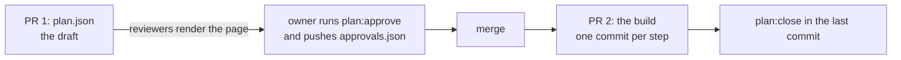

# Chapter 8: Plans in CI

Everything so far ran on your machine. This chapter adds the one check that matters once plans live in a team's repository, and settles how a plan moves through a pull request.

**What you'll learn:**

- What the scaffold's CI already checks for plans, without changes
- What `guren check --plan` adds, and why it never fails a build
- A pull request shape that keeps approval with a person

## 1. What CI already covers

The scaffold's `.github/workflows/ci.yml` runs one command, `bunx guren gate --deps`. Two of its stages already guard the work of this course:

| Stage | Guards |
|---|---|
| `test` | every behaviour of both plans, by its `[AC-…]` test |
| `check` | every `(AC-…)` rule in `docs/entities/`: a rule whose test disappeared is reported |

So a closed plan stays enforced after it closes. Its rules live in the entity documents, and its tests run on every push.

## 2. Open plans: `check --plan`

A plan that is approved but not closed is a design someone is building. Two things can go wrong while it is open, and neither shows up in the gate:

- a file a verified step recorded changes afterwards, so the step's elements read `drifted`
- a second open plan changes the same model, controller or table

A change like chapter 7's rename is a different case: the elements it touches go stale rather than drifted, and `plan:next` holds the step, which is where you saw it.

`bunx guren check --plan` reports both, for every open plan in the repository:

```bash run
bunx guren check --plan
```

Both plans in this app are closed, so it reports nothing. Add it to CI anyway, so an open plan's drift shows up on the pull request that causes it:

```yaml file=.github/workflows/ci.yml
name: CI

on:
  push:
    branches:
      - main
  pull_request:

jobs:
  checks:
    runs-on: ubuntu-latest
    steps:
      - uses: actions/checkout@v4

      - uses: oven-sh/setup-bun@v2

      - name: Install dependencies
        run: bun install --frozen-lockfile

      # Every verification stage in one exit code: codegen, typecheck, lint,
      # check, audit, test. --deps scans dependencies too; drop it if this
      # runner cannot reach the npm registry. `bunx guren gate` runs the same
      # stages locally.
      - name: Gate
        run: bunx guren gate --deps

      # Open plans the application drifted under, or two open plans changing
      # one target. Advisory: it reports and exits 0.
      - name: Open plans
        run: bunx guren check --plan
```

`check --plan` is advisory on purpose. An open plan drifting is a decision for the plan's owner (re-check the step with `plan:verify --step`, undo the change, or revise the plan), not a reason to block someone else's pull request.

## 3. A plan in a pull request

The plan and its approval are files, so they travel through review like code. The order that keeps approval with a person:



- **PR 1** holds the draft. A reviewer runs `bunx guren plan:render` on their machine and reviews the page, not the JSON diff. The page makes no network requests, so it can also be attached to the pull request.
- **Approval** is a commit by the person accountable for the design, never by the agent. It lands before the build starts, so the build is checked against what was agreed.
- **PR 2** is the build: one commit per step, which is how chapter 4 kept each review small. Its last commit closes the plan.

## 4. Commit

```bash run
bunx guren gate
git add -A
git commit -m "ci: report open plans"
```

## Where you are

- CI that runs every plan's tests and checks every rule's link, on every push.
- An advisory report on open plans.
- A pull request shape for plans.

## Common trip-ups

- **The agent approves a plan in a pull request.** The `plan-write` skill forbids it, but check the author of the commit that adds `approvals.json`. It should be the person who owns the design.
- **`check --plan` reports two plans changing one table.** They are open at once. Close one first, or merge them into one plan with `plan:revise`.

## Exercises

1. Write a draft plan for deleting a meetup, approve it, and change `MeetupController` in a separate commit. What does `bunx guren check --plan` report now?
2. Look back over the course. Which decisions did you make that no command could have made for you? List them; that list is the job the agent does not take.

<details>
<summary>Exercise 1: hint and an example answer</summary>

`check --plan` looks at every approved plan that is not closed. It warns when an element of one reads `drifted` in `plan:status`, when two open plans change the same target, or when a plan carries a command the allowlist refuses.

For a plan nobody has started building, most likely nothing. Its elements read `planned` or `present`, not `drifted`: an element drifts when it exists and some planned property differs while others match, or when a verified step's files changed since. When a drift does show, it is an "Approved plan drifted" warning naming the element ids, and the command still exits 0. A change in the code the plan depends on is caught elsewhere: `plan:next` compares the baseline and holds the steps that depend on what moved, as in chapter 7. `bunx guren plan:status <plan> --json` shows the state of each element.

</details>

<details>
<summary>Exercise 2: hint and an example answer</summary>

Go through the chapters and note each point where the text says the choice is yours.

One possible list:

- Which questions to answer up front, and the answers (guests can browse; a full meetup refuses)
- Which warnings are choices (`meetups.store` without a policy) and which are mistakes
- Which behaviours to add, including the allowed user's `success` behaviour on every route behind a policy
- Approving each plan
- Reading each step's commit: the record passed to `authorize`, where `organizerId` comes from
- Whether each consumer in Impact is covered
- Undoing the teammate's commit or revising the plan when a step was held
- Whether to accept less than the plan, with a waiver

Other lists are fine too. What they share is that each item decides what the software should do, and the commands only check that the code does what was decided.

</details>

## Next

You have taken two plans from request to documentation. For the framework underneath (routing, the ORM, testing, deployment), continue with [the Guren Tutorial](../tutorials/00-overview.md) or the [guides](../guides/implementation-plans.md).
