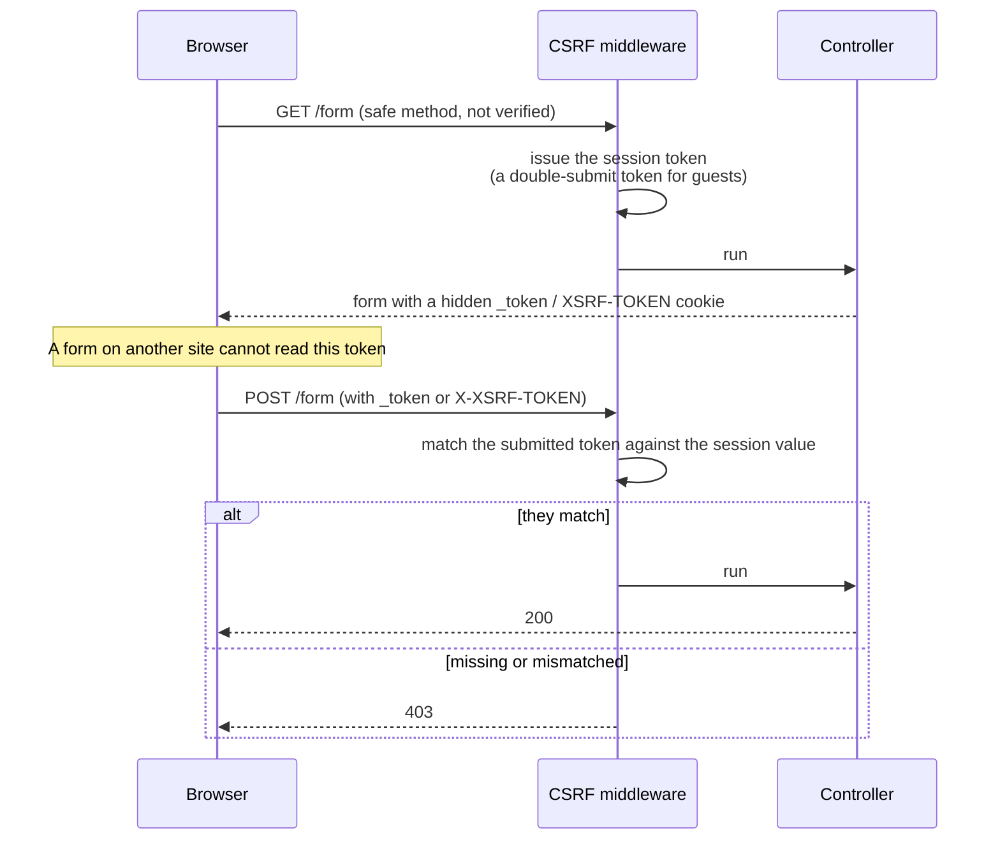

# CSRF Protection

Cross-Site Request Forgery (CSRF) protection prevents malicious websites from submitting forms on behalf of authenticated users. Guren provides built-in CSRF middleware that integrates seamlessly with sessions.

The token spans two requests: it is issued on the GET that renders the form, and matched on the POST that submits it.



## Setup

Enable CSRF protection by adding the middleware to your application:

```ts
// src/app.ts
import { createApp, createSessionMiddleware, createCsrfMiddleware } from '@guren/core'

const app = createApp()

// Optional — the token binds to a persisted session
app.use('*', createSessionMiddleware())
app.use('*', createCsrfMiddleware())
```

The middleware automatically:
- Generates a token per session, or a stateless double-submit token for guests
- Validates tokens on state-changing requests (POST, PUT, PATCH, DELETE)
- Allows safe methods (GET, HEAD, OPTIONS, QUERY) without validation — QUERY (RFC 10008) is safe by contract, so keep QUERY handlers read-only, or add `'QUERY'` to the `methods` option to require tokens anyway

## Including the Token in Forms

A native `<form method="post">` must carry the token as a `_token` field, or Guren
rejects it with a 403. In an Inertia app, `useForm()` and `<Link method="post">`
send it for you — see [Inertia.js Integration](#inertiajs-integration).

Use the `csrfField()` helper to generate a hidden input field:

```ts
// In your controller
import { Controller, getCsrfToken, csrfField } from '@guren/core'
import { pages } from '@/.guren/pages.gen'

export default class FormController extends Controller {
  create() {
    const token = getCsrfToken(this.ctx)
    // Pass to your template/view
    return this.inertia(pages.forms.Create, { csrfToken: token })
  }
}
```

In your frontend form (React example):

```tsx
function CreateForm({ csrfToken }: { csrfToken: string }) {
  return (
    <form method="POST" action="/posts">
      <input type="hidden" name="_token" value={csrfToken} />
      {/* form fields */}
      <button type="submit">Create</button>
    </form>
  )
}
```

Or generate the hidden field directly:

```ts
const hiddenField = csrfField(ctx)
// Returns: <input type="hidden" name="_token" value="..." />
```

## AJAX Requests

For JavaScript/AJAX requests, include the token in a header:

```ts
// The middleware sets a JavaScript-readable XSRF-TOKEN cookie
const csrfToken = decodeURIComponent(
  document.cookie.match(/(?:^|;\s*)XSRF-TOKEN=([^;]*)/)?.[1] ?? '',
)

fetch('/api/posts', {
  method: 'POST',
  headers: {
    'Content-Type': 'application/json',
    'X-XSRF-TOKEN': csrfToken,
  },
  body: JSON.stringify({ title: 'Hello' }),
})
```

Axios — and therefore Inertia.js — does this for you, so you only need the code
above for plain `fetch`.

The middleware accepts the token from three places, in this order:

1. The `X-CSRF-TOKEN` header
2. The `X-XSRF-TOKEN` header, read from the `XSRF-TOKEN` cookie
3. The `_token` field in an urlencoded, multipart, or JSON request body

These names are not configurable. If you turn the cookie off (`cookie: false`
below), pass the token to the page yourself with `getCsrfToken(ctx)` and send it
as `X-CSRF-TOKEN` — do this only for session-authenticated flows, because guest
tokens verify against the cookie and cannot work without it.

## Configuration Options

```ts
createCsrfMiddleware({
  // Routes to exclude from CSRF validation
  exclude: ['/api/webhooks/*', '/api/public/*'],

  // Custom error handler
  onError: (ctx) => {
    return ctx.json({ error: 'Invalid CSRF token' }, 403)
  },
})
```

The remaining options rarely need changing:

| Option | Default | Purpose |
|--------|---------|---------|
| `methods` | `['POST', 'PUT', 'PATCH', 'DELETE']` | Which HTTP methods require a token |
| `cookie` | `true` | Issue the `XSRF-TOKEN` cookie on safe requests and successful mutations |
| `cookieOptions` | `{ path: '/', sameSite: 'Lax' }` | Cookie attributes; `secure` is on when `NODE_ENV` is `production`, and in runtimes without `process` |

## Excluding Routes

Some routes (like webhook endpoints) should skip CSRF validation:

```ts
createCsrfMiddleware({
  exclude: [
    '/api/webhooks/stripe',
    '/api/webhooks/github',
    '/api/public/*', // Wildcard patterns supported
  ],
})
```

## Manual Token Verification

For custom validation logic, use `verifyCsrfToken()`:

```ts
import { verifyCsrfToken, getCsrfToken } from '@guren/core'
import { Router } from '@guren/core'

export function registerWebRoutes(router: Router): void {
  router.post('/custom', async (ctx) => {
    const token = ctx.req.header('X-Custom-Token')

    if (!verifyCsrfToken(ctx, token)) {
      return ctx.json({ error: 'Invalid token' }, 403)
    }

    return ctx.json({ ok: true })
  })
}
```

## Token Regeneration

A session-bound token follows the session id, so it changes when:
- The session is first persisted (a brand-new session does not yet anchor a token)
- `session.regenerate()` is called (recommended after login)

Guest tokens carry no session id and are reused until a session exists.

```ts
// After successful login
const session = getSessionFromContext(ctx)
await session.regenerate()
// New CSRF token is generated automatically
```

## Security Best Practices

1. **Always use HTTPS** - Tokens can be intercepted over HTTP
2. **Regenerate after login** - Prevents session fixation attacks
3. **Don't expose tokens in URLs** - Use POST bodies or headers
4. **Set secure cookie flags** - The session middleware handles the session cookie; the `XSRF-TOKEN` cookie follows `cookieOptions`

## Inertia.js Integration

When using Inertia.js, CSRF is handled automatically through cookies. Ensure your Axios/fetch configuration includes credentials:

```ts
// resources/js/app.tsx
axios.defaults.withCredentials = true
```

Inertia automatically reads the `XSRF-TOKEN` cookie and includes it in requests.

### Submit through Inertia, not a native form

That only covers requests Inertia sends through Axios. A native
`<form method="post">` submits as a full browser navigation, which carries no
`X-XSRF-TOKEN` header — so Guren rejects it with a 403 unless the form itself
carries a `_token` hidden field.

In an Inertia page, prefer `useForm()`:

```tsx
import { useForm } from '@inertiajs/react'

function LogoutButton() {
  const { post, processing } = useForm()

  return (
    <button type="button" onClick={() => post('/logout')} disabled={processing}>
      Log out
    </button>
  )
}
```

`<Link href="/logout" method="post" as="button">` works too, for a plain action
link. Reach for a native form only when you deliberately want a full page submit.
