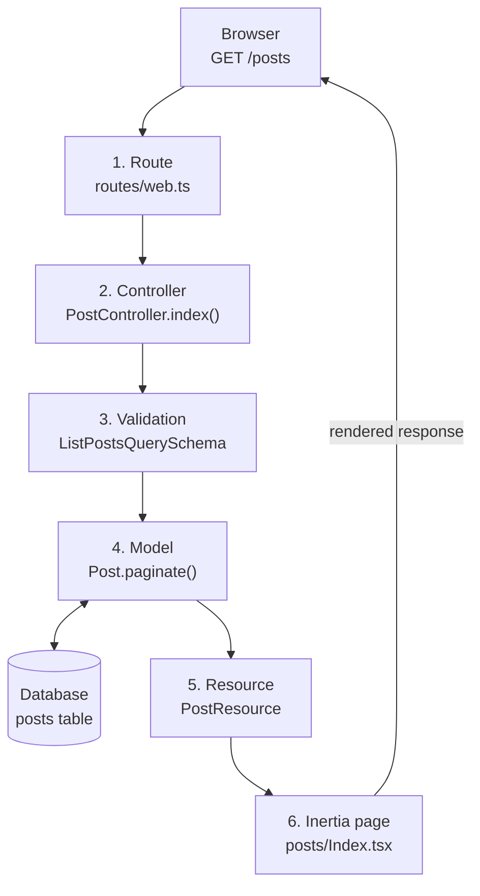

# First Steps: A 10-Minute Tour of One Request

This tour follows a single request — `GET /posts` — through every layer of a Guren app: route, controller, validation, model, resource, Inertia page, and test. Read it to build a mental map; each stop links to the guide that goes deeper.

It assumes a running app (see [Getting Started](./getting-started.md)) with a posts resource generated by:

```bash
bunx guren add resource posts --fields "title:string,body:text,published:boolean"
```

Prefer to build this yourself step by step? Take [The Guren Tutorial](../tutorials/00-overview.md) instead — it covers the same ground hands-on, and then keeps going.

Here is the whole path first. `GET /posts` moves through these layers in order, and HTML comes back out.



The rest of this tour walks the stops one at a time.

## 1. The route

Every request starts in `routes/web.ts`, where a registrar maps URLs to controller actions:

```ts
import { Router } from '@guren/core'
import PostController from '@/app/Http/Controllers/PostController'

export function registerWebRoutes(router: Router): void {
  router.get('/posts', [PostController, 'index'])
  router.post('/posts', [PostController, 'store'])
}
```

`GET /posts` matches the first line, so Guren dispatches to `PostController.index`. Groups, middleware, and named routes all live here too — see the [Routing Guide](./routing.md).

## 2. The controller

`app/Http/Controllers/PostController.ts` handles the request:

```ts
import { Controller } from '@guren/core'
import { Post } from '@/app/Models/Post'
import { PostResource } from '@/app/Http/Resources/PostResource'
import { ListPostsQuerySchema } from '@/app/Http/Validators/PostValidator'
import { pages } from '@/.guren/pages.gen'

export default class PostController extends Controller {
  async index() {
    const { page } = this.validateQuery(ListPostsQuerySchema)
    const result = await Post.paginate({ page, perPage: 20 })

    return this.inertia(pages.posts.Index, {
      data: result.data.map((post) => new PostResource(post).toJSON()),
    })
  }
}
```

Three things happen: input is validated, data is fetched, and a page is rendered. The [Controller Guide](./controllers.md) covers the full toolbox.

## 3. Validation

`this.validateQuery(schema)` parses the query string against a Zod schema and throws a 422 automatically on bad input — no manual error handling:

```ts
import { z } from 'zod'

export const ListPostsQuerySchema = z.object({
  page: z.coerce.number().int().positive().default(1),
})
```

`validateBody` and `validateParams` work the same way for request bodies and route parameters. See the [Validation Guide](./validation.md).

## 4. The model

`app/Models/Post.ts` binds a class to a Drizzle table from `db/schema.ts`:

```ts
import { defineModel } from '@guren/orm'
import { posts } from '@/db/schema'

export class Post extends defineModel(posts) {}
```

Queries read like Laravel: `Post.find(1)`, `Post.findOrFail(1)` (throws a 404), `Post.where('published', true).get()`. Column types flow from the schema into every result. See the [Database Guide](./database.md).

## 5. The resource

`app/Http/Resources/PostResource.ts` decides what leaves the server — so internal columns never leak by accident:

```ts
import { Resource } from '@guren/core'

export class PostResource extends Resource<Post> {
  toArray() {
    const { id, title, body, published } = this.resource
    return { id, title, body, published }
  }
}
```

See the [API Resources Guide](./api-resources.md).

## 6. The Inertia page

`this.inertia(pages.posts.Index, props)` renders `resources/js/pages/posts/Index.tsx` — a plain React component that receives the controller's props directly, no API layer in between:

```tsx
import type { PageProps } from '@guren/inertia-client/contracts'
import { pages } from '@/.guren/pages.gen'

type Props = PageProps<typeof pages.posts.Index>

export default function PostsIndex({ data }: Props) {
  return (
    <ul>
      {data.map((post) => (
        <li key={post.id}>{post.title}</li>
      ))}
    </ul>
  )
}
```

The index page `bunx guren add resource` generates arrives a little more finished than this:


Codegen extracts each page's `Props` into `.guren/pages.gen.ts`, so a controller passing the wrong shape is a compile error — rename a column and TypeScript flags every layer from schema to browser. See the [Frontend Guide](./frontend.md).

## 7. The test

Prove the whole path works with `TestApp`, which drives real requests through your booted app:

```ts
import { test } from 'bun:test'
import { TestApp } from '@guren/testing'

test('lists posts', async () => {
  const app = await TestApp.create()
  await app.get('/posts').assertOk()
})
```

See the [Testing Guide](./testing.md) for fluent assertions, `actingAs`, and database helpers.

## 8. Project knowledge

The request path explains what the application does; project knowledge records why it works that way and keeps the overview current. `bunx guren spec:generate` derives ER, domain, screen, and module views from the code. ADRs created with `bunx guren make:adr` declare the entities and paths they govern, while `bunx guren check --docs` validates those relations.

With `bun run dev` running, open [http://localhost:3333/_guren/docs](http://localhost:3333/_guren/docs) to browse those documents, entities, and code paths as one interactive Docs Graph. The graph surrounds the request path above with its rationale and generated views; it does not replace the route-to-page flow. See [Spec-Anchored Development](./spec-anchored.md) for the full workflow.


## The mental model

Every feature in a Guren app follows this same path:

- **routes** map URLs to controllers
- **validators** parse inputs
- **models** describe data access
- **resources** shape outputs
- **pages** define props
- **controllers** compose it all

Around that runtime path, **project knowledge** connects generated specs and human decisions back to the code they describe, then checks that the connections remain valid.

To add a feature, scaffold the whole path at once and refresh the manifests:

```bash
bunx guren add resource comments --fields "body:text,postId:integer"
bun run codegen
```

## Where to go next

Ready to build for real? **[The Guren Tutorial](../tutorials/00-overview.md)** walks you through posts, users, authorization, uploads, mail and agent tools hands-on. If any term was unfamiliar, check the [Glossary](./glossary.md).
