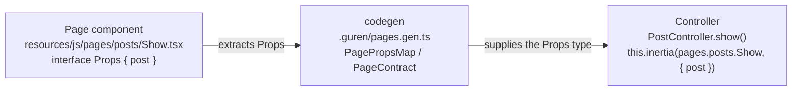

# Frontend Guide

Guren delivers a single-page application experience by combining Inertia.js with React. Controllers return Inertia responses, and the frontend renders the matching React components located under `resources/js/pages/`.

## Project Structure
- `resources/js/app.tsx`: Bootstraps the Inertia app and registers global providers.
- `resources/js/ssr.tsx`: Exports the server-side renderer consumed by the backend when SSR is enabled.
- `resources/js/pages/`: React components that map to controller responses.
- `resources/js/components/`: Shared UI components (optional but recommended).
- `resources/css/app.css`: Tailwind (or your chosen CSS) entry point.

## Page Components
Page filenames map to the page definitions auto-generated in `.guren/pages.gen.ts`. Props are defined as `interface Props` in each page component and extracted by codegen:

```ts
// Controller
return this.inertia(pages.posts.Index, {
  data,
  pagination,
})
```

```tsx
// resources/js/pages/posts/Index.tsx
import type { PageProps } from '@guren/inertia-client/contracts'
import { Head, Link } from '@inertiajs/react'
import { pages } from '@/.guren/pages.gen'

type Props = PageProps<typeof pages.posts.Index>

export default function Index({ data, pagination }: Props) {
  return (
    <>
      <Head title="Posts" />
      <div className="space-y-4">
        {data.map((post) => (
          <article key={post.id} className="rounded border border-slate-200 p-4">
            <h2 className="text-lg font-semibold">{post.title}</h2>
            <p className="text-slate-600">{post.excerpt}</p>
            <Link className="text-blue-600 underline" href={`/posts/${post.id}`}>
              Read more
            </Link>
          </article>
        ))}
      </div>
      <p className="mt-4 text-sm text-slate-500">{pagination.meta.total} posts</p>
    </>
  )
}
```

Use TypeScript to annotate props so you benefit from compile-time safety.

## Layouts and Shared UI
Wrap pages with layout components to keep navigation and shared UI consistent:

```tsx
// resources/js/components/Layout.tsx
export function Layout({ children }: React.PropsWithChildren) {
  return (
    <div className="min-h-screen bg-slate-50">
      <header className="border-b bg-white">
        <div className="mx-auto flex max-w-4xl items-center justify-between px-6 py-4">
          <a href="/">Guren</a>
        </div>
      </header>
      <main className="mx-auto max-w-4xl px-6 py-10">{children}</main>
    </div>
  )
}
```

```tsx
// resources/js/pages/posts/Index.tsx
import { Layout } from '@/resources/js/components/Layout'

export default function Index({ posts }: Props) {
  return (
    <Layout>
      {/* page content */}
    </Layout>
  )
}
```

## Forms and Navigation
Inertia provides helpers for client-side navigation and form submissions:

- `<Link href="/posts/new">Create Post</Link>` for navigation without a full reload.
- `const form = useForm({ title: '', body: '' })` to manage form state.
- `form.post('/posts')` to submit data.

Handle validation errors by returning them from the controller and reading `form.errors` on the client.

## Assets and Styling
The scaffold ships with Tailwind CSS preconfigured. Edit `resources/css/app.css` or add custom CSS frameworks as needed. If you introduce additional assets (images, fonts), place them under `public/`.

## Favicon and Document Head
The production document is built by the server, not from `public/index.html`, so a `<link>` added to that file never reaches a browser. Register site-wide head markup with `setInertiaDocument()` instead — the scaffold already links the placeholder `public/favicon.svg` from `src/app.ts`:

```typescript
import { setInertiaDocument } from '@guren/core'

setInertiaDocument({
  head: '<link rel="icon" type="image/svg+xml" href="/favicon.svg" />',
})
```

The markup is emitted verbatim, so keep it to developer-authored strings. Files at the root of `public/` are served by the Bun runtime; on Node-based deployments serve them from a CDN.

Files a browser would render as a *document* — `.html`, `.htm`, `.svg`, `.xhtml`, `.xml` — are served with `Content-Disposition: attachment` and `X-Content-Type-Options: nosniff`, so navigating straight to one downloads it instead of running its script on your origin. Images, scripts, stylesheets and fonts are unaffected: an ``, a CSS `url()` and a `<link rel="icon">` all still load, because the disposition only decides navigate-versus-download. An `<iframe>` or `<object>` embed *is* a navigation, so a document embedded that way stops rendering. For a public directory holding nothing user-supplied, `rootPublicAssets: { inlineDocuments: true }` and `inlineDocuments: true` turn this off per route family; otherwise serve the page from a controller.

The same policy follows your app onto the deploy targets whose platform serves `public/` before the app runs: the Cloudflare, Vercel and Lambda plugins declare it to the platform at build time, so a file that downloads locally downloads in production. Those declarations are keyed on file extension rather than on the content type the framework computes, and `inlineDocuments` does not reach them — the plugins read a built directory, not your route configuration. An app that turned the policy off deliberately can undo it at the platform: delete the rules from the generated `.cloudflare/assets/_headers`, the `handle: "hit"` route from `.vercel/output/config.json`, or the CloudFront function association from the CDK stack — a step to repeat after each build, since the build regenerates those files.

## Server-Side Rendering
Each application ships with a default `resources/js/ssr.tsx` entry that calls `renderInertiaServer()` from `@guren/inertia-client`. When you bootstrap the app with `autoConfigureInertiaAssets(app, { importMeta })`, Guren will:

- Start and manage a Vite dev server automatically during development when `bun run dev` boots the app.
- Use `VITE_DEV_SERVER_URL` only when you explicitly want to point HTML responses at an already-running external Vite dev server.
- Detect the built client manifest (`public/assets/.vite/manifest.json`) and automatically seed `GUREN_INERTIA_ENTRY`/`GUREN_INERTIA_STYLES` in production.
- Locate the SSR manifest (`public/assets/.vite/ssr-manifest.json`) and set `GUREN_INERTIA_SSR_ENTRY` / `GUREN_INERTIA_SSR_MANIFEST` so Inertia can render on the server.

To produce the required assets run the app build, which runs codegen before the Vite client and SSR builds:

```bash
bun run build
```

You can override the default resolver—useful for custom component lookups—by editing `resources/js/ssr.tsx` and passing a different `resolve` function to `renderInertiaServer()`. If you opt out of `autoConfigureInertiaAssets`, make sure you populate the required environment variables before calling `configureInertiaAssets` yourself.

## Type Safety

Guren provides end-to-end type safety between controllers and page components through an automatic codegen pipeline.

### How the Type Flow Works



1. **Define Props in the page component** — each page declares an `interface Props` describing the data it expects:

```tsx
// resources/js/pages/posts/Show.tsx
import type { PostResourceData } from '@/app/Http/Resources/PostResource'

interface Props {
  post: PostResourceData
}

export default function Show({ post }: Props) {
  return <h1>{post.title}</h1>
}
```

2. **Codegen extracts Props** — running `bun run codegen` (or automatically during `bun run dev`) scans every page component, extracts the `interface Props`, and writes them into `.guren/pages.gen.ts`:

```ts
// .guren/pages.gen.ts (auto-generated)
export interface PagePropsMap {
  'posts/Show': { post: PostResourceData }
}

export const pages = {
  posts: {
    Show: defineGeneratedPage<'posts/Show', PagePropsMap['posts/Show']>(...)
  }
}
```

3. **Controller gets type-checked** — when a controller calls `this.inertia(pages.posts.Show, { ... })`, TypeScript checks the second argument against the `PageContract`'s embedded props type. Missing or mistyped props cause a compile error:

```ts
// app/Http/Controllers/PostController.ts
import { pages } from '@/.guren/pages.gen'

export default class PostController extends Controller {
  async show() {
    const post = await Post.findOrFail(id)
    // ✅ Type-checked: { post } must match Props from Show.tsx
    return this.inertia(pages.posts.Show, { post: new PostResource(post).toJSON() })
  }
}
```

### Using Local Types in Props

Props can reference locally defined types. Codegen automatically collects them:

```tsx
type Author = { id: number; name: string }

interface Props {
  post: { title: string; author: Author }
}
```

Both `Author` and the `Props` body are extracted into `pages.gen.ts`.

### Using Imported Types in Props

Types imported from Resource files or other modules are also tracked:

```tsx
import type { PostResourceData } from '@/app/Http/Resources/PostResource'

interface Props {
  post: PostResourceData
}
```

Codegen rewrites the import path so `pages.gen.ts` can reference the same type.

### Tips

- Share types between backend and frontend by re-exporting the Drizzle-inferred types from models (e.g. `export type PostRecord = typeof posts.$inferSelect`).
- Use the `@/` alias (the project root) instead of long relative imports — it resolves in server code via tsconfig `paths` and in the frontend build via the Guren Vite plugin.
- Run `bun run codegen` after adding or changing Props to keep `pages.gen.ts` up to date.

## Hot Reloading
Running `bun run dev` automatically launches the Vite dev server from the Bun process, so changes to TSX files trigger instant reloads without extra commands.

Backend files reload too: `dev:server` runs `bun --hot bin/serve.ts`, so edits to controllers, routes, and models take effect on the next request without a restart. Adding a route re-runs codegen and reloads once more, then settles. State held in the process does not survive a reload: the memory-backed session and cache stores are rebuilt empty, and module-level variables are reinitialized. External stores — Redis, your database — are unaffected, so you stay signed in as long as sessions live outside the process.

If your project predates this default, add the flag yourself:

```json
"dev:server": "bun --hot bin/serve.ts"
```

Keep `@guren/cli` current when you do. Older versions rewrote the generated files under `.guren/` on every codegen run even when the output was unchanged, and since your controllers import those files, the rewrite triggers another reload — an endless loop.

If you need to customize this workflow, import `startViteDevServer()` from `@guren/core/runtime` and manage the Vite instance yourself.

By structuring your pages and components with these patterns, you get a smooth SPA experience with minimal boilerplate, powered entirely by React and Inertia.
