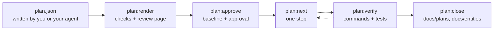

# Implementation Plans

An implementation plan is a design document for a change, written as JSON before any code exists. Guren checks it against your application, renders it as a page a person can review, stamps it when it is approved, breaks it into steps, and then reads from the code which parts of it exist. The agent that implements the plan never reports its own progress: `plan:status` and `plan:verify` derive it from the schema, the route graph, the controllers, the pages and the test results.

A plan is worth writing when a change spans a table, several routes and a page, and the design is cheaper to correct than the diff. If you can describe the diff in one sentence, skip the plan.



The examples on this page come from one plan, comments on the posts of `examples/blog`, run against a copy of that application.

## Where a plan lives

A plan is a directory under `docs/plans/`, named by its slug:

| File | What it is | Committed |
|---|---|---|
| `docs/plans/comments/plan.json` | The plan | yes |
| `docs/plans/comments/approvals.json` | The hashes `plan:approve` recorded, with the readings of each `alter` | yes |
| `docs/plans/comments/decisions.json` | Waivers, written by `plan:waive` | yes |
| `docs/plans/comments/plan.html` | The page `plan:render` writes | no |
| `.guren/plans/comments.state.json` | Verification results and the marked step | no, it ignores itself |

The slug is the directory name for a file called `plan.json`. Any other name works too: `comments.plan.json` has the slug `comments`, and keeps its records beside it as `comments.approvals.json` and `comments.decisions.json`.

The rendered page is generated output and belongs out of the repository. `plan:next` ignores it and its temporary file where `plan:render` writes them by default, so it does not have to be ignored for the loop to run, but it should not be committed either. A page written elsewhere with `-o` is an ordinary untracked file, and `plan:next` refuses the tree it sits in. The first pattern covers the `docs/plans/<slug>/` layout, the second a plan named `<slug>.plan.json` anywhere else, such as the application root:

```text
docs/plans/**/*.html
*.plan.html
```

The plan, its approvals and its decision log are a different matter: `plan:next` refuses while one of them is uncommitted, since a waiver decides which step it hands out.

## Writing a plan

You write the JSON, or your agent does in the session where you discussed the feature. The command that asks a model for a plan on its own is not available yet (see the end of this page). `plan:render` validates the file against the plan schema and names the field at fault:

```text
 ERROR  The plan does not match the plan schema:
  models.0.columns.0.change.from: Invalid input: expected string, received undefined
```

### The document

| Field | Holds |
|---|---|
| `planVersion` | `1` |
| `title`, `summary`, `locale` | What the plan is about, and the language its prose is written in (`en`, `ja`) |
| `scope` | `goals` and `nonGoals` |
| `assumptions`, `questions` | What the plan decided without being told, and what it could not decide |
| `models`, `validators`, `controllers`, `routes`, `views`, `resources`, `policies`, `sideEffects` | The design, one section per kind of element |
| `flows` | How a request moves through what the plan adds, as nodes and edges |
| `commands` | Commands such as `guren add attachments` the change needs first |
| `tasks` | What each slice must achieve, and its acceptance behaviours |
| `hints` | Ordering advice, such as `task/entity/model.tag before task/entity/model.comment` |
| `baseline` | Written by `plan:approve`, never by hand |

Every section may be left out. An omitted section and an empty one are the same plan.

### Ids and changes

Every element carries an `id` and a `change`. Ids share one namespace across the whole plan, start with a letter, and may contain letters, digits, `_`, `.`, `:` and `-`; the convention is the section and a name (`model.comment`, `route.comments.store`). Other elements refer to each other by these ids, and a revision later names an element by its id alone, so keep them stable.

| `change.kind` | Meaning |
|---|---|
| `existing` | Referenced and left as it is |
| `add` | New |
| `alter` | Changed in place |
| `rename` | Renamed; `from` is the old name (a model's class, a column's property, a route's name) |
| `drop` | Removed; `reason` says why |

An `alter`, `rename` or `drop` of an existing table or column must say what happens to its rows with `dataMigration`: `{ "kind": "none", "reason": "…" }`, `backfill` or `manual` with a `description`. The plan is refused without one:

```text
  column.post.summary: Column "summary" of "Post" is a "rename" on an existing table and states no dataMigration.
```

A model lists only the columns the plan touches or references. This is the new `Comment` model from the example, cut to two of its five columns:

```json
{
  "id": "model.comment",
  "change": { "kind": "add" },
  "name": "Comment",
  "table": "comments",
  "columns": [
    {
      "id": "column.comment.body",
      "name": "body",
      "change": { "kind": "add" },
      "type": "text",
      "nullable": false,
      "unique": false,
      "index": false
    },
    {
      "id": "column.comment.postId",
      "name": "postId",
      "columnName": "post_id",
      "change": { "kind": "add" },
      "type": "integer",
      "nullable": false,
      "unique": false,
      "index": true,
      "references": { "model": "model.post", "column": "id", "onDelete": "cascade" }
    }
  ],
  "relationships": [
    { "name": "post", "type": "belongsTo", "target": "model.post" },
    { "name": "author", "type": "belongsTo", "target": "model.user" }
  ],
  "fillable": ["body"]
}
```

Column types are an abstract vocabulary rather than Drizzle builders: `string`, `text`, `integer`, `number`, `decimal`, `boolean`, `date`, `datetime`, `json`, `uuid`. `datetime` takes `withTimezone`, and `decimal` takes `precision` and `scale`.

The other sections follow the same pattern. A controller holds its actions, each with the validator its `body`, `params` or `query` uses, its `authorization` (middleware, and a policy ability), its `response` (an Inertia view, a redirect, a resource) and its business `rules` as prose. A route names its method, path, name, action id, middleware and `bind`. A view names its page id, its props, and a form whose fields point at a validator's fields rather than restating their rules. Elements in an application module carry `module`.

### Acceptance behaviours

A task intent names an entity, the elements it covers, and the behaviours that prove it works:

```json
{
  "id": "AC-comments-4",
  "description": "A user cannot delete someone else's comment.",
  "kind": "forbidden",
  "actor": "user",
  "route": "route.comments.destroy",
  "given": ["a comment written by another user exists"],
  "expect": { "status": 403 }
}
```

`kind` is one of `success`, `validation`, `unauthenticated`, `forbidden`, `not-found` and `state`. The checks count them: a route with a validator and no `validation` behaviour, or with authentication and no `unauthenticated` one, is reported. `expect` takes `status`, `redirect`, `inertia`, `errors` and `database`; request `input` and database values are written as `{ "name": "body", "json": "\"Nice post\"" }`, the value as JSON text.

Each behaviour becomes a test whose title carries its id in brackets. Start acceptance ids with `AC-`: `plan:verify` reports a bracketed `AC-` token that the plan does not declare, which is how a mistyped id gets caught.

```ts
test("[AC-comments-4] a user cannot delete someone else's comment", async () => {
  const comment = await Comment.forceCreate({ body: 'Mine', postId: post.id, userId: author.id })
  await http.actingAs(reader).delete(`/comments/${comment!.id}`).assertStatus(403)
})
```

Guren redirects a non-GET request with 303, so a behaviour that expects the redirect after a form post says `"status": 303`.

### Questions

A question is a decision the author could not make alone, with the options, the one the plan assumed, and the elements that change if the answer differs:

```json
{
  "id": "Q-delete",
  "question": "Does deleting a comment remove the row?",
  "options": [
    { "label": "hard delete", "consequence": "The row is removed; no deleted_at column." },
    { "label": "soft delete", "consequence": "A deleted_at column is added and lists filter on it." }
  ],
  "assumed": "hard delete",
  "affects": ["model.comment", "action.comments.destroy"]
}
```

A plan with an open question cannot be approved. Answer it by editing the plan: apply the answer, remove the question, and record the decision under `assumptions`. Before approval, editing `plan.json` by hand is the normal way to change it.

## Rendering and checking: `plan:render`

```bash
bunx guren plan:render docs/plans/comments/plan.json
```

It writes `docs/plans/comments/plan.html` and prints the path. `-o` writes somewhere else, `--app <dir>` names the application to check against when you run it from another directory, and `--locale ja` opens the page's own labels in Japanese (the page switches between `en` and `ja`; the plan's text is never translated).

The page is one file with no network access: it opens from disk and can be attached to a review. It has a tab per section, a filter per entity, a "Changes only" toggle that hides `existing` elements, an entity relationship diagram of the plan merged over the current schema, and every id links to the element it names. Failed checks and breaking changes are pinned under "Needs attention". Each element has Approve and Request changes buttons and a comment box, and the footer exports the review as `feedback.json`. No command reads that file yet, and the footer says so: hand `feedback.json` or the copied text to the agent that wrote the plan, or apply the comments to `plan.json` yourself. The two commands it prints are the ones that follow a revision, `plan:render` and `plan:approve`.

The checks run against the application as it is now. They report, among others, a route whose action is not in the plan, a foreign key to a model that exists nowhere, an `add` whose name is already taken, an `existing` or `alter` target that does not exist, a mutating route with authentication and no authorization, a body-carrying route with no validator, and the missing behaviours above. Rendering never fails on a check; `plan:approve` does. On a plan with a baseline, `plan:render` settles the same findings approval does, so a collision the plan's own work explains shows on the page as a passing check rather than a blocking one. Renaming the delete route of the example to a name the blog already uses gives:

```text
  route.comments.destroy: The route name "posts.destroy" already exists in this application.
```

### Impact

For every element the plan alters, renames or drops, the page lists what in the application depends on it: relationships, routes with their `ApiRoutes` entries and agent tools, resources, policies, controller actions, tests, and for a column the places that read or write it. A plan that renames `posts.excerpt` to `summary` in the blog shows, under the column:

```text
PostResource reads it                              app/Http/Resources/PostResource.ts:32
posts/Index reads it through PostResource          resources/js/pages/posts/Index.tsx:80
posts/Show reads it through PostResource           resources/js/pages/posts/Show.tsx:60
PostController.store writes data no static scan can name the columns of
PostController.update writes data no static scan can name the columns of
```

Tests are found two ways. A `TestApp` request (`get`, `post`, `put`, `patch`, `delete`, `query`, and an agent tool call) is matched against the route graph, so a route lists the requests that reach it. A test file named after the controller or model is listed too, marked as matched by name, because a test that calls the action directly makes no request to read. After the implementation of the example, a plan moving the comment delete route shows:

```text
Route comments.destroy
ApiRoutes entry comments.destroy
Request DELETE /comments/${…} reaches comments.destroy    tests/comments.test.ts:38
```

The blog's own tests call their controllers without HTTP, so a plan that moves `posts.show` finds a test by name and no request:

```text
Route posts.show
ApiRoutes entry posts.show
Test tests/controllers/PostController.test.ts, named after it
No TestApp request in the existing tests reaches the routes above.
```

That last note appears only when nothing could have hidden a request. A request whose path the scan cannot read (built from a variable, or on a receiver it does not know as a `TestApp`), a request whose route parameter constraint could not be checked, and a test file that did not parse are noted beside the entry instead.

Impact is a lower bound. The scan is static, so a value passed to another function or file, a reassignment and a column held in a variable are not followed, and an empty list means nothing was found, not that nothing is affected. Dropping a column, changing its shape, renaming or dropping a route, and changing a published agent tool are marked breaking whatever Impact found.

## Approving: `plan:approve`

Approval is a person's decision, made after reading the page. It refuses while a check fails or a question is open:

```text
 ERROR  docs/plans/comments/plan.json is not approved while a check fails or a question is open; an assumption nobody confirmed is not approved by silence.
  question Q-delete is unanswered: Does deleting a comment remove the row?
```

Once the plan is clean:

```bash
bunx guren plan:approve docs/plans/comments/plan.json
```

```text
Comments on posts (plan.json)

Stamped the baseline at 0c871a5b9dc25587d33ae3d6bb6c3befe2c7e6a2: 13 element(s) hashed.
Not hashed, since their section could not be read: validator.comment
Approved 22735cb551ac15559cd5cabc344925f8f75af7a62efe39570ac49d8c032a59c0, recorded in docs/plans/comments/approvals.json.
```

The first approval writes a `baseline` into the plan: `rev`, the commit the plan was written against, and `contextHash`, a hash per referenced element of what the application holds for it today. That is why it refuses a repository with no commit and a working tree with uncommitted changes (the plan's own files excepted). The approval itself goes to `approvals.json`, beside the plan and never inside it. Commit both.

Validators are never hashed: the stamp finds each element's file from its name, and it does not resolve a validator's exported schema symbol to a file. If another section cannot be read, approval refuses and names the elements that would stay unhashed; `--allow-unstamped` approves without them.

The plan's hash identifies it: a SHA-256 of the plan with its baseline. Approvals, verification records and waivers all name it, so a plan edited after approval is a different plan. `plan:next`, `plan:verify`, `plan:waive` and `plan:close` refuse a plan with a baseline whose current hash no approval names:

```text
 ERROR  docs/plans/comments/plan.json is not approved at its current hash dc9a6ce3ad173e23290f743293fa0e3495c932b3b2cdf07c0cda8c9b063a5465, so no step of it is handed out: it was edited after approval, or never approved, and what it says now may not be what anyone agreed to. Run guren plan:approve docs/plans/comments/plan.json once the plan says what you mean to build.
```

`plan:status` and `plan:render` keep working, since they are how you read the change before approving it. A draft, which has no baseline and so no hash, is still accepted by `plan:next` and `plan:verify`. A draft with approvals recorded beside it is refused like an unapproved plan: deleting `baseline` from an approved plan does not take it out of the gate.

Approving an edited plan again records the new hash and leaves the baseline as it was, so its steps verify again under the new hash. The checks and questions are asked again first, against the application as it is at that moment. The plan's own work does not stand in the way: an element the implementation has already built where the plan leaves it is settled, and the approval says which:

```text
Built as the plan leaves them, so their collision or absence is the plan's own work: model.comment, controller.comments, resource.comment, policy.comment, action.comments.store, action.comments.destroy
```

An element is settled only when the application started it where the plan says and now holds what the plan leaves. Anything else still refuses: an `add` a later edit retargets onto a name the application already had, a table the plan adds that another application root declares, an endpoint another route holds, and a model whose class is written while its table is not, which is at neither end. A `rename` or `alter` of a route that also moves its path reads as not built, which errs towards refusing. A draft is unchanged: nothing is settled for it, so a draft whose `add` already exists is still refused.

The rule is as sharp as freshness, and no sharper. A class another commit adds in the plan's own root, and a second route on the endpoint of one the plan built, read as the plan's own work. An `existing` element a revision turns into a `drop` is settled once someone else has deleted it, since the stamp recorded it present and it is gone.

### Readings of an `alter`

An `alter` changes something that existed before the plan, so a planned property that already held proves nothing about the change. For every `alter`, the approval therefore records what each planned property reads at that moment, on its entry in `approvals.json`. `plan:status` counts an `alter`'s property as done only when it read `differ` or `unknown` at approval and matches now. Approve the plan before implementing it, so the readings describe the application before the work. Approving an edited plan keeps the readings recorded under the same baseline. It keeps them only for properties whose planned value and name in code the edit left unchanged.

A property with no reading from approval is not counted, even when it matches. Before the work, `plan:status` names each planned property without a reading that still differs, and the fix:

```text
  planned   alter     Post                       model.post
      differs: relationship comments (planned hasMany, found not declared)
      differs: relationship comments target (planned Comment, found not declared)
      The approval recorded no reading of relationship comments, relationship comments target: run guren plan:approve on the plan before changing them, since a match with no reading from before the work does not count.
```

`plan:approve` on a hash already approved records only the readings the entry lacks:

```text
Already approved at 2026-09-22T10:16:20.673Z; recorded the readings it lacked in docs/plans/comments/approvals.json: model.post, view.posts.show.
```

After the work, a reading would find the property already held, so approving again cannot help. An `alter` whose matches all lack a reading reads `unjudged`, and its note says to verify the change through a behaviour that reaches it; once its step has verified, a second note adds the waiver. For an element no behaviour can reach, such as a column, the note names only the waiver.

## Implementing: `plan:next` and `plan:verify`

Guren derives the work from the plan, and the order does not depend on a model. Every entity the plan adds or changes is a task, ordered by foreign keys, and there are six kinds of step, and a task gets only those it has work for:

| Step | Work | Verified by |
|---|---|---|
| `commands` | The plan's `commands`, such as `guren add attachments`, in `task/foundation` | `codegen`, `typecheck` |
| `scaffold` | The first version of a new entity, through `make:feature` | `codegen`, `typecheck` |
| `tests` | One test per acceptance behaviour, failing | `codegen`, the tests failing |
| `data` | Table, migration, model relationships and fillable | `codegen`, `db:migrate`, `typecheck` |
| `http` | Validators, controllers, routes, resources, policies | `codegen`, `guren check`, the tests passing |
| `pages` | Page components | `codegen`, `typecheck`, `guren check` |

Work shared by several entities goes to a `task/foundation` task. Step ids read `task/entity/model.comment/http`. A `commands`, `data`, `http` or `pages` step whose elements span more than five files is split into parts with ids such as `task/entity/model.comment/http/1` and `task/entity/model.comment/http/2`; `scaffold` and `tests` are never split. `plan:next` prints the exact id to pass to `--step`. The loop is: ask for the next step, implement it, verify it, commit.

```bash
bunx guren plan:next docs/plans/comments/plan.json
```

```text
Comments on posts (plan.json)

Verified: task/entity/model.comment/scaffold

Next: task/entity/model.comment/tests
  task: entity Comment (task/entity/model.comment)
  verify: codegen → tests:fail

Behaviours to write, as test titles `[<id>] <description>`, failing:
  [AC-comments-1] A signed-in user can comment on a post.
      success; actor user; route route.comments.store; given a post exists; expect status 303; comments has 1 row(s)
  [AC-comments-2] An empty comment is rejected.
      validation; actor user; route route.comments.store; given a post exists; expect status 422; errors on body
  [AC-comments-3] A guest cannot comment.
      unauthenticated; actor guest; route route.comments.store; given a post exists; expect redirect /login
  [AC-comments-4] A user cannot delete someone else's comment.
      forbidden; actor user; route route.comments.destroy; given a comment written by another user exists; expect status 403

Implement this step only, then run `bunx guren plan:verify docs/plans/comments/plan.json --step task/entity/model.comment/tests` and commit once it is verified.
Marked in .guren/plans/comments.state.json
```

`plan:next` prints one step and never the whole plan. `--json` prints the same as data. It marks the step in the state file, which is what the Stop hook reads. It refuses a plan no approval names, as above, and a working tree with uncommitted changes unless they are the marked step's own, so run it before you start a step, not after:

```text
 ERROR  The working tree under /app has uncommitted changes (paths relative to the repository root), and one step is one commit. Commit or discard them first:
  ?? tests/comments.test.ts
```

```bash
bunx guren plan:verify docs/plans/comments/plan.json --step task/entity/model.comment/tests
```

```text
task/entity/model.comment/tests: verified (607 ms)
  pass     codegen     bun run codegen
  pass     tests:fail  bun test tests/comments.test.ts
  failing  [AC-comments-1]
  failing  [AC-comments-2]
  failing  [AC-comments-3]
  failing  [AC-comments-4]

Recorded in .guren/plans/comments.state.json
```

The `tests` step passes only when every behaviour has a test and each one fails: a test that passes before the code exists proves nothing, and a skipped test is not a failing one. `plan:verify` selects the test files whose source carries the step's ids, and runs them with `bun test`. Later steps run the same files and need them to pass. After the verify output it prints the plan's status, described below.

### Outcomes

A step ends in one of four outcomes.

| Outcome | Meaning |
|---|---|
| `verified` | Every command passed and every element the step owns is at the state that completes it |
| `failed` | A command failed; there is something in the implementation to fix |
| `incomplete` | The commands passed, but an element is not there yet |
| `blocked` | The environment could not run a command: a script `package.json` lacks, a tool not installed, a timeout, a database that cannot be reached, a migration check with no drizzle-kit or drizzle config, or a drizzle-kit that gives no answer |

From the example, a `data` step whose model relationship does not typecheck yet:

```text
task/entity/model.comment/data: failed (1254 ms)
  pass     codegen     bun run codegen
  pass     db:migrate  bun run db:migrate
  fail     typecheck   bun run typecheck
      `bun run typecheck` exited 1
      app/Models/Post.ts(26,14): error TS2345: Argument of type '"comments"' is not assignable to parameter of type '"author"'.
```

The same step before the relationships were written:

```text
task/entity/model.comment/data: incomplete (1055 ms)
  pass     codegen     bun run codegen
  pass     db:migrate  bun run db:migrate
  pass     typecheck   bun run typecheck
  not at its completion state: model.post: planned
  not at its completion state: model.comment: drifted
```

And a machine where the TypeScript compiler was not on the path:

```text
task/entity/model.comment/scaffold: blocked (354 ms)
  pass     codegen     bun run codegen
  blocked  typecheck   bun run typecheck
      `bun run typecheck` exited 127: a tool it needs is not installed
```

Before a `data` step runs `db:migrate`, it asks the application's own drizzle-kit whether the migrations cover the schema (`drizzle-kit generate --explain`, a dry run that writes no migration and opens no database). Without that check, a table with no migration would pass, since `db:migrate` then has nothing to apply. From the example, the `data` step with its migration left out:

```text
task/entity/model.comment/data: failed (1383 ms)
  pass     codegen     bun run codegen
  fail     db:migrate  drizzle-kit generate --explain
      the schema has changes no migration covers: generate one with `guren make:migration`
      create_table comments
      create_index comments
      create_index comments
      create_fk
      create_fk
  pass     typecheck   bun run typecheck
```

Generate the migration (`bunx guren make:migration --name create_comments_table`), commit it and verify again. The dry run compares the whole schema with the migrations folder, so a schema change outside the plan fails the step too.

`plan:verify` refuses an unapproved plan before it runs anything, so nothing is recorded against a hash nobody agreed to. Past that, it executes your application: `bun test` boots it and `db:migrate` opens the database it is configured for, so run it against a development or test database, never production. Each command may take 600 seconds before it counts as `blocked`; `--timeout <seconds>` changes that. Without `--step` it runs every step in order and skips the ones whose record still holds; steps whose files changed since they verified are re-checked last, as described next. `--ci` exits 1 when a step it ran did not verify, and `--json` prints the report as data.

### One step, one commit

Change only the elements a step lists, and commit it once it verifies. A verified step records a fingerprint of the files that hold its elements and of its test files. When one of them changes, the step's elements read `drifted`. A later step often has good reason to write into such a file: a route beside an earlier one in `routes/web.ts`, a table in `db/schema.ts`, a field on a resource. In a copy of the example, a commit after the `pages` step added a field to `CommentResource.ts`, a file the `http` step had verified, so most elements of `http` drifted:

```text
Routes
  drifted   add       comments.store             route.comments.store
      Verified 2026-09-22T10:18:13.443Z by task/entity/model.comment/http; changed since: app/Http/Resources/CommentResource.ts.
```

The elements verified only through a behaviour of `http` (its controller and policy) fell back to the state `plan:status` reads for them, since a step whose files changed carries no reach (see Reading progress).

`plan:verify --step` re-checks such steps. Once the given step verifies, the same run re-checks the earlier steps whose files changed, in task order, stopping at the first one that runs commands and does not verify. Each outcome is recorded (a `failed` one names what broke) and listed under "Re-checked"; `plan:next` then returns the earliest step left unverified, usually the one that failed. A re-check that comes out `blocked` is left for a later run. While the given step does not verify, the earlier records are left alone and listed as left for a later run, since the commands the steps share would fail them too.

A `tests` step is re-checked without running anything, because its tests pass once the code exists: it stays verified while exactly one test file carries each of its behaviour ids, and otherwise the run names the behaviour and leaves the step drifted.

`plan:next` runs nothing, so when the next step has drifted, it prints the re-check command:

```text
Verified before; files it was verified at have changed since: app/Http/Resources/CommentResource.ts.
Re-check it with `bunx guren plan:verify docs/plans/comments/plan.json --step task/entity/model.comment/http` rather than re-implementing it, fix only what that run reports, and commit once it is verified.
```

When every step is verified, `plan:next` says so:

```text
Every step is verified. Nothing is left to implement.
```

### The Stop hook

In an application with the agent harness (`bunx guren agent:init`), the `plan-implement` skill runs this loop, and the `Stop` hook of Claude Code, Codex and Cursor watches the marked step. Whenever the agent ends a turn, the hook verifies the step and sends the agent back while it is not verified:

```text
plan:verify on stop (docs/plans/comments/plan.json, task/entity/model.comment/data): the step is incomplete, so this turn is not done (continuation 1 of 3).
```

The hook verifies the marked step through the same run as `plan:verify --step`, so earlier steps whose files changed are re-checked on every stop that verifies it, without spending a continuation. When the marked step verifies but its changes broke an earlier step, the hook lets the turn end and names that step.

It gives up after three continuations, when nothing about the step changed since the last one, when the step or one of its elements is `blocked`, or when something the step depends on went stale since approval. The step is then recorded as stalled:

```text
plan:verify on stop (docs/plans/comments/plan.json, task/entity/model.comment/data): giving up, nothing about the step changed since the last continuation.
```

`plan:next` returns a stalled step again, with the reason. A stall is for a person to settle, in one of three ways: fix the environment, edit the plan and approve it, or waive the element.

A plan edited after approval stalls the step at the next stop without sending the agent back, since no continuation can approve a plan. Later stops stay silent. Approve the edited plan, or restore the approved text, and `plan:next` hands the step out again:

```text
plan:verify on stop (docs/plans/comments/plan.json, task/entity/model.comment/data): giving up, docs/plans/comments/plan.json is not approved at its current hash dc9a6ce3ad173e23290f743293fa0e3495c932b3b2cdf07c0cda8c9b063a5465, so the step is not verified against it: it was edited after approval, or never approved, and what it says now may not be what anyone agreed to. Run guren plan:approve docs/plans/comments/plan.json once the plan says what you mean to build.
The step is recorded as stalled; `bunx guren plan:next docs/plans/comments/plan.json` returns it once an approval names the plan's hash.
```

The `plan-implement` skill tells the agent to report the refusal and leave approving to you.

## Reading progress: `plan:status`

```bash
bunx guren plan:status docs/plans/comments/plan.json
```

`plan:status` compares every element with the code. It imports the routes file, the schema and the validator files, and parses source; it boots nothing, runs nothing, needs no database, and exits 0 whatever it finds. At the end of the example, with every step verified:

```text
Validators
  verified  add       CommentPayloadSchema       validator.comment

Actions
  verified  add       CommentController.store    action.comments.store
  verified  add       CommentController.destroy  action.comments.destroy

Views
  verified  alter     posts/Show                 view.posts.show

Resources
  verified  add       CommentResource            resource.comment

Policies
  verified  add       CommentPolicy              policy.comment

Elements the plan changes: 16
  planned 0, present 0, wired 0, verified 16, drifted 0, unjudged 0, blocked 0, waived 0
```

| State | Meaning |
|---|---|
| `planned` | Not in the code yet |
| `present` | In the code, and every planned property the scanners can read matches (for a `drop`, absent) |
| `wired` | Reachable: a route mounted by `createApp()` that no earlier route answers first, an action such a route dispatches to, a page such an action returns, a validator such a route or action validates with, a side effect the application dispatches, emits, registers or sends |
| `verified` | Its step verified, and the files it fingerprinted are unchanged |
| `drifted` | Partly there with a property that differs, or changed since it was verified |
| `unjudged` | No planned property of it could be read (for an `alter`: none differs, and no match counts against its readings), and nothing else says whether the change happened |
| `blocked` | Cannot be judged here; the line says why |
| `waived` | Accepted incomplete by a person, with a reason |

A property no scanner reads is never counted as a match, and an element whose planned properties are all unreadable is `unjudged` rather than complete. A kind that has a mount point is the exception: a validator, an action, a route, a page and a side effect complete on being mounted, since the mount is a reading of the element itself. An element that plans no property at all, such as a controller, completes on existing. An `alter` counts only what moved since its readings at approval, whatever it mounts (see Readings of an `alter`, under Approving).

A route is mounted but not reached when a route registered before it, with the same method or `ALL`, answers every request its path matches: a planned `GET /comments/new` after `GET /comments/:id` never receives a request. Such a route stays `present`, and so do the action, validator and page only it reaches; so does a route that may be shadowed, where the order or the paths cannot be compared. The note names the earlier route and the routes file or module that registered it; register the planned route first, or change its path.

A side effect is mounted when the application's source, outside tests and the class's own file, uses the class through the framework's API: a job dispatched or scheduled, an event emitted, a listener registered, a mail sent or queued, a notification sent. Its step is `incomplete` until that use exists. Once it does, the step can verify, but the element stays `wired`. Which action uses it is not checked against the plan's `trigger`.

A verified step does not lift an element none of whose planned properties matched beyond its existence. A key a validator or resource declares, and an ability a policy declares, count as such a match: they show only that the name exists. Such an element becomes `verified` only while a behaviour of a step whose record stands reaches it, following the plan's own references: a behaviour's route and expected page, a route's action and bound models, an action's validators, policy and response page or resource, a page's prop resources, the model behind a reached resource or policy, and the controller of an action it reaches. A form's validator, the route the form submits to and the routes a page's buttons call do not carry reach, since a request to a route shows nothing of the page that links to it. The behaviours that count belong to the steps that must see them pass; the `tests` step, which verifies by seeing them fail, never carries reach. So such an element needs a behaviour that reaches it, or a waiver, before the plan can close. That covers a validator, resource or policy whose keys or abilities are all that matched, a page none of whose planned props matched, a controller (it plans no property), and an `alter` none of whose matches counts. No behaviour can reach a column, command, job, event, listener, mail or notification, so one of these that does not lift on its own properties closes only with a waiver. `--json` records why an element was not lifted under `hold`.

A planned `body`, `params` or `query` validator counts as matched when the action validates with it or a route holds it as a contract schema. An action that validates with something else, a schema built in place (`this.validateBody(PostSchema.partial())`) included, or through a helper, keeps the action at `present` with a note instead of drifting it.

A validator's `fields` are read off the exported zod schema, a resource's from the payload type `guren codegen` reads, and a policy's abilities from its member names. A missing key or ability, a field whose type or `required` differs from the plan, and a bound tighter than the planned one read `differ`, and `plan:verify` reports the step `incomplete`. Whatever the reader cannot be sure of, such as a field behind a transform, a refinement or a union, reads `unknown` rather than a guess, and `--json` gives the reason on the property. The per-construct rules are in the field-reader and policy-ability amendments to §6 of [RFC 0030](https://github.com/gurenjs/guren/blob/main/rfcs/0030-implementation-plans.md).

The report lists every planned property left `unknown` under "Planned, not checkable": one no scanner reads, one read but not decidable (a type compared only as text, a bound looser than planned), and an `alter`'s match that already held at approval. A gap in what Guren can judge stays visible rather than passing as green:

```text
Planned, not checkable:
  column.comment.postId: references.onDelete
  view.posts.show: form, actions, states
  resource.comment: field id type
  policy.comment: ability delete rule
```

For a plan with a baseline, the report ends with its approval: the time and approver when an approval names the current hash, or which commands refuse it when none does:

```text
Not approved at this hash: plan:next, plan:verify, plan:waive, plan:close refuse the plan until guren plan:approve records an approval of it.
```

Verification results live in `.guren/plans/`, which git ignores: a result is a fact about one machine. A fresh clone and CI see every element at most `wired` until `plan:verify` has run there.

### Freshness

For an approved plan, `plan:status` also compares each referenced element with the hash stamped at approval:

```text
Against the approved baseline: fresh 13, stale 0, unstamped 0, unjudged 1
  unjudged: validator.comment
```

An element is `fresh` while the application holds what was stamped, or what the plan says it will hold (`--json` says which under `basis`). It is `stale` when another change moved it somewhere else. `unstamped` has no hash (its section was unreadable at approval), and `unjudged` cannot be read now. Validators always read `unjudged` (they are never hashed, see Approving), so the line above appears in any plan that declares a validator. A commit elsewhere that did not touch a referenced element leaves the plan fresh.

A stale element holds every step that depends on it. In a copy of the example, another commit registered a `comments.store` route before the implementation started:

```text
Held, since what they depend on changed after the plan was approved:
  task/entity/model.comment/http
    route.comments.store (routes, add), owned by the step; named by AC-comments-1, AC-comments-2, AC-comments-3: What the scanners read for it changed since approval, to neither what was stamped nor what the plan leaves.
      fail  The route name "comments.store" already exists in this application.
```

`plan:next` returns the next step that does not depend on it, exits 0, and ends with the two ways out:

```text
A held step is a person’s decision: undo the change that moved it, or edit the plan so each stale element states what the application holds now (an `existing` action another commit renamed or removed names the one that stands in its place) and approve the edit:
  bunx guren plan:approve docs/plans/comments/plan.json
  Approval keeps the baseline the plan was first stamped with. Commit the edited plan and its approvals file before the next plan:next, which refuses them uncommitted.
```

Freshness counts the edited plan's end state, so the stale element turns fresh once the approval goes through.

### Across plans: `guren check --plan`

```bash
bunx guren check --plan
```

`check --plan` looks at every open plan at once. A plan is found at the application root as `*.plan.json`, and under `docs/plans/` as `plan.json` or `*.plan.json`. Open means approved at its current hash and not closed. It reports an open plan with `drifted` elements, and two open plans that change the same element, matched by what they change in the application rather than by id. Midway through the example, with a second approved plan renaming `posts.excerpt`:

```text
 WARN  [warn] Approved plan drifted: docs/plans/comments/plan.json has 2 drifted element(s): model.comment, resource.comment.

ℹ        → Run guren plan:status docs/plans/comments/plan.json for what differs, then fix the code or revise the plan.

 WARN  [warn] Open plans overlap: docs/plans/comments/plan.json and docs/plans/post-summary/plan.json are both approved and open, and both change: model class Post (model.post / model.post).

ℹ        → Land or close one plan before implementing the other, or revise one so they stop changing the same element.
```

It also warns when two plan files share a slug, since they would share one state file and one `docs/plans/<slug>.md`, and when a plan file or a plans directory cannot be read. Every finding is a warning and the command exits 0. The plan checks run only under `--plan`: plain `guren check`, `check --ci` and `guren gate` never include them, because they import `db/schema.ts` and the validator files. A draft beside an approvals file (a deleted baseline) and an approvals file that will not read are reported too. Drafts and plans edited since approval are otherwise left out, since nobody has agreed to them.

## Waiving an element: `plan:waive`

When an element will not be finished under this plan, or nothing in the plan can judge it, a person can accept it incomplete, with a reason. A side effect is the usual case. In a copy of the example whose plan also declared a `CommentPosted` event, emitted from `CommentController.store`, the event read `wired`, and `plan:close` listed it among the elements left:

```text
  event.commentPosted: wired
    No planned property of it matched beyond its existence and no behaviour can reach it, so no plan:verify run lifts it: waive it with bunx guren plan:waive docs/plans/comments/plan.json event.commentPosted --reason "<why>"
```

No behaviour can reach a side effect (see Reading progress), so the line names only the waiver:

```bash
bunx guren plan:waive docs/plans/comments/plan.json event.commentPosted --reason "no behaviour can observe an emitted event; the listener's own plan tests the notification"
```

```text
Comments on posts (plan.json)

Waived event.commentPosted: no behaviour can observe an emitted event; the listener's own plan tests the notification

Recorded in docs/plans/comments/decisions.json
The decision log is committed with the plan. A waiver names this plan hash, so a revision does not inherit it.
```

The element reads `waived`, `plan:verify` leaves it out of its step's judgement, and `plan:next` lists it under "Waived, not to be implemented". A waiver lifts an element and nothing else: a behaviour that fails still fails its step, so a behaviour the code will not satisfy needs a changed plan instead. `plan:waive` refuses an `existing` element, an id the plan does not declare, an element of a section `plan:status` does not judge (flows, tasks, behaviours, questions), a draft that has no baseline yet, a plan whose current hash no approval names, and a missing `--reason`. `--remove` withdraws the waivers of the named elements and asks for none of this, so it also works on a revision that dropped a waived element. The `plan-implement` skill tells the agent to report a stall and leave the waiver to you.

## Closing: `plan:close`

A plan is closed when an approval names its current hash and every element it changes is `verified` or `waived`. Until then it refuses, and names each element that is left, what holds it, and on the next line the command that moves it. In the drift above, before `http` was re-checked (cut to two of the eight elements it listed):

```text
 ERROR  docs/plans/comments/plan.json is not closed: every element must be verified or waived with a reason (guren plan:waive), and these are not, each with what holds it and what moves it:
  validator.comment: drifted (Verified 2026-09-22T10:18:13.443Z by task/entity/model.comment/http; changed since: app/Http/Resources/CommentResource.ts)
    Run bunx guren plan:verify docs/plans/comments/plan.json --step task/entity/model.comment/http again, since that run no longer holds; or waive it: bunx guren plan:waive docs/plans/comments/plan.json validator.comment --reason "<why>"
  controller.comments: present (Verified 2026-09-22T10:18:13.443Z by task/entity/model.comment/http, but no planned property of it matched beyond its existence and no verified run of a step whose behaviours reach it (task/entity/model.comment/http) holds now, so that result is not counted: run plan:verify on that step, or waive it)
    Run bunx guren plan:verify docs/plans/comments/plan.json --step task/entity/model.comment/http; or waive it: bunx guren plan:waive docs/plans/comments/plan.json controller.comments --reason "<why>"
```

`controller.comments` is verified only through a behaviour of `http`, so re-checking that step lifts it too. An element below its completion state, or `blocked`, needs the code or the environment fixed before `plan:verify`. Where no `plan:verify` run can lift an element, the line names `plan:waive`. When all the element lacks is a behaviour that reaches it, the line also offers adding one and approving the plan again, except for a column, a command or a side effect, where it names only the waiver (see Waiving). An element `plan:verify` cannot fingerprint gets only the waiver too, since no run lifts it. `plan:next` prints the same lines once every step is verified, so an agent at the end of the loop still sees what keeps the plan open.

When every element is verified or waived, `--dry-run` prints everything the close would write. Then:

```bash
bunx guren plan:close docs/plans/comments/plan.json
```

```text
Comments on posts (plan.json)

  created       docs/plans/comments.md
  created       docs/entities/Post.md
  created       docs/entities/Comment.md

Closed 22735cb551ac15559cd5cabc344925f8f75af7a62efe39570ac49d8c032a59c0. The plan, its approvals and its decision log stay where they are, committed; docs/spec/ stays the description of record.
```

`docs/plans/comments.md` is a record of the plan: scope, assumptions, decisions, each element's final state and the acceptance behaviours. Each entity the plan touched gets a document under `docs/entities/`, with a block per section between markers:

```markdown
## Rules

<!-- guren:plan comments 22735cb551ac15559cd5cabc344925f8f75af7a62efe39570ac49d8c032a59c0 rules -->
- A signed-in user can comment on a post. (AC-comments-1)
- An empty comment is rejected. (AC-comments-2)
- A guest cannot comment. (AC-comments-3)
- A user cannot delete someone else's comment. (AC-comments-4)
- The comment's author is the signed-in user. (AC-comments-1, AC-comments-2, AC-comments-3)
- The signed-in user wrote the comment. (AC-comments-4)
<!-- /guren:plan comments rules -->
```

Edit the text outside the markers freely: closing a later plan for the same entity replaces only what is inside its own markers. A heading the close has to add is written in the plan's `locale`, so a `ja` plan gets Japanese headings. Each rule cites the behaviours that test it, and `bunx guren check --docs` warns about a cited id no test carries. A plan closed with waivers also prints a `make:adr` command per waiver, for the ones worth recording as decisions. A closed plan drops out of `check --plan`: the close writes `closed: true` and the plan's hash into `docs/plans/<slug>.md`, and a revision approved after the close counts as open again. Nothing is deleted: the plan, its approvals and its decision log stay committed, and `docs/spec/` from `bunx guren spec:generate` stays the description of what the code is.

## Not available yet

The RFC behind this feature (`rfcs/0030-implementation-plans.md`) describes more than the commands on this page. These parts do not exist yet:

- a `guren plan` command that asks Claude for the plan JSON, and the revision command that applies review feedback to it. Write and edit `plan.json` yourself or in your agent session;
- keeping plans in GitHub issues instead of `docs/plans/`;
- a `scaffold` step that runs the generators for you. `plan:next` lists the elements a scaffold would generate and says no generator ships yet, so the step completes on its verify commands; run `make:feature` and trim what the plan does not need.

## Next steps

- [Spec-Anchored Development](./spec-anchored.md): the entity documents and doc links a closed plan feeds
- [Testing](./testing.md): `TestApp`, `actingAs()` and `withCsrf()` for acceptance tests
- [CLI](./cli.md): the rest of the commands
