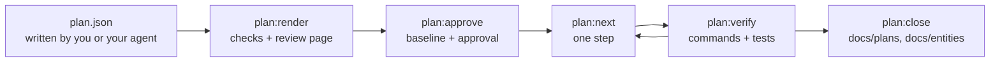

# Implementation Plans

An implementation plan is a design document for a change, written as JSON before any code exists. Guren checks it against your application, renders it as a page a person can review, stamps it when it is approved, breaks it into steps, and then reads from the code which parts of it exist. The agent that implements the plan never reports its own progress: `plan:status` and `plan:verify` derive it from the schema, the route graph, the controllers, the pages and the test results.

A plan is worth writing when a change spans a table, several routes and a page, and the design is cheaper to correct than the diff. If you can describe the diff in one sentence, skip the plan.



The examples on this page come from one plan, comments on the posts of `examples/blog`, run against a copy of that application.

## Where a plan lives

A plan is a directory under `docs/plans/`, named by its slug:

| File | What it is | Committed |
|---|---|---|
| `docs/plans/comments/plan.json` | The plan | yes |
| `docs/plans/comments/approvals.json` | The hashes `plan:approve` recorded | yes |
| `docs/plans/comments/decisions.json` | Waivers, written by `plan:waive` | yes |
| `docs/plans/comments/plan.html` | The page `plan:render` writes | no |
| `.guren/plans/comments.state.json` | Verification results and the marked step | no, it ignores itself |

The slug is the directory name for a file called `plan.json`. Any other name works too: `comments.plan.json` has the slug `comments`, and keeps its records beside it as `comments.approvals.json` and `comments.decisions.json`.

Ignore the rendered page before you start. `plan:next` refuses a working tree with untracked files, and the page is one:

```text
docs/plans/**/*.html
```

## Writing a plan

You write the JSON, or your agent does in the session where you discussed the feature. The command that asks a model for a plan on its own is not available yet (see the end of this page). `plan:render` validates the file against the plan schema and names the field at fault:

```text
 ERROR  The plan does not match the plan schema:
  models.0.columns.0.change.from: Invalid input: expected string, received undefined
```

### The document

| Field | Holds |
|---|---|
| `planVersion` | `1` |
| `title`, `summary`, `locale` | What the plan is about, and the language its prose is written in (`en`, `ja`) |
| `scope` | `goals` and `nonGoals` |
| `assumptions`, `questions` | What the plan decided without being told, and what it could not decide |
| `models`, `validators`, `controllers`, `routes`, `views`, `resources`, `policies`, `sideEffects` | The design, one section per kind of element |
| `flows` | How a request moves through what the plan adds, as nodes and edges |
| `commands` | Commands such as `guren add attachments` the change needs first |
| `tasks` | What each slice must achieve, and its acceptance behaviours |
| `hints` | Ordering advice, such as `task/entity/model.tag before task/entity/model.comment` |
| `baseline` | Written by `plan:approve`, never by hand |

Every section may be left out. An omitted section and an empty one are the same plan.

### Ids and changes

Every element carries an `id` and a `change`. Ids share one namespace across the whole plan, start with a letter, and may contain letters, digits, `_`, `.`, `:` and `-`; the convention is the section and a name (`model.comment`, `route.comments.store`). Other elements refer to each other by these ids, and a revision later names an element by its id alone, so keep them stable.

| `change.kind` | Meaning |
|---|---|
| `existing` | Referenced and left as it is |
| `add` | New |
| `alter` | Changed in place |
| `rename` | Renamed; `from` is the old name (a model's class, a column's property, a route's name) |
| `drop` | Removed; `reason` says why |

An `alter`, `rename` or `drop` of an existing table or column must say what happens to its rows with `dataMigration`: `{ "kind": "none", "reason": "…" }`, `backfill` or `manual` with a `description`. The plan is refused without one:

```text
  column.post.summary: Column "summary" of "Post" is a "rename" on an existing table and states no dataMigration.
```

A model lists only the columns the plan touches or references. This is the new `Comment` model from the example, cut to two of its five columns:

```json
{
  "id": "model.comment",
  "change": { "kind": "add" },
  "name": "Comment",
  "table": "comments",
  "columns": [
    {
      "id": "column.comment.body",
      "name": "body",
      "change": { "kind": "add" },
      "type": "text",
      "nullable": false,
      "unique": false,
      "index": false
    },
    {
      "id": "column.comment.postId",
      "name": "postId",
      "columnName": "post_id",
      "change": { "kind": "add" },
      "type": "integer",
      "nullable": false,
      "unique": false,
      "index": true,
      "references": { "model": "model.post", "column": "id", "onDelete": "cascade" }
    }
  ],
  "relationships": [
    { "name": "post", "type": "belongsTo", "target": "model.post" },
    { "name": "author", "type": "belongsTo", "target": "model.user" }
  ],
  "fillable": ["body"]
}
```

Column types are an abstract vocabulary rather than Drizzle builders: `string`, `text`, `integer`, `number`, `decimal`, `boolean`, `date`, `datetime`, `json`, `uuid`. `datetime` takes `withTimezone`, and `decimal` takes `precision` and `scale`.

The other sections follow the same pattern. A controller holds its actions, each with the validator its `body`, `params` or `query` uses, its `authorization` (middleware, and a policy ability), its `response` (an Inertia view, a redirect, a resource) and its business `rules` as prose. A route names its method, path, name, action id, middleware and `bind`. A view names its page id, its props, and a form whose fields point at a validator's fields rather than restating their rules. Elements in an application module carry `module`.

### Acceptance behaviours

A task intent names an entity, the elements it covers, and the behaviours that prove it works:

```json
{
  "id": "AC-comments-4",
  "description": "A user cannot delete someone else's comment.",
  "kind": "forbidden",
  "actor": "user",
  "route": "route.comments.destroy",
  "given": ["a comment written by another user exists"],
  "expect": { "status": 403 }
}
```

`kind` is one of `success`, `validation`, `unauthenticated`, `forbidden`, `not-found` and `state`. The checks count them: a route with a validator and no `validation` behaviour, or with authentication and no `unauthenticated` one, is reported. `expect` takes `status`, `redirect`, `inertia`, `errors` and `database`; request `input` and database values are written as `{ "name": "body", "json": "\"Nice post\"" }`, the value as JSON text.

Each behaviour becomes a test whose title carries its id in brackets. Start acceptance ids with `AC-`: `plan:verify` reports a bracketed `AC-` token that the plan does not declare, which is how a mistyped id gets caught.

```ts
test("[AC-comments-4] a user cannot delete someone else's comment", async () => {
  const comment = await Comment.forceCreate({ body: 'Mine', postId: post.id, userId: author.id })
  await http.actingAs(reader).delete(`/comments/${comment!.id}`).assertStatus(403)
})
```

Guren redirects a non-GET request with 303, so a behaviour that expects the redirect after a form post says `"status": 303`.

### Questions

A question is a decision the author could not make alone, with the options, the one the plan assumed, and the elements that change if the answer differs:

```json
{
  "id": "Q-delete",
  "question": "Does deleting a comment remove the row?",
  "options": [
    { "label": "hard delete", "consequence": "The row is removed; no deleted_at column." },
    { "label": "soft delete", "consequence": "A deleted_at column is added and lists filter on it." }
  ],
  "assumed": "hard delete",
  "affects": ["model.comment", "action.comments.destroy"]
}
```

A plan with an open question cannot be approved. Answer it by editing the plan: apply the answer, remove the question, and record the decision under `assumptions`. Before approval, editing `plan.json` by hand is the normal way to change it.

## Rendering and checking: `plan:render`

```bash
bunx guren plan:render docs/plans/comments/plan.json
```

It writes `docs/plans/comments/plan.html` and prints the path. `-o` writes somewhere else, `--app <dir>` names the application to check against when you run it from another directory, and `--locale ja` opens the page's own labels in Japanese (the page switches between `en` and `ja`; the plan's text is never translated).

The page is one file with no network access: it opens from disk and can be attached to a review. It has a tab per section, a filter per entity, a "Changes only" toggle that hides `existing` elements, an entity relationship diagram of the plan merged over the current schema, and every id links to the element it names. Failed checks and breaking changes are pinned under "Needs attention". Each element has Approve and Request changes buttons and a comment box, and the footer exports the review as `feedback.json`. The command the footer prints for that file, `guren plan --revise`, is not available yet: give the file to your agent, or apply the comments to `plan.json` yourself.

The checks run against the application as it is now. They report, among others, a route whose action is not in the plan, a foreign key to a model that exists nowhere, an `add` whose name is already taken, an `existing` or `alter` target that does not exist, a mutating route with authentication and no authorization, a body-carrying route with no validator, and the missing behaviours above. Rendering never fails on a check; `plan:approve` does. Renaming the delete route of the example to a name the blog already uses gives:

```text
  route.comments.destroy: The route name "posts.destroy" already exists in this application.
```

### Impact

For every element the plan alters, renames or drops, the page lists what in the application depends on it: relationships, routes with their `ApiRoutes` entries and agent tools, resources, policies, controller actions, tests by file name, and for a column the places that read or write it. A plan that renames `posts.excerpt` to `summary` in the blog shows, under the column:

```text
PostResource reads it                              app/Http/Resources/PostResource.ts:32
posts/Index reads it through PostResource          resources/js/pages/posts/Index.tsx:80
posts/Show reads it through PostResource           resources/js/pages/posts/Show.tsx:60
PostController.store writes data no static scan can name the columns of
PostController.update writes data no static scan can name the columns of
```

Impact is a lower bound. The scan is static, so a value passed to another function or file, a reassignment and a column held in a variable are not followed, and an empty list means nothing was found, not that nothing is affected. Dropping a column, changing its shape, renaming or dropping a route, and changing a published agent tool are marked breaking whatever Impact found.

## Approving: `plan:approve`

Approval is a person's decision, made after reading the page. It refuses while a check fails or a question is open:

```text
 ERROR  docs/plans/comments/plan.json is not approved while a check fails or a question is open; an assumption nobody confirmed is not approved by silence.
  question Q-delete is unanswered: Does deleting a comment remove the row?
```

Once the plan is clean:

```bash
bunx guren plan:approve docs/plans/comments/plan.json
```

```text
Comments on posts (plan.json)

Stamped the baseline at 0c871a5b9dc25587d33ae3d6bb6c3befe2c7e6a2: 13 element(s) hashed.
Not hashed, since their section could not be read: validator.comment
Approved 22735cb551ac15559cd5cabc344925f8f75af7a62efe39570ac49d8c032a59c0, recorded in docs/plans/comments/approvals.json.
```

The first approval writes a `baseline` into the plan: `rev`, the commit the plan was written against, and `contextHash`, a hash per referenced element of what the application holds for it today. That is why it refuses a repository with no commit and a working tree with uncommitted changes (the plan's own files excepted). The approval itself goes to `approvals.json`, beside the plan and never inside it. Commit both.

Validators are never hashed, since no scanner reads them. If another section cannot be read, approval refuses and names the elements that would stay unhashed; `--allow-unstamped` approves without them.

The plan's hash is its identity: a SHA-256 of the plan with its baseline. Verification records and waivers name it, so an approved plan changed by hand is a different plan: approve it again, and expect its steps to verify again. A baseline is never stamped twice.

## Implementing: `plan:next` and `plan:verify`

Guren derives the work from the plan, and the order does not depend on a model. Every entity the plan adds or changes is a task, ordered by foreign keys, and every task has up to five steps:

| Step | Work | Verified by |
|---|---|---|
| `scaffold` | The first version of a new entity, through `make:feature` | `codegen`, `typecheck` |
| `tests` | One test per acceptance behaviour, failing | `codegen`, the tests failing |
| `data` | Table, migration, model relationships and fillable | `codegen`, `db:migrate`, `typecheck` |
| `http` | Validators, controllers, routes, resources, policies | `codegen`, `guren check`, the tests passing |
| `pages` | Page components | `codegen`, `typecheck`, `guren check` |

Work shared by several entities goes to a `task/foundation` task, and a step with nothing to do is left out. Step ids read `task/entity/model.comment/http`. The loop is: ask for the next step, implement it, verify it, commit.

```bash
bunx guren plan:next docs/plans/comments/plan.json
```

```text
Comments on posts (plan.json)

Verified: task/entity/model.comment/scaffold

Next: task/entity/model.comment/tests
  task: entity Comment (task/entity/model.comment)
  verify: codegen → tests:fail

Behaviours to write, as test titles `[<id>] <description>`, failing:
  [AC-comments-1] A signed-in user can comment on a post.
      success; actor user; route route.comments.store; given a post exists; expect status 303; comments has 1 row(s)
  [AC-comments-2] An empty comment is rejected.
      validation; actor user; route route.comments.store; given a post exists; expect status 422; errors on body
  [AC-comments-3] A guest cannot comment.
      unauthenticated; actor guest; route route.comments.store; given a post exists; expect redirect /login
  [AC-comments-4] A user cannot delete someone else's comment.
      forbidden; actor user; route route.comments.destroy; given a comment written by another user exists; expect status 403

Implement this step only, then run `bunx guren plan:verify docs/plans/comments/plan.json --step task/entity/model.comment/tests` and commit once it is verified.
Marked in .guren/plans/comments.state.json
```

`plan:next` prints one step and never the whole plan. `--json` prints the same as data. It marks the step in the state file, which is what the Stop hook reads. It refuses a working tree with uncommitted changes unless they are the marked step's own, so run it before you start a step, not after:

```text
 ERROR  The working tree under /app has uncommitted changes (paths relative to the repository root), and one step is one commit. Commit or discard them first:
  ?? tests/comments.test.ts
```

```bash
bunx guren plan:verify docs/plans/comments/plan.json --step task/entity/model.comment/tests
```

```text
task/entity/model.comment/tests: verified (607 ms)
  pass     codegen     bun run codegen
  pass     tests:fail  bun test tests/comments.test.ts
  failing  [AC-comments-1]
  failing  [AC-comments-2]
  failing  [AC-comments-3]
  failing  [AC-comments-4]

Recorded in .guren/plans/comments.state.json
```

The `tests` step passes only when every behaviour has a test and each one fails: a test that passes before the code exists proves nothing, and a skipped test is not a failing one. `plan:verify` selects the test files whose source carries the step's ids, and runs them with `bun test`. Later steps run the same files and need them to pass. After the verify output it prints the plan's status, described below.

### Outcomes

A step ends in one of four outcomes.

| Outcome | Meaning |
|---|---|
| `verified` | Every command passed and every element the step owns is at the state that completes it |
| `failed` | A command failed; there is something in the implementation to fix |
| `incomplete` | The commands passed, but an element is not there yet |
| `blocked` | The environment could not run a command: a script `package.json` lacks, a tool not installed, a timeout, a database that cannot be reached |

From the example, a `data` step whose model relationship does not typecheck yet:

```text
task/entity/model.comment/data: failed (1254 ms)
  pass     codegen     bun run codegen
  pass     db:migrate  bun run db:migrate
  fail     typecheck   bun run typecheck
      `bun run typecheck` exited 1
      app/Models/Post.ts(26,14): error TS2345: Argument of type '"comments"' is not assignable to parameter of type '"author"'.
```

The same step before the relationships were written:

```text
task/entity/model.comment/data: incomplete (1055 ms)
  pass     codegen     bun run codegen
  pass     db:migrate  bun run db:migrate
  pass     typecheck   bun run typecheck
  not at its completion state: model.post: planned
  not at its completion state: model.comment: drifted
```

And a machine where the TypeScript compiler was not on the path:

```text
task/entity/model.comment/scaffold: blocked (354 ms)
  pass     codegen     bun run codegen
  blocked  typecheck   bun run typecheck
      `bun run typecheck` exited 127: a tool it needs is not installed
```

`plan:verify` executes your application: `bun test` boots it and `db:migrate` opens the database it is configured for, so run it against a development or test database, never production. Each command may take 600 seconds before it counts as `blocked`; `--timeout <seconds>` changes that. Without `--step` it runs every step in order and skips the ones whose record still holds. `--ci` exits 1 when a step it ran did not verify, and `--json` prints the report as data.

### One step, one commit

A verified step records a fingerprint of the files that hold its elements and of its test files. When one of them changes, the step's elements read `drifted` and `plan:next` returns the step again. In the example, the `pages` step edited `CommentResource.ts`, which belongs to the `http` step, and every element of `http` drifted:

```text
Routes
  drifted   add       comments.store             route.comments.store
      Verified 2026-09-22T10:16:42.422Z by task/entity/model.comment/http; changed since: app/Http/Resources/CommentResource.ts.
```

Verifying `http` again settled it. Change only the elements the step lists, and write each behaviour's setup in the `tests` step: once that step has verified, its tests pass, and editing one reopens a step that can no longer see them fail.

When every step is verified, `plan:next` says so:

```text
Every step is verified. Nothing is left to implement.
```

### The Stop hook

In an application with the agent harness (`bunx guren agent:init`), the `plan-implement` skill runs this loop, and the `Stop` hook of Claude Code, Codex and Cursor watches the marked step. Whenever the agent ends a turn, the hook verifies the step and sends the agent back while it is not verified:

```text
plan:verify on stop (docs/plans/comments/plan.json, task/entity/model.comment/data): the step is incomplete, so this turn is not done (continuation 1 of 3).
```

It gives up after three continuations, when nothing about the step changed since the last one, when the step or one of its elements is `blocked`, or when something the step depends on went stale since approval. The step is then recorded as stalled:

```text
plan:verify on stop (docs/plans/comments/plan.json, task/entity/model.comment/data): giving up, nothing about the step changed since the last continuation.
```

`plan:next` returns a stalled step again, with the reason. A stall is for a person to settle, in one of three ways: fix the environment, revise the plan, or waive the element.

## Reading progress: `plan:status`

```bash
bunx guren plan:status docs/plans/comments/plan.json
```

`plan:status` compares every element with the code. It imports the routes file and the schema and parses source, boots nothing, runs nothing, needs no database, and exits 0 whatever it finds. Halfway through the example:

```text
Models
  present   existing  User                       model.user
  verified  alter     Post                       model.post
  verified  add       Comment                    model.comment

Validators
  wired     add       CommentPayloadSchema       validator.comment

Actions
  wired     add       CommentController.store    action.comments.store
  wired     add       CommentController.destroy  action.comments.destroy

Views
  planned   alter     posts/Show                 view.posts.show
      differs: prop comments (planned declared, found not declared)

Elements the plan changes: 16
  planned 1, present 3, wired 5, verified 7, drifted 0, unjudged 0, blocked 0, waived 0
```

| State | Meaning |
|---|---|
| `planned` | Not in the code yet |
| `present` | In the code, and every planned property the scanners can read matches (for a `drop`, absent) |
| `wired` | Reachable: a route mounted by `createApp()`, an action such a route dispatches to, a page such an action returns, a validator such a route or action validates with |
| `verified` | Its step verified, and the files it fingerprinted are unchanged |
| `drifted` | Partly there with a property that differs, or changed since it was verified |
| `unjudged` | Nothing in the code can be read for it, so only its behaviours can verify it |
| `blocked` | Cannot be judged here; the line says why |
| `waived` | Accepted incomplete by a person, with a reason |

A property no scanner reads is never counted as a match. The report lists these under "Planned, not checkable", so a gap in what Guren can read stays visible rather than passing as green:

```text
Planned, not checkable:
  column.comment.postId: references.onDelete
  validator.comment: fields
  view.posts.show: form, actions, states
  resource.comment: fields
  policy.comment: abilities
```

Verification results live in `.guren/plans/`, which git ignores: a result is a fact about one machine. A fresh clone and CI see every element at most `wired` until `plan:verify` has run there.

### Freshness

For an approved plan, `plan:status` also compares each referenced element with the hash stamped at approval:

```text
Against the approved baseline: fresh 13, stale 0, unstamped 0, unjudged 1
  unjudged: validator.comment
```

An element is `fresh` while the application holds what was stamped, or what the plan says it will hold. It is `stale` when another change moved it somewhere else. `unstamped` has no hash (its section was unreadable at approval), and `unjudged` cannot be read now. A commit elsewhere that did not touch a referenced element leaves the plan fresh.

A stale element holds every step that depends on it. In a copy of the example, another commit registered a `comments.store` route before the implementation started:

```text
Held, since what they depend on changed after the plan was approved:
  task/entity/model.comment/http
    route.comments.store (routes, add), owned by the step; named by AC-comments-1, AC-comments-2, AC-comments-3: What the scanners read for it changed since approval, to neither what was stamped nor what the plan leaves.
      fail  The route name "comments.store" already exists in this application.
```

`plan:next` returns the next step that does not depend on it and exits 0. Releasing a hold is a person's call: change the plan to state what the application holds now and approve it again, or undo the change.

## Waiving an element: `plan:waive`

When an element will not be finished under this plan, a person can accept it incomplete, with a reason:

```bash
bunx guren plan:waive docs/plans/comments/plan.json view.posts.show --reason "the comment list ships with the post page redesign"
```

```text
Comments on posts (plan.json)

Waived view.posts.show: the comment list ships with the post page redesign

Recorded in docs/plans/comments/decisions.json
The decision log is committed with the plan. A waiver names this plan hash, so a revision does not inherit it.
```

The element reads `waived`, `plan:verify` leaves it out of its step's judgement, and `plan:next` lists it under "Waived, not to be implemented". A waiver lifts an element and nothing else: a behaviour that fails still fails its step, so a behaviour the code will not satisfy needs a changed plan instead. `plan:waive` refuses an `existing` element, an id the plan does not declare, an element of a section `plan:status` does not judge (flows, tasks, behaviours, questions), a draft that has no baseline yet, and a missing `--reason`. `--remove` withdraws the waivers of the named elements. The `plan-implement` skill tells the agent to report a stall and leave the waiver to you.

## Closing: `plan:close`

A plan is closed when every element it changes is `verified` or `waived`. Until then it refuses and names what is left:

```text
 ERROR  docs/plans/comments/plan.json is not closed: every element must be verified (guren plan:verify) or waived with a reason (guren plan:waive), and these are not:
  view.posts.show: planned
```

`--dry-run` prints everything the close would write. Then:

```bash
bunx guren plan:close docs/plans/comments/plan.json
```

```text
Comments on posts (plan.json)

  created       docs/plans/comments.md
  created       docs/entities/Post.md
  created       docs/entities/Comment.md

Closed 22735cb551ac15559cd5cabc344925f8f75af7a62efe39570ac49d8c032a59c0. The plan, its approvals and its decision log stay where they are, committed; docs/spec/ stays the description of record.
```

`docs/plans/comments.md` is a record of the plan: scope, assumptions, decisions, each element's final state and the acceptance behaviours. Each entity the plan touched gets a document under `docs/entities/`, with a block per section between markers:

```markdown
## Rules

<!-- guren:plan comments 22735cb551ac15559cd5cabc344925f8f75af7a62efe39570ac49d8c032a59c0 rules -->
- A signed-in user can comment on a post. (AC-comments-1)
- An empty comment is rejected. (AC-comments-2)
- A guest cannot comment. (AC-comments-3)
- A user cannot delete someone else's comment. (AC-comments-4)
- The comment's author is the signed-in user. (AC-comments-1, AC-comments-2, AC-comments-3)
- The signed-in user wrote the comment. (AC-comments-4)
<!-- /guren:plan comments rules -->
```

Edit the text outside the markers freely: closing a later plan for the same entity replaces only what is inside its own markers. A heading the close has to add is written in the plan's `locale`, so a `ja` plan gets Japanese headings. Each rule cites the behaviours that test it, and `bunx guren check --docs` warns about a cited id no test carries. A plan closed with waivers also prints a `make:adr` command per waiver, for the ones worth recording as decisions. Nothing is deleted: the plan, its approvals and its decision log stay committed, and `docs/spec/` from `bunx guren spec:generate` stays the description of what the code is.

## Not available yet

The RFC behind this feature (`rfcs/0030-implementation-plans.md`) describes more than has shipped. These are not available in the current release:

- a `guren plan` command that asks Claude for the plan JSON, and the revision command that applies review feedback to it. Write and edit `plan.json` yourself or in your agent session;
- keeping plans in GitHub issues instead of `docs/plans/`;
- a `scaffold` step that runs the generators for you. It lists what it should produce; run `make:feature` and trim what the plan does not need.

## Next steps

- [Spec-Anchored Development](./spec-anchored.md): the entity documents and doc links a closed plan feeds
- [Testing](./testing.md): `TestApp`, `actingAs()` and `withCsrf()` for acceptance tests
- [CLI](./cli.md): the rest of the commands
