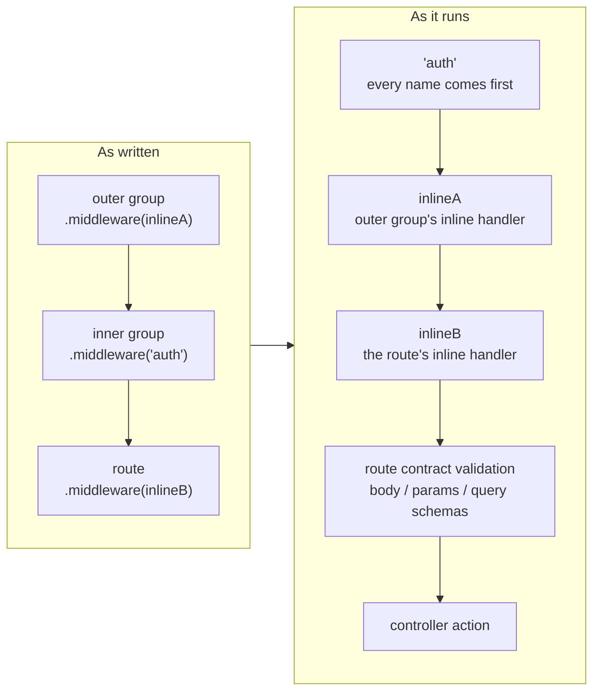

# Middleware Guide

Guren routes and applications share Hono's middleware model but expose Laravel-style ergonomics for common tasks. You can register middleware globally on the `Application` instance, per-route via the routing DSL, or through named aliases and groups.

## Global Middleware

```ts
// src/app.ts
import { createApp, defineMiddleware } from '@guren/core'

const requestTimer = defineMiddleware(async (ctx, next) => {
  const started = performance.now()
  await next()
  const duration = Math.round(performance.now() - started)
  console.log(`${ctx.req.method} ${ctx.req.path} -> ${ctx.res.status} (${duration}ms)`)
})

const app = createApp()
app.use('*', requestTimer)
```

Global middlewares run before any routes are mounted. Providers can register middleware inside their `boot()` hook using the application instance.

## Route Middleware

```ts
import { Router } from '@guren/core'
import DashboardController from '@/app/Http/Controllers/DashboardController'
import { requireAuthenticated } from '@/app/Http/middleware/auth'

export function registerWebRoutes(router: Router): void {
  router.get('/dashboard', [DashboardController, 'index']).middleware(
    requireAuthenticated({ redirectTo: '/login' }),
  )
}
```

Route middleware only applies to the specific endpoint (or every endpoint nested in a group).

`.middleware()` accepts handler functions, registered alias names, or a mix of both. They are resolved by kind rather than by position: every name in a route's chain runs before every handler, across groups as well as within one call. So an inline handler on an outer group runs *after* a named one on an inner group — the reverse of how they read. Use aliases throughout when relative order matters.



The last two stages are not something `.middleware()` can reorder: a schema attached to the route is always validated after every middleware has run, immediately before the action.

Aliases are also the only form that `guren audit` can report by name. Guards the framework recognizes — `requireAuthenticated()` and `requireGuest()` — are detected either way, but any other middleware is invisible to the audit unless it is registered under an alias.

## Middleware Aliases

Register short string names for middleware functions so you can reference them throughout your route files without importing the actual function each time:

```ts
import { Router, requireAuthenticated } from '@guren/core'
import { requireAdmin } from '@/app/Http/middleware/admin'
import { csrfProtection } from '@/app/Http/middleware/csrf'

export function registerWebRoutes(baseRouter: Router): void {
  const router = baseRouter
    .aliasMiddleware('auth', requireAuthenticated())
    .aliasMiddleware('admin', requireAdmin())
    .aliasMiddleware('csrf', csrfProtection())
}
```

> [!IMPORTANT]
> `aliasMiddleware()` returns a **new `Router` type** carrying the alias name it just registered. Call it without capturing the result and the name never reaches the type, so a later `.middleware('auth')` fails to compile. Always chain and assign, as above.

Once registered, use the alias string anywhere middleware is accepted:

```ts
router.get('/dashboard', [DashboardController, 'index']).middleware('auth')
router.post('/settings', [SettingsController, 'update']).middleware('auth', 'csrf')
```

## Middleware Groups

Bundle multiple middleware aliases under a single group name. This is useful for stacks that commonly run together. Every member of a group must already be a registered alias:

```ts
const router = new Router()
  .aliasMiddleware('auth', requireAuthenticated())
  .aliasMiddleware('session', createSessionMiddleware())
  .aliasMiddleware('csrf', createCsrfMiddleware())
  .aliasMiddleware('throttle', createRateLimitMiddleware({ limit: 60, windowMs: 60_000 }))
  .groupMiddleware('web', ['session', 'csrf'])
  .groupMiddleware('api', ['throttle'])
```

Apply a group to a route group using `router.middleware()`:

```ts
router.middleware('web').group((web) => {
  web.get('/', [HomeController, 'index'])
  web.get('/about', [PagesController, 'about'])
  web.get('/contact', [PagesController, 'contact'])
})

router.middleware('api').group((api) => {
  api.get('/api/posts', [ApiPostController, 'index'])
  api.post('/api/posts', [ApiPostController, 'store'])
})
```

You can combine groups and individual aliases:

```ts
router.middleware('web', 'auth').group((group) => {
  group.get('/profile', [ProfileController, 'show'])
  group.put('/profile', [ProfileController, 'update'])
})
```

## Built-in Helpers

### `defineMiddleware`
Utility wrapper for annotating Hono middleware with Guren's type expectations.

### `createSessionMiddleware`
Factory that attaches a session object to the request context. Sessions are stored in memory by default (`MemorySessionStore`) and persisted using signed cookies.

```ts
import { createSessionMiddleware } from '@guren/core'

app.use('*', createSessionMiddleware())
```

Each request exposes the session through `ctx.get('guren:session')` or the helper `getSessionFromContext(ctx)`.

`store` accepts a `SessionStore` or a function returning one; the function runs on the first request, so a store that needs a runtime binding (Workers) or a connection (Redis) is not built at boot. To declare several stores and pick one by environment, see `SessionManager` in the [Authentication](./authentication.md#selecting-a-store-with-sessionmanager) guide.

### Auth Guards

`requireAuthenticated` and `requireGuest` are thin wrappers that expect an auth context to be attached earlier in the pipeline. Pair them with `attachAuthContext`, which stores your guard implementation on the request.

```ts
import { attachAuthContext, requireAuthenticated } from '@guren/core'

app.use('*', attachAuthContext(() => authManager.createGuard('web')))

// Using middleware alias (recommended)
const router = new Router()
  .aliasMiddleware('auth', requireAuthenticated({ redirectTo: '/login' }))
  .aliasMiddleware('guest', requireGuest({ redirectTo: '/dashboard' }))

router.middleware('auth').group((auth) => {
  auth.get('/settings', [SettingsController, 'index'])
  auth.get('/dashboard', [DashboardController, 'index'])
})
```

### CSRF Protection

The CSRF middleware validates tokens on state-changing requests (POST, PUT, PATCH, DELETE):

```ts
const router = new Router().aliasMiddleware('csrf', createCsrfMiddleware())

router.middleware('csrf').group((csrf) => {
  csrf.post('/posts', [PostsController, 'store'])
})
```

### Rate Limiting

Apply rate limiting to routes or groups:

```ts
import { createRateLimitMiddleware } from '@guren/core'

const router = new Router().aliasMiddleware('throttle', createRateLimitMiddleware({ limit: 60, windowMs: 60_000 }))

router.middleware('throttle').group((throttle) => {
  throttle.post('/api/login', [AuthController, 'login'])
})
```

## Writing Custom Middleware

Create middleware with `defineMiddleware` for full type support:

```ts
import { defineMiddleware } from '@guren/core'

export const requireSubscription = defineMiddleware(async (ctx, next) => {
  const user = await ctx.get('auth')?.user()

  if (!user?.isSubscribed) {
    return ctx.json({ error: 'Subscription required' }, 403)
  }

  await next()
})
```

Register it as an alias for convenient use:

```ts
const router = new Router()
  .aliasMiddleware('auth', requireAuthenticated({ redirectTo: '/login' }))
  .aliasMiddleware('subscribed', requireSubscription)

router.middleware('auth', 'subscribed').group((group) => {
  group.get('/premium', [PremiumController, 'index'])
})
```
