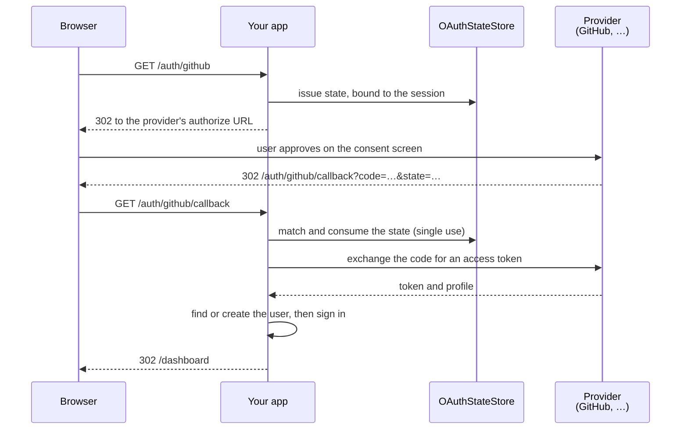

# OAuth Guide

Guren ships an OAuth 2.0 authorization-code flow for "Sign in with GitHub / Google / Discord" style login. It handles the redirect, CSRF-safe state, token exchange, and profile fetch. You wire it into your own login controller and session.

## Core Concepts

- **OAuthManager** – Registers providers and drives the authorize → callback flow.
- **OAuthProviderConfig** – Client ID/secret, endpoints, and scopes for one provider (GitHub, Google, Discord, or any OAuth 2.0 provider).
- **OAuthStateStore** – One-time state storage that prevents CSRF and open-redirect attacks. Memory by default; use `DatabaseOAuthStateStore` (or Redis) for multi-process deployments.
- **Provider factories** – `createGitHubOAuthProviderConfig`, `createGoogleOAuthProviderConfig`, `createDiscordOAuthProviderConfig` pre-fill the well-known endpoints for each provider.

The full flow has four parties. Your app is entered twice, and in between the state store answers one question: did this browser really start this flow?



## Basic Setup

### Registering the Manager

`config/oauth.ts` default-exports a `defineOAuthConfig` definition. Its callback receives the validated env and returns the providers to register and the state store; the definition builds an `OAuthManager` from them and binds it as `oauth` in the container. `bunx guren add oauth` writes this file:

```ts
// config/oauth.ts
import { DatabaseOAuthStateStore, defineOAuthConfig, type OAuthProviderConfig, createGitHubOAuthProviderConfig, createGoogleOAuthProviderConfig, createDiscordOAuthProviderConfig } from '@guren/core'
import { oauthStates } from '../db/schema.js'

export default defineOAuthConfig((env) => {
  // A provider is registered only when all three of its keys are set, so a
  // half-configured one fails app-side rather than at the provider.
  const providers: Record<string, OAuthProviderConfig> = {}

  if (env.OAUTH_GITHUB_CLIENT_ID && env.OAUTH_GITHUB_CLIENT_SECRET && env.OAUTH_GITHUB_REDIRECT_URI) {
    providers.github = createGitHubOAuthProviderConfig({
      clientId: env.OAUTH_GITHUB_CLIENT_ID,
      clientSecret: env.OAUTH_GITHUB_CLIENT_SECRET,
      redirectUri: env.OAUTH_GITHUB_REDIRECT_URI,
    })
  }

  if (env.OAUTH_GOOGLE_CLIENT_ID && env.OAUTH_GOOGLE_CLIENT_SECRET && env.OAUTH_GOOGLE_REDIRECT_URI) {
    providers.google = createGoogleOAuthProviderConfig({
      clientId: env.OAUTH_GOOGLE_CLIENT_ID,
      clientSecret: env.OAUTH_GOOGLE_CLIENT_SECRET,
      redirectUri: env.OAUTH_GOOGLE_REDIRECT_URI,
    })
  }

  if (env.OAUTH_DISCORD_CLIENT_ID && env.OAUTH_DISCORD_CLIENT_SECRET && env.OAUTH_DISCORD_REDIRECT_URI) {
    providers.discord = createDiscordOAuthProviderConfig({
      clientId: env.OAUTH_DISCORD_CLIENT_ID,
      clientSecret: env.OAUTH_DISCORD_CLIENT_SECRET,
      redirectUri: env.OAUTH_DISCORD_REDIRECT_URI,
    })
  }

  return {
    providers,
    // The authorize redirect and its callback may reach different processes, so
    // the state tying them together lives in the database, not in memory.
    stateStore: new DatabaseOAuthStateStore(oauthStates),
  }
})
```

Each provider reads three keys, `OAUTH_<PROVIDER>_CLIENT_ID`, `_CLIENT_SECRET` and `_REDIRECT_URI`, declared in `config/env.ts` (see [Configuration](./configuration.md#declaring-the-environment)); `guren add oauth` declares them for you. `_REDIRECT_URI` is the full callback URL, such as `https://your.app/auth/github/callback`. A provider whose keys are not all set is left unregistered, and starting its flow throws `OAuth provider "github" is not configured.`

List the definition in `createApp({ config })`:

```ts
// src/app.ts
import { createApp } from '@guren/core'
import database from '../config/database.js'
import env from '../config/env.js'
import oauth from '../config/oauth.js'

const app = createApp({
  env,
  config: [database, oauth],
})
```

Apps that bind `oauth` in a service provider keep working; see [Apps with service providers](./configuration.md#apps-with-service-providers).

### Login Controller

```ts
import { Controller, type OAuthManager } from '@guren/core'
import { z } from 'zod'
import { User } from '@/app/Models/User'

const CallbackQuerySchema = z.object({
  code: z.string(),
  state: z.string(),
})

export default class GitHubOAuthController extends Controller {
  private oauth(): OAuthManager {
    return this.make<OAuthManager>('oauth')
  }

  async start() {
    // Passing the session ties the flow to this browser — see
    // "Binding State to the Browser" below.
    const { url } = await this.oauth().authorize('github', {
      redirectTo: this.query('redirect_to'),
      session: this.auth.session(),
    })
    return this.redirect(url)
  }

  async callback() {
    const { code, state } = this.validateQuery(CallbackQuerySchema)

    const { profile, redirectTo } = await this.oauth().handleCallback('github', {
      code,
      state,
      session: this.auth.session(),
    })

    let user = await User.where('githubId', profile.id).first()
    if (!user) {
      user = await User.create({ email: profile.email, name: profile.name, githubId: profile.id })
    }

    await this.auth.login(user)
    return this.redirect(redirectTo ?? '/dashboard')
  }
}
```

### Routes

```ts
import { Router } from '@guren/core'
import GitHubOAuthController from '@/app/Http/Controllers/Auth/GitHubOAuthController'

export function registerWebRoutes(router: Router): void {
  router.get('/auth/github', [GitHubOAuthController, 'start'])
  router.get('/auth/github/callback', [GitHubOAuthController, 'callback'])
}
```

## Binding State to the Browser

`state` is unguessable and single-use, but on its own it is also *transferable*.
An attacker can start a flow on your app, authorize their own provider account,
keep the resulting `code` unconsumed, and then get a visitor to open

```
https://your.app/auth/github/callback?code=<attacker's>&state=<attacker's>
```

Nothing in the pair identifies whose browser began the flow, so the callback
succeeds and logs that visitor into the **attacker's** account. Everything the
visitor writes afterwards (posts, uploads, a saved payment method) lands in an
account the attacker can also read.

Pass the session to both legs of the flow to close it:

```ts
// starting the flow
const { url } = await this.oauth().authorize('github', { session: this.auth.session() })

// in the callback
await this.oauth().handleCallback('github', { code, state, session: this.auth.session() })
```

`authorize()` mints a fresh per-flow value, keeps it in the session, and stores
only its hash with the state; `handleCallback()` reads the value back (removing
it in the same step) and refuses a state whose binding it cannot match. Writing
to the session is also what makes a first-time visitor's session persist across
the round trip to the provider, so the callback request carries the same one.
When `this.auth.session()` returns `undefined` (no session middleware), the
state is simply left unbound, so nothing breaks; it just stays unprotected.

If the binding must live somewhere other than the session (an encrypted cookie,
a native app's secure storage), manage the value yourself with `bindTo`: pass a
value only this browser can present back to `authorize()`, and hand the same
value to `handleCallback()`. `bindTo` wins when both options are given.

A bound state carries a short marker, so boundness travels with the state rather
than only in the store: a store that cannot keep `binding` then rejects the
callback instead of quietly accepting a transferable state. Send the `state` that
`authorize()` returns, including when you supplied one of your own.

> [!WARNING]
> `authorize()` without `session` or `bindTo` still works, so apps written
> against the earlier API keep running, and it logs a warning once per process.
> Those apps remain open to the attack above until they adopt it. `make:auth`
> and the `oauth` blueprint generate the bound version.

## Redirect After Login

Pass a `redirectTo` when starting the flow (e.g. the page the user was on). It survives the round trip to the provider and comes back from `handleCallback`:

```ts
const { url } = await this.oauth().authorize('github', {
  redirectTo: '/settings/billing',
  session: this.auth.session(),
})
// ...later, in the callback:
const { redirectTo } = await this.oauth().handleCallback('github', {
  code,
  state,
  session: this.auth.session(),
})
return this.redirect(redirectTo ?? '/dashboard')
```

`redirectTo` is sanitized automatically: app-relative paths (`/settings/billing`) always pass, but absolute URLs are dropped unless their host is in `allowedRedirectHosts`. This prevents an attacker from crafting a login link that redirects a user off-site after authenticating.

The allowlist is part of the manager's `stateConfig`, which `defineOAuthConfig` does not accept (it takes `providers` and `stateStore` only). An app that needs one binds `oauth` from a service provider's `register()` and removes `config/oauth.ts` from `createApp({ config })`, since a key bound twice fails the boot:

```ts
// app/Providers/OAuthProvider.ts
import { createOAuthManager, DatabaseOAuthStateStore, ServiceProvider } from '@guren/core'
import { oauthStates } from '../../db/schema.js'

export default class OAuthProvider extends ServiceProvider {
  register(): void {
    this.container.singleton('oauth', () => {
      const manager = createOAuthManager({
        stateStore: new DatabaseOAuthStateStore(oauthStates),
        stateConfig: {
          allowedRedirectHosts: ['app.example.com', '*.example.com'], // supports wildcards
        },
      })
      // Register each provider with manager.registerProvider(), as config/oauth.ts did.
      return manager
    })
  }
}
```

## Built-in Providers

Each factory fills in the provider's endpoints and default scopes, so the definition passes only the three keys. `config/oauth.ts` above registers all three:

| Provider | Factory | Keys |
|----------|---------|------|
| GitHub | `createGitHubOAuthProviderConfig` | `OAUTH_GITHUB_CLIENT_ID`, `OAUTH_GITHUB_CLIENT_SECRET`, `OAUTH_GITHUB_REDIRECT_URI` |
| Google | `createGoogleOAuthProviderConfig` | `OAUTH_GOOGLE_CLIENT_ID`, `OAUTH_GOOGLE_CLIENT_SECRET`, `OAUTH_GOOGLE_REDIRECT_URI` |
| Discord | `createDiscordOAuthProviderConfig` | `OAUTH_DISCORD_CLIENT_ID`, `OAUTH_DISCORD_CLIENT_SECRET`, `OAUTH_DISCORD_REDIRECT_URI` |

Delete the block for a provider you do not offer, along with its keys in `config/env.ts`.

### Any OAuth 2.0 Provider

A provider without a factory needs the raw endpoints and, optionally, a `mapProfile` function to normalize the user-info response. Add it to `providers` in `config/oauth.ts`, and declare its three `OAUTH_GITLAB_*` keys in `config/env.ts`:

```ts
// config/oauth.ts, inside the defineOAuthConfig callback
if (env.OAUTH_GITLAB_CLIENT_ID && env.OAUTH_GITLAB_CLIENT_SECRET && env.OAUTH_GITLAB_REDIRECT_URI) {
  providers.gitlab = {
    clientId: env.OAUTH_GITLAB_CLIENT_ID,
    clientSecret: env.OAUTH_GITLAB_CLIENT_SECRET,
    redirectUri: env.OAUTH_GITLAB_REDIRECT_URI,
    authorizeUrl: 'https://gitlab.com/oauth/authorize',
    tokenUrl: 'https://gitlab.com/oauth/token',
    userInfoUrl: 'https://gitlab.com/api/v4/user',
    scopes: ['read_user'],
    mapProfile: (raw, token) => ({
      id: String(raw.id),
      email: raw.email as string | undefined,
      name: raw.name as string | undefined,
      avatar: raw.avatar_url as string | undefined,
      token,
      raw,
    }),
  }
}
```

On a manager you build yourself with `createOAuthManager()`, `manager.registerProvider('gitlab', config)` registers the same object, as the [test below](#testing) does with a built-in factory.

## Provider Email Verification

A provider returning an email is not a claim that it checked the address. Most report that separately (Google sends OIDC's `email_verified`, Discord sends `verified`), and the profile exposes it as `profile.emailVerified`:

| Value | Meaning |
|-------|---------|
| `true` | The provider says it verified the address |
| `false` | The provider says it did **not** |
| `undefined` | The provider sends no such signal — your app decides |

Refuse to *create* an account on `false`: an unverified address lets a user claim an email they do not own, and a callback that rejects duplicate emails then locks the real owner out for good. Check it only on the create path so an already-linked account is not stranded if its status changes later:

```ts
if (!user && profile.emailVerified === false) {
  throw ValidationException.withMessages({
    message: 'Your provider has not verified this email address.',
  })
}
```

The built-in presets declare their own key. For a provider you register yourself, set `emailVerifiedKey` when it uses a non-standard name. The default reads OIDC's `email_verified`, and only boolean values count:

```ts
const discordish: OAuthProviderConfig = {
  // ...
  emailVerifiedKey: 'verified',
}
```

`mapProfile` owns the whole mapping, so a provider using it sets `emailVerified` itself and `emailVerifiedKey` is ignored. GitHub's `/user` carries no verification field at all, so `emailVerified` stays `undefined` there — except when the private-email fallback runs, since `/user/emails` only yields verified primary addresses.

A `fetchFallbackEmail` hook is read against a response that had no email, so the key above cannot vouch for what it returns. Returning a bare string makes no claim and leaves the field `undefined`; return an object to state one:

```ts
fetchFallbackEmail: async (token) => ({ email: await lookupEmail(token), emailVerified: true }),
```

## State Storage

The one-time `state` value that ties the callback back to the original request is stored server-side. The default `MemoryOAuthStateStore` works for single-process dev, but production deployments with more than one process (load balancers, serverless) need shared storage. Otherwise the callback can land on a process that never issued the state.

For most apps, `DatabaseOAuthStateStore` is the recommended default, since it stores state in the same database your app already uses, with no extra infrastructure. `guren add oauth` and `make:auth --oauth` pass it as the definition's `stateStore`:

```ts
// config/oauth.ts
import { DatabaseOAuthStateStore, defineOAuthConfig } from '@guren/core'
import { oauthStates } from '../db/schema.js'

export default defineOAuthConfig(() => ({
  providers: {
    // one entry per provider, as in Registering the Manager
  },
  stateStore: new DatabaseOAuthStateStore(oauthStates),
}))
```

```ts
// db/schema.ts (sqlite dialect shown)
export const oauthStates = sqliteTable('oauth_states', {
  stateHash: text('state_hash').primaryKey(),
  provider: text('provider').notNull(),
  redirectTo: text('redirect_to'),
  expiresAt: integer('expires_at', { mode: 'timestamp_ms' }).notNull(),
  binding: text('binding'),
})
```

The `binding` column holds the hashed browser binding from
[Binding State to the Browser](#binding-state-to-the-browser). Without it the
store cannot persist a binding, so every bound state comes back unbound and
`handleCallback` rejects it with "Invalid or expired OAuth state" (a warning on
the console names the store as the cause). Add the column before binding flows
via `session` or `bindTo`.

A state row is removed when its callback arrives, so a sign-in abandoned before that keeps its row. Schedule `oauth-states:prune`, the console command `guren add oauth` registers, to sweep the expired ones; it calls `OAuthManager.pruneExpiredStates()` on the store behind your `oauth` binding. Redis remains available for apps that already run it, and expires its own keys. Declare `REDIS_URL` in `config/env.ts`:

```ts
// config/oauth.ts
import { defineOAuthConfig } from '@guren/core'
import { createRedisClient, RedisOAuthStateStore } from '@guren/core/redis'

export default defineOAuthConfig((env) => ({
  providers: {
    // one entry per provider, as in Registering the Manager
  },
  stateStore: new RedisOAuthStateStore(createRedisClient({ url: env.REDIS_URL })),
}))
```

## Configuration Options

```ts
interface OAuthProviderConfig {
  clientId: string
  clientSecret: string
  redirectUri: string
  authorizeUrl: string
  tokenUrl: string
  userInfoUrl: string
  scopes?: string[]
  tokenAuthMethod?: 'client_secret_post' | 'client_secret_basic'
  userInfoMethod?: 'GET' | 'POST'
  mapProfile?: (raw: Record<string, unknown>, token: OAuthTokenResult) => OAuthUserProfile
  emailVerifiedKey?: string      // Userinfo key holding the verification signal (default: 'email_verified')
}

interface OAuthStateConfig {
  expiresIn?: number             // State TTL in ms (default: 10 minutes)
  stateLength?: number           // Random state bytes (default: 24)
  hashAlgorithm?: 'sha256' | 'sha512'
  allowedRedirectHosts?: string[] // Absolute redirectTo hosts to allow (wildcards supported)
}
```

## Testing

```ts
import { describe, test, expect } from 'bun:test'
import { OAuthManager, MemoryOAuthStateStore, createGitHubOAuthProviderConfig } from '@guren/core'

describe('GitHub OAuth', () => {
  test('builds an authorize URL with state', async () => {
    const oauth = new OAuthManager({ stateStore: new MemoryOAuthStateStore() })
    oauth.registerProvider('github', createGitHubOAuthProviderConfig({
      clientId: 'test-client',
      clientSecret: 'test-secret',
      redirectUri: 'http://localhost:3000/auth/github/callback',
    }))

    const { url, state } = await oauth.authorize('github')

    expect(url).toContain('github.com/login/oauth/authorize')
    expect(url).toContain(`state=${state}`)
  })
})
```

## Best Practices

1. **Never skip state verification**: `handleCallback` verifies and consumes the state automatically, so don't build a custom callback path that trusts `code` alone. Always pass `session` (or `bindTo`) as well; state verification on its own does not tell you the flow started in the same browser (see [Binding State to the Browser](#binding-state-to-the-browser)).

2. **Set `allowedRedirectHosts` explicitly**: without it, only app-relative `redirectTo` paths are honored, which is the safest default. Add hosts only if you redirect to a separate domain after login.

3. **Use a shared state store in production**: `MemoryOAuthStateStore` only works when every request from the same login hits the same process. Use `DatabaseOAuthStateStore` (no extra infrastructure) or `RedisOAuthStateStore`.

4. **Match accounts by provider ID, not email**: store the provider's `profile.id` (e.g. `githubId`) on your user model. Emails can be unverified or reused across providers.

5. **Request the minimum scopes you need**: each provider factory defaults to a small scope set (e.g. GitHub's `read:user user:email`). Extend it only when you need more.
