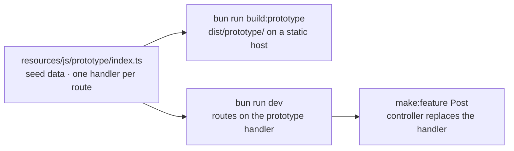

# Prototype First

Specifications written as documents get argued about; specifications a customer can click get corrected. Prototype mode lets you build the screens of a feature before any of its backend exists, host them on any static file host with no server behind them, walk a customer through them, and then start the backend from the same code, with the pages you showed becoming the pages you ship.

The mechanism is one file. A **fixture** under `resources/js/prototype/index.ts` answers every Inertia visit by route name, from in-memory seed data typed against your page components. In the browser it stands in for the server; on the server it stands in for the controllers you have not written yet; and it is typechecked against the same route manifest and page `Props` as everything else, so the prototype and the backend cannot drift apart without `bun run typecheck` saying so.



## Install it

```bash
bunx guren add prototype
```

Or scaffold with it from the start:

```bash
bunx create-guren-app my-app --prototype
```

`add prototype` writes the fixture module, adds two scripts to `package.json`, and wires two options:

| What | Where |
|---|---|
| `resources/js/prototype/index.ts` | The fixture: `definePrototype({ … })` with an empty `state` and `routes` |
| `dev:prototype`, `build:prototype` | `vite --mode prototype`, and `codegen && check --prototype && vite build --mode prototype` |
| `prototype: import.meta.env.GUREN_PROTOTYPE ? { load, base } : undefined` | Passed to `startInertiaClient()` in `resources/js/app.tsx` |
| `prototype: () => import('../resources/js/prototype/index.js')` | Passed to `createApp()` in `src/app.ts` |
| `ImportMetaEnv.GUREN_PROTOTYPE` | Declared in `resources/js/vite-env.d.ts` |

`GUREN_PROTOTYPE` is defined as the literal `true` under `vite --mode prototype` and the literal `false` in every other build, so the client branch and the fixture import are dead code in production and the runtime that answers visits in the browser is never in your production bundle. It is idempotent: run it again after an upgrade and it changes nothing that is already there. `bunx guren add prototype --remove` takes the scripts and the two wiring lines back out and leaves the fixture for you to delete.

## The fixture

Each entry in `routes` is keyed by a route name from `.guren/routes.gen.ts` and answers that route's visits:

```ts
import { apiRoutes, definePrototype } from '@guren/inertia-client/prototype'
import type { ApiRoutes } from '@/.guren/api-client.gen'
import { pages } from '@/.guren/pages.gen'
import { routeManifest } from '@/.guren/routes.gen'
import type { PostData } from '@/resources/js/types/Post'

export default definePrototype({
  manifest: routeManifest,
  api: apiRoutes<ApiRoutes>(),

  shared: {
    auth: { user: { id: 1, name: 'Demo User', email: 'demo@example.com' } },
  },

  state: () => ({
    posts: [
      { id: 1, title: 'First post', body: 'Hello', published: true },
      { id: 2, title: 'Draft', body: 'Not yet', published: false },
    ] as PostData[],
    nextId: 3,
  }),

  routes: {
    'posts.index': ({ state, page }) => page(pages.posts.Index, { posts: state.posts }),

    'posts.show': ({ state, params, page, notFound }) => {
      const post = state.posts.find((item) => item.id === Number(params.id))
      return post ? page(pages.posts.Show, { post }) : notFound()
    },

    'posts.store': ({ state, body, errors, redirect, flash }) => {
      if (!body.title) return errors({ title: 'Title is required.' })
      const post: PostData = { id: state.nextId++, ...body, published: false }
      state.posts.unshift(post)
      flash('success', 'Post created.')
      return redirect('posts.show', { id: post.id })
    },
  },
})
```

| Field | Meaning |
|---|---|
| `manifest` | `routeManifest` from `.guren/routes.gen.ts`. It types the keys of `routes` and each handler's `params`, and the browser matches URLs against it |
| `api` | `apiRoutes<ApiRoutes>()`, a type-only marker. It types each handler's `body` from the route's `body` schema |
| `shared` | Props every page receives under its own, like `shareInertiaProps()`. The demo user keeps guarded screens reachable; set `user: null` to walk the prototype as a guest |
| `state` | A factory for the seed data. The browser keeps the object in `sessionStorage` between reloads; `persist: 'local'` keeps it across tabs, `persist: false` keeps it in memory only |
| `notFoundPage` | A page contract rendered for `notFound()` and unmatched URLs, as a 200 in the browser and a 404 on the server. Without it the prototype shows Inertia's error dialog, as the server would |
| `routes` | One handler per route name. A name the manifest does not know is a type error |

A handler receives `{ params, query, body, state, shared }` plus the five ways to answer:

| Call | What the customer sees |
|---|---|
| `page(pages.posts.Show, props)` | That page. `props` must satisfy the page's `Props`, so a field added to the component fails the fixture in the same `tsc` run as the controller |
| `redirect('posts.show', { id })` | The target route's handler runs and its page is shown at that URL, as following a 303 would |
| `errors({ title: '…' })` | The originating page again with `errors` set, the shape a failed `validateBody()` produces. In the browser a second argument names an error bag |
| `notFound()` | The 404 dialog, or `notFoundPage` |
| `location('https://…')` | A full-page visit to an external URL |

`flash(key, value)` sets a flash message on the next page. `body` is the raw body the form sent, not the schema's parsed output, in both runtimes; call the schema yourself if you want coercion.

**Where the two runtimes differ.** The server builds the same context from a real request, and it is narrower in four places, each because the server behaves as it would for a controller: a `FormData` body arrives in the browser as a plain object with repeated keys as arrays (`tags[]` inputs and multi-file fields survive), while the server keeps the first value of a repeated key, as `validateBody()` does; `errors()` takes no error bag on the server, because `ValidationException` has none; `notFoundPage` is a 200 in the browser and a 404 on the server; and `flash()` on the server writes to the session, so it does nothing in an app with no session middleware.

`bunx guren make:feature Post --fields "title:string,body:text,published:boolean" --prototype` writes all of this for you: the page components, the validator, a `resources/js/types/Post.ts` exporting `PostData`, and seven entries appended to the fixture (index, create, show, edit, store, update, destroy). No model, migration, Resource or controller is written. It prints the route registrations to add, with `prototype` in place of a controller.

## Walk it

```bash
bun run dev:prototype
```

That is Vite alone, with no Bun server running. Every `text/html` request gets the prototype shell, the client loads the fixture, and every Inertia visit is answered in the tab. Forms, redirects, validation errors and flash messages all work, against the seed data.

**Resetting.** The state lives in the tab's `sessionStorage`, so a reload keeps what the customer did and a new tab starts from the seed. Open any URL with `?prototype.reset=1` to discard the stored state and reload without the flag; the module also exports `resetPrototypeState()` for a button in the shell. A demo that cannot be reset deterministically is not usable in a walkthrough, so put the reset link somewhere the presenter can reach.

**What does not work.** The browser runtime intercepts Inertia visits and nothing else:

- A plain `<a href>`, a native `<form>` submit, `window.location` and a direct `fetch()` never reach the fixture. On a static host they hit the SPA fallback (a full reload that starts from the URL, losing `persist: false` state) or a 404. Use `<Link>`, `useForm()` and `router.visit()`.
- Deferred props, `mergeProps`, `once` props, `encryptHistory` and the asset-version handshake are not reproduced. Guren's own server emits none of them today.
- No middleware runs in the browser. An `auth`-guarded route is reachable as a guest unless the handler checks `shared.auth.user` itself.
- Prefetch and `cacheFor` run GET handlers ahead of a click, so keep GET handlers free of side effects.

`guren check` can see none of these; this list is the check.

## Ship it

```bash
bun run build:prototype
```

The script regenerates the manifests, runs `guren check --prototype`, and builds `dist/prototype/`:

```text
dist/prototype/
├── index.html        # the shell, <meta name="robots" content="noindex, nofollow">
├── 404.html          # a copy of index.html, for hosts that serve it on unknown paths
├── _redirects        # /*  /index.html  200, for hosts that read it
├── *.js, *.css       # the hashed bundle, the fixture included
└── …                 # everything under public/, minus the ordinary build's own output
```

Upload the directory to any static host. Every host needs one thing: a URL that is not a file must serve `index.html`, because the customer will reload `/posts/3`.

| Host | SPA fallback |
|---|---|
| Cloudflare Pages | Reads `_redirects`. Nothing to configure |
| Netlify | Reads `_redirects`. Nothing to configure |
| GitHub Pages | Serves `404.html` for unknown paths. Nothing to configure, but a project page lives under `/<repo>/`; see the subpath note below |
| Cloudflare Workers Static Assets | Set `"not_found_handling": "single-page-application"` on the `assets` binding in `wrangler.jsonc` |
| Vercel | Add `{ "rewrites": [{ "source": "/(.*)", "destination": "/index.html" }] }` to `vercel.json` in the directory you deploy |
| S3 + CloudFront, nginx, any file server | Map the not-found response to `index.html` with status 200 |

**Under a subpath.** A GitHub project page or a preview URL serves the prototype from `/repo/` rather than `/`. Pass the base to the Vite plugin:

```ts
import { defineConfig } from 'vite'
import guren from '@guren/core/vite'

export default defineConfig({
  plugins: [guren({ prototype: { base: '/repo/' } })],
})
```

Or pass `--base /repo/` to the build. Asset URLs, `page.url` and route matching all use the same value, and two prototypes hosted on one origin under different bases keep separate state.

**The shell.** The generated `index.html` is minimal: a `<div id="app">`, the module script, and the `noindex` meta tag, because a prototype is not meant to be indexed. `createApp({ inertia: { document } })` is server-side and the static build never constructs the app, so a favicon, a font link or a theme prepaint script go into `resources/js/prototype/index.html`, which replaces the generated shell when it exists. Keep the `noindex` tag when you write your own.

> [!WARNING]
> **A hosted prototype is public unless you put something in front of it.** The fixture ships a "signed-in" demo user so guarded screens are reachable, and nothing in the build knows who is looking. That is not a leak, there is no real data behind it, but a customer walkthrough URL with a pinned demo account is easy to mistake for one, and your seed data may be more than you want indexed. Use the host's access control: Cloudflare Access, Vercel deployment protection, Netlify password protection, or a basic-auth rule on your own server.

## While the backend is being built

The same fixture answers on the server, so a half-implemented app keeps rendering under `bun run dev`. Register a route with the `prototype` handler instead of a controller:

```ts
import { Router, prototype } from '@guren/core'
import PostController from '../app/Http/Controllers/PostController.js'
import { PostPayloadSchema } from '../app/Http/Validators/PostValidator.js'

export function registerWebRoutes(router: Router): void {
  router.get('/posts', [PostController, 'index']).name('posts.index')
  router.get('/posts/:id', prototype).name('posts.show')
  router.post('/posts', { name: 'posts.store', body: PostPayloadSchema }, prototype)
}
```

A `prototype` route runs its middleware, enforces its contract (`params`, `query` and `body` schemas answer 422 before the fixture sees anything), then runs the fixture entry for its name under the real shared-props pipeline: a fixture's `shared.auth` is applied *under* the server's own resolvers, so a real session wins over the demo user, and nobody is logged in by a fixture. `page()` renders through the same path as `this.inertia()`, `redirect()` is a 303 to the named route, `errors()` throws `ValidationException`, and `notFound()` is a 404.

Three rules apply at boot, each a hard error naming the route:

- a `prototype` route must have a name, because the fixture is keyed by it;
- every named `prototype` route must have a fixture entry;
- `createApp()` must carry the `prototype` option (the loader `add prototype` wrote).

**Not in production.** The server-side state is one object per process, shared by every request, which is fine for your own dev server and for nothing else. A production boot (`NODE_ENV=production`) refuses to start while any route is still on the `prototype` handler, and `bunx guren doctor` reports those routes as a deploy blocker. `GUREN_PROTOTYPE_ROUTES=1` overrides the refusal for a deliberately fixture-backed server; the customer-facing artefact is the static build, not that.

`bunx guren context` lists the routes still on their fixture as the **prototype backlog**, so an agent asked to implement the next screen reads the list instead of diffing controllers against routes.

## `guren check --prototype`

Content-activated: an app with no fixture, no `prototype` route and no loader wired in `app.tsx` contributes nothing. Like `--arch` and `--docs`, the flag selects the suite and sets the exit code, which is what lets `build:prototype` gate on it.

| Rule | Level |
|---|---|
| A `prototype` route with no name | error |
| A named `prototype` route with no fixture entry | error |
| A fixture entry naming a route that does not exist | error |
| Two named routes sharing a method and a path | error, the URL matcher cannot tell them apart |
| A `prototype` route declaring `.agent()` | error, the tool manifest would advertise an action nothing implements |
| `prototype` routes present, `createApp()` without `prototype` | error |
| The loader wired in `app.tsx` but no fixture file | error |
| A named GET route with no fixture entry | warn, listed as not reachable in the prototype |

The fixture is read from its source, anchored on the `definePrototype(` call, and a fixture built dynamically (spread, computed keys) is reported as unreadable rather than passed. Nothing in the CLI runs your code.

## Promote it

When the specification settles, run `make:feature` without the flag:

```bash
bunx guren make:feature Post --fields "title:string,body:text,published:boolean"
```

In an app whose `posts.*` routes are on the `prototype` handler, that writes the model, the Resource and the controller, and leaves the pages and the validator the prototype run wrote in place. The Resource's `toArray()` is typed against the existing `PostData`, so the shape the customer saw is now the contract the serializer must satisfy. Add the table to `db/schema.ts`, migrate, and replace each `prototype` in `routes/web.ts` with the `[PostController, 'action']` the command prints. The fixture entries stay and keep serving `build:prototype`, so the customer's link keeps working while the backend lands behind it, one route at a time.

Once every route has a controller, `bunx guren add prototype --remove` unwires the loaders. Delete the fixture directory when it has no further use, or keep it for the next feature.

## Next steps

- [Chapter 15 of the tutorial](../tutorials/15-prototype-first.md) builds a feature this way, end to end, on the course's blog.
- [Frontend Guide](./frontend.md) for the page components and typed links the fixture renders.
- [CLI Reference](./cli.md) for `add prototype`, `make:feature --prototype` and `check --prototype`.
- [Deployment Guide](./deployment.md) for shipping the server once the backend exists.
