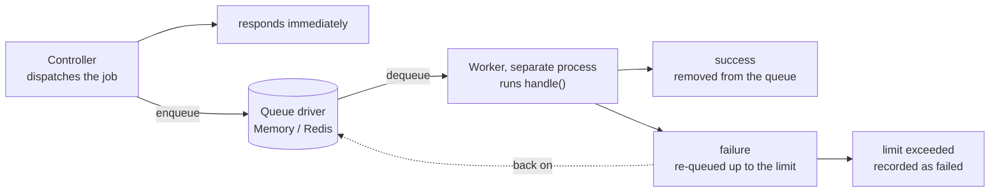

# Queue Guide

The queue moves slow work off the request: sending mail, processing uploads, calling an external API. A controller dispatches a job and responds immediately; a worker process picks the job up and runs it afterwards.

The standard path is: import queue APIs from `@guren/core`, configure the drivers in `config/queue.ts`, and keep controllers focused on dispatching jobs.

## Core Concepts

- **Job** – A class that encapsulates a unit of work to be processed asynchronously. Jobs define their own `handle()` method and can specify retry behavior.
- **Worker** – A long-running process that pulls jobs from queues and executes them. Workers handle retries, failures, and graceful shutdown.
- **Driver** – The storage backend for jobs. Guren ships with Sync, Memory and Redis drivers.
- **QueueManager** – Central registry for configuring and accessing multiple queue drivers.

Dispatching and working are separate processes, joined asynchronously through the queue. The request returns as soon as the job is enqueued; it runs later, on the worker's schedule.



## Creating Jobs

Generate a new job using the CLI:

```bash
bunx guren make:job SendWelcomeEmail
```

This creates `app/Jobs/SendWelcomeEmailJob.ts`:

```ts
import { Job } from '@guren/core'

interface SendWelcomeEmailPayload {
  userId: string
  email: string
}

export class SendWelcomeEmailJob extends Job<SendWelcomeEmailPayload> {
  // Name recorded in queued messages (default: the class name)
  static jobName = 'SendWelcomeEmailJob'

  // Queue name (default: 'default')
  static queue = 'emails'

  // Max retry attempts (default: 3)
  static maxAttempts = 5

  // Backoff strategy: 'exponential' | 'linear' | number (ms)
  static backoff: 'exponential' | 'linear' | number = 'exponential'

  async handle({ userId, email }: SendWelcomeEmailPayload): Promise<void> {
    // Your job logic here
    console.log(`Sending welcome email to ${email}`)
    // await mailService.send(...)
  }

  // Optional: Called when job fails permanently
  async failed({ userId, email }: SendWelcomeEmailPayload, error: Error): Promise<void> {
    console.error(`Failed to send welcome email to ${email}:`, error.message)
  }
}
```

### Job Configuration

| Property | Default | Description |
|----------|---------|-------------|
| `jobName` | the class name | Stable wire name recorded in queued messages |
| `queue` | `'default'` | Queue name for this job type |
| `maxAttempts` | `3` | Maximum retry attempts before failing |
| `backoff` | `'exponential'` | Retry delay strategy |

**Backoff strategies:**
- `'exponential'`: 2^attempt × 1000ms (1s, 2s, 4s, 8s, ...)
- `'linear'`: attempt × 1000ms (1s, 2s, 3s, ...)
- `number`: Fixed delay in milliseconds

### Pinning a Job's Wire Identity

Dispatching a job writes its name into the queued message, and the worker uses
that name to look the class back up. By default the name is the class name, so
two things break in-flight messages:

- **Renaming the class.** Messages queued under the old name no longer resolve.
- **Bundling with identifier mangling.** The deployed class is named something
  like `a`, so it registers under `a` and messages written by an unmangled — or
  differently mangled — build are orphaned. See
  [Serverless](./serverless.md) for the deployment side of this.

Declare `jobName` to pin the name across both:

```ts
import { Job } from '@guren/core'

export class SendWelcomeEmailJob extends Job<{ userId: string }> {
  // Queued as 'SendWelcomeEmailJob' whatever the class ends up being called
  static jobName = 'SendWelcomeEmailJob'
  static queue = 'emails'

  async handle({ userId }: { userId: string }): Promise<void> {
    // ...
  }
}
```

Once pinned, the class is free to be renamed — only `jobName` is durable, and it
is the string `registerJob()` keys on and the worker resolves. `make:job` writes
the pin with the class name it generates, so a scaffolded job starts pinned; change
the string before the first dispatch if you want a different one. A job written
by hand without a `jobName` keeps resolving by class name.

A subclass does **not** inherit its parent's `jobName`, even though JavaScript
statics are inherited. It resolves by its own class name until it declares one:

```ts
class BaseJob extends Job<void> {
  static jobName = 'BaseJob'
}

class DerivedJob extends BaseJob {}                  // queued as 'DerivedJob'
class ProxyJob extends BaseJob {
  static jobName = BaseJob.jobName                   // queued as 'BaseJob'
}
```

Without that rule, registering both classes would collapse them onto one
registry entry and the second registration would evict the first.

A name belongs to one class. When a different class registers under a name
another class holds, `registerJob()` warns once, naming both, and the worker
runs the class registered last. Two modules that each declare a `SendMail` hit
this, and so does `ProxyJob` above registered beside `BaseJob`: a subclass can
share its parent's name only while the parent is not registered. Give one of
them a distinct class name or its own `jobName`. The framework's own jobs take
`SendMailJob`, `SendNotificationJob`, `QueuedEventJob`, `GenerateVariantsJob`
(attachments) and `RunAgentJob` (`@guren/plugin-ai`), so app jobs need other
names. Registering the same class again is silent. A future major will throw
instead of warning.

Changing or adding a `jobName` on a job that already has messages in a durable
queue is itself a rename: drain the queue first, or keep the old name registered
until the backlog clears.

## Dispatching Jobs

### Using the Facade

The `queue` binding is the `QueueManager` that `config/queue.ts` configures. `Job.dispatch()` resolves the manager's default driver from the container by itself, so binding the manager and registering a driver is all a dispatch needs. Resolve the manager when you want the driver in hand, for a worker or to inspect a queue:

```ts
// Resolve the queue manager from the container
const Queue = app.container.make('queue')

// Access the default driver
const driver = Queue.driver()

// The explicit form of SendWelcomeEmailJob.dispatch(payload): the same
// message, pushed through this manager rather than the default application's
await Queue.dispatch(SendWelcomeEmailJob, { userId: 1 })
```

### Manual Setup

`Job.dispatch()` finds the manager through the container, where `config/queue.ts` binds it as `queue`. `bunx guren add queue` writes that definition, declares `QUEUE_CONNECTION` in `config/env.ts`, and adds the definition to `createApp({ config })`:

```ts
// config/queue.ts
import { defineQueueConfig, MemoryDriver, SyncDriver } from '@guren/core'

// QUEUE_CONNECTION=sync executes jobs inline on dispatch (the default, no
// worker process needed); 'memory' queues them for a Worker.
const drivers = {
  sync: () => new SyncDriver(),
  memory: () => new MemoryDriver(),
}

export default defineQueueConfig((env) => {
  // Checked at boot: the manager accepts any name and throws on the first dispatch.
  if (!Object.hasOwn(drivers, env.QUEUE_CONNECTION)) {
    throw new Error(
      `QUEUE_CONNECTION="${env.QUEUE_CONNECTION}" is not a declared driver. Declare it in config/queue.ts or use one of: ${Object.keys(drivers).join(', ')}.`,
    )
  }

  return { default: env.QUEUE_CONNECTION, drivers }
})
```

The callback receives the validated environment, so `QUEUE_CONNECTION` and any other key it reads must be declared in `config/env.ts` (see the [configuration guide](./configuration.md)).

A definition binds the queue but does not register jobs. The worker looks a job class up by the name in its message, so registration stays in a provider's `boot()`, and `guren add queue` writes one:

```ts
// app/Providers/JobsProvider.ts
import { ServiceProvider, registerJob } from '@guren/core'
import { ProcessWelcomeSequenceJob } from '../Jobs/ProcessWelcomeSequenceJob.js'

// config/queue.ts binds the queue; this registers the jobs it runs.
export default class JobsProvider extends ServiceProvider {
  register(): void {}

  boot(): void {
    // Every booted process registers them, including a worker that dispatches
    // nothing itself: a queued message carries the job's name, not its class.
    registerJob(ProcessWelcomeSequenceJob)
  }
}
```

Both go into the app:

```ts
// src/app.ts
import queue from '../config/queue.js'
import JobsProvider from '../app/Providers/JobsProvider.js'

const app = createApp({
  env,
  config: [database, http, queue],
  providers: [JobsProvider],
  routes: registerWebRoutes,
})
```

Apps that configure the queue in a service provider keep working; see [Apps with service providers](./configuration.md#apps-with-service-providers).

`Job.dispatch()` cannot find a manager that nothing binds. Dispatch through that manager explicitly instead: `await queue.dispatch(SendWelcomeEmailJob, payload)`. `setQueueDriver()` can still pin such a manager's driver, but it is deprecated since 2.23.0 and removed in 3.0.0.

Then dispatch jobs from anywhere in your application:

```ts
import { SendWelcomeEmailJob } from '@/app/Jobs/SendWelcomeEmailJob'

// Dispatch immediately
await SendWelcomeEmailJob.dispatch({
  userId: '123',
  email: 'user@example.com',
})

// Dispatch with delay (5 minutes)
await SendWelcomeEmailJob.dispatchAfter(5 * 60 * 1000, {
  userId: '123',
  email: 'user@example.com',
})

// Dispatch with options
await SendWelcomeEmailJob.dispatch(
  { userId: '123', email: 'user@example.com' },
  {
    queue: 'high-priority',
    maxAttempts: 10,
    delay: 30000, // 30 seconds
  }
)
```

## Running Workers

### Using the CLI

Start a worker to process jobs:

```bash
# Process default queue
bunx guren queue:work

# Process specific queues (priority order)
bunx guren queue:work --queue=high-priority,default,emails

# Process with custom settings
bunx guren queue:work --sleep=500 --timeout=120000 --max-jobs=100
```

**CLI options:**

| Option | Default | Description |
|--------|---------|-------------|
| `--queue` | `default` | Comma-separated queue names |
| `--sleep` | `1000` | Sleep time (ms) when no jobs available |
| `--timeout` | `60000` | Job timeout in milliseconds |
| `--max-jobs` | `0` | Max jobs before stopping (0 = unlimited) |

### Cancellation and delivery guarantees

`--timeout` aborts `this.signal` on the job. Pass that signal to cancellable I/O:

```typescript
async handle(payload: { url: string }) {
  await fetch(payload.url, { signal: this.signal })
}
```

The worker waits for `handle()` to settle before retrying or marking the job failed.
A handler that ignores cancellation can therefore exceed the timeout; if it then
completes, the job is acknowledged rather than retried. JavaScript
cannot forcibly stop arbitrary in-process code; use a process supervisor to terminate
a stuck worker. `stop()` requests shutdown and waits up to the worker timeout;
`start()` settles only after the active handler has finished.

Redis reservations are renewed while the handler runs, including during cancellation.
A renewal that fails with a driver error is retried at the next heartbeat. A reservation
another worker now owns aborts the signal; once the handler settles, the worker neither
acknowledges nor releases the job, reports it through `jobFailed`, and moves on. The
driver recovers the job through its visibility timeout. A stale worker
cannot acknowledge, release or fail a reservation now owned by another worker.
Redis state transitions are atomic. Use a standalone Redis instance, or a shared
hash tag in the prefix when using Redis Cluster so all queue keys occupy one slot.

Delivery is at least once: a process can fail after an external effect but before
acknowledging it. Use idempotency keys for payments, emails and other external writes.
`SqsDriver` renews through `ChangeMessageVisibility`; pass the queue's `visibilityTimeout`
in seconds so the renewal matches the queue attribute. Custom queue drivers with expiring
reservations should implement `heartbeatInterval` and `extendReservation(job)`; otherwise
configure their visibility timeout to cover the complete execution, including cancellation. If `start()` rejects on a driver
error, its running state is reset; a supervisor may restart it with backoff.

### Programmatic Worker

For more control, create workers programmatically:

```ts
import { Worker, MemoryDriver, createQueueManager, registerJob } from '@guren/core'
import { SendWelcomeEmailJob } from '@/app/Jobs/SendWelcomeEmailJob'

// Setup
const queue = createQueueManager({
  default: 'memory',
  drivers: {
    memory: () => new MemoryDriver(),
  },
})
const driver = queue.driver()

// Register job classes (required for worker to find them)
registerJob(SendWelcomeEmailJob)

// Create and start worker. `container` is what each job's this.make()
// resolves from; `guren queue:work` passes the container of the app it boots
const worker = new Worker(driver, {
  queues: ['high-priority', 'default', 'emails'],
  sleep: 1000,
  timeout: 60000,
  maxJobs: 0,        // 0 = unlimited
  stopWhenEmpty: false,
  container: app.container,
}, {
  // Optional event handlers
  jobProcessed: (job) => console.log(`Processed: ${job.name}`),
  jobFailed: (job, error, willRetry) => {
    console.error(`Failed: ${job.name}`, error.message, willRetry ? '(will retry)' : '')
  },
  workerStarted: () => console.log('Worker started'),
  workerStopped: () => console.log('Worker stopped'),
})

// Start processing
await worker.start()

// Graceful shutdown (waits for current job)
await worker.stop()
```

## Configuration

### Using QueueManager

For applications with multiple queue backends, declare each driver in `config/queue.ts` and let `QUEUE_CONNECTION` pick the default:

```ts
// config/queue.ts
import { defineQueueConfig, MemoryDriver, RedisDriver } from '@guren/core'
import { createRedisClient } from '@guren/core/redis'

export default defineQueueConfig((env) => ({
  default: env.QUEUE_CONNECTION,
  drivers: {
    memory: () => new MemoryDriver(),
    // A factory runs when its driver is first resolved, so Redis is dialed only
    // once something uses this driver.
    redis: () => new RedisDriver(createRedisClient({ url: env.REDIS_URL })),
  },
}))
```

Keep the driver-name check from the scaffold above when `default` comes from the environment. Resolve drivers from the bound manager:

```ts
const queue = app.container.make('queue') // QueueManager

// Resolve the default driver
const driver = queue.driver()

// Get a specific driver
const memoryDriver = queue.driver('memory')
```

### Redis Driver

For production, use the Redis driver for persistence and multi-server support:

```ts
import { RedisDriver } from '@guren/core'
import { createRedisClient } from '@guren/core/redis'

// config/queue.ts: a `drivers` entry, where `env` is the callback's argument
redis: () =>
  new RedisDriver(createRedisClient({ url: env.REDIS_URL }), {
    prefix: 'myapp:queue:', // Key prefix (default: 'queue:')
  }),
```

Declare `REDIS_URL` in `config/env.ts`, and import `@guren/core/redis` only in the config that uses it, since it pulls in ioredis.

### Sync Driver

The sync driver runs each job inline, in the process that dispatched it, so
nothing needs a worker. It is the development default (`QUEUE_CONNECTION=sync`)
and a failure surfaces from the `dispatch()` call itself.

Because nothing waits in a sync queue, retry backoff is not honored: a job
released back to the sync driver runs again immediately, whatever delay its
`backoff` strategy computes. Use the Memory or Redis driver with a worker when
you need to observe retry timing.

```ts
import { SyncDriver } from '@guren/core'

// config/queue.ts: a `drivers` entry
sync: () => new SyncDriver(),
```

## Failed Jobs

Jobs that exceed `maxAttempts` are moved to the failed jobs store.

### Viewing Failed Jobs

```bash
bunx guren queue:failed
```

Or programmatically:

```ts
const failedJobs = await driver.getFailedJobs()
// Or filter by queue
const failedEmails = await driver.getFailedJobs('emails')
```

### Retrying Failed Jobs

```bash
# Retry a specific job
bunx guren queue:retry <job-id>

# Retry all failed jobs
bunx guren queue:retry --all
```

Or programmatically:

```ts
await driver.retryFailedJob(jobId)
```

### Clearing Failed Jobs

```bash
bunx guren queue:flush
```

Or programmatically:

```ts
await driver.deleteFailedJob(jobId)
```

## Container Integration

`config/queue.ts` binds the queue manager as a singleton. You can resolve it from the container:

```ts
// Access via app.container or this.container in providers

const queue = container.make('queue') // QueueManager
const driver = queue.driver()
```

### Testing with `container.fake()`

Swap the queue manager in tests to prevent real job dispatching:

```ts
// Access via app.container or this.container in providers
import { QueueManager, MemoryDriver } from '@guren/core'

test('jobs are dispatched', async () => {
  const fakeQueue = new QueueManager({
    default: 'memory',
    drivers: { memory: () => new MemoryDriver() },
  })

  using _ = container.fake('queue', fakeQueue)

  // All code resolving 'queue' from the container (including the facade)
  // now uses fakeQueue
})
```

## Testing

For testing, use the Memory driver and process jobs synchronously:

```ts
import { describe, test, expect, beforeEach } from 'bun:test'
import { MemoryDriver, createQueueManager, registerJob, processJob, clearJobRegistry } from '@guren/core'
import { SendWelcomeEmailJob } from '@/app/Jobs/SendWelcomeEmailJob'

describe('SendWelcomeEmailJob', () => {
  let driver: MemoryDriver

  beforeEach(() => {
    const queue = createQueueManager({
      default: 'memory',
      drivers: {
        memory: () => new MemoryDriver(),
      },
    })
    driver = queue.driver()
    clearJobRegistry()
    registerJob(SendWelcomeEmailJob)
  })

  test('processes job successfully', async () => {
    // Dispatch job
    await SendWelcomeEmailJob.dispatch({
      userId: '123',
      email: 'test@example.com',
    })

    // Verify job is queued
    expect(await driver.size('emails')).toBe(1)

    // Process the job
    const processed = await processJob(driver, 'emails')
    expect(processed).toBe(true)

    // Queue should be empty
    expect(await driver.size('emails')).toBe(0)
  })
})
```

## Best Practices

1. **Use typed payloads**: Define interfaces for job payloads to ensure type safety.

2. **Keep jobs focused**: Each job should do one thing well. Chain multiple jobs for complex workflows.

3. **Handle failures gracefully**: Implement the `failed()` method to log errors, send alerts, or clean up.

4. **Use appropriate queues**: Separate queues by priority or type (e.g., `emails`, `exports`, `notifications`).

5. **Set reasonable timeouts**: Long-running jobs should have appropriate `timeout` values.

6. **Monitor queue sizes**: Keep track of queue backlogs to identify bottlenecks.

7. **Test job logic**: Write unit tests for job handlers to catch errors before production.
