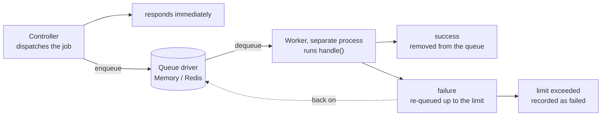

# Queue Guide

Guren provides a robust queue system for deferring time-consuming tasks to be processed in the background. This is essential for maintaining fast response times while handling operations like sending emails, processing uploads, or making external API calls.

The standard vNext path is: import queue APIs from `@guren/core`, configure the queue manager in a provider, and keep controllers focused on dispatching jobs.

## Core Concepts

- **Job** – A class that encapsulates a unit of work to be processed asynchronously. Jobs define their own `handle()` method and can specify retry behavior.
- **Worker** – A long-running process that pulls jobs from queues and executes them. Workers handle retries, failures, and graceful shutdown.
- **Driver** – The storage backend for jobs. Guren ships with Memory and Redis drivers.
- **QueueManager** – Central registry for configuring and accessing multiple queue drivers.

Dispatching and working are separate processes, joined asynchronously through the queue. The request returns as soon as the job is enqueued; it runs later, on the worker's schedule.



## Creating Jobs

Generate a new job using the CLI:

```bash
bunx guren make:job SendWelcomeEmail
```

This creates `app/Jobs/SendWelcomeEmailJob.ts`:

```ts
import { Job } from '@guren/core'

interface SendWelcomeEmailPayload {
  userId: string
  email: string
}

export class SendWelcomeEmailJob extends Job<SendWelcomeEmailPayload> {
  // Queue name (default: 'default')
  static queue = 'emails'

  // Max retry attempts (default: 3)
  static maxAttempts = 5

  // Backoff strategy: 'exponential' | 'linear' | number (ms)
  static backoff: 'exponential' | 'linear' | number = 'exponential'

  async handle({ userId, email }: SendWelcomeEmailPayload): Promise<void> {
    // Your job logic here
    console.log(`Sending welcome email to ${email}`)
    // await mailService.send(...)
  }

  // Optional: Called when job fails permanently
  async failed({ userId, email }: SendWelcomeEmailPayload, error: Error): Promise<void> {
    console.error(`Failed to send welcome email to ${email}:`, error.message)
  }
}
```

### Job Configuration

| Property | Default | Description |
|----------|---------|-------------|
| `jobName` | the class name | Stable wire name recorded in queued messages |
| `queue` | `'default'` | Queue name for this job type |
| `maxAttempts` | `3` | Maximum retry attempts before failing |
| `backoff` | `'exponential'` | Retry delay strategy |

**Backoff strategies:**
- `'exponential'`: 2^attempt × 1000ms (1s, 2s, 4s, 8s, ...)
- `'linear'`: attempt × 1000ms (1s, 2s, 3s, ...)
- `number`: Fixed delay in milliseconds

### Pinning a Job's Wire Identity

Dispatching a job writes its name into the queued message, and the worker uses
that name to look the class back up. By default the name is the class name, so
two things break in-flight messages:

- **Renaming the class.** Messages queued under the old name no longer resolve.
- **Bundling with identifier mangling.** The deployed class is named something
  like `a`, so it registers under `a` and messages written by an unmangled — or
  differently mangled — build are orphaned. See
  [Serverless](./serverless.md) for the deployment side of this.

Declare `jobName` to pin the name across both:

```ts
import { Job } from '@guren/core'

export class SendWelcomeEmailJob extends Job<{ userId: string }> {
  // Queued as 'SendWelcomeEmailJob' whatever the class ends up being called
  static jobName = 'SendWelcomeEmailJob'
  static queue = 'emails'

  async handle({ userId }: { userId: string }): Promise<void> {
    // ...
  }
}
```

Once pinned, the class is free to be renamed — only `jobName` is durable, and it
is the string `registerJob()` keys on and the worker resolves. Jobs without a
`jobName` keep resolving by class name, so this is opt-in.

A subclass does **not** inherit its parent's `jobName`, even though JavaScript
statics are inherited. It resolves by its own class name until it declares one:

```ts
class BaseJob extends Job<void> {
  static jobName = 'BaseJob'
}

class DerivedJob extends BaseJob {}                  // queued as 'DerivedJob'
class ProxyJob extends BaseJob {
  static jobName = BaseJob.jobName                   // queued as 'BaseJob'
}
```

Without that rule, registering both classes would collapse them onto one
registry entry and the second registration would evict the first.

Changing or adding a `jobName` on a job that already has messages in a durable
queue is itself a rename: drain the queue first, or keep the old name registered
until the backlog clears.

## Dispatching Jobs

### Using the Facade

The simplest way to interact with the queue is through the `QueueManager`:

```ts
// Resolve the queue manager from the container
const Queue = app.container.make('queue')

// Access the default driver
const driver = Queue.driver()
```

### Manual Setup

You can also configure a queue manager directly:

```ts
import { createQueueManager, MemoryDriver } from '@guren/core'

const queue = createQueueManager({
  default: 'memory',
  drivers: {
    memory: () => new MemoryDriver(),
  },
})

queue.driver()
```

Then dispatch jobs from anywhere in your application:

```ts
import { SendWelcomeEmailJob } from '@/app/Jobs/SendWelcomeEmailJob'

// Dispatch immediately
await SendWelcomeEmailJob.dispatch({
  userId: '123',
  email: 'user@example.com',
})

// Dispatch with delay (5 minutes)
await SendWelcomeEmailJob.dispatchAfter(5 * 60 * 1000, {
  userId: '123',
  email: 'user@example.com',
})

// Dispatch with options
await SendWelcomeEmailJob.dispatch(
  { userId: '123', email: 'user@example.com' },
  {
    queue: 'high-priority',
    maxAttempts: 10,
    delay: 30000, // 30 seconds
  }
)
```

## Running Workers

### Using the CLI

Start a worker to process jobs:

```bash
# Process default queue
bunx guren queue:work

# Process specific queues (priority order)
bunx guren queue:work --queue=high-priority,default,emails

# Process with custom settings
bunx guren queue:work --sleep=500 --timeout=120000 --max-jobs=100
```

**CLI options:**

| Option | Default | Description |
|--------|---------|-------------|
| `--queue` | `default` | Comma-separated queue names |
| `--sleep` | `1000` | Sleep time (ms) when no jobs available |
| `--timeout` | `60000` | Job timeout in milliseconds |
| `--max-jobs` | `0` | Max jobs before stopping (0 = unlimited) |

### Programmatic Worker

For more control, create workers programmatically:

```ts
import { Worker, MemoryDriver, createQueueManager, registerJob } from '@guren/core'
import { SendWelcomeEmailJob } from '@/app/Jobs/SendWelcomeEmailJob'

// Setup
const queue = createQueueManager({
  default: 'memory',
  drivers: {
    memory: () => new MemoryDriver(),
  },
})
const driver = queue.driver()

// Register job classes (required for worker to find them)
registerJob(SendWelcomeEmailJob)

// Create and start worker
const worker = new Worker(driver, {
  queues: ['high-priority', 'default', 'emails'],
  sleep: 1000,
  timeout: 60000,
  maxJobs: 0,        // 0 = unlimited
  stopWhenEmpty: false,
}, {
  // Optional event handlers
  jobProcessed: (job) => console.log(`Processed: ${job.name}`),
  jobFailed: (job, error, willRetry) => {
    console.error(`Failed: ${job.name}`, error.message, willRetry ? '(will retry)' : '')
  },
  workerStarted: () => console.log('Worker started'),
  workerStopped: () => console.log('Worker stopped'),
})

// Start processing
await worker.start()

// Graceful shutdown (waits for current job)
await worker.stop()
```

## Configuration

### Using QueueManager

For applications with multiple queue backends, use `createQueueManager()`:

```ts
import { createQueueManager, MemoryDriver, RedisDriver, createRedisClient } from '@guren/core'

const redis = createRedisClient({ url: process.env.REDIS_URL })

const queueManager = createQueueManager({
  default: 'redis',
  drivers: {
    memory: () => new MemoryDriver(),
    redis: () => new RedisDriver(redis),
  },
})

// Resolve the default driver and make it active for dispatching
const driver = queueManager.driver()

// Get a specific driver
const memoryDriver = queueManager.driver('memory')
```

### Redis Driver

For production, use the Redis driver for persistence and multi-server support:

```ts
import { createQueueManager, RedisDriver, createRedisClient } from '@guren/core'

const redis = createRedisClient({
  url: process.env.REDIS_URL,
})

const queue = createQueueManager({
  default: 'redis',
  drivers: {
    redis: () =>
      new RedisDriver(redis, {
        prefix: 'myapp:queue:', // Key prefix (default: 'guren:queue:')
      }),
  },
})

const driver = queue.driver()
```

## Failed Jobs

Jobs that exceed `maxAttempts` are moved to the failed jobs store.

### Viewing Failed Jobs

```bash
bunx guren queue:failed
```

Or programmatically:

```ts
const failedJobs = await driver.getFailedJobs()
// Or filter by queue
const failedEmails = await driver.getFailedJobs('emails')
```

### Retrying Failed Jobs

```bash
# Retry a specific job
bunx guren queue:retry <job-id>

# Retry all failed jobs
bunx guren queue:retry --all
```

Or programmatically:

```ts
await driver.retryFailedJob(jobId)
```

### Clearing Failed Jobs

```bash
bunx guren queue:flush
```

Or programmatically:

```ts
await driver.deleteFailedJob(jobId)
```

## Container Integration

The queue subsystem is registered as a singleton via a `ServiceProvider`. You can resolve it from the container:

```ts
// Access via app.container or this.container in providers

const queue = container.make('queue') // QueueManager
const driver = queue.driver()
```

### Testing with `container.fake()`

Swap the queue manager in tests to prevent real job dispatching:

```ts
// Access via app.container or this.container in providers
import { QueueManager, MemoryDriver } from '@guren/core'

test('jobs are dispatched', async () => {
  const fakeQueue = new QueueManager({
    default: 'memory',
    drivers: { memory: () => new MemoryDriver() },
  })

  using _ = container.fake('queue', fakeQueue)

  // All code resolving 'queue' from the container (including the facade)
  // now uses fakeQueue
})
```

## Testing

For testing, use the Memory driver and process jobs synchronously:

```ts
import { describe, test, expect, beforeEach } from 'bun:test'
import { MemoryDriver, createQueueManager, registerJob, processJob, clearJobRegistry } from '@guren/core'
import { SendWelcomeEmailJob } from '@/app/Jobs/SendWelcomeEmailJob'

describe('SendWelcomeEmailJob', () => {
  let driver: MemoryDriver

  beforeEach(() => {
    const queue = createQueueManager({
      default: 'memory',
      drivers: {
        memory: () => new MemoryDriver(),
      },
    })
    driver = queue.driver()
    clearJobRegistry()
    registerJob(SendWelcomeEmailJob)
  })

  test('processes job successfully', async () => {
    // Dispatch job
    await SendWelcomeEmailJob.dispatch({
      userId: '123',
      email: 'test@example.com',
    })

    // Verify job is queued
    expect(await driver.size('emails')).toBe(1)

    // Process the job
    const processed = await processJob(driver, 'emails')
    expect(processed).toBe(true)

    // Queue should be empty
    expect(await driver.size('emails')).toBe(0)
  })
})
```

## Best Practices

1. **Use typed payloads**: Define interfaces for job payloads to ensure type safety.

2. **Keep jobs focused**: Each job should do one thing well. Chain multiple jobs for complex workflows.

3. **Handle failures gracefully**: Implement the `failed()` method to log errors, send alerts, or clean up.

4. **Use appropriate queues**: Separate queues by priority or type (e.g., `emails`, `exports`, `notifications`).

5. **Set reasonable timeouts**: Long-running jobs should have appropriate `timeout` values.

6. **Monitor queue sizes**: Keep track of queue backlogs to identify bottlenecks.

7. **Test job logic**: Write unit tests for job handlers to catch errors before production.
