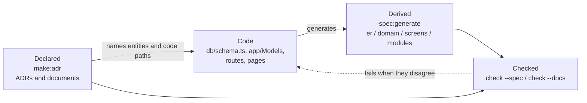

# Spec-Anchored Development

AI agents write code faster than anyone can keep documentation honest by
hand. Guren's answer is one principle:

> **Derived where possible, declared where not, checked always.**

- **Derived** — anything the code can prove is generated from it: ER
  diagrams, the domain model, the screen inventory, the module map, an
  entity's full context.
- **Declared** — anything code cannot express is written down and
  explicitly linked to the code it governs: decisions, business rules,
  background.
- **Checked** — both kinds are verified mechanically. A generated view
  that drifted or a doc link that broke fails a check, not a code review.

The result is a specification that stays true as the code moves — for
you, and for every agent working in your repository.

Here is how the three layers fit together.



## Derived: spec views

```bash
bunx guren spec:generate
```

renders four markdown views into `docs/spec/`, each answering one question:

| File | Question it answers |
|------|--------------------|
| `er.md` | What does the database look like? Mermaid ER diagram from `db/schema.ts` — columns, types, keys — with edges from your model relationships |
| `domain.md` | What are the domain objects? Class diagram of models grouped by module, with relationship cardinalities |
| `screens.md` | What does each screen receive? Page → Props type → the routes that render it |
| `modules.md` | How is the app partitioned? Modules, their models, and cross-module dependencies |

Output is deterministic — regenerating without a code change is
byte-identical — so the files are committed, and a PR diff shows exactly
what a change did to the spec. Never edit them by hand; the drift gate
exists so you don't have to trust anyone not to:

```bash
bunx guren check --spec    # regenerates in memory, non-zero exit on drift
```

## Derived: entity context

```bash
bunx guren context User
```

joins everything the project knows about one model — table and columns,
relationships in both directions, routes with their validation schemas,
controller actions, Inertia pages with Props, resource, policy,
factories, seeders, tests, and the documents linked to it. Add `--json`
for agents; `--module <name>` disambiguates same-named models
(`--module app` selects the application root). The same bundle is
available to MCP-connected agents as the `guren_entity_context` tool.

## Declared: linking docs to code

Decisions and business context live as markdown under `docs/` (and
`modules/<name>/docs/`). The directory is an
[Open Knowledge Format](https://github.com/GoogleCloudPlatform/knowledge-catalog/tree/main/okf)
(OKF) bundle: each document is markdown with YAML frontmatter, `type`
is the one field the format requires, and relations are ordinary
markdown links plus Guren's validated extensions:

```yaml
---
type: adr
status: stable            # draft | stable | deprecated (absent = stable)
entities: [Invoice]
related:
  - app/Http/Controllers/InvoiceController.ts
  - modules/billing/**
generated: { by: human:ada, at: 2026-07-25T09:00:00Z }
verified: { by: human:grace, at: 2026-07-26T09:00:00Z }
---
```

- `entities` links by model class name — `bunx guren context Invoice`
  surfaces the document to whoever touches that model next.
- `related` links files or globs for docs that govern non-model code.
  Both are Guren extensions to OKF (which permits producer-defined keys).
- Ordinary markdown links in the body are OKF's own relation mechanism
  and are validated too — `[orders](/adr/0002-orders.md)` resolves from
  the doc's `docs/` bundle root, relative paths from the doc itself.
- `generated` and `verified` record who wrote and who confirmed the
  content, in OKF's actor convention (`human:<id>`, `process:<id>`, or
  `<producer>/<version>` for agents) — in an agent-maintained corpus,
  provenance is what makes a document trustable.
- Models and controllers can link back with a JSDoc tag:
  `/** @docs docs/adr/0001-billing.md */` (tags in other files aren't scanned).
- `issues` names the GitHub issues or pull requests the document belongs
  to: `issues: [412, "acme/shop#398", https://github.com/acme/shop/pull/9]`.
  A bare number means the app's own repository (read from the `origin`
  remote); quote the `#412` spelling, since an unquoted `#` starts a YAML
  comment and swallows the rest of the line. The task list, progress and
  assignee stay on the issue; the document carries the decision and this
  link. `guren check` warns on an entry it cannot read and never asks
  GitHub anything, so the gate stays offline.

Record decisions with the generator:

```bash
bunx guren make:adr "Billing cycle is end-of-month" --entity Invoice --issue 412
```

It numbers the file under `docs/adr/`, prefills the frontmatter, and
`--entity` fills `entities:` and `related:` from what already exists
(`--by` overrides the `generated.by` actor, which defaults to the git
author; `--issue`, repeatable, fills `issues:`). Every new Guren app
ships with a seed ADR explaining the convention.

`bunx guren context Invoice` then ends with a **Linked issues** section
listing every issue the linked docs declare, so whoever picks up the
model next sees the work already attached to it. The section is read from
the frontmatter alone; state and assignees are one `gh issue view` away.

## Browsing: the docs viewer

`bun run dev` also mounts a read-only viewer at
`http://localhost:3333/_guren/docs` (enabled by the `dev` script's
`GUREN_DOCS=1`; never in production, and only reachable from your own
machine). It renders the whole bundle as an interactive relation graph —
documents, entities, and code paths as nodes, validated links as
edges — and clicking a node opens the document with its frontmatter,
trust tier, and link verdicts. Diagrams render when `mermaid` is in
your `devDependencies` (new apps ship with it).


"Only reachable from your own machine" is enforced rather than assumed:
a request is served only once the runtime confirms the connection came
from a loopback address, and a request it cannot place is refused with
`403` instead of allowed. `bun run dev` supplies that information, so the
normal workflow needs nothing extra. If you serve the app another way and
the runtime cannot report the peer, the refusal names
`GUREN_ALLOW_UNVERIFIED_PEER=1` — set it only on a host that is not
reachable from your network. The MCP endpoint at `/_guren/mcp` is guarded
the same way.

What the guard checks is the connection, not the caller: anything that
terminates the connection locally and forwards to the dev server — a
reverse proxy, a container port publish, a tunnel like ngrok — presents a
loopback peer, so the traffic behind it is accepted. Do not put a tunnel
in front of a dev server running with `GUREN_MCP=1`; the MCP endpoint can
write files into your project.

## Checked: the gates

`bunx guren check` reports broken doc links (a renamed `related` path,
an entity that no longer exists, a dangling `@docs` tag) and stale spec
views alongside its route/controller/page checks. The plain command is
informational; the suite flags gate CI with a non-zero exit:

```bash
bunx guren check --docs    # doc links only
bunx guren check --spec    # spec drift only
bunx guren check --arch    # architecture boundaries only
```

Both docs and spec checks are content-activated: with no `docs/`, no
`docs/spec/`, and no `@docs` tags, they produce zero results — nothing
goes red until you adopt the convention. Under `check --changed` (what
the agent harness's edit hook runs after edits to routes, controllers,
models, schema, or pages), verification narrows to what those changes
plausibly affect, keeping the loop fast; CI runs the full gates.

## Why this matters for agents

A stale document is worse than no document for an AI agent — it reads
the lie with full confidence. Because the derived views regenerate from
code and the declared links are validated by the check suite, an agent
that runs `bunx guren context Invoice` gets context whose links and
derived views are verified — the checker said so. (Prose freshness is
declared per document: a doc that sets OKF's `stale_after: <date>`
gets a warning once that day passes.) The agent harness in every new app teaches
this loop — pull the entity context before touching a model, keep
frontmatter in sync when moving files, regenerate spec views with
structural changes — and the edit hook enforces it mechanically.

## Next Steps

- [Why Guren](./why-guren.md) — where this fits in the framework's agent-native design.
- [CLI Reference](./cli.md) — every command, flags, and CI usage.
- [Architecture](./architecture.md) — the conventions the derived views are built from.
