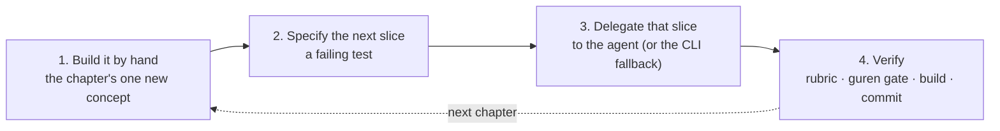

# The Guren Tutorial

This course takes you from an empty directory to a deployed blog with users, comments, tags, file uploads, email, an agent interface, and a documented architecture. It is long, and it is meant to be worked through in order, the way the Rails Tutorial was. If you finish it, you will be able to build and ship a web application, and you will be able to do it with a coding agent doing much of the typing while you stay in charge of what gets shipped.

That second half is what makes this a Guren course rather than a generic one. Guren is built for the agent era: it installs a harness the agent reads, gates the agent's output has to pass, and route contracts that turn your app into a tool an agent can call. This course teaches those alongside HTTP, sessions, relational modelling and tests, because a working engineer in 2026 needs both.

If a term is unfamiliar along the way, check the [Glossary](../guides/glossary.md).

## How every chapter works

From chapter 2 on, every chapter has the same four beats.

1. **Build it by hand.** You write the code that carries the chapter's one new idea: a table and a model, a login, a policy, a pivot table. You never write the third CRUD screen by hand; that is what generators and agents are for. Writing the idea once is what lets you judge someone else's version of it in beat 4.
2. **Specify the next slice.** Before the next piece of the app exists, you write the test that will judge it, and you run it red. This is not a test of your own typing; it is a statement of what you will accept from the agent.
3. **Delegate that slice.** The chapter gives you the prompt, word for word. Every delegation also names a deterministic fallback, a `bunx guren add …` or `make:*` command or a file to write, so the course is completable without an agent subscription, and so the course can be verified mechanically (see below).
4. **Verify.** You review the agent's output against a short rubric the chapter gives you, run `bunx guren gate` and `bun run build`, and commit.

The chapter text never shows you "the code the agent will write". Agents are non-deterministic and models change; the hand-written version in the text is the reference, and the test, the rubric and the gate judge the agent's version. What you take away is not the shape of one agent's output but the criteria for accepting any agent's output.

One more thing runs through the course: the **agent harness** is a subject, not scenery. Each chapter's delegation puts one piece of it to work, from the hooks in chapter 1 to the glob-scoped rules, the skills, the two subagents, and the dev MCP endpoint. Chapter 8 has you write your own rule, skill and subagent brief, right after chapter 7 shows you an agent forgetting something and what it takes to make sure it never does again.

## What you'll build

A blog, and everything a real one needs:

| Chapters | You'll have |
|---|---|
| 1–4 | A scaffolded app, in git, with a test suite, a CI gate and a Docker image; posts with validation and pagination |
| 5–8 | Users with passwords and sessions, protected routes, author-only editing, and a harness you have shaped to your project |
| 9–11 | Comments, tags, cover images and a gallery, and email when someone comments on your post |
| 12–13 | Your app exposed as tools an agent can call, and an architecture that documents itself |
| 14 | The same app on Postgres, with database-backed sessions and rate limiting, deployed behind the CI gate |

## The chapters

Each chapter starts where the previous one ended. Follow them in order.

| # | Chapter | Time |
|---|---|---|
| 1 | [Zero to a Shipped App](./01-zero-to-deployed.md) | 40 min |
| 2 | [One Request, by Hand](./02-one-request-by-hand.md) | 45 min |
| 3 | [The Posts Table](./03-the-posts-table.md) | 60 min |
| 4 | [Validation and Resources](./04-validation-and-resources.md) | 60 min |
| 5 | Users and Passwords | coming |
| 6 | Protecting Routes | coming |
| 7 | Authorization, and What the Gate Cannot See | coming |
| 8 | Teach the Agent Your Project | coming |
| 9 | Relationships | coming |
| 10 | Files | coming |
| 11 | Events and Mail | coming |
| 12 | Your App as an Agent's Tool | coming |
| 13 | The System, Documented | coming |
| 14 | Production | coming |

Chapters are published as they are finished. The shorter [Build a Mini Blog](./overview.md) series stays available in the meantime and covers the same ground as chapters 3–9 in the generator-first style.

## Prerequisites

- **[Bun](https://bun.sh) 1.1 or later.** That is the only hard requirement; the scaffold defaults to SQLite, so there is no database server to install.
- **git.** Every chapter ends with a commit.
- **TypeScript.** You should be comfortable with modern TypeScript: types, async/await, modules. The course does not assume React or Inertia; chapter 2 introduces the little you need and builds from there.
- **A coding agent, optionally.** Claude Code is the one the chapters show. The harness also supports Codex, Cursor, Copilot and OpenCode, and every delegation has a no-agent fallback.
- **Docker, optionally.** Chapter 1 and chapter 14 build a container image. Everything else runs on Bun alone.

## How this course stays correct

Every command and file in these chapters is executed by the framework's own CI against the current release, in order, chapter by chapter, with each chapter's gate and build at the end. A framework change that would break a step fails the framework's build, not your afternoon. The Japanese translation is checked against the English text the same way: prose is translated, code is byte-identical.

This edition is verified against `create-guren-app` 1.13 and Guren 2.16. If your scaffold prints a newer version, the chapters most likely still hold; if a step disagrees with what you see, the [CLI reference](../guides/cli.md) has the current command surface.

> [!TIP]
> Want the ten-minute version first? [Getting Started](../guides/getting-started.md) scaffolds an app and shows one request end to end. Come back here when you want the whole thing.
