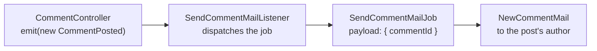

# Chapter 11: Events and Mail

Everything so far finished inside the request: validate, write a row, redirect. This chapter is about the work that should not. When Bob comments on Ada's post, Ada gets an email, and Bob's browser must not wait for a mail server to answer before it sees the page.

Four names for that one sentence, and the chapter is mostly about why there are four:

| Piece | Answers |
|---|---|
| **Event** | Something happened. The controller announces it and stops caring. |
| **Listener** | Somebody cares. It decides what to do about the announcement. |
| **Job** | Work that outlives the request. A payload on a queue, run by whoever picks it up. |
| **Mail** | The message itself: a subject, a body, a recipient. |

The request stops at the first box; everything after it is work the reader never waits for:



**What you'll learn:**

- Where each of the four is registered, and the one registration nothing checks for you
- Why a job payload is ids rather than records
- What `QUEUE_CONNECTION=sync` really does, and what changes when it stops being sync
- How mail and the queue are faked through the container, and why each fake goes inside a real manager

Start the dev server if it is not running:

```bash run background
bun run dev
```

## 1. Three layers, three commands

```bash run
bunx guren add events
```

```bash run
bunx guren add queue
```

```bash run
bunx guren add mail
```

Each one wrote a sample of its kind plus what runs it, and registered that in `src/app.ts`. Open it: the providers array has been rewritten onto a single line with three new entries at the end: a framework provider and an app provider for events, and `JobsProvider` for the queue. The queue and mail managers are the `queue` and `mail` entries in `config: [...]` instead. That collapsing is the patcher's doing, not yours, and it is the shape every `add` command leaves behind.

These are worth reading, because two of them are files you are about to edit:

- `app/Providers/EventProvider.ts` hands a listener class to `events.listen()`, which subscribes it to the event the class names. That connection is a line of code, not a convention: nothing scans `app/Listeners/` looking for work.
- `config/queue.ts` builds the queue manager, and `app/Providers/JobsProvider.ts` calls `registerJob()` for each job class. Note the driver line in the config: `QUEUE_CONNECTION=sync` runs a dispatched job **inline, in the dispatching process**; `memory` puts it in a queue held in that process's own memory, for a worker running in the same process. `guren add queue` wrote `sync` into your `.env`.
- `config/mail.ts` builds the mail manager. `MAIL_MAILER=log`, also already in your `.env`, prints outgoing mail to the server output instead of sending it. Nothing to sign up for, and nothing to accidentally deliver.

The samples (`OrderPlaced`, `SendOrderReceiptListener`, `ProcessWelcomeSequenceJob`, `WelcomeEmailMail`) exist so you can see the shape of each file. You will replace all four in section 3.

## 2. Specify the mail

Three tests. All three fake the mail transport, and the third fakes the queue as well. Read the setup before the assertions:

```ts file=tests/CommentMail.test.ts
import { beforeAll, beforeEach, describe, it } from 'bun:test'
import { MailManager, createQueueManager } from '@guren/core'
import { TestApp, fakeMail, fakeQueue } from '@guren/testing'
import app from '../src/app.js'
import { resetDatabase } from '../config/database.js'
import { Post, type PostRecord } from '../app/Models/Post.js'
import { User, type UserRecord } from '../app/Models/User.js'
import { SendCommentMailJob, type SendCommentMailPayload } from '../app/Jobs/SendCommentMailJob.js'

const mail = fakeMail()

describe('comment mail', () => {
  let http: TestApp
  let ada: UserRecord
  let bob: UserRecord
  let post: PostRecord
  let asBob: TestApp

  beforeAll(async () => {
    http = await TestApp.fromApp(app)
    // Mail.send() asks the manager for a transport, so the fake goes inside a
    // real manager rather than in place of one.
    const manager = new MailManager({ default: 'fake', from: { email: 'blog@example.com', name: 'Blog' } })
    manager.registerTransport('fake', () => mail.getTransport())
    app.container.fake('mail', manager)
  })

  beforeEach(async () => {
    await resetDatabase()
    mail.clear()
    ada = await User.create({ name: 'Ada', email: 'ada@example.com', password: 'correct horse battery' })
    bob = await User.create({ name: 'Bob', email: 'bob@example.com', password: 'correct horse battery' })
    post = await Post.forceCreate({ title: 'Relativity', body: 'A body', authorId: ada.id })
    asBob = await http.actingAs(bob).withCsrf()
  })

  it('mails the post author when someone else comments', async () => {
    await asBob.post(`/posts/${post.id}/comments`, { body: 'Nice post' }).assertRedirect(`/posts/${post.id}`)

    mail.assertSentTo('ada@example.com')
    mail.assertSentWithSubject('New comment on Relativity')
    mail.assertSentWithBodyContaining('Bob')
  })

  it('does not mail you about your own comment', async () => {
    const asAda = await http.actingAs(ada).withCsrf()

    await asAda.post(`/posts/${post.id}/comments`, { body: 'A note to myself' }).assertRedirect(`/posts/${post.id}`)

    mail.assertNothingSent()
  })

  it('hands the mail to the queue instead of sending it in the request', async () => {
    const queue = fakeQueue()
    // Job.dispatch() sends through the bound queue manager's default driver, so
    // the fake driver goes inside a real manager too. `using` restores the app's
    // own manager when the test ends.
    using _queue = app.container.fake(
      'queue',
      createQueueManager({ default: 'fake', drivers: { fake: () => queue.getDriver() } }),
    )

    await asBob.post(`/posts/${post.id}/comments`, { body: 'Nice post' }).assertRedirect(`/posts/${post.id}`)

    queue.assertPushed<SendCommentMailPayload>(SendCommentMailJob, (payload) => payload.commentId > 0)
    mail.assertNothingSent()
  })
})
```

`assertPushed` is given its payload type explicitly. `Job.dispatch` is a generic static, so a job class on its own does not tell TypeScript what its payload is, and an inferred `unknown` makes the predicate fail to compile.

The third test is the one that describes the design rather than the feature. With a fake queue driver in place the job is recorded and never run, so no mail goes out. If that test ever passes *and* mail is sent, the controller is doing the work itself.

```bash run expect-fail
bun test
```

Red on the import: there is no `SendCommentMailJob` yet.

## 3. The four pieces, by hand

An event carries the smallest thing that identifies what happened:

```ts file=app/Events/CommentPosted.ts
import { Event } from '@guren/core'

export class CommentPosted extends Event {
  static override eventName = 'CommentPosted'

  constructor(public readonly commentId: number) {
    super()
  }
}
```

The listener decides what happening means. This one does no work itself; it hands the work to a queue and returns:

```ts file=app/Listeners/SendCommentMailListener.ts
import { Listener } from '@guren/core'
import { CommentPosted } from '../Events/CommentPosted.js'
import { SendCommentMailJob } from '../Jobs/SendCommentMailJob.js'

export class SendCommentMailListener extends Listener<CommentPosted> {
  static override event = CommentPosted

  async handle(event: CommentPosted): Promise<void> {
    await SendCommentMailJob.dispatch({ commentId: event.commentId })
  }
}
```

The job is the piece that may run in another process, minutes later:

```ts file=app/Jobs/SendCommentMailJob.ts
import { Job } from '@guren/core'
import { Comment } from '../Models/Comment.js'
import { User } from '../Models/User.js'
import { NewCommentMail } from '../Mail/NewCommentMail.js'

/** A queued payload is JSON on its way to another process: ids, never records. */
export interface SendCommentMailPayload {
  commentId: number
}

export class SendCommentMailJob extends Job<SendCommentMailPayload> {
  static override queue = 'default'
  static override maxAttempts = 3

  async handle(payload: SendCommentMailPayload): Promise<void> {
    const comment = await Comment.findWith(payload.commentId, ['post', 'author'])
    if (!comment?.post || !comment.author) return

    const postAuthor = await User.find(comment.post.authorId)
    if (!postAuthor || postAuthor.id === comment.authorId) return

    await new NewCommentMail(this.make('mail'), {
      postTitle: comment.post.title,
      commenter: comment.author.name,
      body: comment.body,
      url: `/posts/${comment.post.id}`,
    })
      .to(postAuthor.email)
      .send()
  }
}
```

Two decisions in that file are the chapter's real content. The payload is a `commentId`, not the comment: by the time this runs, the row may have changed, and a record cannot be serialised onto a queue anyway. And "do not mail me about my own comment" lives here, next to the send, rather than in the controller. The controller announces what happened; it does not decide who deserves an email about it.

The mail is the message and nothing else:

```ts file=app/Mail/NewCommentMail.ts
import { Mail, type MailManager } from '@guren/core'

export interface NewCommentMailData {
  postTitle: string
  commenter: string
  body: string
  url: string
}

export class NewCommentMail extends Mail {
  constructor(
    manager: MailManager,
    private readonly data: NewCommentMailData,
  ) {
    super(manager)
  }

  build(): this {
    return this.subject(`New comment on ${this.data.postTitle}`).text(
      `${this.data.commenter} wrote:\n\n${this.data.body}\n\nRead it: ${this.data.url}`,
    )
  }
}
```

You never call `build()`. `send()` calls it once, then checks that the message has a recipient, a subject and a body, and hands it to the transport.

Now the two registrations. The event provider is where a class becomes a subscription:

```ts file=app/Providers/EventProvider.ts
import { ServiceProvider, type EventManager } from '@guren/core'
import { SendCommentMailListener } from '../Listeners/SendCommentMailListener.js'

export default class EventProvider extends ServiceProvider {
  register(): void {}

  boot(): void {
    const events = this.container.make<EventManager>('events')

    events.listen(SendCommentMailListener)
  }
}
```

`listen()` takes the class and reads its configuration from the class itself. `event` names what it subscribes to. `priority` orders it among the listeners for that event, highest first. `shouldHandle()`, when the class defines one, can skip an event before `handle` runs. `shouldQueue = true` hands the listener to the queue named by `queue` instead of calling it directly; under `sync` that queue still runs it inline, so it leaves the request only once a worker drains a real queue. A new instance is built for every event, so a listener cannot carry state from one comment to the next.

`SendCommentMailListener` leaves `shouldQueue` at `false` and dispatches a job instead. A queued listener sends the event to the worker; a job sends a payload you chose, with its own `maxAttempts`, and the job is what the third test looks for on the fake queue.

`events.on(CommentPosted, (event) => listener.handle(event))` would also run the listener, and it is the wiring to avoid for a `Listener` class. `on()` takes a function and knows nothing about the class it came from, so `shouldHandle()` and `shouldQueue` would be ignored without a word.

The jobs provider is where a job class becomes dispatchable:

```ts file=app/Providers/JobsProvider.ts
import { ServiceProvider, registerJob } from '@guren/core'
import { SendCommentMailJob } from '../Jobs/SendCommentMailJob.js'

// config/queue.ts binds the queue; this registers the jobs it runs.
export default class JobsProvider extends ServiceProvider {
  register(): void {}

  boot(): void {
    // A queued message carries the job's name, so the driver can only run a job
    // the registry knows. Nothing in `guren check` looks for a missing one.
    registerJob(SendCommentMailJob)
  }
}
```

Finally the controller announces:

```ts file=app/Http/Controllers/CommentController.ts
import { Controller } from '@guren/core'
import { Post } from '../../Models/Post.js'
import { Comment } from '../../Models/Comment.js'
import type { UserRecord } from '../../Models/User.js'
import { CommentPosted } from '../../Events/CommentPosted.js'
import { CommentPayloadSchema } from '../Validators/CommentValidator.js'

export default class CommentController extends Controller {
  async store(): Promise<Response> {
    const post = this.model(Post)
    await this.authorize('create', Comment)
    const author = await this.auth.userOrFail<UserRecord>()
    const data = await this.validateBody(CommentPayloadSchema)
    const comment = await Comment.forceCreate({ ...data, postId: post.id, authorId: author.id })
    await this.make('events').emit(new CommentPosted(comment.id))
    return this.redirect(`/posts/${post.id}`)
  }

  async destroy(): Promise<Response> {
    const comment = this.model(Comment)
    await this.authorize('delete', [Comment, comment])
    await Comment.delete({ id: comment.id })
    return this.redirect(`/posts/${comment.postId}`)
  }
}
```

`emit` is awaited, and it awaits every listener in priority order. Under `sync` that means the whole chain, job included, finishes before the redirect is returned. That is worth being clear-eyed about: `sync` does not make the work asynchronous, it makes the *code* asynchronous-shaped. When you move to a worker, the controller does not change.

The four samples the blueprints installed have no owner now:

```bash run
rm app/Events/OrderPlaced.ts app/Listeners/SendOrderReceiptListener.ts app/Jobs/ProcessWelcomeSequenceJob.ts app/Mail/WelcomeEmailMail.ts
```

```bash run
bun test
```

Green, and no line of the output starts with `[guren] Deprecation`: the queue fake goes through the container, not through a deprecated API.

**Checkpoint:** comment on someone else's post in the browser and look at the terminal running `bun run dev`:

```bash manual
[mail] ------------------------------------------------------------
[mail] To: ada@example.com
[mail] From: hello@example.com
[mail] Subject: New comment on Relativity
[mail] Bob wrote:
[mail]
[mail] Nice post
[mail]
[mail] Read it: /posts/1
[mail] ------------------------------------------------------------
```

That is the `log` transport. Point `MAIL_MAILER` at a real one and the same message leaves the building.

```bash run
bunx guren gate
```

```bash run
git add -A
git commit -m "feat: mail the post author when someone comments"
```

## 4. The registration nothing checks

Run the integrity check and read it for what is *not* there:

```bash run
bunx guren check
```

It has an opinion about your routes, your pages, your schema, your attachments. It has none about `app/Jobs/`. A job class that never reaches `registerJob()` looks perfect: it compiles, it lints, its tests pass if they fake the queue. It fails the first time something dispatches it for real, with a message that at least names the problem:

```bash manual
SyncDriver: job class "SendCommentMailJob" is not registered. Call registerJob() with the class whose jobName (or class name) is "SendCommentMailJob".
```

This is exactly the situation chapter 8 was about: a project invariant the framework cannot see. So write it down where the agent reads it.

```md file=.claude/rules/background-work.md
---
paths:
  - "app/Events/**"
  - "app/Listeners/**"
  - "app/Jobs/**"
  - "app/Mail/**"
  - "app/Providers/EventProvider.ts"
  - "app/Providers/JobsProvider.ts"
---

# Background work

1. **Every `Job` subclass is registered.** Add `registerJob(TheJob)` to `boot()` in `app/Providers/JobsProvider.ts` in the same change that adds the class. A queued message carries the job's name and the driver resolves it through that registry; an unregistered job throws at dispatch time and `guren check` says nothing about it.
2. **Every listener is wired with `listen()`.** A class in `app/Listeners/` runs only because `boot()` in `app/Providers/EventProvider.ts` calls `events.listen(TheListener)`. That call reads the class's `event`, `priority`, `shouldQueue`, `queue` and `shouldHandle()`. Never wire a `Listener` class through `events.on(TheEvent, (event) => listener.handle(event))`: `on()` sees only the function, so `shouldHandle()` and `shouldQueue` are silently ignored. To queue work, dispatch a job from `handle`; set `shouldQueue` only when the listener itself should run on the worker.
3. **A job payload is JSON: ids, never records.** The job may run in another process, after the row has changed. Load what you need inside `handle`, and return early when the record is gone.
4. **Controllers announce, listeners decide.** A controller emits an event and returns. Rules about who gets mail (skip the actor, skip duplicates) live in the job or the listener, not in the action.
5. **Test the seam, not the plumbing.** A fake goes inside a real manager, and the manager is bound with `app.container.fake(key, manager)`. For mail, register a `fakeMail()` transport on a `MailManager` and bind it as `mail`. For the queue, give `createQueueManager()` a driver factory that returns `fakeQueue().getDriver()` and bind it as `queue` with `using`, so the app's own manager comes back when the test ends. Neither fake is a manager, so binding one directly throws. Do not use `setQueueDriver()`: it is deprecated and removed in 3.0.0.
```

The `PostToolUse` hook runs `guren check --arch` after every edit, and check will keep quiet about all five of these. The rule is the check.

```bash run
git add -A
git commit -m "docs: add a background-work rule for the agent"
```

## 5. Specify the announcement

Publishing a post should tell everyone who took the trouble to comment on it. Same four pieces, one shape harder: a fan-out with a de-duplication rule.

```ts file=tests/PostPublishedMail.test.ts
import { beforeAll, beforeEach, describe, it } from 'bun:test'
import { MailManager } from '@guren/core'
import { TestApp, fakeMail } from '@guren/testing'
import app from '../src/app.js'
import { resetDatabase } from '../config/database.js'
import { Post, type PostRecord } from '../app/Models/Post.js'
import { Comment } from '../app/Models/Comment.js'
import { User, type UserRecord } from '../app/Models/User.js'

const mail = fakeMail()

describe('publishing a post', () => {
  let http: TestApp
  let ada: UserRecord
  let post: PostRecord
  let asAda: TestApp

  beforeAll(async () => {
    http = await TestApp.fromApp(app)
    const manager = new MailManager({ default: 'fake', from: { email: 'blog@example.com', name: 'Blog' } })
    manager.registerTransport('fake', () => mail.getTransport())
    app.container.fake('mail', manager)
  })

  beforeEach(async () => {
    await resetDatabase()
    mail.clear()
    ada = await User.create({ name: 'Ada', email: 'ada@example.com', password: 'correct horse battery' })
    post = await Post.forceCreate({ title: 'Relativity', body: 'A body', authorId: ada.id })
    asAda = await http.actingAs(ada).withCsrf()
  })

  it('mails everyone who commented, once each', async () => {
    const bob = await User.create({ name: 'Bob', email: 'bob@example.com', password: 'correct horse battery' })
    const cleo = await User.create({ name: 'Cleo', email: 'cleo@example.com', password: 'correct horse battery' })
    await Comment.forceCreate({ body: 'First', postId: post.id, authorId: bob.id })
    await Comment.forceCreate({ body: 'Second', postId: post.id, authorId: bob.id })
    await Comment.forceCreate({ body: 'Third', postId: post.id, authorId: cleo.id })

    await asAda.post(`/posts/${post.id}/publish`).assertRedirect(`/posts/${post.id}`)

    mail.assertSentTo('bob@example.com')
    mail.assertSentTo('cleo@example.com')
    mail.assertSentWithSubject('Relativity is published')
    mail.assertSentTimes(2)
  })

  it('does not mail the author their own post', async () => {
    await Comment.forceCreate({ body: 'A note to myself', postId: post.id, authorId: ada.id })

    await asAda.post(`/posts/${post.id}/publish`).assertRedirect(`/posts/${post.id}`)

    mail.assertNothingSent()
  })
})
```

`assertSentTimes(2)` is the whole point of the first test. Bob commented twice; Bob gets one email.

```bash run expect-fail
bun test
```

One red. The second test is green already, and not for a good reason: nothing sends mail yet, so `assertNothingSent()` is satisfied by an app that does nothing at all. It starts carrying its weight once the first test passes.

## 6. Delegate it

Send this prompt to your agent:

```text
When a post is published, mail everyone who commented on it. Emit a `PostPublished` event from `publish` in `PostController`, wire a listener in `EventProvider` that dispatches a `NotifyCommentersJob`, and send a `PostPublishedMail` to each distinct commenter, skipping the post's author. `tests/PostPublishedMail.test.ts` describes it; make it pass.
```

The prompt does not mention `registerJob`, and it does not need to: the rule you wrote in section 4 is scoped to `app/Jobs/**` and `app/Providers/JobsProvider.ts`, so the agent reads it before it writes either. That is the whole experiment. Check the diff for the registration line before you check anything else.

**No agent handy?** The event carries the post:

```ts file=app/Events/PostPublished.ts fallback
import { Event } from '@guren/core'

export class PostPublished extends Event {
  static override eventName = 'PostPublished'

  constructor(public readonly postId: number) {
    super()
  }
}
```

```ts file=app/Listeners/NotifyCommentersListener.ts fallback
import { Listener } from '@guren/core'
import { PostPublished } from '../Events/PostPublished.js'
import { NotifyCommentersJob } from '../Jobs/NotifyCommentersJob.js'

export class NotifyCommentersListener extends Listener<PostPublished> {
  static override event = PostPublished

  async handle(event: PostPublished): Promise<void> {
    await NotifyCommentersJob.dispatch({ postId: event.postId })
  }
}
```

```ts file=app/Mail/PostPublishedMail.ts fallback
import { Mail, type MailManager } from '@guren/core'

export interface PostPublishedMailData {
  postTitle: string
  url: string
}

export class PostPublishedMail extends Mail {
  constructor(
    manager: MailManager,
    private readonly data: PostPublishedMailData,
  ) {
    super(manager)
  }

  build(): this {
    return this.subject(`${this.data.postTitle} is published`).text(
      `A post you commented on is now published.\n\nRead it: ${this.data.url}`,
    )
  }
}
```

```ts file=app/Jobs/NotifyCommentersJob.ts fallback
import { Job } from '@guren/core'
import { Post } from '../Models/Post.js'
import { Comment } from '../Models/Comment.js'
import { User } from '../Models/User.js'
import { PostPublishedMail } from '../Mail/PostPublishedMail.js'

export interface NotifyCommentersPayload {
  postId: number
}

export class NotifyCommentersJob extends Job<NotifyCommentersPayload> {
  static override queue = 'default'
  static override maxAttempts = 3

  async handle(payload: NotifyCommentersPayload): Promise<void> {
    const post = await Post.find(payload.postId)
    if (!post) return

    const comments = await Comment.where('postId', post.id).get()
    const recipientIds = [...new Set(comments.map((comment) => comment.authorId))].filter(
      (id) => id !== post.authorId,
    )
    if (recipientIds.length === 0) return

    const recipients = await User.where({ id: recipientIds }).get()
    const manager = this.make('mail')

    for (const recipient of recipients) {
      await new PostPublishedMail(manager, {
        postTitle: post.title,
        url: `/posts/${post.id}`,
      })
        .to(recipient.email)
        .send()
    }
  }
}
```

```ts file=app/Providers/EventProvider.ts fallback
import { ServiceProvider, type EventManager } from '@guren/core'
import { SendCommentMailListener } from '../Listeners/SendCommentMailListener.js'
import { NotifyCommentersListener } from '../Listeners/NotifyCommentersListener.js'

export default class EventProvider extends ServiceProvider {
  register(): void {}

  boot(): void {
    const events = this.container.make<EventManager>('events')

    events.listen(SendCommentMailListener)
    events.listen(NotifyCommentersListener)
  }
}
```

```ts file=app/Providers/JobsProvider.ts fallback
import { ServiceProvider, registerJob } from '@guren/core'
import { SendCommentMailJob } from '../Jobs/SendCommentMailJob.js'
import { NotifyCommentersJob } from '../Jobs/NotifyCommentersJob.js'

// config/queue.ts binds the queue; this registers the jobs it runs.
export default class JobsProvider extends ServiceProvider {
  register(): void {}

  boot(): void {
    // A queued message carries the job's name, so the driver can only run a job
    // the registry knows. Nothing in `guren check` looks for a missing one.
    registerJob(SendCommentMailJob)
    registerJob(NotifyCommentersJob)
  }
}
```

And the publish action announces:

```ts file=app/Http/Controllers/PostController.ts fallback
import { Controller, ValidationException, paginate, type PaginatedPageProps } from '@guren/core'
import { pages } from '@/.guren/pages.gen'
import { Post } from '../../Models/Post.js'
import { Comment } from '../../Models/Comment.js'
import { Tag } from '../../Models/Tag.js'
import { PostTag } from '../../Models/PostTag.js'
import type { UserRecord } from '../../Models/User.js'
import { PostPublished } from '../../Events/PostPublished.js'
import { PostResource, type PostResourceData } from '../Resources/PostResource.js'
import { CommentResource } from '../Resources/CommentResource.js'
import { ListPostsQuerySchema, PostIdParamSchema, PostImageParamSchema, PostPayloadSchema } from '../Validators/PostValidator.js'

type PostsIndexProps = PaginatedPageProps<PostResourceData>

async function syncTags(postId: number, names: string[]): Promise<void> {
  await PostTag.delete({ postId })
  for (const name of names) {
    const tag = (await Tag.first({ name })) ?? (await Tag.create({ name }))
    await PostTag.forceCreate({ postId, tagId: tag.id })
  }
}

export default class PostController extends Controller {
  async index(): Promise<Response> {
    const { page } = this.validateQuery(ListPostsQuerySchema)
    const result = await Post.withPaginate('author', { page, perPage: 10, orderBy: ['id', 'desc'] })
    const paginator = paginate(result, { path: this.request.path ?? '/posts' })

    return this.inertia(pages.posts.Index, {
      data: result.data.map((post) => new PostResource(post).toJSON()),
      pagination: {
        meta: paginator.meta(),
        links: paginator.links(),
      },
    } satisfies PostsIndexProps)
  }

  async show(): Promise<Response> {
    const { id } = this.validateParams(PostIdParamSchema)
    const post = await Post.findWithOrFail(id, ['author', 'tags'])
    const [withFiles] = await Post.withAttachments([post], ['cover', 'images'])
    const comments = await Comment.where('postId', post.id).with('author').orderBy('id', 'asc').get()

    return this.inertia(pages.posts.Show, {
      post: new PostResource(withFiles!).toJSON(),
      canManage: await this.can('update', [Post, post]),
      comments: await Promise.all(
        comments.map(async (comment) => ({
          ...new CommentResource(comment).toJSON(),
          canDelete: await this.can('delete', [Comment, comment]),
        })),
      ),
    })
  }

  async create(): Promise<Response> {
    return this.inertia(pages.posts.New, {})
  }

  async store(): Promise<Response> {
    const author = await this.auth.userOrFail<UserRecord>()
    const { tags, ...data } = await this.validateBody(PostPayloadSchema)
    const post = await Post.forceCreate({ ...data, authorId: author.id })
    await syncTags(post.id, tags)
    const cover = await this.file('cover')
    if (cover) {
      await Post.attach(post.id, 'cover', cover)
    }
    for (const file of await this.files('images')) {
      await Post.attach(post.id, 'images', file)
    }
    return this.redirect(`/posts/${post.id}`)
  }

  async edit(): Promise<Response> {
    const post = this.model(Post)
    await this.authorize('update', [Post, post])
    const withTags = await Post.findWithOrFail(post.id, 'tags')

    return this.inertia(pages.posts.Edit, {
      post: new PostResource(withTags).toJSON(),
    })
  }

  async update(): Promise<Response> {
    const post = this.model(Post)
    await this.authorize('update', [Post, post])
    const { tags, ...data } = await this.validateBody(PostPayloadSchema)
    await Post.update({ id: post.id }, data)
    await syncTags(post.id, tags)
    return this.redirect(`/posts/${post.id}`)
  }

  async cover(): Promise<Response> {
    const post = this.model(Post)
    await this.authorize('update', [Post, post])
    const cover = await this.file('cover')
    if (!cover) {
      throw new ValidationException({ cover: ['Choose an image.'] })
    }
    await Post.attach(post.id, 'cover', cover)
    return this.redirect(`/posts/${post.id}`)
  }

  async destroyImage(): Promise<Response> {
    const post = this.model(Post)
    await this.authorize('update', [Post, post])
    const { attachment } = this.validateParams(PostImageParamSchema)
    await Post.detach(post.id, 'images', attachment)
    return this.redirect(`/posts/${post.id}`)
  }

  async destroy(): Promise<Response> {
    const post = this.model(Post)
    await this.authorize('delete', [Post, post])
    await Post.purgeAttachments(post.id)
    await Post.delete({ id: post.id })
    return this.redirect('/posts')
  }

  async publish(): Promise<Response> {
    const post = this.model(Post)
    await this.authorize('publish', [Post, post])
    await Post.forceUpdate({ id: post.id }, { publishedAt: new Date().toISOString() })
    await this.make('events').emit(new PostPublished(post.id))
    return this.redirect(`/posts/${post.id}`)
  }

  async unpublish(): Promise<Response> {
    const post = this.model(Post)
    await this.authorize('publish', [Post, post])
    await Post.forceUpdate({ id: post.id }, { publishedAt: null })
    return this.redirect(`/posts/${post.id}`)
  }
}
```

```bash run
bun test
```

The rubric:

- `registerJob(NotifyCommentersJob)` is in `JobsProvider.boot()`, and `events.listen(NotifyCommentersListener)` is in `EventProvider.boot()`. Without both, the feature is dead code that compiles. A listener wired with `events.on(...)` instead also works here, but it breaks rule 2.
- The payload is `{ postId }`. Recipients are resolved inside `handle`, not passed in.
- Commenters are de-duplicated by author id and the post's author is removed from the list, in the job. Two comments from Bob are one email to Bob.
- `publish` emits and returns. It does not query comments and it does not know that mail exists.
- Both new tests and the three from section 2 are green.

**Checkpoint:** comment on a draft from two accounts, publish it, and watch two `[mail]` blocks and no third one for yourself.

```bash run
bunx guren gate
```

```bash run
git add -A
git commit -m "feat: mail commenters when a post is published"
```

## Where you are

- An event, a listener, a job and a mail, each registered in a place you can point at.
- A controller that announces and returns, and business rules about recipients that live next to the sending.
- Three test seams: a mail transport inside a real manager, a queue driver inside another, and a request that proves the two are connected.
- A project rule carrying the one invariant `guren check` has no opinion about, and an agent that followed it.

## Common trip-ups

- **`SyncDriver: job class "X" is not registered.`** `registerJob(X)` is missing from `JobsProvider.boot()`. This is the error the rule in section 4 exists to prevent.
- **`Email must have at least one recipient` (or subject, or body).** `send()` validates the built message. A `to()` that received `undefined`, or a `build()` that returns before setting the subject, both land here.
- **Nothing arrives and no error appears.** Check the listener is wired in `EventProvider.boot()`. An event with no listeners is a successful `emit`.
- **`manager.getDefaultDriverName is not a function`, and the request answers 500, in a test that fakes the queue.** `fakeQueue()` was bound as `queue` directly. That key holds a `QueueManager`, and the fake is a driver, the same mistake as binding `fakeMail()` as `mail`. Return its driver from a `createQueueManager()` factory and bind the manager.
- **`[guren] Deprecation (global-service-setters): setQueueDriver() is deprecated` in the test output.** A test still pins the driver. Bind a manager with `app.container.fake('queue', …)` as section 2 does; the pin is removed in 3.0.0.
- **A test faking `mail` with `fakeMail()` directly throws.** `Mail.send()` calls `manager.transport(name)`, and the fake is a transport, not a manager. Register it on a real `MailManager` and bind that.
- **The mail is sent during the request even though there is a queue.** That is `QUEUE_CONNECTION=sync` working as designed. A worker drains the queue only when the driver stores jobs where a second process can read them, such as Redis or SQS in production; exercise 1 shows why `memory` is not one.

## Exercises

1. Set `QUEUE_CONNECTION=memory` in `.env`, restart the server, and post a comment. No mail appears. Now run `bunx guren queue:work --once` in a second terminal: still nothing. Explain why, then put the value back. The answer is the reason `memory` is a development driver and not a deployment one.
2. Register a second listener on `CommentPosted` with a higher `priority` that only logs. Which one runs first? Now make the first one throw, and say what happens to the second and to the request.

<details>
<summary>Exercise 1: hint and an example answer</summary>

Ask where the job is stored under each driver, and which process `queue:work` reads from. `config/queue.ts` maps `memory` to `new MemoryDriver()`.

A `MemoryDriver` keeps its jobs in the memory of the process that created it. The comment request runs in the server process, so the job lands in the server's queue, and nothing in that process drains it. `bunx guren queue:work --once` boots the app in a new process with a new, empty memory queue, finds no job, and exits, because `--once` stops when the queue is empty. The job stays in the server's memory until the next restart, and then it is gone. A deployed web process and its worker are separate processes, often on separate machines, so the queue has to live outside both: Redis or SQS. Put `QUEUE_CONNECTION=sync` back.

</details>

<details>
<summary>Exercise 2: hint and an example answer</summary>

`events.listen()` reads `priority` from the listener class, and `emit()` awaits the listeners one at a time, highest priority first. A logging listener, wired with `events.listen(LogCommentListener)` in `app/Providers/EventProvider.ts`:

```ts
import { Listener } from '@guren/core'
import { CommentPosted } from '../Events/CommentPosted.js'

export class LogCommentListener extends Listener<CommentPosted> {
  static override event = CommentPosted
  static override priority = 10

  handle(event: CommentPosted): void {
    console.log(`comment ${event.commentId} posted`)
  }
}
```

It runs first: 10 is higher than the default 0 that `SendCommentMailListener` keeps. Make its `handle` throw, and the error leaves `emit()` at once, so `SendCommentMailListener` never runs and no job or mail follows. `store` in `CommentController` awaits `emit()`, so the request fails with a 500 from the error handler instead of the redirect. The comment itself is saved, because `forceCreate` ran before `emit()`. A listener that defines `failed()` has it called before the error propagates.

</details>

## Next

[Chapter 12: Your App as an Agent's Tool](./12-agent-tools.md) turns the routes you already have into tools an agent can call, and shows the same authorization gap from chapter 7 becoming a hard failure instead of a passing audit.
