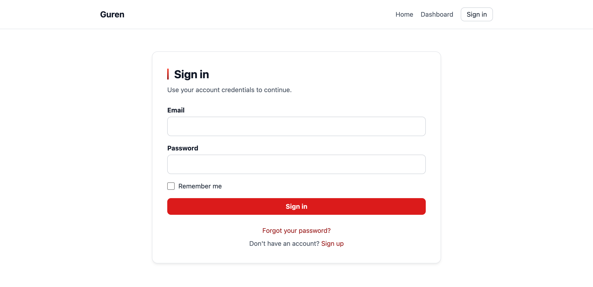
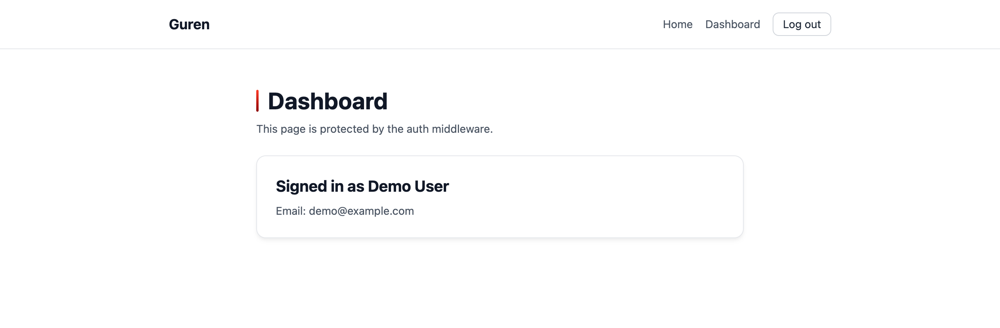
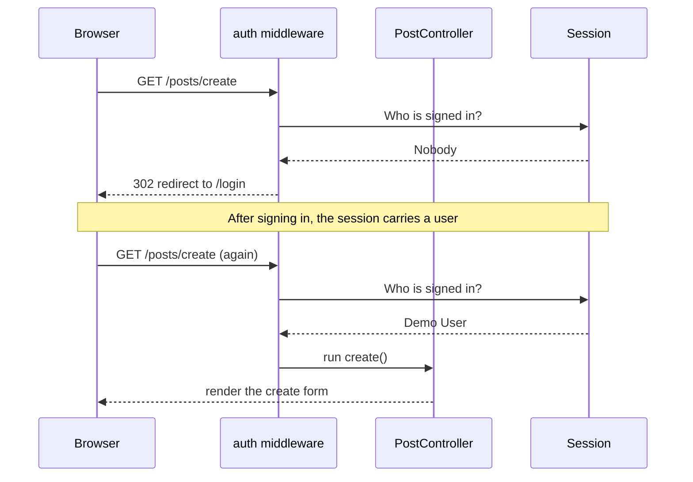

# Part 2: Add Authentication

As `guren audit` pointed out at the end of [Part 1](./create-blog-post-app.md), anyone can create, edit, and delete posts on your blog right now. In this part you add a full authentication stack with one command, put post mutations behind a login wall, and attach an author to every post. To finish, you run `audit` again and let the machine confirm the warnings are gone.

**What you'll learn:**

- What `bunx guren add auth` generates and wires up for you
- How to protect routes with a middleware alias and route groups
- How to read the signed-in user in a controller with `this.auth.userOrFail()`
- How to declare a `belongsTo` relationship and eager-load it with `findWithOrFail`
- How to extend a resource to ship related data while never leaking `passwordHash`
- How to bring the spec views back in sync with the `check --spec` drift gate after a schema change

## 1. Install the authentication scaffolding

From the project root, run:

```bash
bunx guren add auth
```

This one command generates a complete session-based authentication stack. Grouped by role:

| Group | Files |
|------|---------|
| Login / logout | `app/Http/Controllers/Auth/LoginController.ts`, `resources/js/pages/auth/Login.tsx`, `app/Http/Validators/LoginValidator.ts` |
| Registration | `app/Http/Controllers/Auth/RegisterController.ts`, `resources/js/pages/auth/Register.tsx`, `app/Http/Validators/RegisterValidator.ts` |
| Password reset | `ForgotPasswordController` / `ResetPasswordController` with pages and validators, `app/Mail/PasswordResetMail.ts`, `app/Providers/MailProvider.ts`, `config/mail.ts` |
| Example protected pages | `app/Http/Controllers/DashboardController.ts`, `ProfileController.ts` and their pages |
| Model and provider | `app/Models/User.ts` (extends `AuthenticatableModel`), `app/Providers/AuthProvider.ts` |
| Routes and layout | `routes/auth.ts` (`/login`, `/register`, `/forgot-password`, `/dashboard`, `/profile`, …), `resources/js/components/Layout.tsx` |
| Seeder | `db/seeders/UsersSeeder.ts` — a demo user (`demo@example.com` / `secret`) |

It also **edits existing files**:

- `db/schema.ts` — rewrites the starter `users` table into a definition with `passwordHash` and `rememberToken` columns, and generates the matching migration.
- `src/app.ts` — registers `AuthProvider` and the mail providers, and adds `auth: {}` to `createApp()`, which enables the session and CSRF middleware.
- `routes/web.ts` — imports and calls `registerAuthRoutes(router)` at the top of the route registrar.

> [!WARNING]
> `add auth` rewrites the `users` table definition in `db/schema.ts`. If you added custom columns to `users`, re-add them after running the command.

The users migration is already generated, so apply it and seed the demo account:

```bash
bun run db:migrate
bun run db:seed
bun run codegen
```

`bun run codegen` folds the scaffolding's new pages and routes into the type manifests (if `bun run dev` is running, the watcher already did this, so it's effectively a no-op). For how the generated auth stack works — guards, providers, safe handling of user records — see the [Authentication guide](../guides/authentication.md).

### How the sign-in state reaches your pages

The generated shared layout (`resources/js/components/Layout.tsx`) reads `auth.user` from the shared props to toggle between **Sign in** and **Log out**. The wiring that shares that prop is generated too — open `app/Providers/AuthProvider.ts` and you'll find it in `boot()`. There's nothing to change here, but it's worth reading, because later parts build on it:

```ts
// app/Providers/AuthProvider.ts (generated)
import { ServiceProvider, shareInertiaProps, AUTH_CONTEXT_KEY } from '@guren/core'
import type { AuthContext, AuthManager } from '@guren/core'
import { User } from '../Models/User.js'

export default class AuthProvider extends ServiceProvider {
  register(): void {
    const auth = this.container.make<AuthManager>('auth')
    auth.useModel(User, {
      usernameColumn: 'email',
      passwordColumn: 'passwordHash',
      rememberTokenColumn: 'rememberToken',
      credentialsPasswordField: 'password',
    })
  }

  boot(): void {
    shareInertiaProps(async (ctx) => {
      const auth = ctx.get(AUTH_CONTEXT_KEY) as AuthContext | undefined
      return { auth: { user: await auth?.user() } }
    }, this.container)
  }
}
```

`shareInertiaProps` merges this value into the props of every Inertia response, and `this.container` keeps it scoped to this application. What `auth.user()` returns is the **sanitized** user — `passwordHash` and `rememberToken` are stripped at runtime, so sharing it wholesale never ships credentials to the browser. Part 3's comment form relies on this wiring too.

## 2. Checkpoint: sign in

With the dev server running (`bun run dev` if you stopped it), open [http://localhost:3333/login](http://localhost:3333/login).



1. Sign in as **demo@example.com** / **secret** — you land on `/dashboard` with a personalized greeting, and the header navigation flips from **Sign in** to **Log out** (the shared props from `AuthProvider` at work).

   
2. Try a wrong password — the form shows "Invalid credentials."
3. Open `/dashboard` in a private browsing window — you're redirected to `/login`. Protected routes are actually protected.

> [!NOTE]
> The scaffolding also includes self-registration (`/register`) and email-based password reset. This tutorial continues with the seeded demo user, but feel free to create a fresh account through `/register`.

## 3. Protect post mutations

Register an `auth` middleware alias and attach it to the routes that change posts. Edit `routes/web.ts`:

```ts
import { Router, requireAuthenticated } from '@guren/core'
import HomeController from '../app/Http/Controllers/HomeController.js'
import PostController from '../app/Http/Controllers/PostController.js'
import { PostPayloadSchema } from '../app/Http/Validators/PostValidator.js'
import { registerAuthRoutes } from './auth.js'

export function registerWebRoutes(baseRouter: Router): void {
  const router = baseRouter.aliasMiddleware('auth', requireAuthenticated({ redirectTo: '/login' }))

  registerAuthRoutes(router)
  router.get('/', [HomeController, 'index'])

  // Health check endpoint for load balancers and uptime monitors
  router.get('/health', (c) => c.json({ status: 'ok' }))

  router.group('/posts', (posts) => {
    posts.get('/', [PostController, 'index']).name('posts.index')
    posts.middleware('auth').get('/create', [PostController, 'create']).name('posts.create')
    posts.get('/:id', [PostController, 'show']).name('posts.show')
    posts.middleware('auth').get('/:id/edit', [PostController, 'edit']).name('posts.edit')
    posts.middleware('auth').group((authed) => {
      authed.post('/', { name: 'posts.store', body: PostPayloadSchema }, [PostController, 'store'])
      authed.put('/:id', { name: 'posts.update', body: PostPayloadSchema }, [PostController, 'update'])
      authed.delete('/:id', { name: 'posts.destroy' }, [PostController, 'destroy'])
    })
  })
}
```

Here is how a request from a signed-out visitor flows through a protected route.



The mechanism has three tiers:

- `aliasMiddleware` names the middleware once so routes can refer to it as `'auth'` (the alias is recorded in the return type, which is why the sample captures it: `const router = baseRouter.aliasMiddleware(...)`).
- Standalone routes chain `.middleware('auth').get(...)` directly.
- Routes you want to protect together go inside `.middleware('auth').group((authed) => ...)`. Groups nest, so you can layer authentication inside the `/posts` prefix — here the three option-carrying routes (store / update / destroy) take this form.

Listing and reading posts stay public; creating, editing, and deleting now redirect signed-out visitors to `/login`. Middleware and groups are covered in full in the [Routing guide](../guides/routing.md).

Next, add a second line of defense inside the controller. Add one line at the top of store / update / destroy in `app/Http/Controllers/PostController.ts`:

```ts
  async store(): Promise<Response> {
    await this.auth.userOrFail()
    // ...
```

`this.auth.userOrFail()` returns the signed-in user or responds with 401. This is exactly the line the generator would have emitted if you hadn't passed `--public` in Part 1 — and it keeps the guard in place even if a refactor later strips the route middleware. In `store`, this line becomes the typed `userOrFail<Sanitized<UserRecord>>()` when step 5 sets the author.

> [!NOTE]
> What you guarded here is only "is someone signed in" (authentication). As it stands, any signed-in user can edit or delete **anyone's** post. "Only the author can edit" is the job of authorization, which Guren implements as policies — `bunx guren make:policy Post` scaffolds one, and if you generate with `bunx guren make:feature`, passing `--policy` builds the `authorize()` calls in from the start. It's out of scope for this series, but the [Authorization guide](../guides/authorization.md) walks through it with this same blog example.

## 4. Confirm with audit

```bash
bunx guren audit
```

The three A01 warnings from Part 1 (Mutating route has no authentication check) should be gone. `audit` recognizes both route middleware and in-controller `userOrFail` calls, so either one counts as a guard — but having both gives you defense in depth.

## 5. Give every post an author

### Add the column

Edit the `posts` table in `db/schema.ts` to reference `users`:

```ts
export const posts = sqliteTable('posts', {
  id: integer('id').primaryKey({ autoIncrement: true }),
  title: text('title').notNull(),
  body: text('body').notNull(),
  authorId: integer('author_id').notNull().references(() => users.id),
  createdAt: text('created_at').notNull().$defaultFn(() => new Date().toISOString()),
})
```

Generate the migration and rebuild your development database:

```bash
bun run db:make add_author_to_posts
bun run db:reset --seed
```

> [!WARNING]
> SQLite cannot add a `NOT NULL` column without a default to a table that already has rows — the posts you created in Part 1 would block the migration. `db:reset --seed` drops every table, re-runs all migrations from scratch, and re-seeds the demo user. Development data is disposable; never run `db:reset` against a production database. Against real data you'd add the column as nullable, backfill it, then tighten it to `NOT NULL` in a follow-up migration — in development, resetting is simply faster.

### Declare the relationship

Update `app/Models/Post.ts` to declare that a post belongs to an author:

```ts
import { defineModel, type BelongsToRecord } from '@guren/core'
import { posts } from '../../db/schema.js'
import type { UserRecord } from './User.js'

export type PostRecord = typeof posts.$inferSelect
export type NewPostRecord = typeof posts.$inferInsert
export type PostAuthor = Pick<UserRecord, 'id' | 'name'>

export class Post extends defineModel(posts) {
  static fillable = ['title', 'body', 'authorId']

  static override relationTypes: { author: BelongsToRecord<PostAuthor> } = {
    author: null,
  }
}

Post.belongsTo('author', () => import('./User.js').then((m) => m.User), 'authorId', 'id')
```

Three pieces work together here:

- `Post.belongsTo('author', ...)` registers the relation: follow `posts.authorId` to reach `users.id`. The lazy `import()` avoids a circular import between `Post` and `User`.
- `relationTypes` tells TypeScript the shape of eager-loaded data — `post.author` is typed `PostAuthor | null`.
- Adding `authorId` to `fillable` lets `Post.create()` set the field.

The full relationship API is covered in the [Database guide](../guides/database.md).

### Add the author to the resource

As you read in Part 1, `PostResource` decides what reaches the browser. Update `app/Http/Resources/PostResource.ts` to include the author:

```ts
import { Resource } from '@guren/core'
import type { PostAuthor, PostRecord } from '../../Models/Post.js'

type PostWithAuthor = PostRecord & { author?: PostAuthor | null }

export interface PostResourceData extends Record<string, unknown> {
  id: number
  title: string
  body: string
  author: { id: number; name: string } | null
}

export class PostResource extends Resource<PostWithAuthor, PostResourceData> {
  toArray(): PostResourceData {
    return {
      id: this.resource.id,
      title: this.resource.title,
      body: this.resource.body,
      author: this.resource.author
        ? { id: this.resource.author.id, name: this.resource.author.name }
        : null,
    }
  }
}
```

This is a load-bearing design point: the loaded author row contains `passwordHash`, and everything you hand to `this.inertia()` is serialized to the page. The resource copies only `id` and `name`, so **the rest of the user record never gets shipped to the browser.** For calls that didn't load the author (like the index), it's simply `null`.

### Set the author in `store`, load it in `show`

Update two actions in `app/Http/Controllers/PostController.ts`:

```ts
import { Controller, paginate, type PaginatedPageProps, type Sanitized } from '@guren/core'
import type { UserRecord } from '../../Models/User.js'

// inside PostController:

  async show(): Promise<Response> {
    const { id } = this.validateParams(PostIdParamSchema)
    const post = await Post.findWithOrFail(id, 'author')

    return this.inertia(pages.posts.Show, {
      post: new PostResource(post).toJSON(),
    })
  }

  async store(): Promise<Response> {
    const user = await this.auth.userOrFail<Sanitized<UserRecord>>()
    const data = await this.validateBody(PostPayloadSchema)
    const post = await Post.create({ ...data, authorId: user.id })
    return this.redirect('/posts/' + post?.id)
  }
```

- `findWithOrFail(id, 'author')` eager-loads the relation in the same call that returns a 404 when the post is missing.
- `store` derives `authorId` from `userOrFail<Sanitized<UserRecord>>()`. The browser never picks the author, which structurally prevents impersonation. The `Sanitized<UserRecord>` wrapper (rather than bare `UserRecord`) removes from the type the credential columns the runtime strips (see the [Authentication guide](../guides/authentication.md)).

### Show the author

Add an author line to `resources/js/pages/posts/Show.tsx`. `Props` references `PostResourceData`, so the type change follows automatically:

```tsx
      <p className="text-sm text-zinc-500">by {post.author?.name ?? 'Unknown author'}</p>
```

`PostResourceData` changed shape, so refresh the manifests: `bun run codegen` (automatic while `bun run dev` is watching).

### Bring the specs back in sync

The schema and the model relationships changed, so the `docs/spec/` views you generated in Part 1 are now behind the code. Ask the drift gate:

```bash
bunx guren check --spec
```

```
ERROR [fail] docs/spec/er.md: docs/spec/er.md is out of date with the code.
       → Run: bunx guren spec:generate
```

Stale views get named as `[fail]` — not just `er.md`: expect `screens.md` and friends alongside it, reflecting the pages and routes authentication added. Do what it says: regenerate, and `er.md` gains the `authorId FK` on `posts`, `domain.md` gains the `author` relation, and the gate goes green again.

```bash
bunx guren spec:generate
bunx guren check --spec
```

"We changed the implementation but forgot to update the spec" is the fate of every hand-maintained document. Guren prevents it with a mechanical gate rather than discipline — put `check --spec` in CI and a stale view simply cannot merge (see [Spec-Anchored Development](../guides/spec-anchored.md)).

**Checkpoint:** reload [http://localhost:3333/_guren/docs](http://localhost:3333/_guren/docs) — the ER diagram's `posts` now carries the `authorId` foreign key, and the domain view shows the `author` relationship. The viewer always reads the latest views from disk.

## 6. Checkpoint: post as the demo user

1. Signed out, click **New Post** on `/posts` — you're redirected to `/login`.
2. Sign in as **demo@example.com** / **secret** and create a post.
3. Open the post — the byline shows "Demo User".

## Common trip-ups

**"Invalid credentials." for the demo account.**
The seeder never ran and the `users` table is empty. Run `bun run db:seed`.

**Type error on `'auth'` in `.middleware('auth')` (`not assignable to parameter of type 'never'`).**
You discarded the return value of `aliasMiddleware`. The alias is recorded in the return type, so capture it — `const router = baseRouter.aliasMiddleware('auth', ...)` — and use that `router` afterwards.

**Type error on `.middleware('auth').post('/', { name: ..., body: ... }, [Controller, 'store'])`.**
Older framework releases didn't accept the route-options + controller combination on a middleware chain. Upgrade, or register such routes inside `.middleware('auth').group((authed) => ...)` as shown in step 3 (the group form works on every version).

**The `add_author_to_posts` migration fails (`NOT NULL constraint` / cannot add column).**
Existing `posts` rows can't satisfy the new `NOT NULL` column. Rebuild the development database with `bun run db:reset --seed`.

**`pages.auth.Login` or `pages.dashboard.Index` missing after `add auth`.**
Codegen hasn't seen the new pages. Run `bun run codegen` or restart `bun run dev`.

**Signed in, but `/posts/create` keeps bouncing to `/login`.**
Check that `createApp()` in `src/app.ts` received `auth: {}` and that `AuthProvider` is in `providers` — `add auth` patches this automatically, but verify if you had customized the file.

**TypeScript complains about a missing `authorId` in the `Post.create` call.**
You updated the schema but not the model: add `authorId` to `fillable` and make sure the `store` action passes it.

## Next

Posts have authors, and `audit` is quiet — now let's give readers a voice. Continue to [Part 3: Relationships: Comments](./relationships.md). To go deeper on authentication itself (guard variants, remember tokens, sanitized user records), see the [Authentication guide](../guides/authentication.md).
