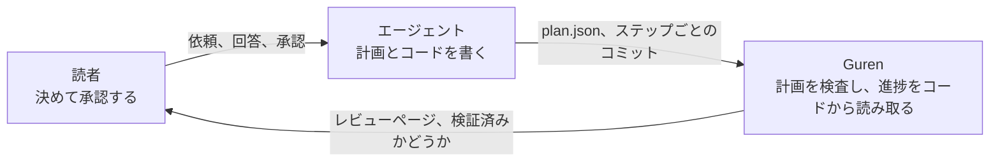
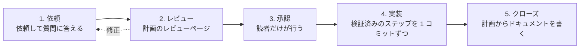

# エージェントと作る

この講座では、コードはコーディングエージェント (Claude Code) が書き、何を作るかは読者が決めます。題材は勉強会の予約アプリで、ユーザーが勉強会を主催し、ほかのユーザーが定員に達するまで参加登録できるようにします。計画は 2 本立てます。どちらもコードを書く前にレビューして承認し、そのあとエージェントが 1 ステップずつ作っていくのを見届けます。

この講座で練習するのは、次の 5 つの判断です。コードを打ち込む作業は扱いません。

- エージェントが自分では決められなかった質問に答える
- 計画を読み、望んでいるものがそのとおりに書かれているか判断する
- 計画を承認する (設計はこの時点で固まります)
- エージェントがコミットした各ステップを受け入れる
- 計画を実装している間にアプリ側が変わったとき、どうするか決める

先にフレームワーク自体を学びたい場合は、[Guren チュートリアル](../tutorials/00-overview.md) から始めてください。この講座はチュートリアルを終えていなくても進められます。

## 役割分担

エージェントは自分の進捗を報告しません。進捗は `guren plan:verify` が、スキーマ、ルート、コントローラー、テスト結果から読み取ります。エージェントが「ステップが終わった」と言う時点で、フレームワークによる確認はもう済んでいるので、作業中は席を外していても構いません。

## 計画が進む流れ

どの計画も、同じ 5 つの段階を順にたどります。1 本目の計画は第 2 章から第 5 章で、2 本目の計画は第 6 章と第 7 章で、この流れを通します。

各段階の章には短いチェック表があります。このチェック表は、どのモデルが書いた計画にもそのまま使えるので、講座のあとも手元に残しておいてください。

## 章立て

| # | 章 | 段階 | 所要時間 |
|---|---|---|---|
| 1 | [エージェントが働けるアプリ](./01-setup.md) | 準備 | 20 分 |
| 2 | [最初の計画](./02-the-first-plan.md) | 依頼 | 30 分 |
| 3 | [レビューと承認](./03-review-and-approve.md) | レビュー、承認 | 30 分 |
| 4 | [1 ステップずつ](./04-one-step-at-a-time.md) | 実装 | 60 分 |
| 5 | [計画をクローズする](./05-close-the-plan.md) | クローズ | 20 分 |
| 6 | [既存のコードを変える計画](./06-changing-what-exists.md) | 依頼から承認まで | 40 分 |
| 7 | [実装中にアプリが変わったとき](./07-when-the-application-moves.md) | 実装、クローズ | 60 分 |
| 8 | [CI の中の計画](./08-plans-in-ci.md) | その後 | 20 分 |

## 始める前に

- **[Bun](https://bun.sh) 1.4.2** と **git**。アプリは SQLite を使うため、データベースサーバーを別に用意する必要はありません。
- **[Claude Code](https://claude.com/claude-code)**。講座のプロンプトは Claude Code 向けに書いていますが、ハーネス自体は Codex、Cursor、Copilot、OpenCode にも対応しています。
- **TypeScript**。エージェントが書いたコードを読むために使います。自分で書く場面はあまりありません。

エージェントに任せる作業には、手で実行できる手順も **エージェントなしの場合** として添えてあります。これらのブロックは参照用の計画に沿っていて、前のブロックの結果を前提に積み上がっていきます。章の中で引用する名前 (`AC-meetups-7`、`route.meetups.edit`) もこの参照用の計画のもので、エージェントが書いた計画では別の名前になります。

第 2 章と第 6 章では、計画の下書きができたところで進め方を選びます。自分の計画を使い続けて引用中の名前を例として読むか、参照用の計画に切り替えて講座のとおりに進むかのどちらかです。エージェントをまったく使わない場合は、**エージェントなしの場合** をすべて実行すれば、最初から最後まで参照用の計画で進められます。参照用の計画とコードは英語版と共通なので、中身は英語で書かれています。

## このコースが正しさを保つ仕組み

フレームワークの CI では、各ステップの **エージェントなしの場合** の手順を使い、フレームワークの現在のソースに対して全章を順に実行しています。各章の終わりには `bunx guren gate` とビルドも実行します。講座の手順を壊す変更がフレームワークに入ると、読者の手元より先に、フレームワーク自身のビルドが失敗します。エージェントの出力はこの実行に含まれないので、そちらはチェック表とゲートで判定します。
