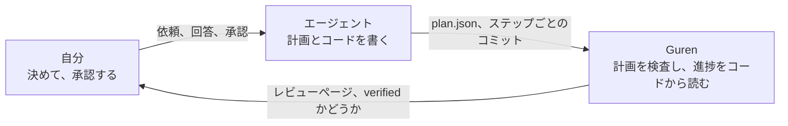
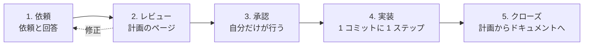

# エージェントと作る

このコースでは、コードを書くのはコーディングエージェント (Claude Code) で、何を作るかを決めるのは自分です。作るのは勉強会の予約アプリです。ユーザーが勉強会を主催し、ほかのユーザーが定員まで参加登録します。計画は 2 本です。コードが存在する前に計画をレビューして承認し、エージェントが 1 ステップずつ作るのを見届けます。

身につけるのはタイピングではなく判断です。判断は次の 5 つです。

- エージェントが一人では決められなかった質問に答える
- 計画を読み、欲しいものを表しているか判断する
- 承認する。設計が固まるのはこの時点です
- エージェントがコミットした各ステップを受け入れる
- 計画の下でアプリが動いたとき、どうするか決める

フレームワークそのものを先に学びたい場合は [Guren チュートリアル](../tutorials/00-overview.md) から始めてください。このコースはそちらの内容を前提にしません。

## 役割分担

エージェントは自分の進捗を報告しません。`guren plan:verify` がスキーマ、ルート、コントローラー、テスト結果から読み取ります。エージェントが作業している間、席を外せるのはこのためです。エージェントが「終わった」と言う時点で、フレームワークがすでに確かめています。

## ループ

どの計画も同じ 5 段階を通ります。第 2 章から第 5 章で 1 本目の計画を、第 6 章と第 7 章で 2 本目を通します。

各段階の章に短いチェック表があります。持ち帰るのはこのチェック表です。どのモデルが書いた計画にも使えます。

## 章立て

| # | 章 | 段階 | 所要時間 |
|---|---|---|---|
| 1 | [エージェントが働けるアプリ](./01-setup.md) | 準備 | 20 分 |
| 2 | [最初の計画](./02-the-first-plan.md) | 依頼 | 30 分 |
| 3 | [レビューと承認](./03-review-and-approve.md) | レビュー、承認 | 30 分 |
| 4 | [1 ステップずつ](./04-one-step-at-a-time.md) | 実装 | 60 分 |
| 5 | [計画をクローズする](./05-close-the-plan.md) | クローズ | 20 分 |
| 6 | [既存を変える計画](./06-changing-what-exists.md) | 依頼から承認まで | 40 分 |
| 7 | [アプリが動いたとき](./07-when-the-application-moves.md) | 実装、クローズ | 60 分 |
| 8 | [CI の中の計画](./08-plans-in-ci.md) | その後 | 20 分 |

## 始める前に

- **[Bun](https://bun.sh) 1.4.2** と **git**。アプリは SQLite を使うので、データベースサーバーは要りません。
- **[Claude Code](https://claude.com/claude-code)**。プロンプトは Claude Code 向けに書いています。ハーネスは Codex、Cursor、Copilot、OpenCode にも対応しています。
- **TypeScript**。エージェントが書いたコードを読みます。自分で書く場面はあまりありません。

エージェントに任せる各ステップには、自分で実行できる版もあり、**エージェントなしの場合** と書いてあります。これらのブロックは前のブロックの結果を前提に積み上がります。また、参照用の計画を使うので、章が引用する名前 (`AC-meetups-7`、`route.meetups.edit`) はその計画のものです。エージェントが書いた計画では名前が変わります。第 2 章と第 6 章の終わりで、自分の計画を使い続けて名前を例として読むか、参照用の計画に切り替えてコースどおりに進むかを選びます。エージェントを使わない場合は、**エージェントなしの場合** をすべて実行すれば最初から最後まで参照用の経路になります。参照用の計画とコードは英語版と同じもので、英語で書かれています。

## このコースが正しさを保つ仕組み

フレームワークの CI が、各ステップの **エージェントなしの場合** を使って全章を順に実行し、章末ごとに `bunx guren gate` とビルドを走らせます。対象はフレームワークの現在のソースです。手順を壊す変更は、読者の作業ではなくフレームワークのビルドを落とします。エージェントの出力はこの実行に含まれません。エージェントの出力を判定するのは、チェック表とゲートです。
