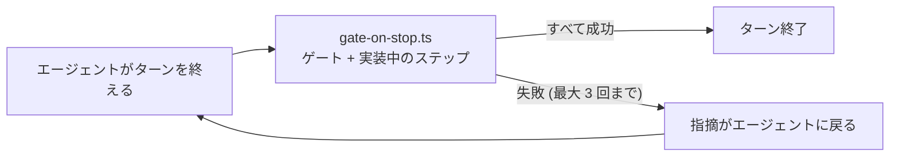

# 第 1 章: エージェントが働けるアプリ

この章では、アプリを雛形から作ってサインイン機能を加え、以降の章で使うハーネスの 2 つの仕組みを確認します。アプリのコードはまだ書きません。

**この章で学ぶこと:**

- `create-guren-app` がエージェント向けに用意するファイルと、その置き場所
- 計画づくりと実装を受け持つ 2 つのスキル、`plan-write` と `plan-implement`
- エージェントが作業を終えようとしたときに `Stop` hook が行うこと

## 1. 雛形を生成する

```bash run
bunx create-guren-app guren-meetups --mode ssr --db sqlite --agents claude --git
```

```bash run
cd guren-meetups
```

勉強会はユーザーごとに作るものなので、最初にアカウントの仕組みを入れます。

```bash run
bunx guren add auth
bun run db:migrate
```

`add auth` を実行すると、`users` テーブル、サインインとサインアップのページ、セッションの設定が追加されます。結果は、CI でも使うゲートで確かめます。

```bash run
bunx guren gate
```

codegen、typecheck、lint、`check`、`audit`、テストがすべて通るはずです。codegen が `.guren/` の型付きマニフェストも更新するため、コミットはゲートを通してから行います。

```bash run
git add -A
git commit -m "feat: add sign-in"
```

## 2. エージェントが読むもの

`--agents claude` を付けたので、ハーネスも一緒に入っています。この講座で特に関わるのは次の 3 つです。

| パス | 役割 |
|---|---|
| `CLAUDE.md` | エージェントが最初に読むファイル。アプリの中身を調べるための `guren` コマンドが載っています |
| `.claude/skills/` | 作業の種類ごとにエージェントが従う手順 (スキル)。この講座では `plan-write` と `plan-implement` を使います |
| `.claude/hooks/gate-on-stop.ts` | エージェントがターンを終えるときに実行されるスクリプト (後述) |

```bash run
ls .claude/skills
```

**`plan-write`** は、依頼内容を `docs/plans/<slug>/plan.json` という計画にまとめるスキルです。自分では決められない点を質問し、計画をアプリの実際の状態と照らし合わせたところで止まります。承認まではしません。

**`plan-implement`** は、承認済みの計画を 1 ステップずつ実装し、ステップごとにコミットするスキルです。

### Stop hook

エージェントがターンを終えようとすると、`gate-on-stop.ts` がコミットされていない変更に対して `guren gate` を実行します。実行されるのは codegen、typecheck、lint、`check`、`audit`、テストです。どれかが失敗すれば、hook はターンの終了を一度だけ止め、指摘をエージェントに返します。計画を実装している間は、エージェントが取り組んでいるステップの検証も行い、検証が通るまで最大 3 回エージェントに差し戻します。



ここで実行されるゲートは、1 節で手動実行したものと同じです。設定は何も要りません。この仕組みがあるので、エージェントが「終わりました」と言ったときには、実際にもほぼ終わっていると考えてかまいません。

各仕組みの詳細は Claude Code の公式ドキュメントにあります。[CLAUDE.md](https://code.claude.com/docs/ja/memory)、[スキル](https://code.claude.com/docs/ja/skills)、[hooks](https://code.claude.com/docs/ja/hooks) の各ページを参照してください。この講座で使う [`Stop`](https://code.claude.com/docs/ja/hooks#stop) と [`SessionStart`](https://code.claude.com/docs/ja/hooks#sessionstart) の 2 つのイベントも、hooks のページで説明されています。

## 3. エージェントを起動する

`guren-meetups` ディレクトリでもう 1 つターミナルを開き、Claude Code を起動します。

```bash manual
claude
```

このターミナルは開いたままにしておきます。第 2 章からは、エージェントに送る文をコードブロックで示します。コードブロックの中身をコピーしてこのセッションに貼り付け、送ってください。

## ここまでの状態

- サインイン機能を加えた雛形アプリができ、コミットも済んでいます。
- エージェントが読むハーネスが入っています。計画用の 2 つのスキルと Stop hook も含まれます。

## よくあるつまずき

- **`bunx guren` が見つからない。** `@guren/cli` がインストールされている `guren-meetups` ディレクトリの中で実行してください。npm にある `guren` パッケージは別物で、アプリの作り方を表示するだけのプレースホルダーです。
- **`db:migrate` が "no such file" で失敗する。** 1 つ上のディレクトリではなく、アプリのルートで実行してください。

## 演習

1. `.claude/skills/plan-write/SKILL.md` を開き、エージェントに実行させないと決めているコマンドと、その理由を探してください。
2. `bunx guren context` を実行してください。`SessionStart` hook が、エージェントのセッションを始めるたびに読み込ませている内容です。変更を計画する前なら、どのセクションから読みますか。

## 次へ

[第 2 章: 最初の計画](./02-the-first-plan.md) では、エージェントに計画を作ってもらい、返ってきた計画の読み方を学びます。
