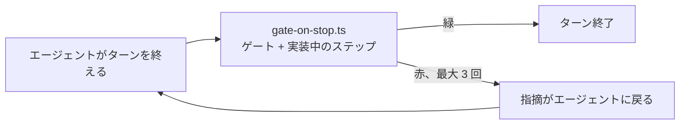

# 第 1 章: エージェントが働けるアプリ

この章ではアプリを雛形生成し、サインインを足し、以降の章が頼るハーネスの 2 つの部分を確認します。アプリのコードは書きません。

**この章で学ぶこと:**

- `create-guren-app` がエージェント向けに入れるものと、その置き場所
- 計画を担う 2 つのスキル: `plan-write` と `plan-implement`
- エージェントが終わったと言うときに `Stop` hook がすること

## 1. 雛形生成

```bash run
bunx create-guren-app guren-meetups --mode ssr --db sqlite --agents claude --git
```

```bash run
cd guren-meetups
```

勉強会はユーザーのものなので、まずアカウントが要ります。

```bash run
bunx guren add auth
bun run db:migrate
```

`add auth` は `users` テーブル、サインインとサインアップのページ、セッションの配線を書きます。結果をゲートで確かめます。CI が走らせるのと同じゲートです。

```bash run
bunx guren gate
```

codegen、typecheck、lint、`check`、`audit`、テストのすべてが通るはずです。codegen は `.guren/` の型付きマニフェストも更新するので、コミットはゲートの後にします。

```bash run
git add -A
git commit -m "feat: add sign-in"
```

## 2. エージェントが読むもの

`--agents claude` がハーネスを入れました。ここで大事なのは次の 3 つです。

| パス | 役割 |
|---|---|
| `CLAUDE.md` | エージェントが最初に読むファイル。「このアプリに何があるか」に答える `guren` コマンドが載っています |
| `.claude/skills/` | ある種類の作業でエージェントが従う手順 (スキル)。`plan-write` と `plan-implement` がこのコースのものです |
| `.claude/hooks/gate-on-stop.ts` | エージェントがターンを終えるときに動きます (後述) |

```bash run
ls .claude/skills
```

**`plan-write`** は依頼を `docs/plans/<slug>/plan.json` にします。決められないことを質問し、計画をアプリと突き合わせて検査し、そこで止まります。承認はしません。

**`plan-implement`** は承認済みの計画を 1 ステップずつ実装し、ステップごとにコミットします。

### Stop hook

エージェントがターンを終えると、`gate-on-stop.ts` が未コミットの作業に `guren gate` を走らせます。中身は codegen、typecheck、lint、`check`、`audit`、テストです。どれかが失敗すると、hook は終了を 1 度だけ止めて、指摘をエージェントに返します。計画の実装中は、エージェントが取り組んでいるステップも検証し、verified でない間は最大 3 回までエージェントを差し戻します。



ゲートは 1 節で実行したものと同じです。どれも設定する必要はありません。「エージェントが終わったと言う」と「本当に終わっている」がほぼ同じ意味になるのは、この仕組みのおかげです。

## 3. 描画した計画を git に入れない

計画ごとに、`plan.json` から描画するレビューページ `plan.html` があります。生成物なので、リポジトリには入れません。

```bash run
printf 'docs/plans/**/*.html\n' >> .gitignore
git add .gitignore
git commit -m "chore: ignore rendered plan pages"
```

## 4. エージェントを起動する

`guren-meetups` で 2 つ目のターミナルを開き、Claude Code を起動します。

```bash manual
claude
```

開いたままにしておきます。第 2 章からは、引用ブロックで示すプロンプトをここに送ります。

## いまいる場所

- サインイン付きの雛形アプリ。コミット済みです。
- エージェントが読むハーネス。計画用の 2 つのスキルと Stop hook を含みます。
- 描画した計画ページは git の対象外です。

## よくあるつまずき

- **`bunx guren` が見つからない。** `@guren/cli` が入っている `guren-meetups` の中で実行してください。npm の `guren` パッケージはプレースホルダーです。
- **`db:migrate` が "no such file" で失敗する。** 1 つ上のディレクトリではなく、アプリのルートで実行してください。

## 演習

1. `.claude/skills/plan-write/SKILL.md` を開き、エージェントに実行させないコマンドと、その理由を見つけてください。
2. `bunx guren context` を実行してください。`SessionStart` hook がエージェントのセッションごとに注入する内容です。変更を計画する前に、どのセクションから読みますか。

## 次へ

[第 2 章: 最初の計画](./02-the-first-plan.md) では、エージェントに計画を頼み、返ってきたものの読み方を学びます。
