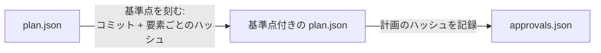

# 第 3 章: レビューと承認

第 2 章の終わりには、未決の質問が 1 つと足りない振る舞いが 5 つという、直すものの一覧が残りました。この章では、このレビュー結果をエージェントに渡して計画を直してもらい、変更を確かめてから承認します。ループの中で、承認だけは読者が自分で行うステップです。

**この章で学ぶこと:**

- レビューページでの判断を、エージェントが反映できるフィードバックにする方法
- `plan:revise` が記録する内容と、改訂のたびに理由を残す意味
- 承認によって固定されるものと、承認の前に確かめるチェック表

## 1. ページでレビューする

`docs/plans/meetups/plan.html` をもう一度開きます。このページで行う次の 3 種類の操作が、エージェントへのフィードバックになります。

| ページでの操作 | フィードバックでの意味 |
|---|---|
| 質問の選択肢を選ぶ | 回答になります。計画からはその質問を消す必要があります |
| 要素の **Approve** | ロックになります。以後その要素は、理由を明記した場合にしか変更できません |
| **Request changes** とコメント | エージェントが読むメモになります。強制力はありません |

この計画では、次のように操作します。

1. **Can guests browse meetups?** では **yes** が選ばれた状態のまま、回答欄に「Yes, browsing is public.」と入力します。
2. `route.meetups.store` の policy の警告は、第 2 章で意図した選択と判断したので、そのままにします。
3. ページ下部の **Copy prompt for the agent** を押します(`--locale ja` で描画したページでは「エージェントへの依頼文をコピー」)。

ページで回答を選んだり要素を承認したりしても、それだけでは `plan.json` は変わりません。エージェントがレビューを反映するまでは、`plan:approve` も質問が未回答のままだとして承認を拒否します。このボタンは、計画のパスと「plan-write スキルでレビューを反映してほしい」という依頼に、ページのフィードバックを付けた依頼文をまとめてコピーします。

## 2. レビューをエージェントに渡す

コピーした依頼文を Claude Code のセッションに貼り付けます。第 2 章で見つけた足りない振る舞いはページからは伝わらないので、送る前に、貼り付けた依頼文の下へ次の文を書き足してください。

```text
あわせて、ページの受け入れ振る舞いの警告ごとに振る舞いを足してください。meetups.create と meetups.update には unauthenticated、meetups.edit には forbidden、meetups.update には validation です。主催者が meetups.edit を開ける success の振る舞いも足してください。meetups.store の警告は残してください。サインインしたユーザーなら誰でも主催できるからです。
```

エージェントは `plan-write` スキルの手順に従い、リポジトリの外に作った計画のコピーを編集してから、そのコピーとフィードバックを渡して `bunx guren plan:revise` を実行します。回答済みの質問がコピーに残っていると、`plan:revise` はそのコピーを受け付けません。受け付けた変更は、1 つずつ理由を添えて `docs/plans/meetups/revisions/0001.json` に記録されます。

**エージェントなしの場合:** 変更を操作 (op) の形で渡します。op にはそれぞれ理由を書きます。

<details>
<summary>振る舞い 5 つの追加と質問への回答を反映する plan:revise</summary>

```bash run fallback
bunx guren plan:revise docs/plans/meetups/plan.json --ops - <<'EOF'
{
  "ops": [
    {"op": "remove", "id": "Q-guests", "reason": "Answered: guests can browse meetups."},
    {"op": "modify", "section": "plan", "element": {"title": "Meetups", "summary": "Signed-in users organize meetups with a capacity and edit the ones they organize. Anyone can browse them.", "scope": {"goals": ["Organize a meetup", "Edit your own meetup", "Browse meetups"], "nonGoals": ["Registering for a meetup", "Deleting a meetup"]}, "assumptions": ["Meetups are listed soonest first", "Guests can browse meetups"], "hints": [], "locale": "en"}, "reason": "Record the answer to Q-guests."},
    {"op": "add", "section": "acceptance", "parent": "task.meetups", "element": {"id": "AC-meetups-8", "description": "A guest cannot open the form for a new meetup.", "kind": "unauthenticated", "actor": "guest", "route": "route.meetups.create", "given": [], "expect": {"redirect": "/login"}}, "reason": "A rule on a route with no behaviour has no test."},
    {"op": "add", "section": "acceptance", "parent": "task.meetups", "element": {"id": "AC-meetups-9", "description": "A user cannot open the edit form of someone else's meetup.", "kind": "forbidden", "actor": "user", "route": "route.meetups.edit", "given": ["a meetup organized by another user exists"], "expect": {"status": 403}}, "reason": "A rule on a route with no behaviour has no test."},
    {"op": "add", "section": "acceptance", "parent": "task.meetups", "element": {"id": "AC-meetups-10", "description": "An edit needs at least one seat.", "kind": "validation", "actor": "user", "route": "route.meetups.update", "given": ["the user organizes a meetup"], "input": [{"name": "title", "json": "\"Bun night\""}, {"name": "startsAt", "json": "\"2026-10-20T19:00\""}, {"name": "capacity", "json": "0"}], "expect": {"status": 422, "errors": ["capacity"]}}, "reason": "A rule on a route with no behaviour has no test."},
    {"op": "add", "section": "acceptance", "parent": "task.meetups", "element": {"id": "AC-meetups-11", "description": "A guest cannot edit a meetup.", "kind": "unauthenticated", "actor": "guest", "route": "route.meetups.update", "given": ["a meetup exists"], "expect": {"redirect": "/login"}}, "reason": "A rule on a route with no behaviour has no test."},
    {"op": "add", "section": "acceptance", "parent": "task.meetups", "element": {"id": "AC-meetups-12", "description": "The organizer can open the edit form.", "kind": "success", "actor": "user", "route": "route.meetups.edit", "given": ["the user organizes a meetup"], "expect": {"status": 200}}, "reason": "A policy that denies everyone passes every forbidden test; only the allowed user fails it."}
  ]
}
EOF
```

</details>

## 3. 変更を確かめる

ページを描画し直します。

```bash run
bunx guren plan:render docs/plans/meetups/plan.json
```

ブラウザでページを再読み込みすると、**Needs attention** の警告は、残すと決めた `meetups.store` の policy の警告 1 件だけになっています。**Tasks & acceptance** には振る舞いが 12 件並びます。

改訂の内容はデータとしてファイルに残っているので、エージェントが何をしたのかを正確に確認できます。

```bash run
cat docs/plans/meetups/revisions/0001.json
```

各 op には、対象の要素と変更の理由が書かれています。半年後に「なぜ計画に AC-meetups-9 があるのか」と聞かれても、リポジトリを見れば答えが分かります。

改訂した計画をコミットします。

```bash run
git add docs/plans
git commit -m "docs: apply the review to the meetups plan"
```

## 4. 承認の前に

| 確かめること | 見る場所 |
|---|---|
| 失敗 (`fail`) の検査がない | Needs attention |
| 未決の質問がない | 質問 (セクションが消えている) |
| 残った警告 (`warn`) がすべて、理由を説明できる選択である | Needs attention |
| 守りたいルールがすべて振る舞いになっている | Tasks & acceptance |
| policy で守られたルートのすべてに、許可されるユーザーの `success` 振る舞いがある | Tasks & acceptance |
| 作業ツリーに未コミットの変更がない | `git status` |

このうち最初の 2 つと最後の 1 つが満たされていなければ、`plan:approve` は承認を拒否します。間の 3 つは自分で確かめてください。

## 5. 承認する

```bash run
bunx guren plan:approve docs/plans/meetups/plan.json
```

承認すると、次の 2 つが行われます。



- **基準点 (baseline)** には、承認時点のコミットと、要素ごとにアプリがその時点で持っていた内容のハッシュが記録されます。承認の後でアプリが変わったことに気づくための仕組みで、実際の使われ方は第 7 章で見ます。
- **承認** では、計画のハッシュが `docs/plans/meetups/approvals.json` に記録されます。計画を実装するコマンドはどれもこのハッシュを確認するため、承認後に `plan.json` を編集すると、誰かが承認し直すまで実装が進まなくなります。

両方をコミットします。

```bash run
git add docs/plans
git commit -m "docs: approve the meetups plan"
```

## ここまでの状態

- 振る舞いが 12 件あり、未決の質問もない計画が承認されています。
- `revisions/0001.json` に、レビューの内容がデータとして残っています。
- `approvals.json` ができました。実装のコマンドは、このファイルで承認を確かめます。

## よくあるつまずき

- **`plan:approve` に、作業ツリーが汚れていると言われる。** 先に改訂した計画をコミットしてください。エージェントがアプリのルートに残したファイル (計画のコピーや `feedback.json`) も未コミットの変更として数えられるので、リポジトリの外へ移します。
- **回答済みの質問が残っているため `plan:revise` が拒否する。** コピーの `questions` に質問が残ったままです。答えは `assumptions` に書いてください。
- **フィードバックで承認した要素が変更されると `plan:revise` に言われる。** その要素でページの **Approve** を押しています。変更そのものが誤っているか、そうでなければ `--reopens "<理由>"` で理由を示す必要があります。

## 演習

1. 承認済みの `plan.json` の単語を 1 つ書き換えてから `bunx guren plan:next docs/plans/meetups/plan.json` を実行し、拒否されたときのメッセージを読んでください。読み終えたら、`git checkout docs/plans/meetups/plan.json` でファイルを元に戻します。
2. `approvals.json` を開いてみてください。第 6 章で承認する計画では、承認ファイルに `readings` というフィールドも加わりますが、このファイルにはありません。2 本目の計画にはあって、この計画には 1 つもないものは何でしょうか。

<details>
<summary>演習 1: ヒントと答えの例</summary>

振る舞いの `description` のように、文字列の中の単語を書き換えてください。JSON として読めなくなると、別のエラーになります。

`plan:next` は、アプリを読んだりステップに印を付けたりする前に拒否します。メッセージは、計画が現在のハッシュでは承認されていないので、どのステップも渡さないと伝えます。承認後に編集されたか、一度も承認されていないか、のどちらかだという説明が続きます。最後に、計画が作りたいものを正しく表すようになったら `guren plan:approve` を実行するよう案内します。`approvals.json` の承認は計画全体のハッシュを指しているので、単語 1 つの変更でも一致しなくなります。`git checkout` で戻せば、ハッシュはまた一致します。

</details>

<details>
<summary>演習 2: ヒントと答えの例</summary>

`readings` は、`alter` の要素について、計画したプロパティが承認の時点でどう読めたかを記録したものです。

この計画には `alter` の要素がありません。`existing` の `model.user` とその `id` カラムを除けば、すべて `add` です。読むものがないので、承認に残るのはハッシュと日時、それに git に名前が設定されていれば承認した人だけです。参加登録の計画は `Meetup`、`MeetupResource`、`meetups/Show`、`MeetupController.show` を `alter` で変更するので、承認に `readings` も加わります。

</details>

## 次へ

[第 4 章: 1 ステップずつ](./04-one-step-at-a-time.md) では、承認した計画をエージェントに渡し、5 つのステップが 1 つずつ検証されながら進んでいく流れを追います。
