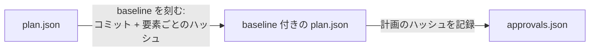

# 第 3 章: レビューと承認

第 2 章は、未決の質問 1 つと足りない振る舞い 5 つの一覧で終わりました。この章ではそのレビューをエージェントに渡し、変更を確かめ、計画を承認します。承認は、ループの中で自分だけが行うステップです。

**この章で学ぶこと:**

- レビューページでの判断が、エージェントの使えるフィードバックになる仕組み
- `plan:revise` が記録するものと、リビジョンに理由を付ける理由
- 承認で固まるものと、承認前のチェック表

## 1. ページでレビューする

`docs/plans/meetups/plan.html` をもう一度開きます。ページ上の 3 種類の入力がフィードバックになります。

| ページでの操作 | フィードバックでの意味 |
|---|---|
| 質問の選択肢を選ぶ | 回答。計画から質問を消す必要があります |
| 要素の **Approve** | ロック。以後その要素は、理由を付けたときだけ変更できます |
| **Request changes** とコメント | エージェントが読むメモ。強制力はありません |

この計画では次のようにします。

1. **Can guests browse meetups?** で **yes** を選んだままにし、回答欄に「Yes, browsing is public.」と書きます。
2. `route.meetups.store` の policy の警告はそのままにします。第 2 章で決めた選択です。
3. ページ下部の **Copy feedback** を押します。

## 2. レビューをエージェントに渡す

> docs/plans/meetups/plan.json に私のレビューを plan:revise で反映してください。ページの受け入れ振る舞いの警告ごとに振る舞いを足してください。meetups.create と meetups.update には unauthenticated、meetups.edit には forbidden、meetups.update には validation です。さらに、主催者が meetups.edit を開ける success の振る舞いも足してください。meetups.store の警告は残します。サインインしたユーザーなら誰でも主催できるからです。ページのフィードバックは次のとおりです。
>
> *(コピーしたフィードバックをここに貼る)*

`plan-write` スキルは、リポジトリの外に計画のコピーを作って編集し、そのコピーとフィードバックを渡して `bunx guren plan:revise` を実行します。回答済みの質問がコピーに残っていれば `plan:revise` は拒否します。変更はそれぞれ理由とともに `docs/plans/meetups/revisions/0001.json` に記録されます。

**エージェントなしの場合:** 変更を操作 (op) として渡します。op はそれぞれ理由を持ちます。

<details>
<summary>振る舞い 5 つの追加と回答済みの質問を渡す plan:revise</summary>

```bash run fallback
bunx guren plan:revise docs/plans/meetups/plan.json --ops - <<'EOF'
{
  "ops": [
    {"op": "remove", "id": "Q-guests", "reason": "Answered: guests can browse meetups."},
    {"op": "modify", "section": "plan", "element": {"title": "Meetups", "summary": "Signed-in users organize meetups with a capacity and edit the ones they organize. Anyone can browse them.", "scope": {"goals": ["Organize a meetup", "Edit your own meetup", "Browse meetups"], "nonGoals": ["Registering for a meetup", "Deleting a meetup"]}, "assumptions": ["Meetups are listed soonest first", "Guests can browse meetups"], "hints": [], "locale": "en"}, "reason": "Record the answer to Q-guests."},
    {"op": "add", "section": "acceptance", "parent": "task.meetups", "element": {"id": "AC-meetups-8", "description": "A guest cannot open the form for a new meetup.", "kind": "unauthenticated", "actor": "guest", "route": "route.meetups.create", "given": [], "expect": {"redirect": "/login"}}, "reason": "A rule on a route with no behaviour has no test."},
    {"op": "add", "section": "acceptance", "parent": "task.meetups", "element": {"id": "AC-meetups-9", "description": "A user cannot open the edit form of someone else's meetup.", "kind": "forbidden", "actor": "user", "route": "route.meetups.edit", "given": ["a meetup organized by another user exists"], "expect": {"status": 403}}, "reason": "A rule on a route with no behaviour has no test."},
    {"op": "add", "section": "acceptance", "parent": "task.meetups", "element": {"id": "AC-meetups-10", "description": "An edit needs at least one seat.", "kind": "validation", "actor": "user", "route": "route.meetups.update", "given": ["the user organizes a meetup"], "input": [{"name": "title", "json": "\"Bun night\""}, {"name": "startsAt", "json": "\"2026-10-20T19:00\""}, {"name": "capacity", "json": "0"}], "expect": {"status": 422, "errors": ["capacity"]}}, "reason": "A rule on a route with no behaviour has no test."},
    {"op": "add", "section": "acceptance", "parent": "task.meetups", "element": {"id": "AC-meetups-11", "description": "A guest cannot edit a meetup.", "kind": "unauthenticated", "actor": "guest", "route": "route.meetups.update", "given": ["a meetup exists"], "expect": {"redirect": "/login"}}, "reason": "A rule on a route with no behaviour has no test."},
    {"op": "add", "section": "acceptance", "parent": "task.meetups", "element": {"id": "AC-meetups-12", "description": "The organizer can open the edit form.", "kind": "success", "actor": "user", "route": "route.meetups.edit", "given": ["the user organizes a meetup"], "expect": {"status": 200}}, "reason": "A policy that denies everyone passes every forbidden test; only the allowed user fails it."}
  ]
}
EOF
```

</details>

## 3. 変更を確かめる

ページを描画し直します。

```bash run
bunx guren plan:render docs/plans/meetups/plan.json
```

ブラウザで再読み込みします。**Needs attention** に残る警告は 2 件です。どの計画にも出る validator の警告と、残すと決めた `meetups.store` の policy の警告です。**Tasks & acceptance** には振る舞いが 12 件並びます。

リビジョンはデータとしてディスクにあるので、エージェントが何をしたか正確に読めます。

```bash run
cat docs/plans/meetups/revisions/0001.json
```

op はそれぞれ要素と変更の理由を持ちます。半年後に「なぜ計画に AC-meetups-9 があるのか」と聞かれても、答えはリポジトリにあります。

改訂した計画をコミットします。

```bash run
git add docs/plans
git commit -m "docs: apply the review to the meetups plan"
```

## 4. 承認の前に

| 確かめること | 見る場所 |
|---|---|
| `fail` の検査がない | Needs attention |
| 未決の質問がない | 質問 (セクションが消えている) |
| 残った `warn` はすべて、説明できる選択 | Needs attention |
| 守りたいルールはすべて振る舞いになっている | Tasks & acceptance |
| policy の後ろのルートすべてに、通してよいユーザーの `success` 振る舞いがある | Tasks & acceptance |
| ツリーがきれい | `git status` |

`plan:approve` が強制するのは最初の 2 つと最後の 1 つです。間の 3 つは自分で確かめます。

## 5. 承認する

```bash run
bunx guren plan:approve docs/plans/meetups/plan.json
```

承認は 2 つのことをします。



- **baseline** は、コミットと、要素ごとにアプリが持っていたもののハッシュを記録します。何のためにあるかは第 7 章で分かります。承認の後でアプリが動いたことに気づくためです。
- **承認** は計画のハッシュを `docs/plans/meetups/approvals.json` に記録します。計画を実装するコマンドはすべてこれを確かめます。承認の後で `plan.json` を編集すると、誰かが承認し直すまで実装は止まります。

両方をコミットします。

```bash run
git add docs/plans
git commit -m "docs: approve the meetups plan"
```

## いまいる場所

- 振る舞いが 12 件あり、未決の質問のない承認済みの計画。
- `revisions/0001.json`。レビューをデータとして残したものです。
- `approvals.json`。実装のコマンドが確かめます。

## よくあるつまずき

- **`plan:approve` がツリーが汚れていると言う。** 先に改訂した計画をコミットしてください。エージェントがアプリのルートに残したファイル (計画のコピー、`feedback.json`) も数えられます。リポジトリの外へ移してください。
- **回答済みの質問が残っているため `plan:revise` が拒否する。** コピーの `questions` にまだ質問があります。答えは `assumptions` に書きます。
- **フィードバックで承認した要素が変わると `plan:revise` が言う。** その要素で **Approve** を押しています。変更が誤りか、`--reopens "<理由>"` が必要です。

## 演習

1. 承認済みの `plan.json` の単語を 1 つ書き換えて、`bunx guren plan:next docs/plans/meetups/plan.json` を実行してください。拒否のメッセージを読んだら、`git checkout docs/plans/meetups/plan.json` で元に戻します。
2. `approvals.json` を読んでください。第 6 章で承認する計画の承認ファイルには `readings` というフィールドも付きますが、このファイルにはありません。2 本目の計画にはあって、この計画にないものは何でしょう。

## 次へ

[第 4 章: 1 ステップずつ](./04-one-step-at-a-time.md) では、承認した計画をエージェントに渡し、検証される 5 つのステップを追います。
