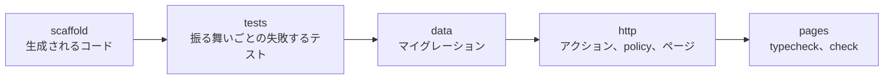
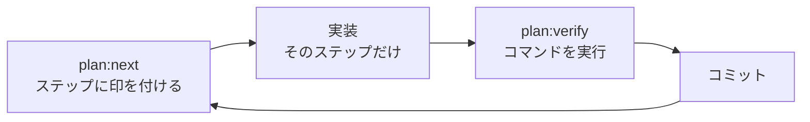
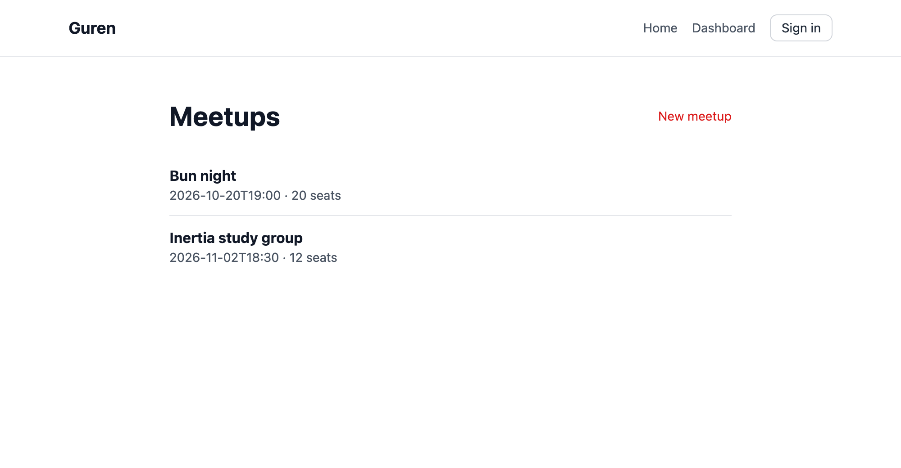

# 第 4 章: 1 ステップずつ

承認した計画を、この章でエージェントに実装してもらいます。Guren が計画をステップに分け、エージェントはステップを 1 つずつ実装して、検証が通ったらコミットします。読者は、次のコミットが届く前にそれぞれのコミットを読んでいきます。

**この章で学ぶこと:**

- 計画がステップに分かれる仕組みと、ステップの種類ごとに書かれるもの
- 検証済み (`verified`) の意味と、その判定を下す仕組み
- ステップごとのコミットで確かめること

## 1. ステップ

ステップは人が書くものではなく、Guren が計画から自動で組み立てます。この計画はエンティティが 1 つなので、5 つのステップからなるタスクが 1 つできます。



どのステップも、次の流れを繰り返します。



`plan:verify` を実行すると、そのステップのコマンド (codegen、typecheck、`guren check`、マイグレーション、テスト) が走り、結果が `.guren/plans/` に記録されます。このディレクトリは git の管理対象外です。コマンドがすべて通り、ステップが受け持つ計画の要素がコード上で実装済みと読み取れれば、そのステップは **検証済み** になります。判定にエージェントの意見は使われません。

## 2. エージェントを動かす

Claude Code のセッションに、次のプロンプトを送ります。

```text
docs/plans/meetups/plan.json を plan-implement スキルで実装してください。1 ステップにつき 1 コミットです。plan:next がすべてのステップが verified だと言ったら止まってください。
```

ここから先は、エージェントがこの流れを自分で繰り返します。途中でターンを終えようとすると、第 1 章の Stop hook が印の付いたステップを検証し、通らなければエージェントに差し戻します。

エージェントが作業している間は、手元のターミナルで進み具合を追いかけます。

```bash manual
git log --oneline
```

コミットメッセージには、角括弧で囲んだステップ名が入ります。コミットが届いたら、4 節のチェック表を見ながら順に読んでください。

## 3. ステップを 1 つずつ進める

この節では、各ステップで何ができるかを見ていきます。エージェントに任せている場合は読むだけで構いません。任せていない場合は、各ブロックを順に実行してください。

### scaffold

```bash run fallback
bunx guren plan:next docs/plans/meetups/plan.json
bunx guren plan:scaffold docs/plans/meetups/plan.json --step task/entity/model.meetup/scaffold
bunx guren plan:verify docs/plans/meetups/plan.json --step task/entity/model.meetup/scaffold
git add -A
git commit -m "feat(meetups): scaffold [task/entity/model.meetup/scaffold]"
```

`plan:scaffold` は、計画の内容だけで決まるコードを書き出します。`db/schema.ts` の `meetups` テーブル、`Meetup` モデル、validator、Resource、すべてを拒否する Policy、どのアクションも 501 を返すコントローラー、それにまだマウントしていない `routes/meetups.ts` です。これらのファイルは、エージェントも含めて誰も手では書きません。

### tests

```bash run fallback
bunx guren plan:next docs/plans/meetups/plan.json
bunx guren plan:scaffold docs/plans/meetups/plan.json --step task/entity/model.meetup/tests
```

このコマンドで `tests/plans/meetups/meetups.test.ts` ができます。振る舞いごとに 1 つのテストがあり、タイトルは `[AC-meetups-1] …` の形で、リクエストもすでに書かれています。ただし、振る舞いが前提とするデータベースの行やサインイン済みのユーザーといったセットアップは生成できません。各テストは、必要なセットアップを示す `given('…')` の呼び出しで止まっているので、そこを埋めていくのがこのステップの作業です。

<details>
<summary>セットアップを書いた tests/plans/meetups/meetups.test.ts</summary>

```ts file=tests/plans/meetups/meetups.test.ts fallback
import { beforeEach, describe, expect, test } from 'bun:test'
import { TestApp } from '@guren/testing'
import { resetDatabase } from '../../../config/database.js'
import { Meetup } from '../../../app/Models/Meetup.js'
import { User, type UserRecord } from '../../../app/Models/User.js'

let booted: Promise<TestApp> | undefined

function ready(): Promise<TestApp> {
  booted ??= import('../../../src/app.js').then(({ default: app }) => TestApp.fromApp(app))
  return booted
}

async function client(actor?: object): Promise<TestApp> {
  const http = actor === undefined ? await ready() : (await ready()).actingAs(actor)
  return http.withCsrf()
}

let ada: UserRecord
let grace: UserRecord

function meetupBy(organizer: UserRecord) {
  return Meetup.forceCreate({ title: 'Bun night', startsAt: '2026-10-20T19:00', capacity: 20, organizerId: organizer.id })
}

beforeEach(async () => {
  await ready()
  await resetDatabase()
  ada = await User.create({ name: 'Ada', email: 'ada@example.com', password: 'correct horse battery' })
  grace = await User.create({ name: 'Grace', email: 'grace@example.com', password: 'correct horse battery' })
})

describe('Meetup', () => {
  test('[AC-meetups-1] A signed-in user can organize a meetup.', async () => {
    await (await client(ada)).post('/meetups', { title: 'Bun night', startsAt: '2026-10-20T19:00', capacity: 20 }).assertStatus(303)
    const meetup = await Meetup.where({ title: 'Bun night' }).first()
    expect(meetup?.organizerId).toBe(ada.id)
  })

  test('[AC-meetups-2] A meetup needs at least one seat.', async () => {
    const response = await (await client(ada)).post('/meetups', { title: 'Bun night', startsAt: '2026-10-20T19:00', capacity: 0 }).assertStatus(422)
    const body = await response.json<{ errors?: Record<string, unknown> }>()
    expect(Object.keys(body.errors ?? {})).toEqual(expect.arrayContaining(['capacity']))
  })

  test('[AC-meetups-3] A guest cannot organize a meetup.', async () => {
    await (await client()).post('/meetups').assertRedirect('/login')
  })

  test('[AC-meetups-4] A user cannot edit someone else\'s meetup.', async () => {
    const meetup = await meetupBy(grace)
    await (await client(ada)).put(`/meetups/${meetup.id}`, { title: 'Taken over', startsAt: '2026-10-20T19:00', capacity: 20 }).assertStatus(403)
  })

  test('[AC-meetups-5] Anyone can see the list of meetups.', async () => {
    await meetupBy(grace)
    const response = await (await client()).get('/meetups').assertStatus(200)
    await response.assertBodyContains('Bun night')
  })

  test('[AC-meetups-6] A guest cannot open the edit form.', async () => {
    const meetup = await meetupBy(grace)
    await (await client()).get(`/meetups/${meetup.id}/edit`).assertRedirect('/login')
  })

  test('[AC-meetups-7] The organizer can edit their meetup.', async () => {
    const meetup = await meetupBy(ada)
    await (await client(ada)).put(`/meetups/${meetup.id}`, { title: 'Bun night 2', startsAt: '2026-10-20T19:00', capacity: 30 }).assertStatus(303)
    expect(await Meetup.where({ title: 'Bun night 2' }).first()).not.toBeNull()
  })

  test('[AC-meetups-8] A guest cannot open the form for a new meetup.', async () => {
    await (await client()).get('/meetups/create').assertRedirect('/login')
  })

  test('[AC-meetups-9] A user cannot open the edit form of someone else\'s meetup.', async () => {
    const meetup = await meetupBy(grace)
    await (await client(ada)).get(`/meetups/${meetup.id}/edit`).assertStatus(403)
  })

  test('[AC-meetups-10] An edit needs at least one seat.', async () => {
    const meetup = await meetupBy(ada)
    const response = await (await client(ada)).put(`/meetups/${meetup.id}`, { title: 'Bun night', startsAt: '2026-10-20T19:00', capacity: 0 }).assertStatus(422)
    const body = await response.json<{ errors?: Record<string, unknown> }>()
    expect(Object.keys(body.errors ?? {})).toEqual(expect.arrayContaining(['capacity']))
  })

  test('[AC-meetups-11] A guest cannot edit a meetup.', async () => {
    const meetup = await meetupBy(grace)
    await (await client()).put(`/meetups/${meetup.id}`).assertRedirect('/login')
  })

  test('[AC-meetups-12] The organizer can open the edit form.', async () => {
    const meetup = await meetupBy(ada)
    await (await client(ada)).get(`/meetups/${meetup.id}/edit`).assertStatus(200)
  })
})
```

</details>

```bash run fallback
bunx guren plan:verify docs/plans/meetups/plan.json --step task/entity/model.meetup/tests
git add -A
git commit -m "test(meetups): acceptance tests [task/entity/model.meetup/tests]"
```

このステップは、すべてのテストが **失敗する** ことを確かめて検証済みになります。コードを書く前から通ってしまうテストでは、何も確かめられないからです。

### data

```bash run fallback
bunx guren plan:next docs/plans/meetups/plan.json
bun run db:make create_meetups
bunx guren plan:verify docs/plans/meetups/plan.json --step task/entity/model.meetup/data
git add -A
git commit -m "feat(meetups): migration [task/entity/model.meetup/data]"
```

`db:make` で scaffold ステップが書いたテーブルからマイグレーションを生成し、`plan:verify` の中でそれが適用されます。

### http

ルートファイルは、手で書き足さずにコマンドでマウントします。

```bash run fallback
bunx guren plan:next docs/plans/meetups/plan.json
bunx guren plan:scaffold docs/plans/meetups/plan.json --step task/entity/model.meetup/http --mount
```

続いて、スタブを実際のコードに置き換えます。コードを書く量は、このステップがいちばん多くなります。

<details>
<summary>app/Http/Controllers/MeetupController.ts</summary>

```ts file=app/Http/Controllers/MeetupController.ts fallback
import { Controller } from '@guren/core'
import { pages } from '@/.guren/pages.gen'
import { MeetupPayloadSchema } from '../Validators/MeetupValidator.js'
import { MeetupResource } from '../Resources/MeetupResource.js'
import { Meetup } from '../../Models/Meetup.js'
import type { UserRecord } from '../../Models/User.js'

export default class MeetupController extends Controller {
  async index(): Promise<Response> {
    const meetups = await Meetup.orderBy([['startsAt', 'asc']])
    return this.inertia(pages.meetups.Index, { meetups: meetups.map((meetup) => new MeetupResource(meetup).toArray()) })
  }

  async show(): Promise<Response> {
    const meetup = this.model(Meetup)
    return this.inertia(pages.meetups.Show, { meetup: new MeetupResource(meetup).toArray() })
  }

  async create(): Promise<Response> {
    return this.inertia(pages.meetups.Create, {})
  }

  async store(): Promise<Response> {
    const data = await this.validateBody(MeetupPayloadSchema)
    const user = await this.auth.userOrFail<UserRecord>()
    const meetup = await Meetup.forceCreate({ ...data, organizerId: user.id })
    return this.redirect(`/meetups/${meetup.id}`)
  }

  async edit(): Promise<Response> {
    const meetup = this.model(Meetup)
    await this.authorize('update', [Meetup, meetup])
    return this.inertia(pages.meetups.Edit, { meetup: new MeetupResource(meetup).toArray() })
  }

  async update(): Promise<Response> {
    const meetup = this.model(Meetup)
    await this.authorize('update', [Meetup, meetup])
    const data = await this.validateBody(MeetupPayloadSchema)
    await Meetup.update({ id: meetup.id }, data)
    return this.redirect(`/meetups/${meetup.id}`)
  }
}
```

</details>

<details>
<summary>app/Policies/MeetupPolicy.ts</summary>

```ts file=app/Policies/MeetupPolicy.ts fallback
import { Policy, type AuthUser } from '@guren/core'
import type { MeetupRecord } from '../Models/Meetup.js'

export class MeetupPolicy extends Policy {
  update(user: AuthUser | null, meetup: MeetupRecord): boolean {
    return user !== null && user.id === meetup.organizerId
  }
}
```

</details>

<details>
<summary>4 つのページと、共有するフォーム</summary>

```tsx file=resources/js/components/MeetupForm.tsx fallback
import { useForm } from '@inertiajs/react'

export interface MeetupFormData {
  title: string
  startsAt: string
  capacity: number
}

interface Props {
  initial: MeetupFormData
  submit: (form: ReturnType<typeof useForm<MeetupFormData>>) => void
  label: string
}

const inputClass = 'mt-1 w-full rounded-g-ctl border border-g-line-strong bg-g-panel px-3 py-2 text-g-text'

export default function MeetupForm({ initial, submit, label }: Props) {
  const form = useForm<MeetupFormData>(initial)
  return (
    <form
      className="mt-6 space-y-4"
      onSubmit={(event) => {
        event.preventDefault()
        submit(form)
      }}
    >
      <label className="block text-sm font-bold text-g-heading">
        Title
        <input className={inputClass} value={form.data.title} onChange={(event) => form.setData('title', event.target.value)} />
      </label>
      {form.errors.title && <p className="text-sm text-g-danger">{form.errors.title}</p>}
      <label className="block text-sm font-bold text-g-heading">
        Starts at
        <input type="datetime-local" className={inputClass} value={form.data.startsAt} onChange={(event) => form.setData('startsAt', event.target.value)} />
      </label>
      {form.errors.startsAt && <p className="text-sm text-g-danger">{form.errors.startsAt}</p>}
      <label className="block text-sm font-bold text-g-heading">
        Capacity
        <input type="number" className={inputClass} value={form.data.capacity} onChange={(event) => form.setData('capacity', Number(event.target.value))} />
      </label>
      {form.errors.capacity && <p className="text-sm text-g-danger">{form.errors.capacity}</p>}
      <button type="submit" disabled={form.processing} className="rounded-g-ctl bg-g-accent px-4 py-2 font-bold text-white">
        {label}
      </button>
    </form>
  )
}
```

```tsx file=resources/js/pages/meetups/Index.tsx fallback
import { Head, Link } from '@inertiajs/react'
import Layout from '../../components/Layout.js'
import type { MeetupResourceData } from '@/app/Http/Resources/MeetupResource'

interface Props {
  meetups: MeetupResourceData[]
}

export default function Index({ meetups }: Props) {
  return (
    <Layout>
      <Head title="Meetups" />
      <div className="flex items-center justify-between">
        <h1 className="text-3xl font-bold text-g-heading">Meetups</h1>
        <Link href="/meetups/create" className="text-sm text-g-accent">New meetup</Link>
      </div>
      {meetups.length === 0 ? (
        <p className="mt-6 text-g-text-2">No meetups yet.</p>
      ) : (
        <ul className="mt-6 divide-y divide-g-line">
          {meetups.map((meetup) => (
            <li key={meetup.id} className="py-3">
              <Link href={`/meetups/${meetup.id}`} className="font-bold text-g-heading">{meetup.title}</Link>
              <p className="text-sm text-g-text-2">{meetup.startsAt} · {meetup.capacity} seats</p>
            </li>
          ))}
        </ul>
      )}
    </Layout>
  )
}
```

```tsx file=resources/js/pages/meetups/Show.tsx fallback
import { Head, Link } from '@inertiajs/react'
import Layout from '../../components/Layout.js'
import type { MeetupResourceData } from '@/app/Http/Resources/MeetupResource'

interface Props {
  meetup: MeetupResourceData
}

export default function Show({ meetup }: Props) {
  return (
    <Layout>
      <Head title={meetup.title} />
      <h1 className="text-3xl font-bold text-g-heading">{meetup.title}</h1>
      <p className="mt-2 text-g-text-2">{meetup.startsAt} · {meetup.capacity} seats</p>
      <Link href={`/meetups/${meetup.id}/edit`} className="mt-6 inline-block text-sm text-g-accent">Edit</Link>
    </Layout>
  )
}
```

```tsx file=resources/js/pages/meetups/Create.tsx fallback
import { Head } from '@inertiajs/react'
import Layout from '../../components/Layout.js'
import MeetupForm from '../../components/MeetupForm.js'

export default function Create() {
  return (
    <Layout>
      <Head title="New meetup" />
      <h1 className="text-3xl font-bold text-g-heading">New meetup</h1>
      <MeetupForm
        initial={{ title: '', startsAt: '', capacity: 20 }}
        submit={(form) => form.post('/meetups')}
        label="Create"
      />
    </Layout>
  )
}
```

```tsx file=resources/js/pages/meetups/Edit.tsx fallback
import { Head } from '@inertiajs/react'
import Layout from '../../components/Layout.js'
import MeetupForm from '../../components/MeetupForm.js'
import type { MeetupResourceData } from '@/app/Http/Resources/MeetupResource'

interface Props {
  meetup: MeetupResourceData
}

export default function Edit({ meetup }: Props) {
  return (
    <Layout>
      <Head title={`Edit ${meetup.title}`} />
      <h1 className="text-3xl font-bold text-g-heading">Edit meetup</h1>
      <MeetupForm
        initial={{ title: meetup.title, startsAt: meetup.startsAt, capacity: meetup.capacity }}
        submit={(form) => form.put(`/meetups/${meetup.id}`)}
        label="Save"
      />
    </Layout>
  )
}
```

</details>

```bash run fallback
bunx guren plan:verify docs/plans/meetups/plan.json --step task/entity/model.meetup/http
git add -A
git commit -m "feat(meetups): controller, policy, pages [task/entity/model.meetup/http]"
```

このステップは、すべての振る舞いのテストが **通る** と検証済みになります。

### pages

コントローラーは存在しないページを描画できないので、ページは http ステップの時点ですでに必要でした。このステップでは、ページを独立したステップとして typecheck と `guren check` で確かめます。

```bash run fallback
bunx guren plan:next docs/plans/meetups/plan.json
bunx guren plan:verify docs/plans/meetups/plan.json --step task/entity/model.meetup/pages
```

## 4. コミットを 1 つずつ読む

検証済みになっても、わかるのはテストが通ったことだけです。テストが確かめるべきことを確かめているか、コードが計画にあることだけをしているかは、読者がコミットを読んで判断します。1 ステップを 1 コミットにしているので、一度に読む量は少なくて済みます。

```bash manual
git show --stat HEAD
```

| ステップ | 確かめること |
|---|---|
| scaffold | 生成されたファイルだけが入っていて、エージェントが手で書き換えた箇所がない |
| tests | どのタイトルにも `[AC-…]` の id が残っている。セットアップが、振る舞いの `given` に書かれたものだけを作っている |
| data | マイグレーションが `meetups` を作るだけで、ほかのテーブルに触れていない |
| http | `this.authorize('update', [Meetup, meetup])` にクラスだけでなく **レコード** も渡している。`organizerId` をリクエストからではなく `this.auth` から取っている。Policy が id を比較している |
| pages | 通常は特にない。コマンドの結果で確認できる |

表の中では、http の行を特に注意して読んでください。scaffold が書く Policy の `update` は、誰かがルールを書くまで `false` を返します。エージェントがコントローラーだけを書いて Policy を書き忘れると、誰も編集できない機能ができあがります。全員を拒否すれば拒否すべきユーザーも拒否されるので、この状態でも `forbidden` のテストはすべて通ります。主催者自身の `success` の振る舞いである `AC-meetups-7` と `AC-meetups-12` の 2 つだけが失敗します。第 2 章のチェック表の 5 行目で確かめた点が、ここで役に立ちます。

## 5. 計画の現在地

```bash run
bunx guren plan:next docs/plans/meetups/plan.json
```

「Every step is verified.」と表示されます。要素ごとの状態は次のコマンドで確認できます。

```bash run
bunx guren plan:status docs/plans/meetups/plan.json
```

計画で追加した要素は、どれも `verified` になっています。計画どおりの形でコードの中に見つかり、検証結果がまだ有効なステップに含まれている、という意味です。計画から参照しているだけの `User` と `users.id` は、コードに存在することを示す `present` です。要素の検証に使ったファイルを変更すると、その要素は検証後に変更された (`drifted`) 状態になり、ステップを検証し直すまで戻りません。

アプリを起動して、できあがったものを見てみましょう。

```bash run background
bun run dev
```

`/register` でサインアップしてから、`/meetups` を開いてください。



```bash run stop-background
# Press Ctrl-C in the terminal running bun run dev.
```

## ここまでの状態

- 5 つのステップがすべて検証済みになり、ファイルを書いた 4 つのステップはそれぞれコミットされています。
- コードを手で打たずに勉強会の機能ができ、仕様を決めた 12 件のテストもすべて通っています。
- すべてのステップが検証済みになり、計画はクローズできる状態です。

## よくあるつまずき

- **すべてのテストが "database has not been configured" で失敗する。** 読者が書き足した `beforeEach` が、アプリの起動前にデータベースに触れています。雛形の冒頭のコメントと参照用のテストにあるとおり、最初に `await ready()` を呼んでください。
- **作業ツリーに未コミットの変更があり、`plan:next` が拒否する。** 前のステップがコミットされていません。次のステップを頼む前に、コミットするか破棄してください。
- **http ステップが `AC-meetups-7` か `AC-meetups-12` の 403 で失敗する。** Policy がまだ `false` を返しているか、コントローラーが `this.authorize` に `[Meetup, meetup]` ではなく `Meetup` だけを渡しています。上のチェック表の http の行を見てください。
- **エージェントが同じステップを繰り返す。** ターンを終えようとして 3 回差し戻されると、Stop hook はそのステップを理由とともに行き詰まり (`stalled`) として記録し、エージェントが止まれるようにします。行き詰まりは `plan:next` に表示されるので、続けるよう指示する前に理由を読んでください。

## 演習

1. ブランチを切って Policy を `return true` に書き換え、http ステップの `plan:verify` を実行してください。どの振る舞いが失敗しますか。確かめたら、コミットせずに元に戻します。
2. `bunx guren plan:status docs/plans/meetups/plan.json --json` を実行し、`policy.meetup` の項目を探してください。`files` には何が並んでいますか。また、そのファイルを変更すると `drifted` になるのはなぜでしょうか。

## 次へ

[第 5 章: 計画をクローズする](./05-close-the-plan.md) では、完了した計画を、コードと一緒に残るドキュメントに書き出します。
