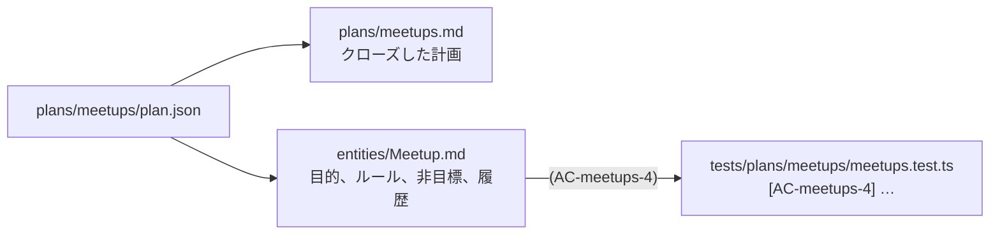

# 第 5 章: 計画をクローズする

実装が終わると、`plan.json` は更新されなくなります。できあがったコードに合わせて、承認済みの計画を書き直す人はいないからです。それでも、計画に書かれていたこと (機能がある理由、守るべきルール、あえて外したこと) は、この先も必要になります。計画をクローズすると、その内容が次のエージェントが読むドキュメントに書き出されます。

**この章で学ぶこと:**

- `plan:close` を実行するための条件と、書き出されるもの
- ドキュメントに書いたルールと、それを裏付けるテストのつながりが保たれる仕組み
- 次のエージェントがこれらの情報を見つける場所

## 1. クローズする

```bash run
bunx guren plan:close docs/plans/meetups/plan.json
```

`plan:close` は、計画が承認済みで、すべての要素が検証済み (`verified`) か免除 (`waived`) になっていないと実行を拒否します (免除は第 7 章で説明します)。この計画は条件を満たしているので、次の 2 つのファイルが書き出されます。



エンティティのドキュメントを開いて読んでみます。

```bash run
cat docs/entities/Meetup.md
```

どのルールにも、末尾にそのルールの元になった振る舞いの id が `(AC-meetups-4)` の形で付いていて、同じ id がテストのタイトルにも入っています。この id によって、文章で書いたルールと、ルールが守られなくなったときに失敗するテストが結び付きます。

`plan:close` が書く内容は、すべて `<!-- guren:plan meetups … -->` のマーカーの間に入ります。マーカーの外に読者が書き足した文章は、そのまま残ります。後で `Meetup` に手を入れる計画があっても、その計画は自分のブロックしか書き換えません。

## 2. つながりを検査する

```bash run
bunx guren check --docs
```

`check --docs` は、ドキュメント中の `(AC-…)` ごとに、同じ id を持つテストがあるかを調べます。テストのタイトルを変えたりテストを削除したりすると、そのルールは裏付けるテストがないものとして報告されます。

## 3. 次のエージェントに見えるもの

```bash run
bunx guren context Meetup
```

最後のセクション **Linked docs** に、いま書き出した 2 つのファイルが並びます。ハーネスは、エンティティに手を入れる前に `guren context <Entity>` を読むようエージェントに指示しています。そのため、次に `Meetup` を変える計画は、コードだけでなく機能の目的とルールを踏まえたところから始まります。

## 4. コミットする

```bash run
git add docs
git commit -m "docs: close the meetups plan"
```

`plan:close` は何も削除しません。計画、リビジョン、承認は、機能がどう決まったかの記録として `docs/plans/meetups/` にそのまま残ります。

## ここまでの状態

- `docs/entities/Meetup.md` ができ、機能の目的とルールが書かれています。ルールはそれぞれテストと結び付いています。
- クローズした計画が `docs/plans/meetups.md` に書き出されています。
- 1 本目の計画が、依頼からドキュメントまでひととおり終わりました。

## よくあるつまずき

- **`plan:close` が、検証済みでない要素を一覧で示す。** 要素ごとに、状態を進めるためのコマンドも表示されます。たいていは、その要素を受け持つステップの `plan:verify --step` です。表示されたコマンドを実行してから、もう一度クローズしてください。
- **`check --docs` が、テストのないルールがあると警告する。** テストのタイトルから `[AC-…]` の id が消えています。エージェントがタイトルを整えたときによく起きるので、id を戻してください。

## 演習

1. `docs/entities/Meetup.md` の `## Purpose` の下、マーカーの外側に自分で段落を書き足してください。もう一度 `plan:close` を実行し、その段落が消えずに残ることを確かめます。
2. `bunx guren docs:graph --entity Meetup` を実行してください。エンティティのドキュメントには、どんな種類のノードがつながっていますか。

## 次へ

[第 6 章: 既存を変える計画](./06-changing-what-exists.md) では、いま作った勉強会に手を入れる機能として、参加登録を計画します。
