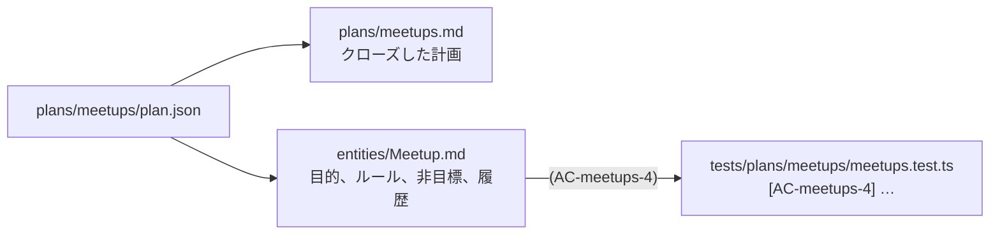

# 第 5 章: 計画をクローズする

実装が終わると、`plan.json` はもう動きません。すでにあるコードに合わせて承認済みの計画を書き換える人はいないからです。それでも、計画が知っていたこと (機能がある理由、守るべきルール、あえて外したこと) には価値が残ります。計画をクローズすると、その知識が次のエージェントの読むドキュメントに書き出されます。

**この章で学ぶこと:**

- `plan:close` が求める条件と、書き出すもの
- ドキュメントのルールが、それを証明するテストとつながり続ける仕組み
- 次のエージェントがそれを見つける場所

## 1. クローズする

```bash run
bunx guren plan:close docs/plans/meetups/plan.json
```

計画が承認済みで、すべての要素が verified か waive 済み (waiver は第 7 章で説明します) でなければ拒否します。この計画は条件を満たすので、2 つのファイルを書きます。



エンティティのドキュメントを読みます。

```bash run
cat docs/entities/Meetup.md
```

どのルールも末尾に、それを支える振る舞いの id が `(AC-meetups-4)` の形で付いています。同じ id がテストのタイトルにもあります。この対がつながりです。文章で書いたルールと、そのルールが崩れたら失敗するテストです。

`plan:close` が書くものはすべて `<!-- guren:plan meetups … -->` のマーカーの間にあります。マーカーの外に書いた文章は自分のものです。`Meetup` に触れる後の計画が書き換えるのは、その計画自身のブロックだけです。

## 2. つながりを検査する

```bash run
bunx guren check --docs
```

`check --docs` は、ドキュメント中の `(AC-…)` ごとに、その id を持つテストを探します。テストのタイトルを変えたりテストを消したりすると、どのテストも証明していないルールとして報告されます。

## 3. 次のエージェントに見えるもの

```bash run
bunx guren context Meetup
```

最後のセクション **Linked docs** に、いま書いた 2 つのファイルが並びます。ハーネスはエージェントに、エンティティに触れる前に `guren context <Entity>` を読むよう指示しています。なので `Meetup` を変える次の計画は、コードだけでなく、その目的とルールから始まります。

## 4. コミットする

```bash run
git add docs
git commit -m "docs: close the meetups plan"
```

`plan:close` は何も削除しません。計画、リビジョン、承認は、機能がどう決まったかの記録として `docs/plans/meetups/` に残ります。

## いまいる場所

- `docs/entities/Meetup.md`。機能の目的とルールがあり、ルールはそれぞれテストにつながっています。
- `docs/plans/meetups.md`。クローズした計画です。
- 1 本目の計画が、依頼からドキュメントまで終わりました。

## よくあるつまずき

- **`plan:close` が verified でない要素を並べる。** 要素ごとに、それを進めるコマンドを示します。たいていはその要素を持つステップの `plan:verify --step` です。それを実行してから、もう一度クローズします。
- **`check --docs` が、テストのないルールを警告する。** テストのタイトルから `[AC-…]` の id が消えています。エージェントがタイトルを整えたときに起きがちです。id を戻してください。

## 演習

1. `docs/entities/Meetup.md` の `## Purpose` の下、マーカーの外に自分の段落を足してください。もう一度 `plan:close` を実行し、段落が残ることを確かめます。
2. `bunx guren docs:graph --entity Meetup` を実行してください。エンティティのドキュメントには、どんな種類のノードがつながっていますか。

## 次へ

[第 6 章: 既存を変える計画](./06-changing-what-exists.md) では、いま作った勉強会に手を入れる参加登録を計画します。
