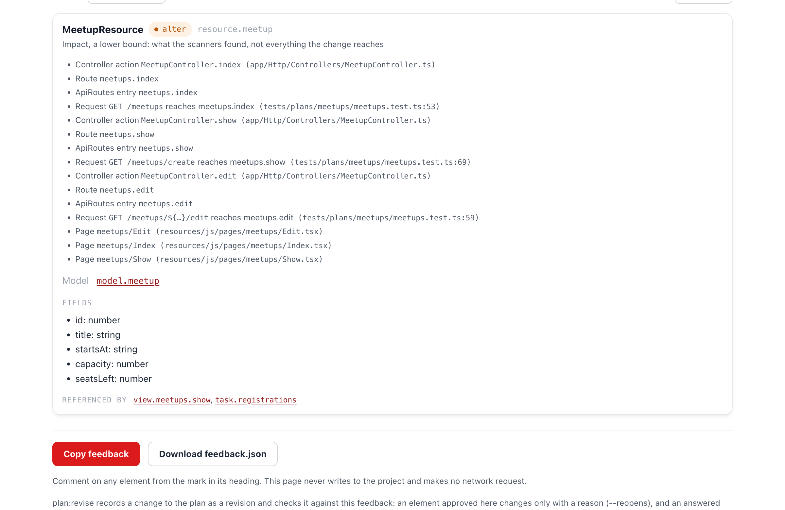

# 第 6 章: 既存を変える計画

1 本目の計画は追加だけでした。参加登録はそうはいきません。勉強会が自分の登録を知り、ページが空き席を示し、すでに受け入れたコードが変わる必要があります。この章ではその変更を計画して承認します。レビューは難しくなります。「これで正しいか」に加えて「ほかに何に触れるか」も問うからです。

**この章で学ぶこと:**

- 計画が、追加するものと変えるもの (`alter`) を分けて書く方法
- **Impact** の読み方。変わる要素に依存するコードをページが並べた一覧です
- 承認が `alter` について警告する理由と、その警告が求めること

## 1. 計画を頼む

> plan-write スキルで参加登録を計画してください。サインインしたユーザーは勉強会に参加登録でき、自分の登録を取り消せます。勉強会は定員を超えて登録を受け付けず、勉強会のページには空き席の数を表示します。

エージェントは `guren context Meetup` の一部として、第 5 章の `docs/entities/Meetup.md` を読みます。既存のルールを知ったうえで計画します。今回は 1 つの質問を未決のまま残してください。満席の勉強会に登録しようとしたらどうなるか、です。

**エージェントなしの場合:**

```bash run fallback
mkdir -p docs/plans/registrations
```

<details>
<summary>docs/plans/registrations/plan.json</summary>

```json file=docs/plans/registrations/plan.json fallback
{
  "planVersion": 1,
  "title": "Registrations",
  "summary": "Signed-in users register for a meetup until it is full and cancel their own registration. The meetup page shows the seats left.",
  "locale": "en",
  "scope": {"goals": ["Register for a meetup", "Cancel your own registration", "See the seats left"], "nonGoals": ["Paid tickets", "Registering someone else"]},
  "assumptions": ["The organizer can register for their own meetup"],
  "questions": [
    {
      "id": "Q-full",
      "question": "What happens when someone registers for a full meetup?",
      "options": [
        {"label": "refuse", "consequence": "No row is written and the page says the meetup is full."},
        {"label": "waitlist", "consequence": "A waitlisted registration is written and promoted when someone cancels."}
      ],
      "assumed": "refuse",
      "affects": ["model.registration", "action.registrations.store"]
    }
  ],
  "models": [
    {
      "id": "model.user",
      "change": {"kind": "existing"},
      "name": "User",
      "table": "users",
      "columns": [{"id": "column.user.id", "name": "id", "change": {"kind": "existing"}, "type": "integer", "nullable": false, "unique": false, "index": false, "primaryKey": true}],
      "relationships": [],
      "fillable": []
    },
    {
      "id": "model.meetup",
      "change": {"kind": "alter"},
      "name": "Meetup",
      "table": "meetups",
      "columns": [
        {
          "id": "column.meetup.id",
          "name": "id",
          "change": {"kind": "existing"},
          "type": "integer",
          "nullable": false,
          "unique": false,
          "index": false,
          "primaryKey": true
        }
      ],
      "relationships": [{"name": "registrations", "type": "hasMany", "target": "model.registration"}],
      "fillable": []
    },
    {
      "id": "model.registration",
      "change": {"kind": "add"},
      "name": "Registration",
      "table": "registrations",
      "columns": [
        {
          "id": "column.registration.id",
          "name": "id",
          "change": {"kind": "add"},
          "type": "integer",
          "nullable": false,
          "unique": false,
          "index": false,
          "primaryKey": true
        },
        {
          "id": "column.registration.meetupId",
          "name": "meetupId",
          "columnName": "meetup_id",
          "change": {"kind": "add"},
          "type": "integer",
          "nullable": false,
          "unique": false,
          "index": true,
          "references": {"model": "model.meetup", "column": "id", "onDelete": "cascade"}
        },
        {
          "id": "column.registration.userId",
          "name": "userId",
          "columnName": "user_id",
          "change": {"kind": "add"},
          "type": "integer",
          "nullable": false,
          "unique": false,
          "index": true,
          "references": {"model": "model.user", "column": "id", "onDelete": "cascade"}
        }
      ],
      "relationships": [{"name": "meetup", "type": "belongsTo", "target": "model.meetup"}, {"name": "user", "type": "belongsTo", "target": "model.user"}],
      "fillable": [],
      "indexes": [{"columns": ["meetupId", "userId"], "unique": true}]
    }
  ],
  "controllers": [
    {
      "id": "controller.meetups",
      "change": {"kind": "alter"},
      "className": "MeetupController",
      "actions": [
        {
          "id": "action.meetups.show",
          "change": {"kind": "alter"},
          "name": "show",
          "authorization": {"middleware": []},
          "response": {"kind": "inertia", "view": "view.meetups.show"},
          "rules": ["Pass the signed-in user's registration, if any."]
        }
      ]
    },
    {
      "id": "controller.registrations",
      "change": {"kind": "add"},
      "className": "RegistrationController",
      "actions": [
        {
          "id": "action.registrations.store",
          "change": {"kind": "add"},
          "name": "store",
          "authorization": {"middleware": ["auth"]},
          "response": {"kind": "redirect", "to": "/meetups/:id"},
          "rules": ["The registrant is the signed-in user.", "A full meetup writes no row.", "Registering twice writes no second row."]
        },
        {
          "id": "action.registrations.destroy",
          "change": {"kind": "add"},
          "name": "destroy",
          "authorization": {"middleware": ["auth"], "policy": {"id": "policy.registration", "ability": "delete"}},
          "response": {"kind": "redirect", "to": "/meetups/:meetupId"},
          "rules": []
        }
      ]
    }
  ],
  "routes": [
    {
      "id": "route.meetups.show",
      "change": {"kind": "existing"},
      "method": "GET",
      "path": "/meetups/:id",
      "name": "meetups.show",
      "action": "action.meetups.show",
      "middleware": [],
      "bind": [{"param": "id", "model": "model.meetup"}]
    },
    {
      "id": "route.registrations.store",
      "change": {"kind": "add"},
      "method": "POST",
      "path": "/meetups/:id/registrations",
      "name": "registrations.store",
      "action": "action.registrations.store",
      "middleware": ["auth"],
      "bind": [{"param": "id", "model": "model.meetup"}]
    },
    {
      "id": "route.registrations.destroy",
      "change": {"kind": "add"},
      "method": "DELETE",
      "path": "/registrations/:id",
      "name": "registrations.destroy",
      "action": "action.registrations.destroy",
      "middleware": ["auth"],
      "bind": [{"param": "id", "model": "model.registration"}]
    }
  ],
  "views": [
    {
      "id": "view.meetups.show",
      "change": {"kind": "alter"},
      "page": "meetups/Show",
      "purpose": "Show a meetup with the seats left, and a button to register or cancel.",
      "props": [{"name": "meetup", "type": "Data.Meetup", "resource": "resource.meetup"}, {"name": "registrationId", "type": "number | null"}],
      "actions": [{"label": "Register", "route": "route.registrations.store"}, {"label": "Cancel", "route": "route.registrations.destroy"}],
      "states": {"empty": "The meetup is full."}
    }
  ],
  "resources": [
    {
      "id": "resource.meetup",
      "change": {"kind": "alter"},
      "name": "MeetupResource",
      "model": "model.meetup",
      "fields": [
        {"name": "id", "type": "number"},
        {"name": "title", "type": "string"},
        {"name": "startsAt", "type": "string"},
        {"name": "capacity", "type": "number"},
        {"name": "seatsLeft", "type": "number"}
      ]
    }
  ],
  "policies": [
    {
      "id": "policy.registration",
      "change": {"kind": "add"},
      "name": "RegistrationPolicy",
      "model": "model.registration",
      "abilities": [{"name": "delete", "rule": "The signed-in user made the registration."}]
    }
  ],
  "tasks": [
    {
      "id": "task.registrations",
      "entity": "Registration",
      "summary": "Register until the meetup is full, cancel your own registration, and see the seats left.",
      "covers": [
        "model.meetup",
        "model.registration",
        "controller.registrations",
        "action.meetups.show",
        "route.registrations.store",
        "route.registrations.destroy",
        "view.meetups.show",
        "resource.meetup",
        "policy.registration"
      ],
      "acceptance": [
        {
          "id": "AC-registrations-1",
          "description": "A signed-in user can register for a meetup with seats left.",
          "kind": "success",
          "actor": "user",
          "route": "route.registrations.store",
          "given": ["a meetup with 2 seats exists"],
          "expect": {"status": 303}
        },
        {
          "id": "AC-registrations-2",
          "description": "Registering for a full meetup writes no row.",
          "kind": "state",
          "actor": "user",
          "route": "route.registrations.store",
          "given": ["a meetup with 1 seat and 1 registration exists"],
          "expect": {"status": 303}
        },
        {
          "id": "AC-registrations-3",
          "description": "Registering twice writes no second row.",
          "kind": "state",
          "actor": "user",
          "route": "route.registrations.store",
          "given": ["the user is registered for a meetup"],
          "expect": {"status": 303}
        },
        {
          "id": "AC-registrations-4",
          "description": "A guest cannot register.",
          "kind": "unauthenticated",
          "actor": "guest",
          "route": "route.registrations.store",
          "given": ["a meetup exists"],
          "expect": {"redirect": "/login"}
        },
        {
          "id": "AC-registrations-5",
          "description": "A user cannot cancel someone else's registration.",
          "kind": "forbidden",
          "actor": "user",
          "route": "route.registrations.destroy",
          "given": ["another user's registration exists"],
          "expect": {"status": 403}
        },
        {
          "id": "AC-registrations-6",
          "description": "A guest cannot cancel a registration.",
          "kind": "unauthenticated",
          "actor": "guest",
          "route": "route.registrations.destroy",
          "given": ["a registration exists"],
          "expect": {"redirect": "/login"}
        },
        {
          "id": "AC-registrations-8",
          "description": "A user can cancel their own registration.",
          "kind": "success",
          "actor": "user",
          "route": "route.registrations.destroy",
          "given": ["the user is registered for a meetup"],
          "expect": {"status": 303}
        },
        {
          "id": "AC-registrations-7",
          "description": "The meetup page shows the seats left.",
          "kind": "success",
          "actor": "guest",
          "route": "route.meetups.show",
          "given": ["a meetup with 2 seats and 1 registration exists"],
          "expect": {"status": 200}
        }
      ]
    }
  ]
}
```

</details>

第 2 章と同じく、第 6 章と第 7 章はこの参照用の計画の要素を名指しします。ここまで自分の計画で進めてきたなら、ここが 2 つ目の切り替え地点です。上のブロックで `docs/plans/registrations/plan.json` を上書きします。ただし、第 5 章の終わりでアプリが参照用と一致している場合に限ります。1 本目も自分の計画で進めたなら、2 本目も自分の計画のまま進め、名前は例として読んでください。

## 2. add、alter、existing

```bash run
bunx guren plan:render docs/plans/registrations/plan.json
```

`docs/plans/registrations/plan.html` を開き、**Changes only** をオンにします。残る要素は 3 種類に分かれます。

| change | 要素 | 意味 |
|---|---|---|
| `add` | `Registration`、`RegistrationController`、ルート 2 つ、`RegistrationPolicy` | 1 本目と同じ新しいコード |
| `alter` | `Meetup`、`MeetupResource`、`meetups/Show`、`MeetupController.show` | すでにあり、これから変わるコード |
| `existing` | `User`、`meetups.show` のルート | 参照するだけで触れない (**Changes only** で隠れます) |

`alter` は、何が変わるかを Guren がコードから読み戻せるプロパティで書きます。`Meetup` には `registrations` のリレーションが、`MeetupResource` には `seatsLeft` のフィールドが、`meetups/Show` には `registrationId` の prop が増えます。後でループが変更の到着を知るのは、このプロパティを読むからです。

## 3. Impact を読む

`alter` のカードにはどれも **Impact** の一覧があります。その要素に依存しているとスキャナが見つけたコードです。



これは問いとして読みます。**計画はこの 1 つずつに対応しているか。** ここでは `MeetupResource` に `seatsLeft` が増え、その Resource を `index`、`show`、`edit` が使います。3 つとも Resource に登録数を渡さないと、一覧ページと編集ページで `seatsLeft` が壊れます。計画が変えるのは `show` だけです。残りの 2 つは、http ステップでエージェントが気づくべきもので、そのコミットで自分が確かめるものです。

この一覧は下限です。スキャナが見えない依存 (手で Resource を組み立てるコード、生のクエリ) は載りません。

| 確かめること | ページで見る場所 |
|---|---|
| 各 `alter` が、変更を文章だけでなくプロパティで書いている | 要素のカード |
| Impact の各項目が、計画で扱われているか、そのままで問題ない | **Impact** |
| 破壊的変更として並ぶものに、意外なものがない | Needs attention |
| 変更または削除するカラムが、既存の行をどうするか (`dataMigration`) を書いている | カラムのカード |

この計画はカラムを変えないので、データの移行は要りません。第 2 章のチェック表もそのまま使います。`registrations.destroy` は policy の後ろにあり、登録した本人の success 振る舞いが `AC-registrations-8` です。

## 4. 回答して承認する

第 3 章と同じ手順で質問に答えます。ページで **refuse** を選び、フィードバックをコピーして渡します。

> docs/plans/registrations/plan.json に私のレビューを plan:revise で反映してください。満席の勉強会は登録を断ります。キャンセル待ちは後の変更です。registrations.store の 2 つの警告は残します。サインインしたユーザーなら誰でも登録でき、リクエストにボディがないからです。

**エージェントなしの場合:**

```bash run fallback
bunx guren plan:revise docs/plans/registrations/plan.json --ops - <<'EOF'
{
  "ops": [
    {"op": "remove", "id": "Q-full", "reason": "Answered: a full meetup refuses the registration."},
    {"op": "modify", "section": "plan", "element": {"title": "Registrations", "summary": "Signed-in users register for a meetup until it is full and cancel their own registration. The meetup page shows the seats left.", "scope": {"goals": ["Register for a meetup", "Cancel your own registration", "See the seats left"], "nonGoals": ["Paid tickets", "Registering someone else"]}, "assumptions": ["The organizer can register for their own meetup", "A full meetup refuses a registration; a waitlist is a later change"], "hints": [], "locale": "en"}, "reason": "Record the answer to Q-full."}
  ]
}
EOF
```

```bash run
git add docs/plans
git commit -m "docs: plan registrations"
bunx guren plan:approve docs/plans/registrations/plan.json
```

承認は成立し、`action.meetups.show` について助言の警告が 1 件出ます。計画はこのアクションがページに渡すものを変えます。しかし Guren が読むアクションのプロパティは描画するページだけで、それはすでに成り立っています。この変更をコードのプロパティから示す手段がないので、`plan:status` はプロパティだけでは確認できません。確認できるのは、このアクションに届く verified の振る舞いだけです。`AC-registrations-7` (「勉強会のページに空き席の数が出る」) がそれに当たります。

この警告は自分への問いです。そうした振る舞いはあるか。ここではあるので承認します。なければ、誰かが waive するまで変更は確認されないままになります。

承認は、各 `alter` がこの時点でどう読めたかも `approvals.json` に記録しました (第 3 章の演習の `readings` です)。「この計画が変えた」と「もともとそうだった」をループが区別できるのは、この記録のおかげです。

```bash run
git add docs/plans
git commit -m "docs: approve the registrations plan"
```

## いまいる場所

- 参加登録を追加し、1 本目の勉強会のコードを変える、承認済みの 2 本目の計画。
- `alter` を読む習慣。Impact を読み、各依存に計画が対応しているかを問います。

## よくあるつまずき

- **`plan:render` が "only existing is consistent there" で失敗する。** `existing` のコントローラーの下に `alter` のアクションがあります。コントローラーも `alter` にしてください。
- **使われていると分かっている要素の Impact が空。** スキャナが追えるのは、静的に解決できる import と名前だけです。空の一覧を信じる前に、自分でもコードを検索してください。

## 演習

1. 計画のコピーから `AC-registrations-7` を消してアプリの外に保存し、`--app .` と、アプリの外を指す `-o` を付けて描画してください。どの検査が、どの要素で失敗しますか。
2. `docs/plans/registrations/approvals.json` で `view.meetups.show` の `readings` を読んでください。`differ` の prop と `match` の prop はどれですか。ループが後でこの計画の成果として確認できるのはどちらですか。

## 次へ

[第 7 章: アプリが動いたとき](./07-when-the-application-moves.md) では、同僚が下のコードを変える中で、この計画を実装します。
