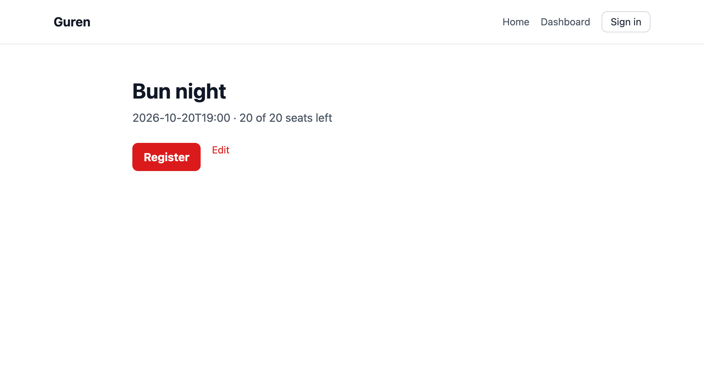

# 第 7 章: アプリが動いたとき

計画は、ある 1 つのコミットの時点のアプリに対して承認されます。実際の開発はそのコミットで止まりません。同僚がリファクタリングをマージし、計画が頼っていた名前が消えることがあります。この章では参加登録の計画を実装し、その途中でそれを起こします。そして、合わなくなった設計の上にエージェントが作り続けるのを Guren がどう止めるかを見ます。

**この章で学ぶこと:**

- **held** のステップとは何か。エージェントが自分で解決できない理由
- 2 つの出口。変更を戻すか、計画を改訂するか
- 改訂が、verified 済みのステップに与える影響
- waiver の役割

## 1. 実装を始める

> docs/plans/registrations/plan.json を plan-implement スキルで実装してください。1 ステップにつき 1 コミットです。

最初の 3 ステップは第 4 章と同じように進みます。よく読みたいのは data ステップです。第 6 章の `alter` として、`Meetup` に `registrations` のリレーションが入るのはここです。

**エージェントなしの場合:**

```bash run fallback
bunx guren plan:next docs/plans/registrations/plan.json
bunx guren plan:scaffold docs/plans/registrations/plan.json --step task/entity/model.registration/scaffold
bunx guren plan:verify docs/plans/registrations/plan.json --step task/entity/model.registration/scaffold
git add -A
git commit -m "feat(registrations): scaffold [task/entity/model.registration/scaffold]"
bunx guren plan:next docs/plans/registrations/plan.json
bunx guren plan:scaffold docs/plans/registrations/plan.json --step task/entity/model.registration/tests
```

<details>
<summary>セットアップを書いた tests/plans/registrations/registrations.test.ts</summary>

```ts file=tests/plans/registrations/registrations.test.ts fallback
import { beforeEach, describe, expect, test } from 'bun:test'
import { TestApp } from '@guren/testing'
import { resetDatabase } from '../../../config/database.js'
import { Meetup, type MeetupRecord } from '../../../app/Models/Meetup.js'
import { Registration } from '../../../app/Models/Registration.js'
import { User, type UserRecord } from '../../../app/Models/User.js'

let booted: Promise<TestApp> | undefined

function ready(): Promise<TestApp> {
  booted ??= import('../../../src/app.js').then(({ default: app }) => TestApp.fromApp(app))
  return booted
}

async function client(actor?: object): Promise<TestApp> {
  const http = actor === undefined ? await ready() : (await ready()).actingAs(actor)
  return http.withCsrf()
}

let ada: UserRecord
let grace: UserRecord
let meetup: MeetupRecord

async function seats(capacity: number) {
  meetup = await Meetup.forceCreate({ title: 'Bun night', startsAt: '2026-10-20T19:00', capacity, organizerId: grace.id })
}

function register(user: UserRecord) {
  return Registration.forceCreate({ meetupId: meetup.id, userId: user.id })
}

function count() {
  return Registration.where({ meetupId: meetup.id }).count()
}

beforeEach(async () => {
  await ready()
  await resetDatabase()
  ada = await User.create({ name: 'Ada', email: 'ada@example.com', password: 'correct horse battery' })
  grace = await User.create({ name: 'Grace', email: 'grace@example.com', password: 'correct horse battery' })
})

describe('Registration', () => {
  test('[AC-registrations-1] A signed-in user can register for a meetup with seats left.', async () => {
    await seats(2)
    await (await client(ada)).post(`/meetups/${meetup.id}/registrations`).assertStatus(303)
    expect(await Registration.where({ meetupId: meetup.id, userId: ada.id }).first()).not.toBeNull()
  })

  test('[AC-registrations-2] Registering for a full meetup writes no row.', async () => {
    await seats(1)
    await register(grace)
    await (await client(ada)).post(`/meetups/${meetup.id}/registrations`).assertStatus(303)
    expect(await count()).toBe(1)
  })

  test('[AC-registrations-3] Registering twice writes no second row.', async () => {
    await seats(5)
    await register(ada)
    await (await client(ada)).post(`/meetups/${meetup.id}/registrations`).assertStatus(303)
    expect(await count()).toBe(1)
  })

  test('[AC-registrations-4] A guest cannot register.', async () => {
    await seats(2)
    await (await client()).post(`/meetups/${meetup.id}/registrations`).assertRedirect('/login')
  })

  test('[AC-registrations-5] A user cannot cancel someone else\'s registration.', async () => {
    await seats(2)
    const registration = await register(grace)
    await (await client(ada)).delete(`/registrations/${registration.id}`).assertStatus(403)
    expect(await count()).toBe(1)
  })

  test('[AC-registrations-6] A guest cannot cancel a registration.', async () => {
    await seats(2)
    const registration = await register(grace)
    await (await client()).delete(`/registrations/${registration.id}`).assertRedirect('/login')
  })

  test('[AC-registrations-8] A user can cancel their own registration.', async () => {
    await seats(2)
    const registration = await register(ada)
    await (await client(ada)).delete(`/registrations/${registration.id}`).assertStatus(303)
    expect(await count()).toBe(0)
  })

  test('[AC-registrations-7] The meetup page shows the seats left.', async () => {
    await seats(2)
    await register(grace)
    const response = await (await client()).get(`/meetups/${meetup.id}`).assertStatus(200)
    await response.assertBodyContains('"seatsLeft":1')
  })
})
```

</details>

```bash run fallback
bunx guren plan:verify docs/plans/registrations/plan.json --step task/entity/model.registration/tests
git add -A
git commit -m "test(registrations): acceptance tests [task/entity/model.registration/tests]"
bunx guren plan:next docs/plans/registrations/plan.json
```

<details>
<summary>registrations のリレーションを足した app/Models/Meetup.ts</summary>

```ts file=app/Models/Meetup.ts fallback
import { defineModel, type BelongsToRecord, type HasManyRecord } from '@guren/core'
import { meetups, registrations, users } from '../../db/schema.js'

export type MeetupRecord = typeof meetups.$inferSelect
export type NewMeetupRecord = typeof meetups.$inferInsert
type UserRecord = typeof users.$inferSelect
type RegistrationRecord = typeof registrations.$inferSelect

export class Meetup extends defineModel(meetups, {
  fillable: ['title', 'startsAt', 'capacity'],
}) {
  static override relationTypes: {
    organizer: BelongsToRecord<UserRecord>
    registrations: HasManyRecord<RegistrationRecord>
  } = {
    organizer: null,
    registrations: [],
  }
}

Meetup.belongsTo('organizer', () => import('./User.js').then((module) => module.User), 'organizerId', 'id')
Meetup.hasMany('registrations', () => import('./Registration.js').then((module) => module.Registration), 'meetupId', 'id')
```

</details>

```bash run fallback
bun run db:make create_registrations
bunx guren plan:verify docs/plans/registrations/plan.json --step task/entity/model.registration/data
git add -A
git commit -m "feat(registrations): migration [task/entity/model.registration/data]"
```

## 2. 同僚のコミット

エージェントが作業している間に、同僚が勉強会ページのルート名を `meetups.show` から `meetups.detail` に変えます。同僚の役として、そのコミットを自分で作ります。

```bash run
sed -i.bak "s/name: 'meetups.show'/name: 'meetups.detail'/" routes/meetups.ts
rm routes/meetups.ts.bak
bunx guren codegen
git add -A
git commit -m "refactor: rename the meetup page route"
```

何も壊れていません。アプリは動き、テストも通ります。ただし計画は `meetups.show` を名指ししていて、`AC-registrations-7` はそのルートにリクエストします。

## 3. ステップが held になる

```bash run
bunx guren plan:next docs/plans/registrations/plan.json
```

```text
No step can be returned: every step left is held, or waits on one that is.

Held, since what they depend on changed after the plan was approved:
  task/entity/model.registration/http
    route.meetups.show (routes, existing), named by AC-registrations-7: …
      fail  The route name "meetups.show" was not found in this application, …
```

第 3 章の baseline がここで働きます。承認時、Guren は要素ごとにアプリが持っていたもののハッシュを取りました。いま取り直すと、`route.meetups.show` のハッシュは承認時の状態とも、計画自身が作るはずの状態とも一致しません。なので、それに依存するステップは **held** になり、そのステップを待つステップもすべて止まります。

エージェントにも同じ出力が届きます。`plan-implement` スキルは、直さずに止まって報告するよう指示しています。どちらの直し方も設計の判断だからです。

| 選択肢 | 選ぶとき | すること |
|---|---|---|
| 変更を戻す | 同僚のコミットのほうが誤り | コミットを revert すると、ステップは held でなくなります |
| 計画を改訂する | 変更が正しく、計画が追随すべき | アプリがいま持っているものを名指すよう計画を直し、承認し直します |

名前の変更はもっともなので、計画を追随させます。

## 4. 改訂して承認し直す

> 同僚がルート meetups.show を meetups.detail に改名しました。docs/plans/registrations/plan.json を plan:revise で改訂し、route.meetups.show が meetups.detail を名指すようにしてください。id はそのままにします。

要素の id `route.meetups.show` は変えません。計画のほかの部分も、すべての記録も、この id で要素を指すからです。変わるのは名前だけです。

**エージェントなしの場合:**

```bash run fallback
bunx guren plan:revise docs/plans/registrations/plan.json --ops - <<'EOF'
{
  "ops": [
    {"op": "modify", "section": "routes", "id": "route.meetups.show", "element": {"change": {"kind": "existing"}, "method": "GET", "path": "/meetups/:id", "name": "meetups.detail", "action": "action.meetups.show", "middleware": [], "bind": [{"param": "id", "model": "model.meetup"}]}, "reason": "A teammate renamed the route to meetups.detail."}
  ]
}
EOF
```

```bash run
git add docs/plans
git commit -m "docs: follow the meetups.detail rename in the registrations plan"
bunx guren plan:approve docs/plans/registrations/plan.json
git add docs/plans
git commit -m "docs: approve the revised registrations plan"
```

baseline は第 6 章で刻んだもののままです。承認し直しても新しいハッシュを記録するだけで、計画が今日書かれたかのようには扱いません。

### verified 済みのステップ

検証の記録は、実行時の計画のハッシュを名指しします。改訂でハッシュが変わったので、終わっている 3 つのステップには有効な記録がなくなりました。コードは変わっていないので、検証し直すだけです。

```bash run fallback
bunx guren plan:verify docs/plans/registrations/plan.json --step task/entity/model.registration/scaffold
bunx guren plan:verify docs/plans/registrations/plan.json --step task/entity/model.registration/tests
bunx guren plan:verify docs/plans/registrations/plan.json --step task/entity/model.registration/data
```

エージェントがいれば、続けるよう伝えたときに `plan-implement` がこれを自分で行います。

## 5. 実装を終える

> docs/plans/registrations/plan.json の実装を続けてください。

第 6 章の Impact が生きるのは http ステップです。`MeetupResource` は登録数を必要とするようになり、`index`、`show`、`edit` のすべてがそれを組み立てます。

**エージェントなしの場合:**

```bash run fallback
bunx guren plan:next docs/plans/registrations/plan.json
bunx guren plan:scaffold docs/plans/registrations/plan.json --step task/entity/model.registration/http --mount
```

<details>
<summary>RegistrationController、RegistrationPolicy、MeetupResource、MeetupController、勉強会のページ</summary>

```ts file=app/Http/Controllers/RegistrationController.ts fallback
import { Controller } from '@guren/core'
import { Meetup } from '../../Models/Meetup.js'
import { Registration } from '../../Models/Registration.js'
import type { UserRecord } from '../../Models/User.js'

export default class RegistrationController extends Controller {
  async store(): Promise<Response> {
    const meetup = this.model(Meetup)
    const user = await this.auth.userOrFail<UserRecord>()
    const already = await Registration.where({ meetupId: meetup.id, userId: user.id }).first()
    const taken = await Registration.where({ meetupId: meetup.id }).count()
    if (!already && taken < meetup.capacity) {
      await Registration.forceCreate({ meetupId: meetup.id, userId: user.id })
    }
    return this.redirect(`/meetups/${meetup.id}`)
  }

  async destroy(): Promise<Response> {
    const registration = this.model(Registration)
    await this.authorize('delete', [Registration, registration])
    await Registration.delete({ id: registration.id })
    return this.redirect(`/meetups/${registration.meetupId}`)
  }
}
```

```ts file=app/Policies/RegistrationPolicy.ts fallback
import { Policy, type AuthUser } from '@guren/core'
import type { RegistrationRecord } from '../Models/Registration.js'

export class RegistrationPolicy extends Policy {
  delete(user: AuthUser | null, registration: RegistrationRecord): boolean {
    return user !== null && user.id === registration.userId
  }
}
```

```ts file=app/Http/Resources/MeetupResource.ts fallback
import { Resource } from '@guren/core'
import type { MeetupRecord } from '../../Models/Meetup.js'

export interface MeetupResourceData extends Record<string, unknown> {
  id: number
  title: string
  startsAt: string
  capacity: number
  seatsLeft: number
}

export class MeetupResource extends Resource<MeetupRecord & { registrationsCount: number }, MeetupResourceData> {
  toArray(): MeetupResourceData {
    return {
      id: this.resource.id,
      title: this.resource.title,
      startsAt: this.resource.startsAt,
      capacity: this.resource.capacity,
      seatsLeft: this.resource.capacity - this.resource.registrationsCount,
    }
  }
}
```

```ts file=app/Http/Controllers/MeetupController.ts fallback
import { Controller } from '@guren/core'
import { pages } from '@/.guren/pages.gen'
import { MeetupPayloadSchema } from '../Validators/MeetupValidator.js'
import { MeetupResource } from '../Resources/MeetupResource.js'
import { Meetup } from '../../Models/Meetup.js'
import { Registration } from '../../Models/Registration.js'
import type { UserRecord } from '../../Models/User.js'

async function withSeats(id: number) {
  const [meetup] = await Meetup.withCount('registrations', { id })
  return new MeetupResource(meetup!).toArray()
}

export default class MeetupController extends Controller {
  async index(): Promise<Response> {
    const meetups = await Meetup.withCount('registrations')
    meetups.sort((a, b) => a.startsAt.localeCompare(b.startsAt))
    return this.inertia(pages.meetups.Index, { meetups: meetups.map((meetup) => new MeetupResource(meetup).toArray()) })
  }

  async show(): Promise<Response> {
    const meetup = this.model(Meetup)
    const user = await this.auth.user<UserRecord | null>()
    const registration = user ? await Registration.where({ meetupId: meetup.id, userId: user.id }).first() : null
    return this.inertia(pages.meetups.Show, { meetup: await withSeats(meetup.id), registrationId: registration?.id ?? null })
  }

  async create(): Promise<Response> {
    return this.inertia(pages.meetups.Create, {})
  }

  async store(): Promise<Response> {
    const data = await this.validateBody(MeetupPayloadSchema)
    const user = await this.auth.userOrFail<UserRecord>()
    const meetup = await Meetup.forceCreate({ ...data, organizerId: user.id })
    return this.redirect(`/meetups/${meetup.id}`)
  }

  async edit(): Promise<Response> {
    const meetup = this.model(Meetup)
    await this.authorize('update', [Meetup, meetup])
    return this.inertia(pages.meetups.Edit, { meetup: await withSeats(meetup.id) })
  }

  async update(): Promise<Response> {
    const meetup = this.model(Meetup)
    await this.authorize('update', [Meetup, meetup])
    const data = await this.validateBody(MeetupPayloadSchema)
    await Meetup.update({ id: meetup.id }, data)
    return this.redirect(`/meetups/${meetup.id}`)
  }
}
```

```tsx file=resources/js/pages/meetups/Show.tsx fallback
import { Head, Link, router } from '@inertiajs/react'
import Layout from '../../components/Layout.js'
import type { MeetupResourceData } from '@/app/Http/Resources/MeetupResource'

interface Props {
  meetup: MeetupResourceData
  registrationId: number | null
}

export default function Show({ meetup, registrationId }: Props) {
  return (
    <Layout>
      <Head title={meetup.title} />
      <h1 className="text-3xl font-bold text-g-heading">{meetup.title}</h1>
      <p className="mt-2 text-g-text-2">{`${meetup.startsAt} · ${meetup.seatsLeft} of ${meetup.capacity} seats left`}</p>
      <div className="mt-6 flex gap-4">
        {registrationId !== null ? (
          <button type="button" className="text-g-danger" onClick={() => router.delete(`/registrations/${registrationId}`)}>Cancel</button>
        ) : meetup.seatsLeft > 0 ? (
          <button type="button" className="rounded-g-ctl bg-g-accent px-4 py-2 font-bold text-white" onClick={() => router.post(`/meetups/${meetup.id}/registrations`)}>Register</button>
        ) : (
          <p className="text-g-text-2">The meetup is full.</p>
        )}
        <Link href={`/meetups/${meetup.id}/edit`} className="text-sm text-g-accent">Edit</Link>
      </div>
    </Layout>
  )
}
```

</details>

```bash run fallback
bunx guren plan:verify docs/plans/registrations/plan.json --step task/entity/model.registration/http
git add -A
git commit -m "feat(registrations): register and cancel [task/entity/model.registration/http]"
bunx guren plan:next docs/plans/registrations/plan.json
bunx guren plan:verify docs/plans/registrations/plan.json --step task/entity/model.registration/pages
bunx guren plan:next docs/plans/registrations/plan.json
bunx guren plan:verify docs/plans/registrations/plan.json --step task/entity/model.meetup/http
```

最後のステップ `task/entity/model.meetup/http` は `MeetupController.show` のものです。承認時に警告が出た `alter` です。このステップ自体はコードを足しません。確認の決め手は、このアクションに届く `AC-registrations-7` です。

http のコミットは第 4 章のチェック表で読み、この計画のために次の 2 行を足します。

| 確かめること | 理由 |
|---|---|
| `store` が登録を書く前に登録数を数えている | 「満席なら行を書かない」はルールで、それを確かめるのは `AC-registrations-2` だけです |
| `MeetupResource` を組み立てるアクションすべてが登録数を渡している | Impact が `index`、`show`、`edit` を挙げていました |

## 6. クローズする

```bash run
bunx guren plan:next docs/plans/registrations/plan.json
bunx guren plan:close docs/plans/registrations/plan.json
git add -A
git commit -m "docs: close the registrations plan"
```



`docs/entities/Registration.md` が新しくできます。`docs/entities/Meetup.md` にはこの計画の履歴の行が増え、1 本目の計画が書いたブロックはそのまま残ります。

## 足りないまま受け入れるとき: waiver

要素を仕上げないほうがよい場合もあります。計画では通知を約束していたが、来月に出すと決めた、といった場合です。`plan:close` は拒否するので、計画を書き換える代わりに、その判断を記録します。

```bash manual
bunx guren plan:waive docs/plans/<slug>/plan.json <element-id> --reason "Ships with the mail plan next month"
```

waiver は計画の隣の `decisions.json` に書かれ、コミットされます。計画のハッシュを名指しするので、後のリビジョンには引き継がれません。`plan:close` は waiver ごとに `make:adr` のコマンドを表示するので、判断はアーキテクチャの決定の置き場所にも残ります。このコースでは使いませんでした。waiver は承認と同じく、人がする判断です。

## いまいる場所

- 参加登録を実装し、verified にし、クローズして、ドキュメントにしました。
- held のステップを計画の改訂で解決しました。理由は `revisions/0001.json` に残っています。

## よくあるつまずき

- **エージェントがルート名を元に戻して held を「直す」。** 同僚の作業を断りなく取り消しています。どちらの選択肢を選んだか、エージェントに伝えてください。
- **`.guren/*.gen.ts` が変わったので `plan:next` が拒否する。** codegen を実行せずにルートを変えたコミットがあります。`bunx guren codegen` を実行し、生成ファイルをコミットしてください。

## 演習

1. ブランチを切り、計画を改訂する代わりに同僚のコミットを revert して、`plan:next` を実行してください。ステップはまだ held ですか。
2. `docs/plans/registrations/revisions/0001.json` を読んでください。1 年後のレビュアーに、計画が `meetups.detail` を名指す理由を伝えるのはどのフィールドですか。

## 次へ

[第 8 章: CI の中の計画](./08-plans-in-ci.md) では、手で実行した検査をプルリクエストごとに走らせます。
