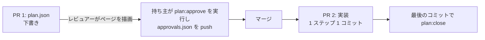

# 第 8 章: CI の中の計画

ここまではすべて自分のマシンで実行しました。この章では、計画をチームのリポジトリに置いたときに意味を持つ検査を 1 つ足し、計画がプルリクエストをどう通るかを決めます。

**この章で学ぶこと:**

- 雛形の CI が、変更なしで計画について確かめていること
- `guren check --plan` が足すものと、それがビルドを落とさない理由
- 承認を人の手に残すプルリクエストの形

## 1. CI がすでに確かめていること

雛形の `.github/workflows/ci.yml` が実行するのは `bunx guren gate --deps` の 1 つだけです。そのうち 2 つのステージが、このコースの成果をすでに守っています。

| ステージ | 守るもの |
|---|---|
| `test` | 両方の計画のすべての振る舞い。`[AC-…]` のテストで確かめます |
| `check` | `docs/entities/` のすべての `(AC-…)` のルール。テストが消えたルールを報告します |

なので、クローズした計画はクローズの後も効き続けます。ルールはエンティティのドキュメントに残り、テストは push のたびに走ります。

## 2. 開いている計画: `check --plan`

承認済みでまだクローズしていない計画は、誰かが実装中の設計です。開いている間に起こりうる問題が 2 つあり、どちらもゲートには出ません。

- 第 7 章のように、計画の下でアプリが動く
- 開いている 2 本目の計画が、同じモデル、コントローラー、テーブルを変える

`bunx guren check --plan` は、リポジトリにある開いた計画すべてについて、両方を報告します。

```bash run
bunx guren check --plan
```

このアプリの計画は 2 本ともクローズ済みなので、何も報告しません。それでも CI に足しておくと、開いた計画のずれが、それを起こしたプルリクエストに出ます。

```yaml file=.github/workflows/ci.yml
name: CI

on:
  push:
    branches:
      - main
  pull_request:

jobs:
  checks:
    runs-on: ubuntu-latest
    steps:
      - uses: actions/checkout@v4

      - uses: oven-sh/setup-bun@v2

      - name: Install dependencies
        run: bun install --frozen-lockfile

      # Every verification stage in one exit code: codegen, typecheck, lint,
      # check, audit, test. --deps scans dependencies too; drop it if this
      # runner cannot reach the npm registry. `bunx guren gate` runs the same
      # stages locally.
      - name: Gate
        run: bunx guren gate --deps

      # Open plans the application drifted under, or two open plans changing
      # one target. Advisory: it reports and exits 0.
      - name: Open plans
        run: bunx guren check --plan
```

`check --plan` はあえて助言にとどめています。開いた計画のずれは、その計画の持ち主が判断すること (第 7 章のように戻すか改訂するか) で、ほかの人のプルリクエストを止める理由ではないからです。

## 3. プルリクエストの中の計画

計画も承認もファイルなので、コードと同じくレビューを通ります。承認を人の手に残す順番は次のとおりです。



- **PR 1** は下書きです。レビュアーは手元で `bunx guren plan:render` を実行し、JSON の差分ではなくページをレビューします。ページはネットワークにアクセスしないので、プルリクエストに添付もできます。
- **承認** は、設計に責任を持つ人のコミットです。エージェントのコミットにはしません。実装が始まる前に入れるので、実装は合意した内容と突き合わせて検査されます。
- **PR 2** は実装です。1 ステップ 1 コミットにすると、第 4 章のように 1 回のレビューが小さく保てます。最後のコミットで計画をクローズします。

## 4. コミットする

```bash run
bunx guren gate
git add -A
git commit -m "ci: report open plans"
```

## いまいる場所

- push のたびに、すべての計画のテストを走らせ、すべてのルールのつながりを確かめる CI。
- 開いた計画についての助言の報告。
- 計画のためのプルリクエストの形。

## よくあるつまずき

- **エージェントがプルリクエストの中で計画を承認している。** `plan-write` スキルは禁じていますが、`approvals.json` を足すコミットの作者を確かめてください。設計に責任を持つ人であるはずです。
- **`check --plan` が、2 本の計画が同じテーブルを変えると報告する。** 2 本が同時に開いています。先に 1 本をクローズするか、`plan:revise` で 1 本にまとめてください。

## 演習

1. 勉強会を削除する計画の下書きを書いて承認し、別のコミットで `MeetupController` を変えてください。`bunx guren check --plan` は何を報告しますか。
2. コースを振り返ってください。どのコマンドも代わりにできなかった判断はどれでしたか。一覧にしてください。その一覧が、エージェントが引き受けない仕事です。

## 次へ

2 本の計画を、依頼からドキュメントまで通しました。下にあるフレームワーク (ルーティング、ORM、テスト、デプロイ) については、[Guren チュートリアル](../tutorials/00-overview.md) か [ガイド](../guides/implementation-plans.md) に進んでください。
