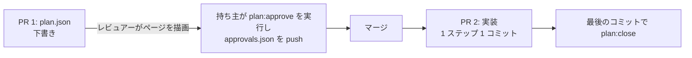

# 第 8 章: CI の中の計画

ここまでの作業はすべて手元のマシンで実行してきました。この章では、計画をチームのリポジトリで扱うようになったときに必要になる検査を 1 つ CI に加え、計画をプルリクエストでどう扱うかを決めます。

**この章で学ぶこと:**

- 雛形の CI が、手を加えなくても計画について確かめていること
- `guren check --plan` で増える検査と、それがビルドを失敗させない理由
- 承認を人が行う形に保つ、プルリクエストの進め方

## 1. CI がすでに確かめていること

雛形の `.github/workflows/ci.yml` は `bunx guren gate --deps` というコマンドを 1 つ実行するだけですが、そのステージのうち 2 つが、この講座で作ったものをすでに守っています。

| ステージ | 守るもの |
|---|---|
| `test` | 両方の計画のすべての振る舞い (`[AC-…]` のテストで確かめる) |
| `check` | `docs/entities/` にあるすべての `(AC-…)` のルール (テストが消えたルールを報告する) |

ルールはエンティティのドキュメントに残り、テストは push のたびに実行されるので、計画はクローズした後も効力を持ち続けます。

## 2. 開いている計画: `check --plan`

承認済みでまだクローズしていない計画 (開いている計画) は、誰かが実装している最中の設計です。計画が開いている間には、ゲートでは検出できない問題が 2 つ起こる可能性があります。

- 第 7 章のように、計画の承認後にアプリのコードが変わる
- 別の開いている計画が、同じモデル、コントローラー、テーブルを変更する

`bunx guren check --plan` を実行すると、リポジトリ内の開いている計画すべてについて、この 2 つの問題を報告します。

```bash run
bunx guren check --plan
```

このアプリの計画は 2 本ともクローズ済みなので、何も報告されません。それでも CI に加えておけば、開いている計画とアプリの食い違いが生じたときに、原因となったプルリクエストで報告されます。

```yaml file=.github/workflows/ci.yml
name: CI

on:
  push:
    branches:
      - main
  pull_request:

jobs:
  checks:
    runs-on: ubuntu-latest
    steps:
      - uses: actions/checkout@v4

      - uses: oven-sh/setup-bun@v2

      - name: Install dependencies
        run: bun install --frozen-lockfile

      # Every verification stage in one exit code: codegen, typecheck, lint,
      # check, audit, test. --deps scans dependencies too; drop it if this
      # runner cannot reach the npm registry. `bunx guren gate` runs the same
      # stages locally.
      - name: Gate
        run: bunx guren gate --deps

      # Open plans the application drifted under, or two open plans changing
      # one target. Advisory: it reports and exits 0.
      - name: Open plans
        run: bunx guren check --plan
```

`check --plan` は、あえて参考扱い (advisory) の報告にとどめています。開いている計画とアプリの食い違いにどう対処するか (第 7 章のように戻すか、改訂するか) は計画の持ち主が決めることなので、ほかの人のプルリクエストを止める理由にはしません。

## 3. プルリクエストの中の計画

計画も承認の記録もファイルなので、コードと同じようにレビューを通します。承認を人が行う形に保つには、次の順番で進めます。



- **PR 1** には計画の下書きを入れます。レビュアーは手元で `bunx guren plan:render` を実行し、JSON の差分ではなく描画したページを見てレビューします。ページはネットワークにアクセスしないので、プルリクエストに添付しても使えます。
- **承認** は、設計に責任を持つ人がコミットします。エージェントにはコミットさせません。承認は実装を始める前に入れるので、実装は合意した内容と照らし合わせて検査されます。
- **PR 2** には実装を入れます。第 4 章と同じく 1 ステップを 1 コミットにすれば、1 回のレビューを小さく保てます。計画は最後のコミットでクローズします。

## 4. コミットする

```bash run
bunx guren gate
git add -A
git commit -m "ci: report open plans"
```

## ここまでの状態

- push のたびに、すべての計画のテストを実行し、すべてのルールとテストの対応を確かめる CI ができました。
- 開いている計画について、参考扱いの報告が出るようになりました。
- 計画をプルリクエストで扱うときの進め方を決めました。

## よくあるつまずき

- **エージェントがプルリクエストの中で計画を承認している。** `plan-write` スキルで禁止はしていますが、`approvals.json` を追加したコミットの作者を確認してください。設計に責任を持つ人になっているはずです。
- **`check --plan` が、2 本の計画が同じテーブルを変えると報告する。** 2 本の計画が同時に開いている状態です。先に一方をクローズするか、`plan:revise` で 1 本にまとめてください。

## 演習

1. 勉強会を削除する計画の下書きを書いて承認し、別のコミットで `MeetupController` を変えてください。その状態で `bunx guren check --plan` を実行すると、何が報告されますか。
2. 講座全体を振り返り、どのコマンドにも代わりができなかった判断を一覧にしてください。その一覧が、エージェントが引き受けない仕事です。

## 次へ

ここまでで、2 本の計画を依頼からドキュメント化まで進めました。土台となるフレームワーク (ルーティング、ORM、テスト、デプロイ) について学ぶには、[Guren チュートリアル](../tutorials/00-overview.md) か [ガイド](../guides/implementation-plans.md) に進んでください。
