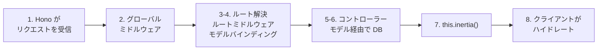

# アーキテクチャ

Guren は、Laravel の設計思想を TypeScript で組み立て直し、Bun・Hono・Inertia.js・React・Drizzle ORM をまとめたフルスタック MVC フレームワークです。このページでは、ルーティングからレスポンスを返すまでの流れと、主なコンポーネントを説明します。

## ハイレベルな流れ
1. **ルーティング**: `routes/web.ts` から registrar を export し、アプリごとの `Router` にルートを定義します。
2. **コントローラー**: `Controller` を継承したクラスが、Hono の `Context` を使ってリクエストを処理します。
3. **モデル**: `defineModel(table)` を使い、Drizzle のスキーマからモデルを作ります。
4. **ビュー**: `resources/js/pages/` の React コンポーネントを Inertia 経由で描画します。
5. **アプリ起動**: `createApp({ routes, providers })` がルートとサービスをまとめ、Bun/Hono サーバーを起動します。

## プロジェクト構成
- `app/Http/Controllers/`: コントローラー
- `app/Models/`: Drizzle をバックエンドにしたモデル (`Model<T>`)
- `config/`: アプリやデータベースの設定ファイル
- `db/`: スキーマ定義、マイグレーション、シーダー
- `resources/js/pages/`: Inertia で描画する React ページ
- `routes/`: ルートの宣言（`routes/web.ts`）
- `src/`: アプリのブートストラップ（`src/main.ts`, `src/app.ts`）

## 命名規約
- コントローラー、モデル、HTTP アプリのように、クラスや型を 1 つだけエクスポートするファイルは `PascalCase.ts` とし、ファイル名をエクスポート名に揃えます。
- 関数やユーティリティを集めたモジュールは `kebab-case.ts`（例: `dev-assets.ts`, `inertia-assets.ts`）とし、クラス中心のモジュールと見分けられるようにします。
- 1 つのディレクトリの中ではどちらかに揃えます。たとえば `app/Http/Controllers/` や `app/Models/` に新しいクラスを置くなら PascalCase、ヘルパーが中心のディレクトリなら kebab-case のままにします。

## ルーティング
`routes/web.ts` は registrar を export します。

```ts
import { Router } from '@guren/core'
import PostController from '@/app/Http/Controllers/PostController'

export function registerWebRoutes(router: Router): void {
  router.get('/', [PostController, 'index'])
  router.group('/posts', (posts) => {
    posts.get('/', [PostController, 'index'])
    posts.get('/:id', [PostController, 'show'])
  })
}
```

- `Application` ごとに独立した `Router` があり、`app.boot()` のときに Hono へマウントされます。
- コントローラーは `[Class, 'method']` のタプルで指定します。`router.resource()` も使えます。

## コントローラー
コントローラーは `Controller` を継承し、Hono の `Context` を `setContext()` 経由で受け取ります。レスポンスは `this.inertia()` や `this.json()` などのヘルパーで返します。

```ts
import { Controller, paginate, type PaginatedPageProps } from '@guren/core'
import { PostResource, type PostResourceData } from '@/app/Http/Resources/PostResource'
import { pages } from '@/.guren/pages.gen'

type PostsIndexProps = PaginatedPageProps<PostResourceData>

export default class PostController extends Controller {
  async index() {
    const result = await Post.paginate({ page: 1, perPage: 15 })
    const paginator = paginate(result, { path: this.request.path ?? '/posts' })

    return this.inertia<PostsIndexProps>(pages.posts.Index, {
      data: result.data.map((post) => new PostResource(post).toJSON()),
      pagination: paginator,
    })
  }
}
```

- `this.ctx`: Hono のコンテキスト全体
- `this.request`: 内部の Request へのショートカット
- `this.inertia(component, props, options)`: Inertia レスポンスを生成する

## モデルと ORM
モデルは `defineModel(table)` で Drizzle のスキーマとつなぎます。層を薄くしてあるので、単純な CRUD はヘルパーで書き、込み入ったクエリは Drizzle RQB で直接書けます。

```ts
export type PostRecord = typeof posts.$inferSelect

export class Post extends defineModel(posts) {}
```

- `Model.all()`, `Model.find(id)`, `Model.findOrFail()`, `Model.first()`, `Model.create(data)` など、Laravel 風のヘルパーが使えます。
- 静的ヘルパーの型は Drizzle の推論で決まります（例: `Post.find()` は `PostRecord | null` を返します）。
- `DatabaseProvider` のようなプロバイダーを登録すると、すべてのモデルでアダプターが使えるようになります（このプロバイダーは内部で `bootModels()` を呼び、`DrizzleAdapter.configure(db)` を実行します）。ビルダーで書けない結合などは `Model.newQuery().toDrizzle()` で書くと、モデルのスコープを保ったまま Drizzle に渡せます。Drizzle の DB インスタンスを直接使った場合は、モデルを経由しません。

## Inertia.js とビュー
- React ページは `resources/js/pages/` の下に置き、コンポーネント名で参照します。
- サーバーは Inertia のペイロードを `data-page` 属性に入れて HTML に埋め込みます。
- クライアントは CDN ESM から React/Inertia を読み込み、初期ページをハイドレートします。

## サービスプロバイダ

Guren v0.3 で、すべてのプロバイダが `ServiceProvider` を継承する統一パターンに移行しました。サービスコンテナには `this.container` からアクセスします。

```ts
import { ServiceProvider } from '@guren/core'

export default class AppServiceProvider extends ServiceProvider {
  register(): void {
    // サービスの登録
    this.container.singleton('myService', () => new MyService())
  }

  boot(): void {
    // 初期化処理
    const service = this.container.make<MyService>('myService')
    service.init()
  }
}
```

> **グローバルミドルウェアは `register()` で追加してください。** ルートは
> `register()` と `boot()` の**間**にマウントされます。Hono はマッチしたルートより
> 前に登録されたミドルウェアしか適用しないので、`boot()` から `app.use()` を
> 呼んでも、そのミドルウェアはルートに対して実行されません。リソースを読み込む
> 必要があれば、どちらのフックも `async` にしてかまいません。
>
> ```ts
> export default class I18nProvider extends ServiceProvider {
>   async register(): Promise<void> {
>     const i18n = createI18n({ locale: 'ja', fallbackLocale: 'en', path: './lang' })
>     await i18n.loadLocales(['en', 'ja'])
>     this.container.instance('i18n', i18n)
>
>     const app = this.container.make<Application>('app')
>     app.use('*', localeMiddleware) // boot() ではなく register() で
>   }
> }
> ```

### ファサード

よく使うサービスにはファサードがあります。ファサードはコンテナから遅延解決されるので、import するだけで使えます。

```ts
import { createFacades } from '@guren/core'

const { Cache, Events, Log, Mail, Queue } = createFacades(app.container)
```

## アプリケーションのブート
生成されたプロジェクトの `src/main.ts` は、次の順に処理を進めます。

1. `routes/web.ts` から registrar を export します。
2. `const app = createApp({ routes: registerWebRoutes, providers: [DatabaseProvider, ...] })` のようにアプリを作り、サービスを早い段階で登録します。
3. `await app.boot()` で、ルートのマウント、プロバイダーのブートフックの実行、ミドルウェアの準備を行います。
4. `await app.listen()`（Bun では `app.listen()` でも可）で HTTP サーバーを起動します。戻り値は実際にバインドしたアドレス `{ port, hostname, url }` です。このポートは、要求したポートと同じになるとは限りません。`port: 0` を指定すると OS が空きポートを選び、本番以外では指定したポートが使用中なら次のポートに移るからです。ポート番号は、要求した値ではなく戻り値から読み取ってください。

   ```ts
   const { url, port } = await app.listen({ port: 3333 })
   console.log(`listening on ${url}`) // 実際にバインドされたポート
   ```

   別のポートに移らず、`EADDRINUSE` ですぐに失敗させたい場合は、`portFallback: false` を渡すか `GUREN_STRICT_PORT=1` を設定します。

この処理は Bun 上でネイティブモジュールとして動き、`bun run dev` で起動します。

### サーバーの停止

`await app.stop()` は `listen()` で行ったことを元に戻します。ソケットを閉じ、`listen()` が起動して管理している Vite 開発サーバーを止め、`listen()` が登録したシグナルハンドラーを外します。

```ts
await app.listen({ port: 3333 })
// ...
await app.stop()
```

停止するときは、処理中のリクエストが終わるのを待ちます。待たずに強制的に閉じたい場合は `true` を渡してください。

```ts
await app.stop(true) // 処理中のリクエストを待たない
```

待ち時間には上限があるので、いつまでも終わらないリクエストがシャットダウンを止め続けることはありません。5秒を過ぎると `stop()` は警告を出して待つのをやめ、残った接続はそのまま自然に閉じるのに任せます。この時点で、ソケットはすでに新しい接続を受け付けていません。上限は `GUREN_BUN_STOP_TIMEOUT_MS` で変えられます。

例外は `bun --hot` のリロードです。リロードで置き換えられる古いサーバーには250ms（`GUREN_BUN_STOP_TIMEOUT_MS` のほうが短ければその値）しか待ち時間がなく、超えても警告は出ません。この停止は強制的に閉じるもので、しかもリロードの時点で broadcasting のソケットはすべて閉じているため、待つべき処理は残っていません。この短い上限が効いてくるのは Bun 1.3.x です。このバージョンでは、サーバー側から WebSocket を閉じたあとの `stop()` が完了しません。broadcasting のクライアントを1つつないで計測したところ、Bun 1.3.11 と 1.3.14 では既定の上限のままだとリロードのたびに約5.1秒かかっていました。いまは約0.3秒で終わります。Bun 1.4.2 では、どちらの上限でも同じリロードが約100msで終わります。

何も listen していないときに `stop()` を呼んでも、2回続けて呼んでも、何も起こりません。そのあとの `listen()` はまっさらな状態から始まるので、1つのプロセスの中で停止と再起動を繰り返せます。

```ts
await app.listen({ port: 0 })
await app.stop()
await app.listen({ port: 0 }) // 新しいソケット
```

`app.address` は停止中は `undefined` になり、再起動すると新しいアドレスを返します。

サーバーをいつまで動かすかをプロセスの寿命以外で決めたい場合は、`stop()` を使います。たとえば、大きなプログラムに組み込んだアプリ、リクエストを処理してから終了するスクリプト、実際のソケットを開いて後で解放する必要があるハーネスなどが当てはまります。通常のデプロイでは要りません。プロセスマネージャーやコンテナランタイムが送る `SIGINT` と `SIGTERM`、それにプロセスの終了時には、`listen()` がすでにサーバーを片付けるようになっています。本番運用でのこのあたりの扱いは [デプロイ](./deployment.md) を参照してください。

## データベーススキーマ
- Drizzle のスキーマ定義は `db/schema.ts` に置きます。
- `config/database.ts` が、コンテナの起動時にテーブルを用意します。
- マイグレーションは `bunx guren make:migration` で生成し、`bun run db:migrate` で適用します。

## リクエストライフサイクル



1. Hono が HTTP リクエストを受け取ります。
2. グローバルミドルウェア（セッション、CSRF、レート制限など）が実行されます。
3. アプリケーションのルーターが一致するハンドラを見つけ、ルート単位のミドルウェアを実行します。
4. ルートモデルバインディングが、バインドされたパラメータをモデルに解決します。
5. 依存を注入した状態でコントローラーがインスタンス化されます。
6. コントローラーのメソッドが実行され、モデルを通して DB にアクセスします。
7. `this.inertia()` がデータをビューに渡し、Inertia のレスポンスを組み立てます。
8. クライアントは最初に React をハイドレートし、それ以降の画面遷移は Inertia の SPA トランジションで行います。

内部の仕組みをさらに詳しく知りたい場合は、[CLI リファレンス](./cli.md) や、生成されたプロジェクト内のインラインドキュメントも参照してください。
