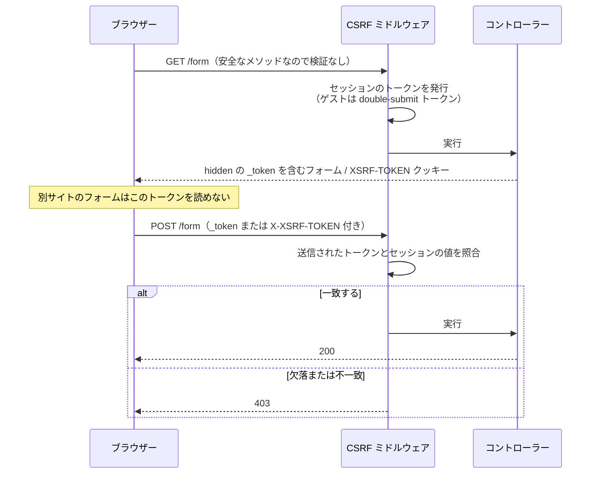

# CSRF 保護

CSRF（Cross-Site Request Forgery）は、悪意のあるサイトが認証済みユーザーになりすましてフォームを送信する攻撃です。Guren にはセッションと連携する CSRF ミドルウェアが組み込まれており、これを使って防ぎます。

トークンは 2 つのリクエストにまたがって使われます。フォームを表示する GET のときに発行し、フォームを送信する POST のときに照合します。



## セットアップ

CSRF 保護を有効にするには、アプリケーションにミドルウェアを追加します。

```ts
// src/app.ts
import { createApp, createSessionMiddleware, createCsrfMiddleware } from '@guren/core'

const app = createApp()

// 任意 — トークンは永続化済みのセッションに紐づきます
app.use('*', createSessionMiddleware())
app.use('*', createCsrfMiddleware())
```

追加したミドルウェアは、次の処理を自動で行います。
- セッションごとにトークンを生成する（ゲストにはステートレスな double-submit トークンを生成する）
- 状態を変更するリクエスト（POST、PUT、PATCH、DELETE）でトークンを検証する
- 安全なメソッド（GET、HEAD、OPTIONS、QUERY）は検証せずに通す。QUERY（RFC 10008）は仕様上安全なメソッドなので、QUERY のハンドラーは読み取り専用にしてください。QUERY でもトークンを要求したい場合は、`methods` オプションに `'QUERY'` を加えます

## フォームにトークンを含める

ネイティブの `<form method="post">` では、トークンを `_token` フィールドとして送ってください。トークンがないと Guren は 403 で拒否します。Inertia アプリでは `useForm()` と `<Link method="post">` が自動でトークンを送ります（[Inertia.js との統合](#inertiajs-との統合)を参照）。

hidden の input フィールドは `csrfField()` ヘルパーで生成できます。

```ts
// コントローラー内
import { Controller, getCsrfToken, csrfField } from '@guren/core'
import { pages } from '@/.guren/pages.gen'

export default class FormController extends Controller {
  create() {
    const token = getCsrfToken(this.ctx)
    // テンプレート/ビューに渡す
    return this.inertia(pages.forms.Create, { csrfToken: token })
  }
}
```

フロントエンド側のフォームは次のようになります（React の例）。

```tsx
function CreateForm({ csrfToken }: { csrfToken: string }) {
  return (
    <form method="POST" action="/posts">
      <input type="hidden" name="_token" value={csrfToken} />
      {/* フォームフィールド */}
      <button type="submit">作成</button>
    </form>
  )
}
```

hidden フィールドを直接生成しても構いません。

```ts
const hiddenField = csrfField(ctx)
// 出力: <input type="hidden" name="_token" value="..." />
```

## AJAX リクエスト

JavaScript から送る AJAX リクエストでは、トークンをヘッダーに入れます。

```ts
// ミドルウェアが JavaScript から読める XSRF-TOKEN Cookie を設定します
const csrfToken = decodeURIComponent(
  document.cookie.match(/(?:^|;\s*)XSRF-TOKEN=([^;]*)/)?.[1] ?? '',
)

fetch('/api/posts', {
  method: 'POST',
  headers: {
    'Content-Type': 'application/json',
    'X-XSRF-TOKEN': csrfToken,
  },
  body: JSON.stringify({ title: 'Hello' }),
})
```

Axios（したがって Inertia.js も）はこの処理を自動で行います。上のコードが必要になるのは、素の `fetch` を使う場合だけです。

ミドルウェアは、次の 3 か所を上から順に見てトークンを探します。

1. `X-CSRF-TOKEN` ヘッダー
2. `XSRF-TOKEN` Cookie から読み取られた `X-XSRF-TOKEN` ヘッダー
3. urlencoded・multipart・JSON いずれかのリクエストボディの `_token` フィールド

これらの名前は変更できません。Cookie を無効にした場合（後述の `cookie: false`）は、`getCsrfToken(ctx)` でトークンをページに渡し、`X-CSRF-TOKEN` ヘッダーで送り返してください。ただし、この方法が使えるのはセッション認証済みのフローだけです。ゲストのトークンは Cookie と照合して検証するので、Cookie がないと成り立ちません。

## 設定オプション

```ts
createCsrfMiddleware({
  // CSRF 検証から除外するルート
  exclude: ['/api/webhooks/*', '/api/public/*'],

  // カスタムエラーハンドラー
  onError: (ctx) => {
    return ctx.json({ error: '無効な CSRF トークン' }, 403)
  },
})
```

残りのオプションは、ふつうは変える必要がありません。

| オプション | デフォルト | 用途 |
|--------|---------|------|
| `methods` | `['POST', 'PUT', 'PATCH', 'DELETE']` | トークンを要求する HTTP メソッド |
| `cookie` | `true` | 安全なリクエストと、成功した更新系リクエストで `XSRF-TOKEN` Cookie を発行する |
| `cookieOptions` | `{ path: '/', sameSite: 'Lax' }` | Cookie の属性。`secure` は、`NODE_ENV` が `production` のときと、`process` がないランタイムで有効になる |

## ルートの除外

Webhook のエンドポイントなど、CSRF 検証を通さないルートは `exclude` に並べます。

```ts
createCsrfMiddleware({
  exclude: [
    '/api/webhooks/stripe',
    '/api/webhooks/github',
    '/api/public/*', // ワイルドカードパターン対応
  ],
})
```

## 手動トークン検証

独自の検証ロジックを書くときは `verifyCsrfToken()` を使います。

```ts
import { verifyCsrfToken, getCsrfToken } from '@guren/core'
import { Router } from '@guren/core'

export function registerWebRoutes(router: Router): void {
  router.post('/custom', async (ctx) => {
    const token = ctx.req.header('X-Custom-Token')

    if (!verifyCsrfToken(ctx, token)) {
      return ctx.json({ error: '無効なトークン' }, 403)
    }

    return ctx.json({ ok: true })
  })
}
```

## トークンの再生成

セッションに紐づくトークンはセッション ID に合わせて変わるので、次のタイミングで新しくなります。
- セッションが初めて永続化されたとき（作成したばかりのセッションには、まだトークンを紐づけられません）
- `session.regenerate()` を呼んだとき（ログイン後に呼ぶことを推奨します）

ゲストのトークンはセッション ID を持たないので、セッションができるまで同じものを使い続けます。

```ts
// ログイン成功後
const session = getSessionFromContext(ctx)
await session.regenerate()
// 新しい CSRF トークンが自動的に生成される
```

## セキュリティベストプラクティス

1. **常に HTTPS を使う**: HTTP ではトークンを傍受されるおそれがあります
2. **ログイン後にトークンを再生成する**: セッション固定攻撃を防げます
3. **トークンを URL に含めない**: POST のボディかヘッダーで送ります
4. **Cookie に secure 系のフラグを付ける**: セッション Cookie はセッションミドルウェアが扱い、`XSRF-TOKEN` Cookie は `cookieOptions` の設定に従います

## Inertia.js との統合

Inertia.js を使う場合、CSRF は Cookie を通じて自動で処理されます。Axios や fetch の設定で credentials を送るようにしておいてください。

```ts
// resources/js/app.tsx
axios.defaults.withCredentials = true
```

Inertia は `XSRF-TOKEN` Cookie を自動で読み取り、リクエストに付けて送ります。

### ネイティブフォームではなく Inertia 経由で送信する

ただし、自動で処理されるのは Inertia が Axios で送るリクエストに限られます。ネイティブの `<form method="post">` は通常のブラウザー遷移として送信されるので、`X-XSRF-TOKEN` ヘッダーが付きません。フォーム自体に `_token` の hidden フィールドがなければ、Guren は 403 で拒否します。

Inertia のページでは `useForm()` を使ってください。

```tsx
import { useForm } from '@inertiajs/react'

function LogoutButton() {
  const { post, processing } = useForm()

  return (
    <button type="button" onClick={() => post('/logout')} disabled={processing}>
      ログアウト
    </button>
  )
}
```

単純なアクションのリンクなら、`<Link href="/logout" method="post" as="button">` でも構いません。ネイティブフォームは、あえてページ全体を遷移させたいときだけ使ってください。
