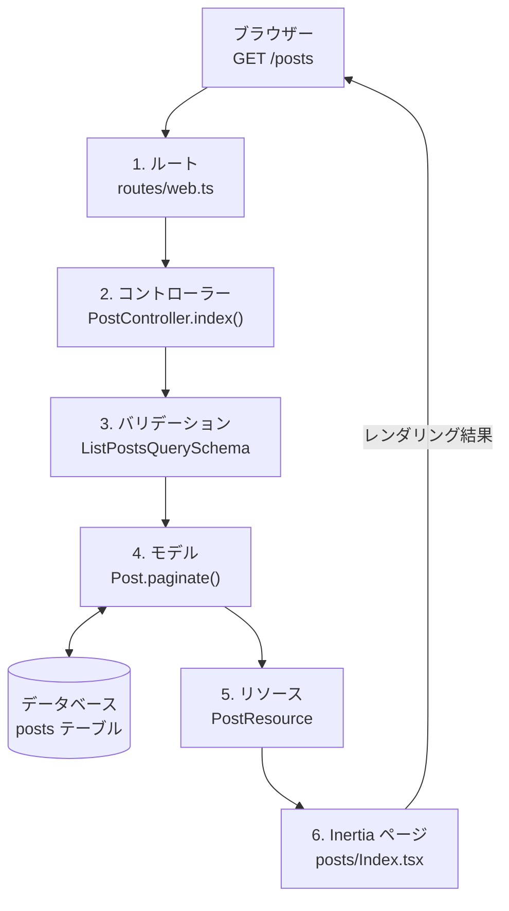
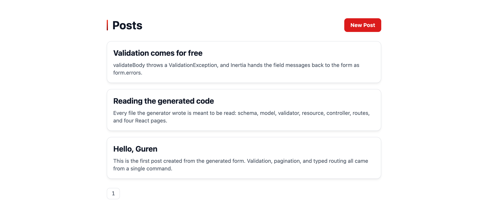

# ファーストステップ: 1 つのリクエストを辿る 10 分ツアー

このツアーでは、単一のリクエスト — `GET /posts` — が Guren アプリのすべてのレイヤーを通る様子を追いかけます: ルート、コントローラー、バリデーション、モデル、リソース、Inertia ページ、そしてテストです。頭の中に地図を作るために読んでください。各ストップには、より深く学べるガイドへのリンクがあります。

前提として、動いているアプリ（[はじめる](./getting-started.md) 参照）に、次のコマンドで posts リソースが生成されているものとします。

```bash
bunx guren add resource posts --fields "title:string,body:text,published:boolean"
```

自分の手で一歩ずつ作りたい方は、代わりに [ミニブログを作るチュートリアル](../tutorials/overview.md) をどうぞ — 同じ内容をハンズオンでカバーしています。

まずは全体像です。`GET /posts` は次の順にレイヤーを通り、ブラウザーに HTML が返ります。



以降は、この図の各ストップを 1 つずつ見ていきます。

## 1. ルート

すべてのリクエストは `routes/web.ts` から始まります。ここで registrar が URL をコントローラーのアクションにマッピングします。

```ts
import { Router } from '@guren/core'
import PostController from '@/app/Http/Controllers/PostController'

export function registerWebRoutes(router: Router): void {
  router.get('/posts', [PostController, 'index'])
  router.post('/posts', [PostController, 'store'])
}
```

`GET /posts` は 1 行目にマッチするため、Guren は `PostController.index` にディスパッチします。グループ、ミドルウェア、名前付きルートもすべてここに書きます — 詳しくは [ルーティングガイド](./routing.md) を参照してください。

## 2. コントローラー

`app/Http/Controllers/PostController.ts` がリクエストを処理します。

```ts
import { Controller } from '@guren/core'
import { Post } from '@/app/Models/Post'
import { PostResource } from '@/app/Http/Resources/PostResource'
import { ListPostsQuerySchema } from '@/app/Http/Validators/PostValidator'
import { pages } from '@/.guren/pages.gen'

export default class PostController extends Controller {
  async index() {
    const { page } = this.validateQuery(ListPostsQuerySchema)
    const result = await Post.paginate({ page, perPage: 20 })

    return this.inertia(pages.posts.Index, {
      data: result.data.map((post) => new PostResource(post).toJSON()),
    })
  }
}
```

ここでは 3 つのことが起きています: 入力のバリデーション、データの取得、ページのレンダリングです。コントローラーの全機能は [コントローラーガイド](./controllers.md) を参照してください。

## 3. バリデーション

`this.validateQuery(schema)` はクエリ文字列を Zod スキーマでパースし、不正な入力には自動的に 422 を投げます。エラーハンドリングを手書きする必要はありません。

```ts
import { z } from 'zod'

export const ListPostsQuerySchema = z.object({
  page: z.coerce.number().int().positive().default(1),
})
```

`validateBody` と `validateParams` も、リクエストボディとルートパラメータに対して同じように動きます。詳しくは [バリデーションガイド](./validation.md) を参照してください。

## 4. モデル

`app/Models/Post.ts` は、クラスを `db/schema.ts` の Drizzle テーブルに結びつけます。

```ts
import { defineModel } from '@guren/orm'
import { posts } from '@/db/schema'

export class Post extends defineModel(posts) {}
```

クエリは Laravel のように読めます: `Post.find(1)`、`Post.findOrFail(1)`（404 を投げます）、`Post.where('published', true).get()`。カラムの型はスキーマからすべての結果へと流れます。詳しくは [データベースガイド](./database.md) を参照してください。

## 5. リソース

`app/Http/Resources/PostResource.ts` は、サーバーから外に出るデータを決めます — 内部カラムがうっかり漏れることはありません。

```ts
import { Resource } from '@guren/core'

export class PostResource extends Resource<Post> {
  toArray() {
    const { id, title, body, published } = this.resource
    return { id, title, body, published }
  }
}
```

詳しくは [API リソースガイド](./api-resources.md) を参照してください。

## 6. Inertia ページ

`this.inertia(pages.posts.Index, props)` は `resources/js/pages/posts/Index.tsx` をレンダリングします。これはコントローラーの props を直接受け取る、ごく普通の React コンポーネントです — 間に API レイヤーはありません。

```tsx
import type { PageProps } from '@guren/inertia-client/contracts'
import { pages } from '@/.guren/pages.gen'

type Props = PageProps<typeof pages.posts.Index>

export default function PostsIndex({ data }: Props) {
  return (
    <ul>
      {data.map((post) => (
        <li key={post.id}>{post.title}</li>
      ))}
    </ul>
  )
}
```

`bunx guren add resource` が生成する一覧ページは、もう少し作り込まれた見た目で届きます。



codegen は各ページの `Props` を `.guren/pages.gen.ts` に抽出するため、コントローラーが誤った形の props を渡すとコンパイルエラーになります。カラムをリネームすれば、スキーマからブラウザまで、すべてのレイヤーを TypeScript が指摘してくれます。詳しくは [フロントエンドガイド](./frontend.md) を参照してください。

## 7. テスト

`TestApp` を使えば、起動済みアプリに実際のリクエストを通すことで、この経路全体が動くことを証明できます。

```ts
import { test } from 'bun:test'
import { TestApp } from '@guren/testing'

test('lists posts', async () => {
  const app = await TestApp.create()
  await app.get('/posts').assertOk()
})
```

fluent なアサーション、`actingAs`、データベースヘルパーについては [テストガイド](./testing.md) を参照してください。

## 8. プロジェクト知識

ここまでのリクエスト経路はアプリが何をするかを説明します。プロジェクト知識は、なぜその設計なのかを記録し、全体像を最新に保ちます。`bunx guren spec:generate` はコードから ER、ドメイン、画面、モジュールのビューを導出します。`bunx guren make:adr` で作る ADR は、自分が統べるエンティティとコードパスを宣言し、`bunx guren check --docs` がその関係を検証します。

`bun run dev` の実行中に [http://localhost:3333/_guren/docs](http://localhost:3333/_guren/docs) を開くと、それらの文書、エンティティ、コードパスを一つのインタラクティブな Docs Graph として閲覧できます。

Docs Graph は上のリクエスト経路を置き換えるものではなく、その周囲に設計理由と生成ビューを結び付けます。ワークフロー全体は [スペックアンカード開発](./spec-anchored.md) を参照してください。

## メンタルモデル

Guren アプリのすべての機能は、この同じ経路を通ります。

- **routes** が URL をコントローラーにマッピングし
- **validators** が入力をパースし
- **models** がデータアクセスを記述し
- **resources** が出力の形を決め
- **pages** が props を定義し
- **controllers** がそれらすべてを組み立てます

この実行時の経路の周囲では、**プロジェクト知識** が生成スペックと人間の意思決定を、それらが説明するコードへ結び付け、関係が有効なままかを検証します。

機能を追加するときは、経路全体を一度に雛形生成し、マニフェストを更新します。

```bash
bunx guren add resource comments --fields "body:text,postId:integer"
bun run codegen
```

## 次のステップ

本格的に作り始める準備はできましたか？ **[ミニブログを作るチュートリアル](../tutorials/overview.md)** では、投稿、認証、コメントをハンズオンで作っていきます。見慣れない用語があったら [用語集](./glossary.md) で確認してください。
