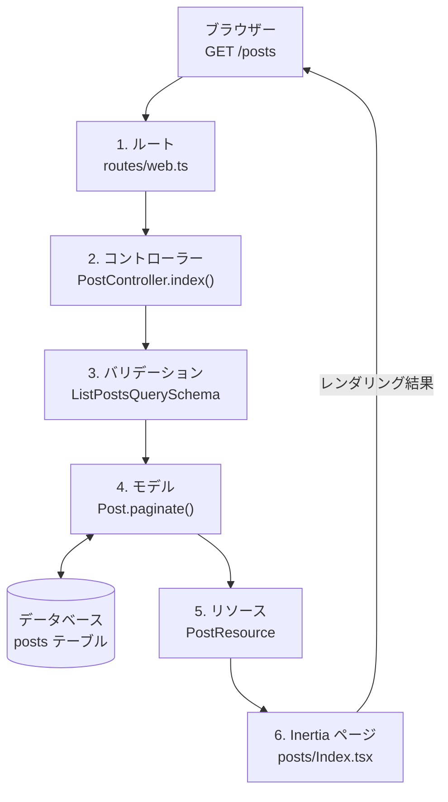

# ファーストステップ: 1 つのリクエストを辿る 10 分ツアー

このツアーでは、`GET /posts` という 1 つのリクエストを追いかけながら、Guren アプリのレイヤーを順に見ていきます。ルート、コントローラー、バリデーション、モデル、リソース、Inertia ページを通り、最後にテストで確かめます。全体像をつかむためのページなので、細部は各所に置いたガイドへのリンクからたどってください。

動いているアプリ（[はじめる](./getting-started.md) 参照）に、次のコマンドで posts リソースを生成してあるものとします。

```bash
bunx guren add resource posts --fields "title:string,body:text,published:boolean"
```

手を動かしながら一歩ずつ作りたい場合は、代わりに [Guren チュートリアル](../tutorials/00-overview.md) に進んでください。同じ内容をハンズオンで扱い、さらにその先まで続きます。

まず全体の流れです。`GET /posts` は次の順にレイヤーを通り、最後にブラウザーへ HTML が返ります。



ここから、図の番号順に 1 つずつ見ていきます。

## 1. ルート

リクエストはすべて `routes/web.ts` から始まります。このファイルの registrar が、URL とコントローラーのアクションを対応づけます。

```ts
import { Router } from '@guren/core'
import PostController from '@/app/Http/Controllers/PostController'

export function registerWebRoutes(router: Router): void {
  router.get('/posts', [PostController, 'index'])
  router.post('/posts', [PostController, 'store'])
}
```

`GET /posts` は 1 行目にマッチするので、Guren は `PostController.index` を呼び出します。グループ、ミドルウェア、名前付きルートもこのファイルに書きます。詳しくは [ルーティングガイド](./routing.md) を参照してください。

## 2. コントローラー

リクエストを処理するのは `app/Http/Controllers/PostController.ts` です。

```ts
import { Controller } from '@guren/core'
import { Post } from '@/app/Models/Post'
import { PostResource } from '@/app/Http/Resources/PostResource'
import { ListPostsQuerySchema } from '@/app/Http/Validators/PostValidator'
import { pages } from '@/.guren/pages.gen'

export default class PostController extends Controller {
  async index() {
    const { page } = this.validateQuery(ListPostsQuerySchema)
    const result = await Post.paginate({ page, perPage: 20 })

    return this.inertia(pages.posts.Index, {
      data: result.data.map((post) => new PostResource(post).toJSON()),
    })
  }
}
```

このアクションは、入力の検証、データの取得、ページのレンダリングの 3 つを順に行っています。コントローラーでできることの全体は [コントローラーガイド](./controllers.md) にまとめてあります。

## 3. バリデーション

`this.validateQuery(schema)` はクエリ文字列を Zod スキーマでパースし、入力が不正なら自動で 422 を返す例外を投げます。エラー処理を自分で書く必要はありません。

```ts
import { z } from 'zod'

export const ListPostsQuerySchema = z.object({
  page: z.coerce.number().int().positive().default(1),
})
```

リクエストボディには `validateBody`、ルートパラメータには `validateParams` があり、どちらも同じように使えます。詳しくは [バリデーションガイド](./validation.md) を参照してください。

## 4. モデル

`app/Models/Post.ts` は、クラスと `db/schema.ts` の Drizzle テーブルを結びつけます。

```ts
import { defineModel } from '@guren/core'
import { posts } from '@/db/schema'

export class Post extends defineModel(posts) {}
```

クエリは Laravel と同じ感覚で書けます。`Post.find(1)`、`Post.findOrFail(1)`（見つからなければ 404 を投げます）、`Post.where('published', true).get()` といった具合です。カラムの型はスキーマから引き継がれ、どのクエリ結果にも付きます。詳しくは [データベースガイド](./database.md) を参照してください。

## 5. リソース

`app/Http/Resources/PostResource.ts` で、サーバーの外に出すデータを決めます。ここに書いたカラムしか出ていかないので、内部用のカラムをうっかり返してしまうことはありません。

```ts
import { Resource } from '@guren/core'

export class PostResource extends Resource<Post> {
  toArray() {
    const { id, title, body, published } = this.resource
    return { id, title, body, published }
  }
}
```

詳しくは [API リソースガイド](./api-resources.md) を参照してください。

## 6. Inertia ページ

`this.inertia(pages.posts.Index, props)` を呼ぶと、`resources/js/pages/posts/Index.tsx` がレンダリングされます。中身はコントローラーの props をそのまま受け取るふつうの React コンポーネントで、間に API レイヤーは挟まりません。

```tsx
import type { PageProps } from '@guren/inertia-client/contracts'
import { pages } from '@/.guren/pages.gen'

type Props = PageProps<typeof pages.posts.Index>

export default function PostsIndex({ data }: Props) {
  return (
    <ul>
      {data.map((post) => (
        <li key={post.id}>{post.title}</li>
      ))}
    </ul>
  )
}
```

`bunx guren add resource` が生成する一覧ページは、これより少し作り込んだ見た目になっています。


codegen が各ページの `Props` を `.guren/pages.gen.ts` に書き出すので、コントローラーが形の違う props を渡すとコンパイルエラーになります。カラム名を変えたときも、スキーマからブラウザまでの各レイヤーで直すべき箇所を TypeScript が教えてくれます。詳しくは [フロントエンドガイド](./frontend.md) を参照してください。

## 7. テスト

`TestApp` を使うと、起動したアプリに実際のリクエストを送り、ここまでの経路が端から端まで動くことを確かめられます。

```ts
import { test } from 'bun:test'
import { TestApp } from '@guren/testing'

test('lists posts', async () => {
  const app = await TestApp.create()
  await app.get('/posts').assertOk()
})
```

メソッドチェーンで書けるアサーション、`actingAs`、データベース用のヘルパーは [テストガイド](./testing.md) で紹介しています。

## 8. プロジェクト知識

ここまでのリクエスト経路が表すのは、アプリが何をするかです。プロジェクト知識には、なぜその設計にしたのかを記録し、全体像を最新の状態に保ちます。`bunx guren spec:generate` を実行すると、コードから ER、ドメイン、画面、モジュールのビューが生成されます。`bunx guren make:adr` で作る ADR には、その決定が関わるエンティティとコードパスを書いておき、`bunx guren check --docs` でその対応が正しいかを検証します。

`bun run dev` を実行した状態で [http://localhost:3333/_guren/docs](http://localhost:3333/_guren/docs) を開くと、これらの文書とエンティティ、コードパスを 1 つのインタラクティブな Docs Graph として見られます。

Docs Graph は上のリクエスト経路の代わりになるものではありません。経路のまわりに、設計の理由と生成したビューを結びつけるものです。ワークフロー全体は [スペックアンカード開発](./spec-anchored.md) を参照してください。

## メンタルモデル

Guren アプリの機能は、どれもこの同じ経路を通ります。

- **routes** が URL をコントローラーに対応づける
- **validators** が入力をパースする
- **models** がデータアクセスを表す
- **resources** が出力の形を決める
- **pages** が props を定義する
- **controllers** がこれらをまとめて動かす

この実行時の経路のまわりでは、**プロジェクト知識** が生成したスペックと人が下した判断を、それぞれが説明するコードに結びつけ、その対応が崩れていないかを検証します。

機能を追加するときは、経路全体の雛形を一度に生成してから、マニフェストを更新します。

```bash
bunx guren add resource comments --fields "body:text,postId:integer"
bun run codegen
```

## 次のステップ

本格的に作り始めるなら、**[Guren チュートリアル](../tutorials/00-overview.md)** に進んでください。投稿、ユーザー、認可、アップロード、メール、エージェント用のツールを、手を動かしながら作っていきます。わからない用語が出てきたら [用語集](./glossary.md) で確認してください。
