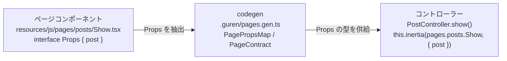

# フロントエンドガイド

Guren では、Inertia.js と React を組み合わせてシングルページアプリのような操作感を作ります。コントローラーが Inertia レスポンスを返し、フロントエンドが `resources/js/pages/` の下にある React コンポーネントを描画する、という分担です。サーバーが Inertia プロトコルのどこまでを実装しているかは [Inertia プロトコル対応](./inertia.md)を参照してください。

## プロジェクト構成
- `resources/js/app.tsx`: Inertia アプリのブートストラップと、グローバルなプロバイダーの登録
- `resources/js/ssr.tsx`: SSR を有効にしたときにバックエンドが使うサーバーレンダラーをエクスポートする
- `resources/js/pages/`: コントローラーの応答に対応する React コンポーネント
- `resources/js/components/`: 共有 UI コンポーネントの置き場所（推奨）
- `resources/css/app.css`: Tailwind などの CSS のエントリーポイント

## ページコンポーネント
ページのファイル名は、`.guren/pages.gen.ts` に自動生成される page definitions と対応しています。Props は各ページコンポーネントに `interface Props` として定義し、codegen がそれを抽出します。

```ts
// Controller
return this.inertia(pages.posts.Index, {
  data,
  pagination,
})
```

```tsx
// resources/js/pages/posts/Index.tsx
import type { PageProps } from '@guren/inertia-client/contracts'
import { Head, Link } from '@inertiajs/react'
import { pages } from '@/.guren/pages.gen'

type Props = PageProps<typeof pages.posts.Index>

export default function Index({ data, pagination }: Props) {
  return (
    <>
      <Head title="Posts" />
      <div className="space-y-4">
        {data.map((post) => (
          <article key={post.id} className="rounded border border-slate-200 p-4">
            <h2 className="text-lg font-semibold">{post.title}</h2>
            <p className="text-slate-600">{post.excerpt}</p>
            <Link className="text-blue-600 underline" href={`/posts/${post.id}`}>
              Read more
            </Link>
          </article>
        ))}
      </div>
      <p className="mt-4 text-sm text-slate-500">{pagination.meta.total} posts</p>
    </>
  )
}
```

props に TypeScript の型を付けておけば、コントローラーとの食い違いをコンパイル時に見つけられます。

## レイアウトと共有 UI
ナビゲーションなどの共通 UI をページ間で使い回すには、ページをレイアウトコンポーネントで包みます。

```tsx
// resources/js/components/Layout.tsx
export function Layout({ children }: React.PropsWithChildren) {
  return (
    <div className="min-h-screen bg-slate-50">
      <header className="border-b bg-white">
        <div className="mx-auto flex max-w-4xl items-center justify-between px-6 py-4">
          <a href="/">Guren</a>
        </div>
      </header>
      <main className="mx-auto max-w-4xl px-6 py-10">{children}</main>
    </div>
  )
}
```

```tsx
// resources/js/pages/posts/Index.tsx
import { Layout } from '@/resources/js/components/Layout'

export default function Index({ posts }: Props) {
  return (
    <Layout>
      {/* page content */}
    </Layout>
  )
}
```

## フォームとナビゲーション
クライアント側の画面遷移とフォーム送信には、Inertia のヘルパーを使います。

- `<Link href="/posts/new">Create Post</Link>` で遷移すると、ページ全体は再読み込みされません。
- `const form = useForm({ title: '', body: '' })` でフォームの状態を管理します。
- `form.post('/posts')` で送信します。

バリデーションエラーはコントローラーから返し、クライアント側では `form.errors` で参照します。

## Partial Reloads
いま表示しているページを読み込み直すときに、props をすべて取り直す必要はありません。クライアントが visit オプションの `only` か `except` で必要な props を指定すると、サーバーはその props だけを返します。

```tsx
import { router } from '@inertiajs/react'

router.reload({ only: ['users'] })
router.visit('/users?active=true', { except: ['companies'] })
```

リクエストには、現在のコンポーネント名が `X-Inertia-Partial-Component` ヘッダーで付きます。そのため、props は応答が同じコンポーネントを描画する場合にだけ絞り込まれます。ログインページへのリダイレクトのように別のページに行き着いた visit では、props がすべて返ります。共有 props も同じように絞り込まれますが、`errors` はどの応答にも含まれます。

関数として渡した prop は、実際に送るときになって初めて評価されます。partial reload で対象から外れた prop は、そのクエリも実行されません。

```typescript
import { Controller } from '@guren/core'
import { pages } from '@/.guren/pages.gen'

export class UserController extends Controller {
  async index() {
    return this.inertia(pages.users.Index, {
      users: () => User.all(),
      companies: () => Company.all(),
    })
  }
}
```

ページコンポーネント側は `users: User[]` と宣言したままでかまいません。コントローラーの呼び出しは関数を解決した後の型で検査され、`ControllerInertiaProps` からも `User[]` として読み取れます。

`always()` で包んだ prop は、`only` や `except` の指定に関係なく、すべての応答に含まれます。フレームワークも、flash に入ったバリデーションエラーをこの形で共有しています。flash から読む共有 props は、応答に載るかどうかにかかわらずそのリクエストで消費されてしまうので、同じように包んでおく必要があります。

```typescript
import { always, getSessionFromContext, shareInertiaProps } from '@guren/core'

shareInertiaProps((ctx) => ({ flash: always(getSessionFromContext(ctx)?.getFlash('status')) }), container)
```

## Deferred Props
`defer()` で包んだ prop は初回の応答には含まれず、最初の描画が終わった直後にクライアントが取りに行きます。重いクエリが終わるのを待たずにページを表示できます。

```typescript
import { Controller, defer } from '@guren/core'
import { pages } from '@/.guren/pages.gen'

export class UserController extends Controller {
  async index() {
    return this.inertia(pages.users.Index, {
      users: () => User.all(),
      permissions: defer(() => Permission.all()),
      teams: defer(() => Team.all(), 'attributes'),
      projects: defer(() => Project.all(), 'attributes'),
    })
  }
}
```

初回の page object には、後から読み込む prop のキーが `deferredProps` に入ります。キーは第 2 引数のグループ名（省略時は `default`）ごとにまとめられ、上の例では `{ "default": ["permissions"], "attributes": ["teams", "projects"] }` になります。クライアントはグループごとに partial reload を 1 回ずつ送るので、`teams` と `projects` は一緒に届き、`permissions` はそれと並行して読み込まれます。コールバックが実行されるのは、この後続のリクエストのときだけです。

クライアント側では、後続のリクエストが返るまで prop は `undefined` です。`Props` では省略可能として宣言し、`<Deferred>` の中で描画してください。値が届くまでは fallback が表示されます。コントローラーはどの prop にも deferred な値を渡せるので、必須として宣言していても型検査は通ってしまいます。`?` を付けずに宣言した prop に `defer()` を渡していると、`guren check` が警告を出します。

```tsx
import type { PageProps } from '@guren/inertia-client/contracts'
import { Deferred } from '@inertiajs/react'
import { pages } from '@/.guren/pages.gen'

type Props = PageProps<typeof pages.users.Index>

export default function Index({ users, permissions }: Props) {
  return (
    <>
      <UserTable users={users} />
      <Deferred data="permissions" fallback={<p>Loading permissions...</p>}>
        <PermissionList permissions={permissions ?? []} />
      </Deferred>
    </>
  )
}
```

## アセットとスタイル
生成されたアプリには Tailwind CSS が設定済みです。`resources/css/app.css` を編集するか、好みの CSS フレームワークを追加してください。画像やフォントなどのアセットを足すときは `public/` の下に置きます。

## favicon とドキュメント head
本番の HTML はサーバー側で組み立てるもので、`public/index.html` は読み込まれません。そのため、このファイルに `<link>` を書いてもブラウザには届きません。サイト全体の head に入れるマークアップは `inertia` オプションで登録します。生成されたアプリでは、`src/app.ts` からプレースホルダーの `public/favicon.svg` にリンクしてあります。

```typescript
const app = createApp({
  inertia: {
    document: {
      head: '<link rel="icon" type="image/svg+xml" href="/favicon.svg" />',
    },
  },
  // ...
})
```

マークアップは手を加えずにそのまま出力されるので、開発者が書いた文字列だけを渡してください。`public/` 直下のファイルは Bun ランタイムが配信します。Node ベースのデプロイでは CDN から配信してください。

ブラウザがドキュメントとして描画する形式のファイル (`.html`、`.htm`、`.svg`、`.xhtml`、`.xml`) には、`Content-Disposition: attachment` と `X-Content-Type-Options: nosniff` が付きます。URL を直接開いてもファイルはダウンロードされ、中のスクリプトが自サイトのオリジンで動くことはありません。画像・スクリプト・スタイルシート・フォントは影響を受けず、``、CSS の `url()`、`<link rel="icon">` もこれまでどおり読み込まれます。Content-Disposition は、遷移するかダウンロードするかを決めるだけだからです。ただし `<iframe>` や `<object>` への埋め込みは遷移として扱われるため、この形では描画されなくなります。ユーザーがアップロードしたファイルを一切置かない public ディレクトリなら、`rootPublicAssets: { inlineDocuments: true }` と `inlineDocuments: true` で、ルートの系統ごとにこの動作を止められます。そうでない場合は、そのページをコントローラーから返してください。

アプリより先にプラットフォームが `public/` を配信するデプロイ先でも、同じ方針が適用されます。Cloudflare・Vercel・Lambda の各プラグインがビルド時にこの方針をプラットフォームに宣言するので、ローカルでダウンロードになるファイルは本番でもダウンロードになります。ただし、この宣言はフレームワークが判定する content type ではなく拡張子をもとにしています。また、プラグインが読むのはビルド済みのディレクトリでルート設定ではないため、`inlineDocuments` はプラットフォームには伝わりません。意図して無効にしているアプリは、プラットフォーム側で取り消してください。具体的には、生成された `.cloudflare/assets/_headers` からルールを消す、`.vercel/output/config.json` から `handle: "hit"` のルートを消す、CDK スタックから CloudFront Function の関連付けを外す、のいずれかをビルドの後に実行します。これらのファイルはビルドのたびに作り直されるので、毎回実行する必要があります。

## サーバーサイドレンダリング
どのアプリにも既定で `resources/js/ssr.tsx` が入っていて、`@guren/inertia-client` の `renderInertiaServer()` を呼び出します。`autoConfigureInertiaAssets(app, { importMeta })` を使ってブートすると、Guren が次の処理を自動で行います。

- 開発時は、`bun run dev` と一緒に Vite dev サーバーを起動して管理します。
- `VITE_DEV_SERVER_URL` は、すでに起動している外部の Vite dev サーバーを明示的に使いたい場合にだけ設定します。
- 本番では、ビルド済みのクライアントマニフェスト (`public/assets/.vite/manifest.json`) を見つけて `GUREN_INERTIA_ENTRY`/`GUREN_INERTIA_STYLES` を設定します。
- SSR マニフェスト (`public/assets/.vite/ssr-manifest.json`) を見つけると、`GUREN_INERTIA_SSR_ENTRY` / `GUREN_INERTIA_SSR_MANIFEST` を設定し、サーバーレンダリングを有効にします。

必要なアセットは、`codegen` を含む標準のビルドで生成します。

```bash
bun run build
```

コンポーネントの解決方法を変えたい場合は、`resources/js/ssr.tsx` を編集して `renderInertiaServer()` に別の `resolve` を渡します。`autoConfigureInertiaAssets` を使わない場合は、`configureInertiaAssets` を呼ぶ前に、必要な環境変数を自分で設定してください。

## 型安全

コントローラーとページコンポーネントの間の型安全は、自動で走る codegen の仕組みによって保たれています。

### 型の流れ



1. **ページコンポーネントで Props を定義する**。各ページが受け取るデータを `interface Props` で宣言します。

```tsx
// resources/js/pages/posts/Show.tsx
import type { PostResourceData } from '@/app/Http/Resources/PostResource'

interface Props {
  post: PostResourceData
}

export default function Show({ post }: Props) {
  return <h1>{post.title}</h1>
}
```

2. **codegen が Props を抽出する**。`bun run codegen`（`bun run dev` の実行中にも自動で走ります）がすべてのページコンポーネントを読み、`interface Props` を取り出して `.guren/pages.gen.ts` に書き出します。

```ts
// .guren/pages.gen.ts（自動生成）
export interface PagePropsMap {
  'posts/Show': { post: PostResourceData }
}

export const pages = {
  posts: {
    Show: defineGeneratedPage<'posts/Show', PagePropsMap['posts/Show']>(...)
  }
}
```

3. **コントローラーが型チェックされる**。コントローラーで `this.inertia(pages.posts.Show, { ... })` を呼ぶと、TypeScript が第二引数を `PageContract` の Props 型と照らし合わせます。プロパティが足りなかったり型が合わなかったりすると、コンパイルエラーになります。

```ts
// app/Http/Controllers/PostController.ts
import { pages } from '@/.guren/pages.gen'

export default class PostController extends Controller {
  async show() {
    const post = await Post.findOrFail(id)
    // ✅ 型チェック済み: { post } は Show.tsx の Props と一致する必要がある
    return this.inertia(pages.posts.Show, { post: new PostResource(post).toJSON() })
  }
}
```

### Props でのローカル型の使用

Props からは、同じファイルに定義した型も参照できます。こうした型も codegen が自動で集めます。

```tsx
type Author = { id: number; name: string }

interface Props {
  post: { title: string; author: Author }
}
```

`Author` と `Props` の両方が `pages.gen.ts` に抽出されます。

### Props でのインポート型の使用

Resource ファイルなど、別のモジュールからインポートした型も追跡されます。

```tsx
import type { PostResourceData } from '@/app/Http/Resources/PostResource'

interface Props {
  post: PostResourceData
}
```

codegen がインポートパスを書き換えるので、`pages.gen.ts` からも同じ型を参照できます。

### Tips

- バックエンドとフロントエンドで型を共有するには、モデルから Drizzle の推論型を再エクスポートします（例: `export type PostRecord = typeof posts.$inferSelect`）。
- 長い相対パスの代わりに、プロジェクトルートを指す `@/` エイリアスを使います。サーバー側では tsconfig の `paths` が、フロントエンドのビルドでは Guren の Vite プラグインがこれを解決します。
- Props を追加・変更したら、`bun run codegen` を実行して `pages.gen.ts` を更新してください。

## ホットリロード
`bun run dev` を実行すると Bun が Vite dev サーバーを自動で起動するので、TSX を変更するとすぐにリロードされます。

バックエンドもリロードされます。`dev:server` は `bun --hot bin/serve.ts` を実行するので、コントローラー・ルート・モデルへの変更は、再起動しなくても次のリクエストから反映されます。ルートを追加したときは codegen が走ってもう一度リロードが入り、そこで落ち着きます。ただし、プロセスの中に持っている状態はリロードで引き継がれません。メモリドライバーのセッションとキャッシュは空の状態から作り直され、モジュールレベルの変数も初期化されます。Redis やデータベースなどプロセスの外にあるストアは影響を受けないので、セッションをプロセスの外に置いていればサインインしたままです。

この既定の設定が入る前に作ったプロジェクトでは、自分でフラグを追加してください。

```json
"dev:server": "bun --hot bin/serve.ts"
```

その場合は `@guren/cli` も最新版にしてください。古いバージョンは、codegen のたびに `.guren/` の下の生成ファイルを、内容が変わらなくても書き直します。コントローラーはそのファイルを import しているので、書き直しが次のリロードを引き起こし、リロードが止まらなくなります。

開発の流れを細かく調整したい場合は、`@guren/core/runtime` の `startViteDevServer()` を使って Vite を自分で制御できます。

ここまでのパターンでページとコンポーネントを組み立てれば、React と Inertia だけで、ボイラープレートの少ない SPA を作れます。
