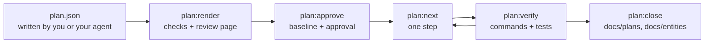

# 実装計画

実装計画は、変更の設計をコードより先に JSON で書いておくドキュメントです。Guren はこれをアプリケーションと突き合わせて検査し、レビュー用のページとして描画します。承認時には計画に基準点を刻み、作業をステップに分解し、どこまで実装されたかをコードから読み取ります。進捗を報告するのは実装したエージェントではありません。`plan:status` と `plan:verify` が、スキーマ、ルートグラフ、コントローラー、ページ、テスト結果から判定します。

計画を書く価値があるのは、テーブルとルートとページにまたがる変更のように、差分を直すより設計を直すほうが安く済む場合です。差分を一文で説明できる変更なら、計画は要りません。



このページの例はすべて、`examples/blog` の投稿にコメント機能を足す一つの計画から取っています。実行したのはこのアプリケーションのコピーです。

## 置き場所

計画は `docs/plans/` の下に、slug を名前にしたディレクトリとして置きます。

| ファイル | 中身 | コミット |
|---|---|---|
| `docs/plans/comments/plan.json` | 計画そのもの | する |
| `docs/plans/comments/approvals.json` | `plan:approve` が記録したハッシュと、`alter` ごとの読み取り | する |
| `docs/plans/comments/decisions.json` | `plan:waive` が書く waiver | する |
| `docs/plans/comments/plan.html` | `plan:render` が書くページ | しない |
| `.guren/plans/comments.state.json` | 検証結果と、いま取り組んでいるステップの印 | しない (自身を ignore します) |

ファイル名が `plan.json` なら、slug はディレクトリ名です。別の名前でも構いません。`comments.plan.json` の slug は `comments` で、記録はその隣に `comments.approvals.json` と `comments.decisions.json` として置かれます。

描画したページは生成物なので、リポジトリには入れません。`plan:next` は `plan:render` が既定の場所に書いたページとその一時ファイルを無視するため、ループを回すだけなら ignore は要りませんが、コミットするものでもありません。`-o` で別の場所に書いたページはただの未追跡ファイルなので、そのツリーは `plan:next` に拒否されます。一つ目のパターンは `docs/plans/<slug>/` の配置に、二つ目はアプリケーションのルートなどに置いた `<slug>.plan.json` に対応します。

```text
docs/plans/**/*.html
*.plan.html
```

計画そのものと承認・決定ログは別です。waiver はどのステップを渡すかを左右するので、`plan:next` はこの三つのいずれかが未コミットなら拒否します。

## 計画を書く

JSON を書くのは自分か、機能について話し合ったセッションのエージェントです。モデルに計画を単独で書かせるコマンドはまだありません (このページの最後を参照)。`plan:render` はファイルを計画のスキーマで検証し、誤りのあるフィールドを示します。

```text
 ERROR  The plan does not match the plan schema:
  models.0.columns.0.change.from: Invalid input: expected string, received undefined
```

### ドキュメントの構成

| フィールド | 中身 |
|---|---|
| `planVersion` | `1` |
| `title`、`summary`、`locale` | 計画の題と要約、本文の言語 (`en`、`ja`) |
| `scope` | `goals` と `nonGoals` |
| `assumptions`、`questions` | 指示なしに決めたことと、決めきれなかったこと |
| `models`、`validators`、`controllers`、`routes`、`views`、`resources`、`policies`、`sideEffects` | 設計本体。要素の種類ごとに一セクション |
| `flows` | 計画が足すものの中をリクエストがどう流れるか。ノードとエッジで書きます |
| `commands` | 変更の前に要る `guren add attachments` などのコマンド |
| `tasks` | スライスごとに達成すべきことと、その受け入れ振る舞い |
| `hints` | `task/entity/model.tag before task/entity/model.comment` のような順序の助言 |
| `baseline` | `plan:approve` が書きます。手では書きません |

どのセクションも省略できます。省略したセクションと空のセクションは同じ計画として扱われます。

### id と change

要素はすべて `id` と `change` を持ちます。id は計画全体で一つの名前空間を共有します。先頭は英字で、英数字と `_`、`.`、`:`、`-` を使えます。慣例ではセクション名と名前を並べます (`model.comment`、`route.comments.store`)。要素どうしはこの id で互いを参照し、あとで改訂が要素を指すときも id だけを使うので、一度決めた id は変えないでください。

| `change.kind` | 意味 |
|---|---|
| `existing` | 参照するだけで変えない |
| `add` | 新しく足す |
| `alter` | その場で変える |
| `rename` | 名前を変える。`from` は旧名 (モデルならクラス名、カラムならプロパティ名、ルートならルート名) |
| `drop` | 取り除く。`reason` に理由を書く |

既存のテーブルやカラムに対する `alter`、`rename`、`drop` には、行をどうするかを `dataMigration` で書きます。`{ "kind": "none", "reason": "…" }` か、`description` 付きの `backfill` または `manual` です。書いていない計画は承認されません。

```text
  column.post.summary: Column "summary" of "Post" is a "rename" on an existing table and states no dataMigration.
```

モデルには、計画が触れるか参照するカラムだけを並べます。例の計画で新しく足す `Comment` モデルを、五つのカラムのうち二つに絞って示します。

```json
{
  "id": "model.comment",
  "change": { "kind": "add" },
  "name": "Comment",
  "table": "comments",
  "columns": [
    {
      "id": "column.comment.body",
      "name": "body",
      "change": { "kind": "add" },
      "type": "text",
      "nullable": false,
      "unique": false,
      "index": false
    },
    {
      "id": "column.comment.postId",
      "name": "postId",
      "columnName": "post_id",
      "change": { "kind": "add" },
      "type": "integer",
      "nullable": false,
      "unique": false,
      "index": true,
      "references": { "model": "model.post", "column": "id", "onDelete": "cascade" }
    }
  ],
  "relationships": [
    { "name": "post", "type": "belongsTo", "target": "model.post" },
    { "name": "author", "type": "belongsTo", "target": "model.user" }
  ],
  "fillable": ["body"]
}
```

カラム型は Drizzle のビルダー名ではなく、抽象的な語彙で書きます。`string`、`text`、`integer`、`number`、`decimal`、`boolean`、`date`、`datetime`、`json`、`uuid` の十種類です。`datetime` には `withTimezone`、`decimal` には `precision` と `scale` を指定できます。

ほかのセクションも同じ形です。コントローラーはアクションを持ち、各アクションには `body`、`params`、`query` が使う validator、`authorization` (ミドルウェアと Policy の ability)、`response` (Inertia のビュー、リダイレクト、Resource)、業務ルールを文章で書いた `rules` を書きます。ルートにはメソッド、パス、ルート名、アクションの id、ミドルウェア、`bind` を書きます。ビューにはページ id と props を書き、フォームのフィールドはルールを繰り返さずに validator のフィールドを指します。アプリケーションモジュールに属する要素には `module` を付けます。

### 受け入れ振る舞い

タスクの意図には、対象のエンティティ、担当する要素、動作を確かめる振る舞いを書きます。

```json
{
  "id": "AC-comments-4",
  "description": "A user cannot delete someone else's comment.",
  "kind": "forbidden",
  "actor": "user",
  "route": "route.comments.destroy",
  "given": ["a comment written by another user exists"],
  "expect": { "status": 403 }
}
```

`kind` は `success`、`validation`、`unauthenticated`、`forbidden`、`not-found`、`state` のいずれかです。検査はこの種類を数えます。validator があるのに `validation` の振る舞いがないルートや、認証が要るのに `unauthenticated` の振る舞いがないルートは報告されます。`expect` には `status`、`redirect`、`inertia`、`errors`、`database` を書けます。リクエストの `input` とデータベースの値は `{ "name": "body", "json": "\"Nice post\"" }` の形で、値を JSON テキストとして書きます。

振る舞いはそれぞれ一つのテストになり、テスト名には角括弧で囲んだ id を入れます。受け入れ振る舞いの id は `AC-` で始めてください。計画にない `AC-` の id を角括弧で見つけると `plan:verify` が報告するので、打ち間違いに気づけます。

```ts
test("[AC-comments-4] a user cannot delete someone else's comment", async () => {
  const comment = await Comment.forceCreate({ body: 'Mine', postId: post.id, userId: author.id })
  await http.actingAs(reader).delete(`/comments/${comment!.id}`).assertStatus(403)
})
```

Guren は GET 以外のリクエストへのリダイレクトを 303 で返します。フォーム送信後のリダイレクトを期待する振る舞いには `"status": 303` と書きます。

### 質問

質問は、書き手が一人では決められなかった判断です。選択肢と、計画が仮に選んだもの、答えが変わったときに影響を受ける要素を書きます。

```json
{
  "id": "Q-delete",
  "question": "Does deleting a comment remove the row?",
  "options": [
    { "label": "hard delete", "consequence": "The row is removed; no deleted_at column." },
    { "label": "soft delete", "consequence": "A deleted_at column is added and lists filter on it." }
  ],
  "assumed": "hard delete",
  "affects": ["model.comment", "action.comments.destroy"]
}
```

質問が残っている計画は承認できません。答えは計画を編集して反映します。答えに沿って要素を直し、質問を消し、決めたことを `assumptions` に残してください。承認前の計画は、`plan.json` を直接編集して変えるのが普通のやり方です。

## 描画と検査: `plan:render`

```bash
bunx guren plan:render docs/plans/comments/plan.json
```

`docs/plans/comments/plan.html` を書き、そのパスを表示します。`-o` で出力先を変えられます。別のディレクトリから実行するときは、`--app <dir>` で検査対象のアプリケーションを指定します。`--locale ja` を付けると、ページ自身のラベルが日本語で開きます。ページ上で `en` と `ja` を切り替えられますが、計画の本文は翻訳しません。

ページは一つのファイルで、ネットワークにはアクセスしません。ディスクから直接開けるので、レビュー依頼にそのまま添付できます。以下のラベルは `--locale ja` で開いたときの表記です。セクションごとのタブ、エンティティのフィルター、`existing` の要素を隠す「変更のみ」の切り替えがあります。現在のスキーマに計画を重ねた ER 図も描かれ、id はすべて参照先の要素へのリンクです。失敗した検査と互換性を壊す変更は「確認が必要な項目」に固定表示されます。要素ごとに「承認」と「修正を依頼」のボタン、コメント欄があり、レビュー結果はフッターから `feedback.json` として書き出せます。このファイルを読むコマンドはまだなく、フッターにもそう書かれています。`feedback.json` かコピーしたテキストを計画を書いたエージェントに渡すか、コメントを自分で `plan.json` に反映してください。フッターが表示するのは、計画を直したあとに実行する `plan:render` と `plan:approve` の二つです。

検査は、いまのアプリケーションに対して走ります。報告する内容の例は次のとおりです。

- 計画にないアクションを指すルート
- どこにも存在しないモデルへの外部キー
- 名前がすでに使われている `add`
- 存在しない `existing` や `alter` の対象
- 認証だけで認可のない、状態を変えるルート
- validator のない、ボディを受け取るルート
- 先に挙げた、足りない振る舞い

検査が失敗しても描画は止まりません。止めるのは `plan:approve` です。baseline を持つ計画では、`plan:render` も承認と同じように計画自身の作業を差し引くので、計画が作った要素の衝突はページ上で通過した検査として表示されます。例の削除ルートを、ブログがすでに使っている名前に変えると次のように報告されます。

```text
  route.comments.destroy: The route name "posts.destroy" already exists in this application.
```

### Impact

計画が変更・改名・削除する要素ごとに、アプリケーションの中でそれに依存しているものをページが一覧にします。対象はリレーション、ルートとその `ApiRoutes` のエントリとエージェントツール、Resource、Policy、コントローラーのアクション、テスト、そしてカラムならそれを読み書きしている箇所です。ブログの `posts.excerpt` を `summary` に改名する計画では、カラムの下に次の一覧が出ます。

```text
PostResource reads it                              app/Http/Resources/PostResource.ts:32
posts/Index reads it through PostResource          resources/js/pages/posts/Index.tsx:80
posts/Show reads it through PostResource           resources/js/pages/posts/Show.tsx:60
PostController.store writes data no static scan can name the columns of
PostController.update writes data no static scan can name the columns of
```

テストは二つの方法で見つけます。一つは `TestApp` のリクエスト (`get`、`post`、`put`、`patch`、`delete`、`query` とエージェントツールの呼び出し) をルートグラフと照合する方法で、ルートにはそこに届くリクエストが並びます。もう一つはファイル名で、コントローラーやモデルの名前が付いたテストファイルも「ファイル名で対応」として並びます。アクションを直接呼ぶテストには、読み取れるリクエストがないためです。例の実装を終えたあとで、コメント削除のルートを移す計画を書くと次のように出ます。

```text
Route comments.destroy
ApiRoutes entry comments.destroy
Request DELETE /comments/${…} reaches comments.destroy    tests/comments.test.ts:38
```

ブログにもともとあるテストは HTTP を通さずにコントローラーを呼ぶので、`posts.show` を移す計画では、ファイル名で見つかったテストだけが並び、リクエストは見つかりません。

```text
Route posts.show
ApiRoutes entry posts.show
Test tests/controllers/PostController.test.ts, named after it
No TestApp request in the existing tests reaches the routes above.
```

最後の注記が出るのは、見落としの可能性がないときだけです。パスを読めないリクエスト (変数から組み立てたもの、`TestApp` と判断できない受け手に対するもの)、ルートパラメータの制約を確かめられなかったリクエスト、解析できなかったテストファイルがあれば、代わりにそのことが要素の横に注記されます。

Impact は下限です。静的な走査なので、別の関数やファイルに渡った値、再代入、変数に入れたカラム名は追えません。一覧が空でも、影響がないとは限りません。何も見つからなかったというだけです。カラムの削除や形の変更、ルートの改名や削除、公開済みエージェントツールの変更は、Impact の結果にかかわらず breaking として示されます。

## 承認: `plan:approve`

承認は、ページを読んだ人が下す判断です。検査が失敗しているか、質問が残っていれば拒否されます。

```text
 ERROR  docs/plans/comments/plan.json is not approved while a check fails or a question is open; an assumption nobody confirmed is not approved by silence.
  question Q-delete is unanswered: Does deleting a comment remove the row?
```

問題がなくなったら承認します。

```bash
bunx guren plan:approve docs/plans/comments/plan.json
```

```text
Comments on posts (plan.json)

Stamped the baseline at 0c871a5b9dc25587d33ae3d6bb6c3befe2c7e6a2: 13 element(s) hashed.
Not hashed, since their section could not be read: validator.comment
Approved 22735cb551ac15559cd5cabc344925f8f75af7a62efe39570ac49d8c032a59c0, recorded in docs/plans/comments/approvals.json.
```

最初の承認で、計画に `baseline` が書き込まれます。`rev` は計画を書いた時点のコミットです。`contextHash` は参照している要素ごとに、アプリケーションがいま持っている形をハッシュにしたものです。コミットのないリポジトリや、未コミットの変更がある作業ツリーを拒否するのはこのためです (計画自身のファイルは除きます)。承認の記録は計画の中ではなく、隣の `approvals.json` に書かれます。両方をコミットしてください。

validator はハッシュを取りません。baseline を刻むときは要素の名前からファイルをたどりますが、validator の名前 (export されたスキーマのシンボル) からはファイルをたどらないためです。それ以外のセクションが読めなかった場合、承認は拒否され、ハッシュのないまま残る要素が示されます。`--allow-unstamped` を付けると、それらを除いて承認します。

計画を識別するのはハッシュです。baseline を含めた計画の SHA-256 で、承認も検証の記録も waiver もこのハッシュを名指しします。承認後に編集した計画は別の計画です。baseline を持つ計画の現在のハッシュをどの承認も名指ししていなければ、`plan:next`、`plan:verify`、`plan:waive`、`plan:close` はその計画を拒否します。

```text
 ERROR  docs/plans/comments/plan.json is not approved at its current hash dc9a6ce3ad173e23290f743293fa0e3495c932b3b2cdf07c0cda8c9b063a5465, so no step of it is handed out: it was edited after approval, or never approved, and what it says now may not be what anyone agreed to. Run guren plan:approve docs/plans/comments/plan.json once the plan says what you mean to build.
```

`plan:status` と `plan:render` は拒否しません。承認する前に変更を読むためのコマンドだからです。baseline のない下書きにはハッシュがないので、`plan:next` と `plan:verify` は下書きをこれまでどおり受け付けます。ただし隣に承認の記録がある下書きは、未承認の計画と同じく拒否されます。承認済みの計画から `baseline` を消しても、この確認からは逃れられません。

編集した計画をもう一度承認すると、新しいハッシュが記録され、baseline はそのまま残ります。各ステップの検証は新しいハッシュのもとでやり直しです。承認の前には検査と質問の確認がもう一度走り、その時点のアプリケーションと突き合わされます。計画自身の作業は妨げになりません。実装が計画どおりに作り終えた要素は検査から差し引かれ、どれを差し引いたかが承認時に表示されます。

```text
Built as the plan leaves them, so their collision or absence is the plan's own work: model.comment, controller.comments, resource.comment, policy.comment, action.comments.store, action.comments.destroy
```

差し引かれるのは、アプリケーションが計画の言う出発点から始まり、いま計画の残す姿になっている要素だけです。それ以外は今までどおり拒否されます。あとからの編集で、アプリケーションがすでに持っていた名前に付け替えた `add`、計画が足すテーブルを別の app root がすでに宣言している場合、別のルートが押さえているエンドポイント、クラスだけ書かれてテーブルがまだないモデル (出発点でも到達点でもありません) です。パスも動かす `rename` や `alter` のルートは「作り終えた」とは読まれず、拒否する側に倒れます。下書きは変わりません。刻んだ記録がないので何も差し引かれず、`add` の要素がすでにあれば拒否されます。

この判定の精度は鮮度の判定と同じで、それ以上ではありません。計画と同じ app root に別のコミットが足した同名のクラスや、計画が作ったルートと同じエンドポイントに足された二本目のルートは、計画自身の作業として読まれます。`existing` を `drop` に変えた要素は、別の誰かが消したあとなら差し引かれます。刻んだ記録は「あった」と言っていて、いまは無いからです。

### `alter` の読み取り

`alter` は計画より前からあるものを変えるので、承認の時点ですでに一致していた性質は、変更が済んだ証拠になりません。そこで承認のたびに、`alter` の要素ごとに計画が書いた性質をその場で読み、結果を `approvals.json` のその承認の項目に記録します。`plan:status` が `alter` の性質を完了と数えるのは、承認時に `differ` か `unknown` だったものが、いま一致している場合だけです。読み取りが実装前のアプリケーションを表すように、計画は実装を始める前に承認してください。編集した計画を承認し直しても、同じ baseline のもとで記録した読み取りは引き継がれます。引き継がれるのは、計画上の値とコード上の名前を編集で変えていない性質の読み取りだけです。

読み取りのない性質は一致しても数えません。数えるものが一つも残らない `alter` は `unjudged` になり、注記には対処が二つ示されます。`plan:approve` をもう一度実行するか、その要素に届く振る舞いで検証するかです。承認済みのハッシュで `plan:approve` を実行すると、承認の項目に足りない読み取りだけを書き足します。

```text
Already approved at 2026-09-22T10:16:20.673Z; recorded the readings it lacked in docs/plans/comments/approvals.json: model.post, view.posts.show.
```

`plan:approve` の再実行が役に立つのは実装の前だけです。実装のあとに取った読み取りは最初から一致しているので、数えられることはありません。コードを書き終えてからは、その要素に届く振る舞いを足すか、waive するしかありません。

## 実装: `plan:next` と `plan:verify`

作業の分解と順序は、モデルではなく Guren が計画から導きます。計画が足したり変えたりするエンティティごとにタスクができ、タスクは外部キーの順に並びます。ステップは六種類あり、各タスクには作業のある種類だけが入ります。

| ステップ | 作業 | 検証 |
|---|---|---|
| `commands` | 計画の `commands` (`guren add attachments` など)。`task/foundation` に入ります | `codegen`、`typecheck` |
| `scaffold` | 新しいエンティティの最初の版。`make:feature` で作ります | `codegen`、`typecheck` |
| `tests` | 受け入れ振る舞いごとのテスト。失敗する状態で書きます | `codegen`、テストが失敗すること |
| `data` | テーブル、マイグレーション、モデルのリレーションと fillable | `codegen`、`db:migrate`、`typecheck` |
| `http` | validator、コントローラー、ルート、Resource、Policy | `codegen`、`guren check`、テストが通ること |
| `pages` | ページコンポーネント | `codegen`、`typecheck`、`guren check` |

複数のエンティティが共有する作業は `task/foundation` に入り、作業のないステップは省かれます。ステップの id は `task/entity/model.comment/http` のような形です。`commands`、`data`、`http`、`pages` のステップは、担当する要素が五つを超えるファイルにまたがると複数に分かれ、`task/entity/model.comment/http/1`、`task/entity/model.comment/http/2` のような id になります。`scaffold` と `tests` は分かれません。`--step` に渡す正確な id は `plan:next` が表示します。次のステップを尋ね、実装し、検証し、コミットする。これを繰り返します。

```bash
bunx guren plan:next docs/plans/comments/plan.json
```

```text
Comments on posts (plan.json)

Verified: task/entity/model.comment/scaffold

Next: task/entity/model.comment/tests
  task: entity Comment (task/entity/model.comment)
  verify: codegen → tests:fail

Behaviours to write, as test titles `[<id>] <description>`, failing:
  [AC-comments-1] A signed-in user can comment on a post.
      success; actor user; route route.comments.store; given a post exists; expect status 303; comments has 1 row(s)
  [AC-comments-2] An empty comment is rejected.
      validation; actor user; route route.comments.store; given a post exists; expect status 422; errors on body
  [AC-comments-3] A guest cannot comment.
      unauthenticated; actor guest; route route.comments.store; given a post exists; expect redirect /login
  [AC-comments-4] A user cannot delete someone else's comment.
      forbidden; actor user; route route.comments.destroy; given a comment written by another user exists; expect status 403

Implement this step only, then run `bunx guren plan:verify docs/plans/comments/plan.json --step task/entity/model.comment/tests` and commit once it is verified.
Marked in .guren/plans/comments.state.json
```

`plan:next` が表示するのは一つのステップだけで、計画全体は出しません。`--json` を付けると同じ内容をデータで返します。表示したステップには状態ファイルで印が付き、Stop フックはこの印を読みます。承認のない計画は先に述べたとおり拒否されます。未コミットの変更がある作業ツリーも、それが印の付いたステップ自身の作業でない限り拒否されます。`plan:next` はステップに取りかかる前に実行してください。

```text
 ERROR  The working tree under /app has uncommitted changes (paths relative to the repository root), and one step is one commit. Commit or discard them first:
  ?? tests/comments.test.ts
```

```bash
bunx guren plan:verify docs/plans/comments/plan.json --step task/entity/model.comment/tests
```

```text
task/entity/model.comment/tests: verified (607 ms)
  pass     codegen     bun run codegen
  pass     tests:fail  bun test tests/comments.test.ts
  failing  [AC-comments-1]
  failing  [AC-comments-2]
  failing  [AC-comments-3]
  failing  [AC-comments-4]

Recorded in .guren/plans/comments.state.json
```

`tests` ステップが通るのは、すべての振る舞いにテストがあり、その全部が失敗したときだけです。コードより先に通ってしまうテストは何も証明しませんし、skip したテストは失敗に数えません。`plan:verify` はステップの id がソースに書かれたテストファイルを選び、`bun test` で実行します。後のステップも同じファイルを実行し、今度は通ることを求めます。検証結果のあとには計画の状態が続きます。読み方は後で説明します。

### 結果

ステップの結果は四つのどれかです。

| 結果 | 意味 |
|---|---|
| `verified` | すべてのコマンドが通り、ステップが担当する要素がすべて完了の状態にある |
| `failed` | コマンドが失敗した。実装に直すところがある |
| `incomplete` | コマンドは通ったが、まだ存在しない要素がある |
| `blocked` | 環境がコマンドを実行できなかった。`package.json` にないスクリプト、入っていないツール、タイムアウト、つながらないデータベース、マイグレーションの確認に使う drizzle-kit や drizzle の設定がない、drizzle-kit が答えを返さないなど |

例から、モデルのリレーションがまだ型検査を通らない `data` ステップです。

```text
task/entity/model.comment/data: failed (1254 ms)
  pass     codegen     bun run codegen
  pass     db:migrate  bun run db:migrate
  fail     typecheck   bun run typecheck
      `bun run typecheck` exited 1
      app/Models/Post.ts(26,14): error TS2345: Argument of type '"comments"' is not assignable to parameter of type '"author"'.
```

同じステップの、リレーションを書く前の結果です。

```text
task/entity/model.comment/data: incomplete (1055 ms)
  pass     codegen     bun run codegen
  pass     db:migrate  bun run db:migrate
  pass     typecheck   bun run typecheck
  not at its completion state: model.post: planned
  not at its completion state: model.comment: drifted
```

TypeScript のコンパイラーにパスが通っていないマシンでは次のようになります。

```text
task/entity/model.comment/scaffold: blocked (354 ms)
  pass     codegen     bun run codegen
  blocked  typecheck   bun run typecheck
      `bun run typecheck` exited 127: a tool it needs is not installed
```

`data` ステップは `db:migrate` を実行する前に、スキーマの変更がすべてマイグレーションに含まれているかを、アプリケーション自身の drizzle-kit に尋ねます (`drizzle-kit generate --explain`)。マイグレーションを書かず、データベースも開かない試行です。この確認がないと、マイグレーションのないテーブルでも通ってしまいます。`db:migrate` に適用するものがないからです。例から、マイグレーションを入れ忘れた `data` ステップです。

```text
task/entity/model.comment/data: failed (1383 ms)
  pass     codegen     bun run codegen
  fail     db:migrate  drizzle-kit generate --explain
      the schema has changes no migration covers: generate one with `guren make:migration`
      create_table comments
      create_index comments
      create_index comments
      create_fk
      create_fk
  pass     typecheck   bun run typecheck
```

マイグレーションを生成し (`bunx guren make:migration --name create_comments_table`)、コミットしてから検証し直してください。試行はスキーマ全体をマイグレーションのフォルダーと比べるので、計画の外のスキーマ変更でもステップは失敗します。

`plan:verify` は承認のない計画を、何も実行しないうちに拒否します。誰も合意していないハッシュのもとで結果が記録されることはありません。そのうえで、`plan:verify` はアプリケーションを実際に動かします。`bun test` はアプリケーションを起動し、`db:migrate` は設定されたデータベースを開きます。開発用かテスト用のデータベースに向けて実行し、本番には向けないでください。各コマンドは 600 秒を過ぎると `blocked` になり、`--timeout <seconds>` で変えられます。`--step` を省くと全ステップを順に実行し、記録がまだ有効なステップは飛ばします。検証後にファイルが変わったステップは、次に述べるとおり最後に確かめ直します。`--ci` は実行したステップが一つでも verified にならなければ終了コード 1 を返し、`--json` は結果をデータで出します。

### 一ステップ、一コミット

変更はステップが挙げる要素だけにとどめ、verified になったらコミットしてください。検証を通ったステップは、担当する要素が入っているファイルとテストファイルの指紋を記録します。そのどれかが変わると、ステップの要素は `drifted` になります。後のステップがそうしたファイルに書き込むのは珍しくありません。`routes/web.ts` の既存ルートの隣に足すルート、`db/schema.ts` のテーブル、Resource のフィールドなどです。例のコピーで、`pages` ステップのあとのコミットが `CommentResource.ts` にフィールドを足しました。このファイルは `http` ステップが検証したものなので、`http` の要素の大半が drifted になりました。

```text
Routes
  drifted   add       comments.store             route.comments.store
      Verified 2026-09-22T10:18:13.443Z by task/entity/model.comment/http; changed since: app/Http/Resources/CommentResource.ts.
```

`http` の振る舞いを通してしか verified にならない要素 (コントローラーと Policy、`data` ステップの `model.post`) は、`plan:status` が読む状態に戻りました。ファイルが変わったステップの振る舞いは経路にならないからです (「進捗を読む」の節を参照してください)。

こうしたステップは `plan:verify --step` が確かめ直します。指定したステップが verified になると、同じ実行の中で、ファイルが変わった前のステップをタスク順に確かめ直します。コマンドを実行して verified にならないステップが出たところで止まります。結果はそれぞれ記録され (`failed` なら壊れた箇所を添えます)、レポートの「Re-checked」の下に並びます。そのあと `plan:next` は、verified でない最初のステップを返します。たいていは失敗したステップです。確かめ直しが `blocked` になったステップは、後の実行に回します。指定したステップが verified にならなければ、前のステップの記録には手を付けず、後の実行に回したステップとして示します。ステップ間で共有するコマンドが失敗している以上、確かめ直しても同じ理由で失敗するからです。

`tests` ステップは何も実行せずに確かめ直します。コードができたあとではテストが通ってしまうからです。各振る舞いの id を書いたテストファイルがちょうど一つずつあれば、verified のままです。そうでなければ、実行はその振る舞いを示し、ステップを drifted のまま残します。

`plan:next` は何も実行しないので、次のステップが drifted なら、確かめ直すよう伝えます。

```text
Verified before; files it was verified at have changed since: app/Http/Resources/CommentResource.ts.
Re-check it with `bunx guren plan:verify docs/plans/comments/plan.json --step task/entity/model.comment/http` rather than re-implementing it, fix only what that run reports, and commit once it is verified.
```

すべてのステップを検証し終えると、`plan:next` がそう伝えます。

```text
Every step is verified. Nothing is left to implement.
```

### Stop フック

エージェントハーネス (`bunx guren agent:init`) を入れたアプリケーションでは、`plan-implement` スキルがこのループを回し、Claude Code、Codex、Cursor の `Stop` フックが印の付いたステップを見張ります。エージェントがターンを終えるたびにフックがステップを検証し、verified でなければエージェントを作業に戻します。

```text
plan:verify on stop (docs/plans/comments/plan.json, task/entity/model.comment/data): the step is incomplete, so this turn is not done (continuation 1 of 3).
```

フックは印の付いたステップを `plan:verify --step` と同じ実行で検証します。そのため、ステップを検証する stop のたびに、ファイルが変わった前のステップも確かめ直されます。これに continuation は使いません。印の付いたステップが verified になっても、その変更で前のステップが壊れていれば、フックはターンを終わらせ、そのステップを示します。

フックが諦めるのは、次のいずれかの場合です。

- 三回戻しても終わらない
- 前回戻したときからステップに何の変化もない
- ステップかその要素が `blocked` になった
- ステップが依存する要素が承認後に古くなった

諦めたステップは stalled として記録されます。

```text
plan:verify on stop (docs/plans/comments/plan.json, task/entity/model.comment/data): giving up, nothing about the step changed since the last continuation.
```

`plan:next` は stalled のステップを理由とともにもう一度返します。stall をどう収めるかは人が決めます。環境を直すか、計画を編集して承認するか、要素を waive するかの三つです。

承認後に計画が編集されていると、フックは次の stop でエージェントを作業に戻さず、ステップを stalled にします。作業を続けても計画は承認されないからです。以降の stop では何も言いません。編集した計画を承認するか、承認したときの文面に戻せば、`plan:next` がそのステップをもう一度渡します。

```text
plan:verify on stop (docs/plans/comments/plan.json, task/entity/model.comment/data): giving up, docs/plans/comments/plan.json is not approved at its current hash dc9a6ce3ad173e23290f743293fa0e3495c932b3b2cdf07c0cda8c9b063a5465, so the step is not verified against it: it was edited after approval, or never approved, and what it says now may not be what anyone agreed to. Run guren plan:approve docs/plans/comments/plan.json once the plan says what you mean to build.
The step is recorded as stalled; `bunx guren plan:next docs/plans/comments/plan.json` returns it once an approval names the plan's hash.
```

`plan-implement` スキルは、エージェントに拒否を報告させ、承認は人に任せるよう指示しています。

## 進捗を読む: `plan:status`

```bash
bunx guren plan:status docs/plans/comments/plan.json
```

`plan:status` は要素を一つずつコードと比べます。ルートファイル、スキーマ、validator のファイルを import し、ソースを解析するだけで、アプリケーションの起動もコマンドの実行もせず、データベースも使いません。結果がどうであれ終了コードは 0 です。例のすべてのステップを検証し終えた時点では次のように出ます。

```text
Validators
  verified  add       CommentPayloadSchema       validator.comment

Actions
  verified  add       CommentController.store    action.comments.store
  verified  add       CommentController.destroy  action.comments.destroy

Views
  verified  alter     posts/Show                 view.posts.show

Resources
  verified  add       CommentResource            resource.comment

Policies
  verified  add       CommentPolicy              policy.comment

Elements the plan changes: 16
  planned 0, present 0, wired 0, verified 16, drifted 0, unjudged 0, blocked 0, waived 0
```

| 状態 | 意味 |
|---|---|
| `planned` | まだコードにない |
| `present` | コードにあり、スキャナーが読める計画上の性質がすべて一致している (`drop` なら存在しない) |
| `wired` | 到達できる。`createApp()` がマウントし、先に登録されたルートに横取りされないルート、そのルートが呼ぶアクション、そのアクションが返すページ、そのルートやアクションが検証に使う validator、アプリケーションが dispatch、emit、登録、送信する side effect |
| `verified` | 所属するステップが検証を通り、指紋を取ったファイルが変わっていない |
| `drifted` | 一部はあるが性質が食い違う、または検証後に変わった |
| `unjudged` | 計画が書いた性質をどれも読み取れず (`alter` なら、食い違う性質がなく、読み取りに照らして数える一致もなく)、変更が起きたかを言えるものがほかにない |
| `blocked` | ここでは判定できない。理由が添えられます |
| `waived` | 人が理由を付けて、未完成のまま受け入れた |

どのスキャナーも読まない性質は、一致とは数えません。計画が書いた性質をどれも読めない要素は、完了ではなく `unjudged` になります。例外は取り付け先を持つ種類で、validator、アクション、ルート、ページ、side effect は取り付けられていることで完了します。取り付けはその要素自身を読んだ結果だからです。コントローラーのように性質を一つも書いていない要素は、存在するだけで完了します。`alter` は取り付け先があっても、承認時の読み取りから動いたものしか数えません (「承認」の節の「`alter` の読み取り」を参照してください)。

ルートはマウントされていても、届かないことがあります。同じメソッドか `ALL` で先に登録されたルートが、そのパスに合うリクエストをすべて受けてしまう場合です。`GET /comments/:id` のあとに登録した `GET /comments/new` には、リクエストが一件も届きません。このルートは `present` にとどまり、このルートからしか届かないアクション、validator、ページも同じです。登録順やパスを比べられず、横取りされているかもしれないルートも `present` にとどまります。注記には先に登録されたルートと、それを登録したルートファイルかモジュールが出ます。計画のルートを先に登録するか、パスを変えてください。

side effect が取り付けられたと読まれるのは、テストとクラス自身のファイルを除くアプリケーションのソースが、フレームワークの API でそのクラスを使っているときです。ジョブの dispatch やスケジュール登録、イベントの emit、リスナーの登録、メールの送信やキュー投入、通知の送信がこれに当たります。その使用が書かれるまで、ステップは `incomplete` です。使用が書かれればステップは検証を通れるようになりますが、要素は `wired` のままです。どのアクションから使っているかは、計画の `trigger` と照らし合わせません。

計画が書いた性質のうち、存在以外に一致したものがない要素は、ステップが検証を通っても `verified` にはなりません。validator や Resource が宣言するキーと、Policy が宣言する ability は、存在だけの一致です。名前があることしか分かりません。こうした要素は、記録の有効なステップの振る舞いがその要素に届いているときだけ `verified` になります。届く経路は計画自身の参照をたどります。振る舞いのルートと期待するページ、ルートのアクションと束ねたモデル、アクションの validator と Policy と返すページや Resource、ページの prop の Resource、届いた Resource や Policy の裏にあるモデル、そして届いたアクションのコントローラーです。フォームの validator、フォームの送信先ルート、ページのボタンが呼ぶルートは経路になりません。あるルートへのリクエストは、そこへリンクするページについて何も語らないからです。数えるのは、その振る舞いが通ることを求めるステップの振る舞いだけで、失敗を確かめる `tests` ステップは経路になりません。したがってこうした要素は、届く振る舞いを足すか waiver を書かないと計画を閉じられません。キーや ability しか一致しなかった validator、Resource、Policy と、計画が書いた prop がどれも一致しなかったページ、性質を一つも書かないコントローラー、読み取りに照らして数える一致がない `alter` (例では `model.post`) です。コマンド、ジョブ、イベント、リスナー、メール、通知に届く経路は計画にないので、これらは waiver でしか閉じられません。持ち上がらなかった理由は `--json` の `hold` に記録されます。

計画が書いた `body`、`params`、`query` の validator は、アクションがそれで検証しているか、ルートが契約スキーマとして持っていれば一致と数えます。別のものを使っている場合、その場で組み立てたスキーマ (`this.validateBody(PostSchema.partial())` など)、ヘルパー経由の検証は、アクションを drifted にはせず、注記付きの `present` にとどめます。

validator の `fields` は、export された zod のスキーマから読みます。キーはすべて確かめます。フィールドの型、必須かどうか、ルールの `min`、`max`、`email`、`url`、`uuid` を読むのは、フィールドが単純な部品だけでできているときです。プリミティブか `z.coerce.*`、`.optional()`、`.nullable()`、`.default()`、長さや範囲や形式の検査がそれに当たります。何も付けない `z.coerce` の string、number、boolean、date は、必須かどうかが `unknown` になります。途中に transform、refinement、union などのラッパーがあれば、型、必須かどうか、ルールは `unknown` になります。理由は `--json` の性質ごとに出ます。Resource の `fields` は、`guren codegen` が読むペイロードの型から読みます。スキーマやペイロードにないキーや、型、必須かどうか、ルールの食い違いがあれば要素は `drifted` になり、`plan:verify` はそのステップを `incomplete` と報告します。

`unknown` のまま残った計画上の性質は、すべて「Planned, not checkable」の下に並びます。どのスキャナーも読まない性質、読んでも判定できない性質 (文字列としてしか比べられない型や、計画より緩い範囲など)、承認時にすでに一致していた `alter` の性質です。Guren が判定できない部分が、緑に紛れて見えなくなることはありません。

```text
Planned, not checkable:
  column.comment.postId: references.onDelete
  view.posts.show: form, actions, states
  resource.comment: field id type
  policy.comment: ability delete rule
```

baseline を持つ計画では、レポートの最後に承認の状態が出ます。現在のハッシュを名指しする承認があればその日時と承認者、なければ拒否するコマンドの一覧です。

```text
Not approved at this hash: plan:next, plan:verify, plan:waive, plan:close refuse the plan until guren plan:approve records an approval of it.
```

検証結果は git が無視する `.guren/plans/` に置かれます。検証結果は一台のマシンについての事実だからです。新しく clone したリポジトリや CI では、そこで `plan:verify` を実行するまで、どの要素も `wired` までにとどまります。

### 鮮度

承認済みの計画では、`plan:status` は参照している要素を承認時のハッシュとも比べます。

```text
Against the approved baseline: fresh 13, stale 0, unstamped 0, unjudged 1
  unjudged: validator.comment
```

アプリケーションが承認時の形か、計画が目指す形を保っている間、その要素は `fresh` です (どちらなのかは `--json` の `basis` に出ます)。ほかの変更で別の形に動くと `stale` になります。`unstamped` はハッシュがない要素で、承認時にセクションを読めなかったものです。`unjudged` はいま読めない要素です。validator はハッシュを取らないので (「承認」の節を参照してください)、常に `unjudged` になります。そのため validator を宣言した計画には上の行が必ず出ます。参照している要素に触れないコミットなら、計画は fresh のままです。

stale になった要素は、それに依存するステップをすべて保留にします。例のコピーで、実装を始める前に別のコミットが `comments.store` というルートを登録したときの出力です。

```text
Held, since what they depend on changed after the plan was approved:
  task/entity/model.comment/http
    route.comments.store (routes, add), owned by the step; named by AC-comments-1, AC-comments-2, AC-comments-3: What the scanners read for it changed since approval, to neither what was stamped nor what the plan leaves.
      fail  The route name "comments.store" already exists in this application.
```

`plan:next` は、その要素に依存しない次のステップを返し、終了コード 0 で終わります。最後には解き方が二つ示されます。

```text
A held step is a person’s decision: undo the change that moved it, or edit the plan so each stale element states what the application holds now (an `existing` action another commit renamed or removed names the one that stands in its place) and approve the edit:
  bunx guren plan:approve docs/plans/comments/plan.json
  Approval keeps the baseline the plan was first stamped with. Commit the edited plan and its approvals file before the next plan:next, which refuses them uncommitted.
```

鮮度は編集した計画が目指す形と比べて判定されるので、承認が通れば stale の要素は fresh に戻ります。

### 計画をまとめて見る: `guren check --plan`

```bash
bunx guren check --plan
```

`check --plan` は、開いている計画をまとめて調べます。対象はアプリケーションのルートにある `*.plan.json` と、`docs/plans/` の下の `plan.json` と `*.plan.json` です。開いているとは、現在のハッシュで承認されていて、まだ閉じていないことを指します。報告するのは、`drifted` の要素を持つ計画と、同じ要素を変更する二つの計画です。同じかどうかは id ではなく、アプリケーションの中で何を変えるかで判断します。例の途中で、`posts.excerpt` を改名する二つ目の計画を承認したときの出力です。

```text
 WARN  [warn] Approved plan drifted: docs/plans/comments/plan.json has 2 drifted element(s): model.comment, resource.comment.

ℹ        → Run guren plan:status docs/plans/comments/plan.json for what differs, then fix the code or revise the plan.

 WARN  [warn] Open plans overlap: docs/plans/comments/plan.json and docs/plans/post-summary/plan.json are both approved and open, and both change: model class Post (model.post / model.post).

ℹ        → Land or close one plan before implementing the other, or revise one so they stop changing the same element.
```

二つの計画ファイルが同じ slug を持つ場合 (状態ファイルと `docs/plans/<slug>.md` を共有してしまうため) と、計画ファイルや計画のディレクトリを読めない場合にも警告します。結果はすべて警告で、終了コードは 0 です。計画の検査は `--plan` を付けたときだけ走ります。`db/schema.ts` と validator のファイルを import するので、フラグなしの `guren check`、`check --ci`、`guren gate` には含まれません。隣に承認の記録がある下書き (baseline を消した計画) と、読めない承認ファイルも報告されます。それ以外の下書きと、承認後に編集した計画は、まだ誰も合意していないので対象外です。

## 要素を waive する: `plan:waive`

この計画では仕上げない要素があるとき、あるいは計画のどこからも判定できない要素があるときは、人が理由を付けて未完成のまま受け入れられます。よくあるのは side effect です。例のコピーの計画に、`CommentController.store` から emit する `CommentPosted` イベントを足した場合です。イベントは `wired` になり、`plan:close` は残った要素の一つとしてこう示します。

```text
  event.commentPosted: wired
    No planned property of it matched beyond its existence and no step's behaviour reaches it, so no plan:verify run lifts it: waive it with bunx guren plan:waive docs/plans/comments/plan.json event.commentPosted --reason "<why>", or add a behaviour that reaches it and approve the plan again
```

出力は振る舞いの追加も示しますが、side effect には振る舞いが届かないので (「進捗を読む」の節を参照してください)、使えるのは waiver だけです。

```bash
bunx guren plan:waive docs/plans/comments/plan.json event.commentPosted --reason "no behaviour can observe an emitted event; the listener's own plan tests the notification"
```

```text
Comments on posts (plan.json)

Waived event.commentPosted: no behaviour can observe an emitted event; the listener's own plan tests the notification

Recorded in docs/plans/comments/decisions.json
The decision log is committed with the plan. A waiver names this plan hash, so a revision does not inherit it.
```

要素は `waived` になり、`plan:verify` はステップの判定からその要素を外します。`plan:next` はそれを「Waived, not to be implemented」の下に並べます。waiver が外すのは要素の判定だけです。振る舞いが失敗すればステップは失敗したままなので、コードが満たせない振る舞いには計画の変更が要ります。`plan:waive` が拒否するのは次の場合です。

- `existing` の要素
- 計画にない id
- `plan:status` が判定しないセクション (flows、tasks、振る舞い、質問) の要素
- baseline のない下書き
- 現在のハッシュをどの承認も名指ししていない計画
- `--reason` がない

`--remove` は、指定した要素の waiver を取り下げます。こちらは上の確認を行わないので、waive した要素を落とした改訂版の計画にも使えます。`plan-implement` スキルは、エージェントに stall を報告させ、waiver の判断は人に任せるよう指示しています。

## 閉じる: `plan:close`

現在のハッシュを名指しする承認があり、計画が変更する要素がすべて `verified` か `waived` になったら、計画を閉じられます。それまでは拒否され、残っている要素ごとに、それを留めているものと、次の行にそれを動かすコマンドが示されます。上の drifted の例で、`http` を確かめ直す前の出力です (示された九つの要素のうち二つを抜き出しています)。

```text
 ERROR  docs/plans/comments/plan.json is not closed: every element must be verified or waived with a reason (guren plan:waive), and these are not, each with what holds it and what moves it:
  model.post: unjudged (Verified 2026-09-22T10:16:33.499Z by task/entity/model.comment/data, but no planned property of it matched beyond its existence and no verified behaviour reaches it, so that result is not counted: add a behaviour that reaches it, or waive it)
    Run bunx guren plan:verify docs/plans/comments/plan.json --step task/entity/model.comment/http, then bunx guren plan:verify docs/plans/comments/plan.json --step task/entity/model.comment/data; or waive it: bunx guren plan:waive docs/plans/comments/plan.json model.post --reason "<why>"
  validator.comment: drifted (Verified 2026-09-22T10:18:13.443Z by task/entity/model.comment/http; changed since: app/Http/Resources/CommentResource.ts)
    Run bunx guren plan:verify docs/plans/comments/plan.json --step task/entity/model.comment/http again, since that run no longer holds; or waive it: bunx guren plan:waive docs/plans/comments/plan.json validator.comment --reason "<why>"
```

`model.post` は `http` ステップの振る舞いを通してしか verified にならないので、そのステップが先に来ます。完了の状態に届いていない要素や `blocked` の要素は、`plan:verify` の前にコードや環境を直す必要があります。どの `plan:verify` の実行でも持ち上がらない要素には、`plan:waive` が示されます。足りないのが届く振る舞いだけの要素には、振る舞いを足して計画を承認し直す道も示されますが、コマンドと side effect には役に立ちません (「要素を waive する」の節を参照してください)。すべてのステップを検証し終えたあとは `plan:next` も同じ行を表示するので、計画を閉じられない理由がエージェントにも分かります。

すべての要素が verified か waived になったら、`--dry-run` で書き込む内容を確かめられます。問題がなければ閉じます。

```bash
bunx guren plan:close docs/plans/comments/plan.json
```

```text
Comments on posts (plan.json)

  created       docs/plans/comments.md
  created       docs/entities/Post.md
  created       docs/entities/Comment.md

Closed 22735cb551ac15559cd5cabc344925f8f75af7a62efe39570ac49d8c032a59c0. The plan, its approvals and its decision log stay where they are, committed; docs/spec/ stays the description of record.
```

`docs/plans/comments.md` は計画の記録で、スコープ、前提、決定、各要素の最終状態、受け入れ振る舞いが入ります。計画が触れたエンティティには `docs/entities/` の下にドキュメントができ、セクションごとにマーカーで囲んだブロックが入ります。

```markdown
## Rules

<!-- guren:plan comments 22735cb551ac15559cd5cabc344925f8f75af7a62efe39570ac49d8c032a59c0 rules -->
- A signed-in user can comment on a post. (AC-comments-1)
- An empty comment is rejected. (AC-comments-2)
- A guest cannot comment. (AC-comments-3)
- A user cannot delete someone else's comment. (AC-comments-4)
- The comment's author is the signed-in user. (AC-comments-1, AC-comments-2, AC-comments-3)
- The signed-in user wrote the comment. (AC-comments-4)
<!-- /guren:plan comments rules -->
```

マーカーの外の文章は自由に編集できます。同じエンティティについて後の計画を閉じても、置き換わるのはその計画自身のマーカーの中だけです。見出しは計画の `locale` に従い、`ja` の計画なら日本語で書かれます。ルールはそれを確かめる振る舞いの id を引用し、どのテストも持たない id を引用していれば `bunx guren check --docs` が警告します。waiver を残して閉じた計画では、waiver ごとに `make:adr` のコマンドも表示されます。決定として残す価値のあるものに使ってください。閉じた計画は `check --plan` の対象から外れます。閉じるときに `docs/plans/<slug>.md` へ `closed: true` と計画のハッシュが書かれるためで、閉じたあとに承認した改訂版は再び開いた計画として扱われます。削除されるものはありません。計画、承認、決定ログはコミットされたまま残り、コードが何であるかの記述は引き続き `bunx guren spec:generate` の `docs/spec/` が担います。

## まだ使えないもの

この機能の元になった RFC (`rfcs/0030-implementation-plans.md`) には、このページのコマンドより先の部分も書かれています。次のものはまだありません。

- 計画の JSON を Claude に書かせる `guren plan` コマンドと、レビューのフィードバックを計画に反映する改訂コマンド。`plan.json` は自分で、またはエージェントとのセッションで書き、編集してください
- 計画を `docs/plans/` ではなく GitHub の issue に置く方式
- 生成コマンドを代わりに実行する `scaffold` ステップ。`plan:next` は scaffold が作るはずの要素を並べ、生成コマンドはまだない、ステップは検証コマンドだけで完了すると伝えます。`make:feature` を実行し、計画に要らないものを削ってください

## 次のステップ

- [スペックアンカード開発](./spec-anchored.md): 閉じた計画が書き込むエンティティドキュメントとドキュメントリンク
- [テスト](./testing.md): 受け入れテストで使う `TestApp`、`actingAs()`、`withCsrf()`
- [CLI](./cli.md): ほかのコマンド
