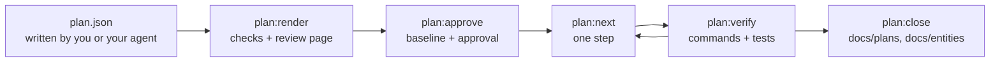

# 実装計画

実装計画は、変更の設計をコードより先に JSON で書いておくドキュメントです。Guren は計画をアプリケーションと突き合わせて検査し、レビュー用のページとして描画します。承認すると計画に基準点が刻まれ、作業はステップに分けられ、どこまで実装できたかはコードから読み取られます。進捗は実装したエージェントの自己申告ではなく、`plan:status` と `plan:verify` がスキーマ、ルートグラフ、コントローラー、ページ、テスト結果から判定します。

計画を書く価値があるのは、テーブルとルートとページにまたがる変更のように、できあがった差分を直すより設計の段階で直すほうが安く済む場合です。差分を一文で説明できる程度の変更なら、計画は要りません。

一連の流れを通して体験したい場合は、[エージェントと作る](../agent-course/00-overview.md) を読んでください。Claude Code と一緒に 2 本の計画を依頼からクローズまで進める講座で、判断が必要な場面ごとにチェック表を用意しています。



このページの例はすべて、`examples/blog` の投稿にコメント機能を足す 1 つの計画から取っており、コマンドはこのアプリケーションのコピーで実行しています。

## 置き場所

計画は、`docs/plans/` の下に slug を名前にしたディレクトリを作って置きます。

| ファイル | 中身 | コミット |
|---|---|---|
| `docs/plans/comments/plan.json` | 計画そのもの | する |
| `docs/plans/comments/approvals.json` | `plan:approve` が記録したハッシュと、`alter` ごとの読み取り | する |
| `docs/plans/comments/decisions.json` | `plan:waive` が書く免除 (waiver) の記録 | する |
| `docs/plans/comments/revisions/0001.json` | `plan:revise` が書くリビジョン | する |
| `docs/plans/comments/plan.html` | `plan:render` が書くページ | しない |
| `.guren/plans/comments.state.json` | 検証結果と、いま取り組んでいるステップの印 | しない (自身を ignore します) |

ファイル名が `plan.json` の場合は、ディレクトリ名が slug になります。ファイル名は別の名前でも構いません。たとえば `comments.plan.json` なら slug は `comments` で、記録はその隣に `comments.approvals.json`、`comments.decisions.json`、`comments.revisions/` として置かれます。

描画したページは生成物なので、リポジトリには入れません。`create-guren-app` で作ったアプリの `.gitignore` には、次の 2 行が最初から入っています。それより前に作ったアプリでは、この 2 行を `.gitignore` に足してください。1 行目は `docs/plans/<slug>/` に置いた計画のページ、2 行目はアプリケーションのルートなどに置いた `<slug>.plan.json` のページに対応します。`plan:next` は既定の場所に書かれたページとその一時ファイルを無視します。ただし `-o` で別の場所に書いたページはただの未追跡ファイルとして扱われるので、そのツリーでは `plan:next` が実行を拒否します。

```text
docs/plans/**/*.html
*.plan.html
```

計画そのものと、承認・決定ログ・リビジョンの扱いはページとは違います。免除の記録は次にどのステップを渡すかを左右しますし、リビジョンは計画を変えるコミットに含めるものです。そのため `plan:next` は、これらのどれかが未コミットだと実行を拒否します。

## 計画を書く

JSON は、読者が自分で書くか、機能について話し合ったセッションのエージェントに書かせます。エージェントに渡す内容は `guren plan --print-prompt` で表示できます。依頼とこのページの規約を載せたプロンプトのあとに、計画の JSON Schema が続きます。このコマンドはモデルを呼ばず、何も実行しません。

```bash
bunx guren plan "comments on posts, authors can delete their own" --print-prompt
```

出力をセッションに貼り付けるか、エージェント自身にこのコマンドを実行させてください。プロンプトは、エージェントに次の順で作業するよう指示しています。まず `context`、`model:list`、`guidelines` でアプリケーションを読み、自分で決められないことを質問し、`docs/plans/<slug>/plan.json` を書いてから、失敗する検査がなくなるまで `plan:render --json` を実行します。承認は読者が行います。依頼を省いた場合、プロンプトは依頼内容を尋ねるようエージェントに指示します。`--json` を付けると、プロンプトとスキーマが 1 つのオブジェクトで出力されます。`--print-prompt` を付けずに `guren plan` を実行するとエラーで終わり、モデルに単独で計画を書かせる使い方はまだ用意していません (このページの最後を参照)。

エージェントハーネスを入れたアプリ (`bunx guren agent:init` で導入し、`agent:sync` で更新) では、この流れを `plan-write` スキルが進めます。エージェントに機能の計画を頼むと、書き始める前に設計を左右する点を質問してきます。答えを受け取るとプロンプトに沿って計画を書き、失敗する検査がなくなるまで `plan:render --json` を実行して、最後にページの場所と未決の点を伝えます。レビュー後の変更は `plan:revise` で記録し、承認まではしません。承認した計画は `plan-implement` スキルが実装します。

`plan:render` はファイルを計画のスキーマで検証し、誤りのあるフィールドを指摘します。

```text
 ERROR  The plan does not match the plan schema:
  models.0.columns.0.change.from: Invalid input: expected string, received undefined
```

### ドキュメントの構成

| フィールド | 中身 |
|---|---|
| `planVersion` | `1` |
| `title`、`summary`、`locale` | 計画の題と要約、本文の言語 (`en`、`ja`) |
| `scope` | `goals` と `nonGoals` |
| `assumptions`、`questions` | 指示なしに決めたことと、決めきれなかったこと |
| `models`、`validators`、`controllers`、`routes`、`views`、`resources`、`policies`、`sideEffects` | 設計の本体。要素の種類ごとに 1 セクション |
| `flows` | 計画で足すものの中を、リクエストがどう流れるか。ノードとエッジで書く |
| `commands` | 変更の前に実行しておく `guren add attachments` などのコマンド |
| `tasks` | スライスごとに達成すべきことと、その受け入れ振る舞い |
| `hints` | `task/entity/model.tag before task/entity/model.comment` のような、順序についての助言 |
| `baseline` | `plan:approve` が書く。手では書かない |

どのセクションも省略できます。省略したセクションと空のセクションは、同じ計画として扱われます。

### id と change

要素はすべて `id` と `change` を持ちます。id の名前空間は計画全体で 1 つです。先頭は英字にし、あとには英数字と `_`、`.`、`:`、`-` を使えます。慣例では、セクション名と名前をつなげて書きます (`model.comment`、`route.comments.store`)。要素どうしはこの id で互いを参照し、あとで改訂するときも要素は id だけで指すので、一度決めた id は変えないでください。

| `change.kind` | 意味 |
|---|---|
| `existing` | 参照するだけで変えない |
| `add` | 新しく足す |
| `alter` | その場で変える |
| `rename` | 名前を変える。`from` は旧名 (モデルならクラス名、カラムならプロパティ名、ルートならルート名) |
| `drop` | 取り除く。`reason` に理由を書く |

既存のテーブルやカラムに `alter`、`rename`、`drop` を使う場合は、既存の行をどう扱うかを `dataMigration` に書きます。書けるのは `{ "kind": "none", "reason": "…" }` か、`description` を付けた `backfill` または `manual` です。これを書いていない計画は承認されません。

```text
  column.post.summary: Column "summary" of "Post" is a "rename" on an existing table and states no dataMigration.
```

モデルに並べるのは、計画で変えるカラムと参照するカラムだけです。次の例は、例の計画で新しく足す `Comment` モデルを、5 つのカラムのうち 2 つに絞って示したものです。

```json
{
  "id": "model.comment",
  "change": { "kind": "add" },
  "name": "Comment",
  "table": "comments",
  "columns": [
    {
      "id": "column.comment.body",
      "name": "body",
      "change": { "kind": "add" },
      "type": "text",
      "nullable": false,
      "unique": false,
      "index": false
    },
    {
      "id": "column.comment.postId",
      "name": "postId",
      "columnName": "post_id",
      "change": { "kind": "add" },
      "type": "integer",
      "nullable": false,
      "unique": false,
      "index": true,
      "references": { "model": "model.post", "column": "id", "onDelete": "cascade" }
    }
  ],
  "relationships": [
    { "name": "post", "type": "belongsTo", "target": "model.post" },
    { "name": "author", "type": "belongsTo", "target": "model.user" }
  ],
  "fillable": ["body"]
}
```

カラム型は、Drizzle のビルダー名ではなく抽象的な型名で書きます。使えるのは `string`、`text`、`integer`、`number`、`decimal`、`boolean`、`date`、`datetime`、`json`、`uuid` の 10 種類です。`datetime` には `withTimezone` を、`decimal` には `precision` と `scale` を指定できます。

ほかのセクションも同じような形です。コントローラーにはアクションを並べ、各アクションに `body`、`params`、`query` で使う validator、`authorization` (ミドルウェアと Policy の ability)、`response` (Inertia のビュー、リダイレクト、Resource)、業務ルールを文章で書いた `rules` を書きます。ルートにはメソッド、パス、ルート名、アクションの id、ミドルウェア、`bind` を書きます。ビューにはページ id と props を書きます。フォームのフィールドにはルールを書き直さず、validator のフィールドを指定します。アプリケーションモジュールに属する要素には `module` を付けます。

### 受け入れ振る舞い

タスクの意図には、対象のエンティティ、そのタスクが受け持つ要素、動作を確かめる振る舞いを書きます。

```json
{
  "id": "AC-comments-4",
  "description": "A user cannot delete someone else's comment.",
  "kind": "forbidden",
  "actor": "user",
  "route": "route.comments.destroy",
  "given": ["a comment written by another user exists"],
  "expect": { "status": 403 }
}
```

`kind` には `success`、`validation`、`unauthenticated`、`forbidden`、`not-found`、`state` のどれかを書きます。検査はこの種類ごとに振る舞いを数え、validator があるのに `validation` の振る舞いがないルートや、認証が必要なのに `unauthenticated` の振る舞いがないルートを報告します。`expect` には `status`、`redirect`、`inertia`、`errors`、`database` を書けます。リクエストの `input` とデータベースの値は、`{ "name": "body", "json": "\"Nice post\"" }` のように値を JSON テキストとして書きます。

振る舞いは 1 つずつテストになり、テスト名には角括弧で囲んだ id を入れます。受け入れ振る舞いの id は `AC-` で始めてください。計画にない `AC-` の id が角括弧で書かれていると `plan:verify` が報告するので、打ち間違いに気づけます。

```ts
test("[AC-comments-4] a user cannot delete someone else's comment", async () => {
  const comment = await Comment.forceCreate({ body: 'Mine', postId: post.id, userId: author.id })
  await http.actingAs(reader).delete(`/comments/${comment!.id}`).assertStatus(403)
})
```

Guren は、GET 以外のリクエストに対するリダイレクトを 303 で返します。フォーム送信後にリダイレクトすることを期待する振る舞いには、`"status": 303` と書いてください。

### 質問

質問には、書き手が一人では決めきれなかった判断を書きます。選択肢、計画が仮に選んだもの、答えが変わったときに影響を受ける要素を並べます。

```json
{
  "id": "Q-delete",
  "question": "Does deleting a comment remove the row?",
  "options": [
    { "label": "hard delete", "consequence": "The row is removed; no deleted_at column." },
    { "label": "soft delete", "consequence": "A deleted_at column is added and lists filter on it." }
  ],
  "assumed": "hard delete",
  "affects": ["model.comment", "action.comments.destroy"]
}
```

質問が残っている計画は承認できません。答えが出たら計画を編集して反映します。答えに沿って要素を直し、質問を消して、決めたことを `assumptions` に残してください。承認前の計画は、`plan.json` を直接編集して変えるのが普通です。

### コマンド

計画の `commands` は `plan:next` が実装エージェントに渡し、エージェントは書かれたとおりに実行します。そのため、書けるのは Guren のジェネレーターだけです。

```json
{ "id": "command.attachments", "command": "guren add attachments", "reason": "Comments take images." }
```

検査を通るのは、`guren <subcommand>` か `bunx guren <subcommand>` の形で、サブコマンドが `make:migration` 以外の `make:*`、`lang:publish`、`add plugin` 以外の `add <blueprint>` のどれかであるコマンドです。引数に使えるのは文字、数字、`_-.,:/=@+%` で、空白を含む値は一重引用符か二重引用符で囲みます (`--fields "title:string,body:text?"`)。シェルの演算子、`$`、バックスラッシュ、閉じていない引用符があると検査は失敗します。絶対パスの引数や、`..` でアプリケーションの外に出る引数も失敗します (`--path /etc`、`--app=../other`)。この検査で制限しているのはシェルの構文とジェネレーターの書き込み先で、`--force` などジェネレーターごとのその他のフラグは判断しません。ここに挙げた以外のコマンドも失敗します。`bun run db:migrate` は計画に書くものではなく、`data` ステップの検証コマンドとして実行されます。この検査が失敗している間は `plan:approve` が承認を拒否し、こうしたコマンドを含む計画には、下書きでも承認済みでも `plan:next` がステップを渡しません。

## 描画と検査: `plan:render`

```bash
bunx guren plan:render docs/plans/comments/plan.json
```

実行すると `docs/plans/comments/plan.html` が書き出され、そのパスが表示されます。出力先は `-o` で変えられます。別のディレクトリから実行するときは、`--app <dir>` で検査するアプリケーションを指定してください。`--locale ja` を付けると、ページのラベルが日本語で表示されます。ページ上でも `en` と `ja` を切り替えられますが、計画の本文は翻訳されません。`--json` を付けるとページのパスとすべての検査が 1 つの JSON で出力されるので、エージェントはページを開かずに失敗した検査を読めます。

ページは 1 つのファイルで、ネットワークにはアクセスしません。ディスクから直接開けるので、レビュー依頼にそのまま添付できます。以下のラベルは `--locale ja` で開いたときの表記です。ページには、セクションごとのタブ、エンティティのフィルター、`existing` の要素を隠す「変更のみ」の切り替えがあります。現在のスキーマに計画を重ねた ER 図も描かれ、id はどれも参照先の要素へのリンクになっています。失敗した検査と互換性を壊す変更は、「確認が必要な項目」に固定で表示されます。要素ごとに「承認」と「修正を依頼」のボタンとコメント欄があり、レビュー結果はフッターから `feedback.json` として書き出せます。ページ上で何を操作しても、計画のファイルそのものは変わりません。「エージェントへの依頼文をコピー」を押すと、計画のパス、`plan-write` スキルでレビューを反映してほしいという依頼、フィードバックをまとめた依頼文が、ページの表示言語でコピーされます。これをエージェントに送れば、レビューがリビジョンとして計画に取り込まれます。`plan:revise` は `feedback.json` から承認と回答を読みます (後述)。コメントの内容は、読者かエージェントが計画のコピーに反映します。フッターには、計画を直したあとに実行する `plan:render` と `plan:approve` の 2 つのコマンドが表示されます。

検査は、今のアプリケーションに対して実行されます。報告される内容には、たとえば次のようなものがあります。

- 計画にないアクションを指すルート
- どこにも存在しないモデルへの外部キー
- 名前がすでに使われている `add`
- 存在しない `existing` や `alter` の対象
- 認証だけで認可のない、状態を変えるルート
- validator のない、ボディを受け取るルート
- 先に挙げた、足りない振る舞い

検査が失敗しても描画は止まらず、先に進めなくなるのは `plan:approve` のほうです。基準点 (`baseline`) を持つ計画では、`plan:render` も承認と同じように計画自身が行った作業を差し引いて判定します。そのため、計画が作った要素との衝突は、ページ上では通過した検査として表示されます。例の削除ルートの名前を、ブログがすでに使っている名前に変えると、次のように報告されます。

```text
  route.comments.destroy: The route name "posts.destroy" already exists in this application.
```

### Impact

計画で変更・改名・削除する要素ごとに、アプリケーションの中でその要素に依存しているものがページに一覧表示されます。一覧に載るのは、リレーション、ルートとその `ApiRoutes` のエントリとエージェントツール、Resource、Policy、コントローラーのアクション、テスト、カラムの場合はそのカラムを読み書きしている箇所です。ブログの `posts.excerpt` を `summary` に改名する計画では、カラムの下に次の一覧が出ます。

```text
PostResource reads it                              app/Http/Resources/PostResource.ts:32
posts/Index reads it through PostResource          resources/js/pages/posts/Index.tsx:80
posts/Show reads it through PostResource           resources/js/pages/posts/Show.tsx:60
PostController.store writes data no static scan can name the columns of
PostController.update writes data no static scan can name the columns of
```

テストは 2 つの方法で探します。1 つは、`TestApp` のリクエスト (`get`、`post`、`put`、`patch`、`delete`、`query` とエージェントツールの呼び出し) をルートグラフと照合する方法で、各ルートの下にはそこに届くリクエストが並びます。もう 1 つはファイル名による方法で、コントローラーやモデルの名前が付いたテストファイルも「ファイル名で対応」として並びます。アクションを直接呼ぶテストからは、読み取れるリクエストがないためです。例の計画を実装し終えたあとで、コメント削除のルートを移す計画を書くと、次のように表示されます。

```text
Route comments.destroy
ApiRoutes entry comments.destroy
Request DELETE /comments/${…} reaches comments.destroy    tests/comments.test.ts:38
```

ブログにもともとあるテストは HTTP を通さずにコントローラーを呼んでいます。そのため `posts.show` を移す計画では、ファイル名で見つかったテストだけが並び、リクエストは見つかりません。

```text
Route posts.show
ApiRoutes entry posts.show
Test tests/controllers/PostController.test.ts, named after it
No TestApp request in the existing tests reaches the routes above.
```

最後の注記は、見落としの可能性がないときにだけ表示されます。パスを読めないリクエスト (変数から組み立てたものや、`TestApp` だと判断できない受け手に対するもの)、ルートパラメータの制約を確かめられなかったリクエスト、解析できなかったテストファイルがあった場合は、この注記の代わりに、そのことが要素の横に書かれます。

Impact に出るのは影響の下限です。静的な走査なので、別の関数やファイルに渡った値、再代入、変数に入れたカラム名までは追えません。一覧が空でも、影響がないとは限らず、何も見つからなかったというだけです。カラムの削除や形の変更、ルートの改名や削除、公開済みのエージェントツールの変更は、Impact の結果にかかわらず、互換性を壊す変更として表示されます。

## 承認: `plan:approve`

承認は、ページを読んだ人が下す判断です。検査が失敗しているか、質問が残っている場合、承認は拒否されます。

```text
 ERROR  docs/plans/comments/plan.json is not approved while a check fails or a question is open; an assumption nobody confirmed is not approved by silence.
  question Q-delete is unanswered: Does deleting a comment remove the row?
An answer chosen on the review page does not change the plan file. Send the agent the prompt the page copies with "Copy prompt for the agent", or remove each answered question yourself with plan:revise (--edited with a copy of the plan, or --ops with a remove op), passing the page's feedback with --feedback.
```

問題がなくなったら承認します。

```bash
bunx guren plan:approve docs/plans/comments/plan.json
```

```text
Comments on posts (plan.json)

Stamped the baseline at 0c871a5b9dc25587d33ae3d6bb6c3befe2c7e6a2: 14 element(s) hashed.
Approved 22735cb551ac15559cd5cabc344925f8f75af7a62efe39570ac49d8c032a59c0, recorded in docs/plans/comments/approvals.json.
```

最初に承認したときに、計画に `baseline` が書き込まれます。`rev` は計画を書いた時点のコミットで、`contextHash` は参照している要素ごとに、アプリケーションでの今の形をハッシュにしたものです。コミットのないリポジトリや、未コミットの変更がある作業ツリー (計画自身のファイルは除く) で承認が拒否されるのはこのためです。承認の記録は計画の中には入らず、隣の `approvals.json` に書かれます。両方をコミットしてください。

validator は、export されたスキーマのシンボル名で探します。`app/Http/Validators/` のファイルを import せずに読み、export されている名前を集めます。コントローラーの中のスキーマや、別の場所からの再 export は読めないので、どのファイルでも宣言・export されていない名前は、失敗ではなく警告になります。セクションを読めなかった場合 (構文解析できないファイルや、`export *` で export しているファイルがある場合など) は承認が拒否され、ハッシュのないまま残る要素が示されます。`--allow-unstamped` を付けると、それらの要素を除いて承認します。

validator を読めるようになる前に承認した計画には、validator のハッシュがありません。その validator を書いたあとで再承認すると、その名前は衝突ではなく `plan:app-unjudged` の警告として報告されます。計画自身が書いたものかどうかを、基準点から判断できないためです。

計画はハッシュで識別します。ハッシュは基準点を含めた計画の SHA-256 で、承認、検証の記録、免除の記録はどれもこのハッシュで計画を指します。承認後に編集した計画は、別の計画として扱われます。基準点を持つ計画の現在のハッシュがどの承認にも記録されていなければ、`plan:next`、`plan:scaffold`、`plan:verify`、`plan:waive`、`plan:close` はその計画を拒否します。

```text
 ERROR  docs/plans/comments/plan.json is not approved at its current hash dc9a6ce3ad173e23290f743293fa0e3495c932b3b2cdf07c0cda8c9b063a5465, so no step of it is handed out: it was edited after approval, or never approved, and what it says now may not be what anyone agreed to. Run guren plan:approve docs/plans/comments/plan.json once the plan says what you mean to build.
```

`plan:status` と `plan:render` は、承認する前に変更を読むためのコマンドなので、こうした計画でも拒否しません。基準点のない下書きにはハッシュがないので、`plan:next` と `plan:verify` は下書きをこれまでどおり受け付けます。`plan:scaffold` は承認された内容からコードを書くコマンドなので、下書きを拒否します。隣に承認の記録がある下書きは、未承認の計画と同じように拒否されます。承認済みの計画から `baseline` を消しても、この確認を避けることはできません。

編集した計画をもう一度承認すると、新しいハッシュが記録され、基準点はそのまま残ります。各ステップは新しいハッシュのもとで検証し直すことになります。承認の前には検査と質問の確認がもう一度行われ、その時点のアプリケーションと突き合わされます。このとき、計画自身が行った作業は妨げになりません。計画どおりに実装し終えた要素は検査から差し引かれ、どれを差し引いたかが承認時に表示されます。

```text
Built as the plan leaves them, so their collision or absence is the plan's own work: model.comment, controller.comments, resource.comment, policy.comment, action.comments.store, action.comments.destroy
```

差し引かれるのは、アプリケーションが計画の想定する出発点から始まり、今は計画が目指す姿になっている要素だけです。それ以外はこれまでどおり拒否されます。たとえば、あとからの編集でアプリケーションがすでに持っていた名前に付け替えた `add`、計画で足すテーブルを別のアプリケーションルートがすでに宣言している場合、別のルートが使っているエンドポイント、クラスだけ書かれてテーブルがまだないモデル (出発点でも到達点でもない状態) がこれに当たります。パスも動かす `rename` や `alter` のルートは「作り終えた」とは判断されず、拒否する側に倒します。下書きの扱いは変わりません。刻んだ記録がないので何も差し引かれず、`add` の要素がすでにあれば拒否されます。

この判定の精度は、鮮度の判定と同じ程度にとどまります。計画と同じアプリケーションルートに別のコミットが足した同名のクラスや、計画が作ったルートと同じエンドポイントに足された 2 本目のルートも、計画自身の作業として扱われます。また、`existing` を `drop` に変えた要素は、別の誰かが先に消していれば差し引かれます。刻んだ記録では存在していて、今は無くなっているためです。

### `alter` の読み取り

`alter` は計画より前からあるものを変えるので、承認の時点ですでに一致していた性質は、変更が済んだ証拠になりません。そこで承認のたびに、`alter` の要素ごとに計画が書いた性質をその場で読み、結果を `approvals.json` のその承認の項目に記録します。`plan:status` が `alter` の性質を完了と数えるのは、承認時に `differ` か `unknown` だったものが今は一致している場合だけです。読み取り結果が実装前のアプリケーションを表すように、計画は実装を始める前に承認してください。編集した計画を承認し直した場合、同じ基準点のもとで記録した読み取りは引き継がれます。ただし引き継がれるのは、計画上の値とコード上の名前を編集で変えていない性質の読み取りだけです。

承認時の読み取りがない性質は、一致していても完了と数えません。実装の前であれば、`plan:status` はまだ食い違っているそうした性質を挙げ、直し方を示します。

```text
  planned   alter     Post                       model.post
      differs: relationship comments (planned hasMany, found not declared)
      differs: relationship comments target (planned Comment, found not declared)
      The approval recorded no reading of relationship comments, relationship comments target: run guren plan:approve on the plan before changing them, since a match with no reading from before the work does not count.
```

すでに承認済みのハッシュに対して `plan:approve` を実行すると、承認の項目に足りない読み取りだけが書き足されます。

```text
Already approved at 2026-09-22T10:16:20.673Z; recorded the readings it lacked in docs/plans/comments/approvals.json: model.post, view.posts.show.
```

実装のあとで読み取ると、性質はすでに一致しています。そのため、実装後に承認し直しても役に立ちません。一致した性質のどれにも読み取りがない `alter` は `unjudged` になり、その要素に届く振る舞いで検証するよう注記が付きます。ステップの検証が通ったあとは、免除する (`plan:waive`) という選択肢を示す注記も加わります。カラムのように振る舞いが届かない要素には、免除だけが示されます。

読める性質がすべて承認時にすでに一致していた `alter` は、性質によっては完了になりません。`plan:approve` はそうした計画も承認しますが、要素と性質を挙げて警告します。`--json` では `heldAlters` に並びます。警告は承認の項目に記録した読み取りから判定するので、同じハッシュを承認し直すと同じ警告が出ます。同じ基準点のもとで実装後に承認し直した場合、実装で変えた性質については警告しません。次の例は、ページですでに宣言されている `post` prop を `view.posts.show` で書き直しただけの計画です。

```text
Warning, advisory (the approval stands):
  view.posts.show (posts/Show): every readable planned property already held at approval (prop post); none shows the change, so plan:status reports it unjudged. State the change in a property the application does not hold yet and approve the plan again, or expect that it completes only through a verified behaviour that reaches it, or by a waiver.
```

承認時に `unknown` だった性質は、一致していたとは数えません。警告はその性質を、まだ変更を示せる唯一の性質として挙げます。ただし変更を示せるのは、読み取れるようになってから一致した場合だけです。読める性質が 1 つもない `alter` には警告を出さず、前述のとおり `plan:status` が `unjudged` と報告します。

## 改訂: `plan:revise`

計画は、承認の前でも後でもリビジョンとして変更します。`plan:revise` はモデルを呼ばずにリビジョンを記録するコマンドで、親になるのは現在の計画ファイルそのものです。変更内容は、変更を加えた計画のコピーか、変更操作の一覧 (ops) として別に渡します。

```bash
cp docs/plans/comments/plan.json /tmp/comments.edited.json
# edit the copy: rename a column, change a type, drop a route
bunx guren plan:revise docs/plans/comments/plan.json --edited /tmp/comments.edited.json --message "soft-delete comments instead"
```

コマンドは 2 つのファイルの差分から変更操作を求めます。追加・変更・削除した要素ごとに操作が 1 つでき、どの操作も `--message` の内容を理由として持ちます。コマンドは `{ parent, ops, result }` を `docs/plans/comments/revisions/0001.json` に書き、そのあと `plan.json` をコピーの内容で置き換えます。`comments.plan.json` という名前の計画なら、リビジョンは `comments.revisions/` に置かれます。`--ops ops.json` を使えば、変更操作を直接渡せます。渡すのは `{ "ops": [...] }` の形の文書で、操作ごとに `reason` を書きます。

`--feedback feedback.json` を付けると、ページでのレビュー結果が制約として効きます (コピーしたテキストを渡す場合は `-` を指定します)。ページで承認した要素は、`--reopens "<reason>"` で理由を示したときだけ変更できます。ページで回答した質問は、改訂後の計画から消えていなければなりません。フィードバックから読むのはこの 2 つだけなので、コメントの内容はコピーに自分で反映してください。

承認後の計画は、この方法で変更します。`plan.json` をその場で編集すると、ハッシュがどの承認にもリビジョンにもない値に変わるので、`plan:revise` はその計画を拒否します。その場合は `git checkout -- docs/plans/comments/plan.json` で元に戻し、編集内容をコピーに移して `--edited` で渡してください。改訂したあと承認していない計画は、そのまま続けて改訂できます。リビジョンは基準点をそのまま引き継ぐので、改訂した結果は `plan:approve` で承認するまで `plan:next` などのコマンドに拒否されます。古いハッシュに対して記録した免除も引き継がれず、コマンドはその免除を一覧で示します。最初の承認前の下書きも同じ方法で改訂できますが、直接編集しても構いません。

実装済みの計画を改訂すると、すべてのステップがもう一度やり直しの対象になります。古いハッシュでの記録は、新しいハッシュのもとでは数えられないためです。`plan:next` は、以前のハッシュで検証済みだったステップを再確認の対象として示します。ファイルがすでにある `scaffold` や `tests` のステップは、以前の版の計画で作られたものとして示されます。`plan:scaffold` は書き込み先が 1 つでもすでにあるステップを拒否するので、`plan:next` は `plan:verify --step` を案内し、まだないものを手で書く対象として一覧にします。`--step` を付けない `plan:verify` は、計画全体を一度に再確認します。単純に再実行できないのは `tests` ステップだけです。コードができたあとは振る舞いのテストが通るのに、`tests:fail` はテストの失敗を求めるからです。そこで、このステップの検証が通った実行では、振る舞いごとに失敗を確認したことを記録しておきます。記録のキーは計画に書かれたテストの形で、description 以外のすべてのフィールドに、ルートのメソッドとパス、期待するページを加えたものです。以降の実行では、改訂がテストに触れなかった振る舞いについてこの記録を引き継ぎ、改めて失敗を求めるのは変わった振る舞いだけです。その振る舞いは、古い計画で実装したコードに対して失敗させます。この記録を持たない `tests` ステップ (この規則より古い CLI で検証したもの) は、振る舞いが通るようになると検証できず、Stop hook はすぐに打ち切ります。このステップは要素を持たないので、`plan:close` はこのステップを待ちません。

## 実装: `plan:next` と `plan:verify`

作業の分け方と順序は、モデルではなく Guren が計画から自動で組み立てます。計画で足したり変えたりするエンティティごとにタスクができ、タスクは外部キーの依存順に並びます。ステップは 6 種類あり、各タスクには作業のある種類のステップだけが入ります。

| ステップ | 作業 | 検証 |
|---|---|---|
| `commands` | 計画の `commands` (`guren add attachments` など)。`task/foundation` に入る | `codegen`、`typecheck` |
| `scaffold` | 新しいエンティティの最初の版。`plan:scaffold` が書く | `codegen`、`typecheck` |
| `tests` | 受け入れ振る舞いごとのテスト。`plan:scaffold` が雛形を書き、失敗する状態にする | `codegen`、テストが失敗すること |
| `data` | テーブル、マイグレーション、モデルのリレーションと fillable。scaffold 済みなら、マイグレーションと、`plan:scaffold` が書かなかったもの | `codegen`、`db:migrate`、`typecheck` |
| `http` | コントローラーとルート。validator、Resource、Policy も含む。scaffold 済みなら、`plan:scaffold` がスタブにしたものと書かなかったもの | `codegen`、`typecheck`、`guren check`、テストが通ること |
| `pages` | ページコンポーネント | `codegen`、`typecheck`、`guren check` |

テストを実行するのは、タスクごとに 1 つ、振る舞いを判定するステップだけです。そのステップは最後の `http` ステップで、`http` がない場合はタスクの最後のステップになるので、`data` や `pages` でテストを実行することもあります。分割された `http` の前半を含め、ほかのステップではテストを実行しません。`typecheck` を実行するのも、タスクの最後の `http` ステップだけです。前半のパートが、後半のパートで書く Resource やジョブを import していることがあるためです。`http` のアクションが描画するページのうち、`pages` ステップで追加するものは、ファイルができるまで `.guren/pages.gen.ts` に載りません。そこで `plan:next` はそのページを `http` ステップと一緒に表示します。このステップでは default export と計画の `Props` だけを持つスタブを作り、残りは `pages` ステップで書きます。複数のエンティティが共有する作業は `task/foundation` に入ります。ステップの id は `task/entity/model.comment/http` のような形です。`commands`、`data`、`http`、`pages` のステップは、担当する要素が 5 つを超えるファイルにまたがると複数に分かれ、`task/entity/model.comment/http/1`、`task/entity/model.comment/http/2` のような id になります。`scaffold` と `tests` は分かれません。`--step` に渡す正確な id は `plan:next` が表示します。作業は、次のステップを尋ね、実装し、検証し、コミットする、という流れの繰り返しです。

```bash
bunx guren plan:next docs/plans/comments/plan.json
```

```text
Comments on posts (plan.json)

Verified: task/entity/model.comment/scaffold

Next: task/entity/model.comment/tests
  task: entity Comment (task/entity/model.comment)
  verify: codegen → tests:fail

Write this step’s test skeletons with `bunx guren plan:scaffold docs/plans/comments/plan.json --step task/entity/model.comment/tests`, not by hand, then fill them in.
  It writes one TestApp test per behaviour (AC-comments-1, AC-comments-2, AC-comments-3, AC-comments-4), with its request and the expectations the plan states, into one file.
  Each fails at a given() call until the setup it names is written (records, the signed-in actor, path parameters); replace every call, and keep each title’s id and its request.

Behaviours to write, as test titles `[<id>] <description>`, failing:
  [AC-comments-1] A signed-in user can comment on a post.
      success; actor user; route route.comments.store; given a post exists; expect status 302; comments has 1 row(s)
  [AC-comments-2] An empty comment is rejected.
      validation; actor user; route route.comments.store; given a post exists; expect status 422; errors on body
  [AC-comments-3] A guest cannot comment.
      unauthenticated; actor guest; route route.comments.store; given a post exists; expect redirect /login
  [AC-comments-4] A user cannot delete someone else's comment.
      forbidden; actor user; route route.comments.destroy; given a comment written by another user exists; expect status 403
  Each test requests its route through a TestApp, in its body or a function of its file it calls: plan:verify reads the requests before it runs them.

Implement this step only, then run `bunx guren plan:verify docs/plans/comments/plan.json --step task/entity/model.comment/tests` and commit once it is verified.
Marked in .guren/plans/comments.state.json
```

`plan:next` が表示するのは 1 つのステップだけで、計画全体は出しません。`--json` を付けると、同じ内容をデータで返します。表示したステップには状態ファイルで印が付き、Stop フックはこの印を読みます。承認のない計画は、先に述べたとおり拒否されます。未コミットの変更がある作業ツリーも、その変更が印の付いたステップ自身の作業でない限り拒否されるので、`plan:next` はステップに取りかかる前に実行してください。

```text
 ERROR  The working tree under /app has uncommitted changes (paths relative to the repository root), and one step is one commit. Commit or discard them first:
  ?? tests/plans/comments/comments.test.ts
```

```bash
bunx guren plan:verify docs/plans/comments/plan.json --step task/entity/model.comment/tests
```

```text
task/entity/model.comment/tests: verified (607 ms)
  pass     codegen     bun run codegen
  pass     tests:fail  bun test tests/plans/comments/comments.test.ts
  failing  [AC-comments-1]
  failing  [AC-comments-2]
  failing  [AC-comments-3]
  failing  [AC-comments-4]
  work: 1 file, +38 -0 since 3f1c2a9b0d4e

Recorded in .guren/plans/comments.state.json
```

`tests` ステップの検証が通るのは、すべての振る舞いにテストがあり、そのすべてが失敗したときだけです。コードより先に通ってしまうテストは何も証明しませんし、skip したテストは失敗に数えません。`plan:verify` は、ステップの id がソースに書かれたテストファイルを選んで `bun test` で実行します。後のステップでも同じファイルを実行し、今度は通ることを求めます。検証結果のあとには計画の状態が表示されますが、その読み方は後で説明します。

`plan:verify` は、テストを実行する前に、各振る舞いのテストが振る舞いの指すルートへ `TestApp` でリクエストしているかを確認します。タイトルに id を含む `test`、`it`、`describe` のどれかが、そのメソッドとパスへリクエストするか、ルートのエージェントツールを呼んでいる必要があります。リクエストは本体に書くか、本体から呼ぶ同じファイル内の関数に書きます。`` `/comments/${id}` `` のようにセグメント全体を実行時の値で埋めたパスは、制約付きのパラメーターにも届くものとして数えます。別のルートへリクエストしているテストや、何もリクエストしていないテストがあると、実際に何をリクエストしているかを示してコマンドが失敗し、`bun test` は実行されません。

この読み取りで解決できないリクエストがある場合も、別の理由でコマンドが失敗します。ファイルに書かれていないパス、import したヘルパーの戻り値に対するリクエスト、`TestApp` や `Promise<TestApp>` の注釈がない同じファイル内の関数の戻り値に対するリクエスト、別ファイルの関数に渡した `TestApp`、実行時に組み立てたタイトルがこれに当たります。こうした書き方に変えたテストでステップの検証が通ってしまわないよう、この判定は安全側に倒しています。指摘では、リクエストをテストに直接書くか、ヘルパーに注釈を付けるよう求められます。この仕組みは改ざんを検出するためのもので、正しさを証明するものではありません。ファイルに書かれたリクエストは、実際に実行されるかどうかに関係なく通ります。

### scaffold ステップ: `plan:scaffold`

新しいモデルを追加するタスクは `scaffold` ステップから始まり、`plan:next` がそのステップを書くコマンドを示します。

```text
Next: task/entity/model.comment/scaffold
  task: entity Comment (task/entity/model.comment)
  verify: codegen → typecheck

Write this step with `bunx guren plan:scaffold docs/plans/comments/plan.json --step task/entity/model.comment/scaffold`, not by hand.
  It writes each added model (table and class), its validators and resources, each policy with a provider registering it, each added controller with its actions as stubs, the routes to them in a file of their own that the http step mounts, and the side-effect classes: model.comment, column.comment.id, column.comment.body, column.comment.postId, column.comment.createdAt, validator.comment, controller.comments, action.comments.store, action.comments.destroy, route.comments.store, route.comments.destroy, resource.comment, policy.comment
```

```bash
bunx guren plan:scaffold docs/plans/comments/plan.json --step task/entity/model.comment/scaffold
```

このコマンドは、追加する各モデルのテーブルを、スキーマの方言に合わせて `db/schema.ts` に追記します。テーブルには、計画でカラムに書いたオプションがすべて反映されます。型、null 許容、`unique`、`index`、`default`、`columnName`、`withTimezone`、精度とスケール、主キー、外部キーとその `onDelete` に加えて、モデルの複数カラムのインデックスも入ります。

```typescript
export const comments = pgTable('comments', {
  id: serial('id').primaryKey(),
  body: text('body').notNull(),
  postId: integer('post_id').notNull().references(() => posts.id, { onDelete: 'cascade' }),
  createdAt: timestamp('created_at', { withTimezone: true }).notNull().defaultNow(),
}, (table) => [
  index('comments_post_id_index').on(table.postId),
])
```

`app/Models/Comment.ts` には、計画の `fillable` とリレーションが書かれます。リレーションのキーは、計画に書かれた外部キーから決まります。キーや相手がまだ存在しないリレーションは書かずに一覧で示すので、それがそろうステップで追加してください。後のタスクの作業を待っているリレーション (次のタスクで追加する子への `hasMany` など) については、その作業を受け持つステップ (後のタスクの `data` ステップか、その分割の 1 つ) が一覧に示されます。そのリレーションは、待っている先のモデルの性質としてそのステップで判定され、宣言する側のモデルのファイルに書きます。`plan:next` も、そのステップでこのリレーションを挙げます。それ以外のリレーションを書かずにおくと、追加するまで `plan:status` はそのモデルを `drifted` と判定します。

ステップの validator は、モデルの名前を付けた 1 つのファイル `app/Http/Validators/CommentValidator.ts` にまとめて書かれ、validator ごとにスキーマが 1 つ export されます。各フィールドは、計画の型、`required`、ルール (`min`、`max`、`email`、`url`、`uuid`) から、`plan:status` が読み返せる形で書かれます。

```typescript
import { z } from 'zod'

export const CommentPayloadSchema = z.object({
  body: z.string().min(1).max(2000),
})
```

アクションが `query` や `params` に使う validator では、数値と真偽値を `z.coerce.number()` と `z.stringbool()` で書きます。これらの値は文字列として届くためです。文章で書かれたルールや、フィールドの型に合わないルール (真偽値に対する上限など) は書かずに、レポートに一覧で示します。

このステップでモデルを追加する Resource は、計画のペイロード型を持つ `Resource` のサブクラスとして書かれます。このペイロード型は、`guren codegen` が `data.gen.ts` を作るときに読みます。カラムから読み返せる値がすべて計画の型に収まるフィールドには、カラムの値をそのまま使います。計画で `string` とした日時のカラムは `toISOString()` で文字列にし、JSON のカラムは計画の型にキャストします。それ以外のフィールドでは、対応付けるまで例外を投げるスタブを呼び、レポートに一覧で示します。

```typescript
export class CommentResource extends Resource<CommentRecord, CommentResourceData> {
  toArray(): CommentResourceData {
    return {
      id: this.resource.id,
      body: this.resource.body,
      createdAt: this.resource.createdAt.toISOString(),
    }
  }
}
```

Policy には、計画の ability ごとにメソッドが 1 つ書かれます。どのメソッドもルールを書くまでは `false` を返し、計画のルールはメソッドのコメントに残ります。`app/Providers/CommentPolicyProvider.ts` が `boot()` でその Policy をゲートに登録し、コマンドはこのプロバイダーを `src/app.ts` の `createApp({ providers })` に追加します。`plan:status` は Policy を ability で判定し、登録までは読まないので、Policy は `present` になれば完了です。

ステップで追加するコントローラーには、計画したアクションだけが書かれます。各アクションは、計画の validator で `params` と `query` を検証し、計画の Policy の ability で認可し、`body` を検証してから 501 を返します。そのため Policy が拒否した呼び出しは、何を送っても 403 になります。

```typescript
export default class CommentController extends Controller {
  // Planned response: a redirect to /posts/:postId
  // Rule: The comment's author is the signed-in user.
  // postId is not fillable: write it with Comment.create(data, { set: { postId } }) (RFC 0031)
  async store(): Promise<Response> {
    await this.validateBody(CommentPayloadSchema)
    throw HttpException.notImplemented('CommentController.store is planned and not written yet')
  }

  // Planned response: a redirect to /posts/:postId
  async destroy(): Promise<Response> {
    const comment = this.model(Comment)
    await this.authorize('delete', [Comment, comment])
    throw HttpException.notImplemented('CommentController.destroy is planned and not written yet')
  }
}
```

ability は、レコードに対して `[Model, record]` の形で確認します。ORM のレコードはクラスを持たないので、ゲートがそこから Policy を探せないためです。レコードなしで確認する `viewAny` と `create` 以外の ability で、アクションへのルートがすべて Policy のモデルのレコードを 1 つバインドしている場合、スタブは `this.model()` でそのレコードを取り出してタプルを渡します。そうでない場合はクラスだけを渡し、レコード単位の ability (`view`、`update`、`delete` など) であれば、レコードを読み込んだあとで渡すべきタプルをアクションの上のコメントに示します。`POST` ルートで本文を受け取るアクションでは、同じコメントに、計画で追加するモデルの `fillable` に含まれない外部キーを並べます。`create()` は data にそれらが含まれていると拒否するので、`set` で渡します (RFC 0031)。

検証には `validated('comments.store')` ではなく `validateBody()` を使います。`validated()` の型は生成されたルート名から決まりますが、`http` ステップでマウントするまでルートは登録されないためです。レスポンスも書きません。`plan:status` は名前を読み取れるレスポンス (Resource、ページ、リダイレクト) を実装済みと数えるので、スタブがそれを書くと完了したように見えてしまいます。各アクションのレスポンスは、書き残したものとしてレポートに並びます。

これらのアクションへのルートは、専用のファイル `routes/comments.ts` に書かれます。メソッド、パス、名前、契約のスキーマ、バインディング、`auth` ミドルウェア、`.agent()` のメタデータは計画のとおりです。

```typescript
export function registerCommentRoutes(router: Router): void {
  const authRouter = router.aliasMiddleware('auth', requireAuthenticated({ redirectTo: '/login' }))
  authRouter.post('/posts/:postId/comments', { name: 'comments.store', body: CommentPayloadSchema, bind: { postId: Post } }, [CommentController, 'store']).middleware('auth')
  authRouter.delete('/comments/:id', { name: 'comments.destroy', bind: { id: Comment } }, [CommentController, 'destroy']).middleware('auth')
}
```

このファイルはまだどこからも呼ばれていないので、ルートは登録されず、`planned` と判定されます。ここでルートをマウントしてしまうと、`tests` ステップより前に 401 や 422 を返すことがあり、すでに通る振る舞いがあるとそのステップは失敗します。付けるミドルウェアは `auth` だけです。計画にほかのミドルウェア名があれば一覧で示し、アプリケーションがその名前に割り当てたハンドラーを知っている `http` ステップに任せます。計画が承認済みでまだ閉じておらず、その `http` ステップが未検証のあいだは、`guren check` はマウントされていないこのファイルを参考扱いの警告 (advisory) として報告します。そのため、途中のステップで `guren gate` が止まることはありません。そのステップが検証されるか計画が閉じたあとは、マウントされていないファイルはふたたび通常の警告になります。

ステップで追加するジョブ、イベント、リスナー、メール、通知は、対応する `make:*` コマンドと同じ形で、計画のクラス名を使って書かれます。`plan:status` はこれらを `present` と判定します。`wired` になるのは何かがディスパッチ、登録、送信したあとで、それは `http` ステップの作業です。`docs/entities/Comment.md` がすでにあれば、コントローラーとルートのファイルに `@docs docs/entities/Comment.md` を書きます。まだないドキュメントを指すタグは `guren check` で失敗するので、その場合は書きません。

このコマンドは codegen もマイグレーションも実行しません。codegen と型検査は `plan:verify` が、マイグレーションの生成は `data` ステップが受け持ちます。

拒否するかどうかは、すべて最初の書き込みより前に判定します。拒否されるのは次の場合です。

- 下書き、またはどの承認にも記録されていない計画
- `scaffold` と `tests` 以外のステップ (そのタスクの scaffold ステップを示します)、または `plan:next` が印を付けていないステップ
- モジュールに属するモデル、validator、Resource、Policy、コントローラー、副作用 (書き込み先はプロジェクトのルートだけです) と、API 専用のアプリケーション
- MySQL で `text` か `json` のカラムに付けたキー (主キー、`unique`、インデックス、MySQL がインデックスを作る外部キー)。drizzle-kit が拒否し、MySQL もプレフィックス長のないキーを受け付けません (カラムを `string` にするか、キーを外してください)。値が `null` の `default` も拒否されます
- 名前が `Resource` で終わらない Resource (`guren codegen` が見つけられないため)、`Policy` 自身のメンバー (`before`、`allow`、`deny`) と同じ名前の ability、`Controller` のメンバー (`redirect`、`json`) と同じ名前のアクション
- 登録できない Policy プロバイダー。`src/app.ts` も `app.ts` もない場合、書き換えられる `createApp()` の呼び出しがない場合、すでに登録されている場合が該当します
- すでに存在する書き込み先。モデルのファイルやクラス、スキーマの export、いずれかのアプリケーションルートにあるテーブル名、作成するファイル、ほかの validator ファイルが export している validator 名、同じ名前の Resource、Policy、コントローラー、副作用のクラスが対象です

scaffold 済みのステップでもう一度実行すると、ファイルがすでにあるので同じように拒否されます。その場合はステップを検証してください。`--json` を付けると、作ったファイル、追記したテーブル、登録したプロバイダー、マウントせずに残したルートのファイルとそれをマウントするステップ、書いた要素、残した要素、スタブにしたものや書かなかったもの、書かなかったリレーションが出力されます。

### ルートのマウント: `plan:scaffold --mount`

scaffold が書いたルートを持つ `http` ステップでは、最初にそのルートをマウントします。実行するコマンドは `plan:next` が示します。

```text
Mount the routes the scaffold step wrote first, with `bunx guren plan:scaffold docs/plans/comments/plan.json --step task/entity/model.comment/http --mount`, not by hand: it calls routes/comments.ts from the entry registrar.
  Written as stubs by plan:scaffold, to finish: validator.comment, controller.comments, action.comments.store, action.comments.destroy, route.comments.store, route.comments.destroy, resource.comment, policy.comment. Each action validates and authorizes as planned and answers 501; write its body and response.
```

このコマンドは `registerCommentRoutes` を `routes/web.ts` に import し、そこの registrar の先頭で呼び出します。先頭で呼ぶので、エントリーで設定した `auth` の別名が、ルートのファイルでの設定より優先されます。マウントしたルートは、エントリー自身のルートより先に登録されます。そのため、`/posts/:id` のようにパラメーターを含む scaffold のパスが、`/posts/create` のようなエントリーのルートを覆ってしまうことがあります。パスが重なる場合は順序を確かめてください。マウントすると、`plan:status` はルートとそのアクションを `wired` と判定し、それらが使う validator も `wired` になります。残る作業は、各アクションの本体とレスポンス、そして scaffold がスタブにしたものや書かなかったものです。

次の場合は、何も書かずに拒否します。下書きやどの承認にも記録されていない計画、`plan:next` が印を付けていないステップ、scaffold したルートを持たないステップ (持っているステップを示します)、存在しないルートのファイルや registrar を export しなくなったファイル、`routes/web.ts` のないアプリケーション、registrar と同じ名前で別のものを import しているエントリー、すでにマウントされたファイルです。エントリーが直接呼んでいる場合も、別のルートのファイルが呼んでいる場合も、マウント済みとみなします。

### テストの雛形: tests ステップの `plan:scaffold`

`tests` ステップも同じコマンドで書きます。`plan:scaffold <plan> --step <task>/tests` を実行すると、`tests/plans/<plan>/<collection>.test.ts` が 1 つ書かれます (comments の計画なら `tests/plans/comments/comments.test.ts`)。中身は、ステップの振る舞いごとに 1 つずつの `TestApp` テストです。

```ts
test('[AC-comments-1] A signed-in user can comment on a post.', async () => {
  given('a post exists')
  const actor = given<object>('the actor: user')
  const postId = given<number | string>('the :postId parameter')
  await (await client(actor)).post(`/posts/${postId}/comments`, { body: 'Nice post' }).assertStatus(302)
  expect(await Comment.where({ body: 'Nice post' }).first()).not.toBeNull()
})
```

- タイトルは振る舞いの id で始まり、`plan:verify` はこの id でファイルを選びます。計画の文中にある角括弧は丸括弧に置き換えて書くので、ファイルがほかの id を含むことはありません。
- リクエストは、ルートが示すものを書きます。メソッド、パラメーターをセグメント全体の埋め込みにしたパス、ボディ (`GET` ならクエリ文字列) にした `input` です。
- 期待値は計画に書かれたものを使います。`status`、`redirect` (ルートと共通のパラメーターにはルートの値を使います)、`inertia` (JSON を求めるリクエストにして、Inertia のバージョン確認を通さずにページを受け取ります)、`errors` (JSON のボディから読みます)、`database` の行を書きます。行の確認はモデルを通したクエリで、ルートにモデルがあり、計画のカラムの型と比べられる値のときに書きます。行の準備と後片付けは、実装する側の作業です。ほかのテストが残した行があると、実装とは関係なく期待値が通ったり失敗したりします。
- 計画に文章で書いた前提、ルートがサインインを求める場合のアクター、パスの各パラメーターは、呼ぶと例外を投げる `given()` の呼び出しになります。雛形に書けない期待値は、同じく例外を投げる `unwritten()` の呼び出しになります。期待する 404 も同じ扱いです。まだないルートも 404 を返すからです。どれもレポートと出力に一覧で示します。
- `ready()` は `src/app.ts` を import し、`TestApp.fromApp()` で一度だけ起動します。ファイルの `beforeAll` がこれを呼ぶので、行の作成や削除のために追加した `beforeEach` より先に ORM が設定されます。Bun のフックの既定の制限時間は 5 秒ですが、起動は 120 秒まで待ちます。起動に失敗しても `beforeAll` では例外を投げずに出力するだけなので、追加したフックの内容に関係なく、`plan:verify` はステップを `blocked` と記録します。そして `ready()` か `client()` を呼んだテストが、それぞれその失敗を理由に名前付きで失敗します。自分で追加するフックは `await ready()` から始めてください。そうすれば、各テストが報告するのはデータベースのエラーではなく起動の失敗になります。
- `client()` は起動済みのアプリケーションを返し、アクターを渡すとそのアクターとして振る舞います。アプリケーションが CSRF をマウントしていれば、`withCsrf()` で準備します。`cookie: false` で CSRF をマウントしたアプリケーションには対応していません。
- サインイン済みのアクターを用意するのは、`auth` か `auth:*` のミドルウェア、Policy、`forbidden` の振る舞いがある場合だけです。

実装する前は、どのテストも `given()` の呼び出しか、まだマウントされていないルートで失敗します。skip されるテストはないので、`tests:fail` の条件どおりにステップを検証できます。アプリケーションが起動しない場合は、どのテストもルートに届いていないので、`plan:verify` はステップを `blocked` と記録します。コードを書く前に通ってしまうケースが 2 つあり、そのときは `tests:fail` でステップが失敗します。1 つは既存のルートに対する振る舞いで準備するものがない場合で、レポートに一覧で示します。もう 1 つは、新しいルートのパスに既存のルートがすでに応答してしまう振る舞いで、こちらは一覧に出ません。`given()` と `unwritten()` の呼び出しは、それぞれが示す前提やアサーションに置き換えてください。テストを `test.skip` や `test.todo` に変えないでください。skip したケースは実行したことにならず、ステップはそこで失敗します。後のステップも同じファイルを実行して通ることを求めるので、タイトルの id とリクエストは残してください。

次の場合は、何も書かずに拒否します。下書きや承認のない計画、`plan:next` が印を付けていないステップ、すでにあるファイル (再実行した場合)、ほかのテストファイルがすでに持っている振る舞い (`plan:verify` が 2 つのファイルで見つけてしまうため)、ほかの振る舞いの id を含むリクエストのボディや期待値、起動できる default export が `src/app.ts` にも `app.ts` にもないアプリケーションです。API 専用のアプリケーションには `scaffold` ステップはありませんが、`tests` ステップはほかと同じようにあり、雛形も書けます。制約付きのルートパラメーター (`:id{[0-9]+}`) は、静的な読み取りでは判断しきれません。実行時の値が制約を満たすとは限らないので、そのリクエストはルートに届くとは判断せず、不確かなものとして扱います。

### 結果

ステップの結果は次の 4 つのどれかです。

| 結果 | 意味 |
|---|---|
| `verified` | 検証済み。すべてのコマンドが通り、ステップが担当する要素がすべて完了の状態にある |
| `failed` | 失敗。コマンドが失敗しており、実装に直すところがある |
| `incomplete` | 未完了。コマンドは通ったが、まだ存在しない要素がある |
| `blocked` | 実行できなかった。環境の都合でコマンドを実行できなかった。`package.json` にないスクリプト、入っていないツール、タイムアウト、つながらないデータベース、マイグレーションの確認に使う drizzle-kit や drizzle の設定がない、drizzle-kit が答えを返さない、など |

次の例は、モデルのリレーションがまだ型検査を通らない `data` ステップです。

```text
task/entity/model.comment/data: failed (1254 ms)
  pass     codegen     bun run codegen
  pass     db:migrate  bun run db:migrate
  fail     typecheck   bun run typecheck
      `bun run typecheck` exited 1
      app/Models/Post.ts(26,14): error TS2345: Argument of type '"comments"' is not assignable to parameter of type '"author"'.
```

同じステップでリレーションを書く前だと、結果は次のようになります。

```text
task/entity/model.comment/data: incomplete (1055 ms)
  pass     codegen     bun run codegen
  pass     db:migrate  bun run db:migrate
  pass     typecheck   bun run typecheck
  not at its completion state: model.post: planned
  not at its completion state: model.comment: drifted
```

TypeScript のコンパイラーにパスが通っていないマシンでは、次のようになります。

```text
task/entity/model.comment/scaffold: blocked (354 ms)
  pass     codegen     bun run codegen
  blocked  typecheck   bun run typecheck
      `bun run typecheck` exited 127: a tool it needs is not installed
```

`data` ステップでは、`db:migrate` を実行する前に、スキーマの変更がすべてマイグレーションに含まれているかをアプリケーション自身の drizzle-kit に確認します (`drizzle-kit generate --explain`)。これはマイグレーションを書き出さず、データベースも開かない試行です。この確認がないと、マイグレーションのないテーブルでもステップが通ってしまいます。`db:migrate` に適用するものがないためです。次の例は、マイグレーションを入れ忘れた `data` ステップです。

```text
task/entity/model.comment/data: failed (1383 ms)
  pass     codegen     bun run codegen
  fail     db:migrate  drizzle-kit generate --explain
      the schema has changes no migration covers: generate one with `guren make:migration`
      create_table comments
      create_index comments
      create_index comments
      create_fk
      create_fk
  pass     typecheck   bun run typecheck
```

マイグレーションを生成し (`bunx guren make:migration --name create_comments_table`)、コミットしてから検証し直してください。この試行はスキーマ全体をマイグレーションのフォルダーと比べるので、計画に含まれないスキーマの変更があってもステップは失敗します。

`plan:verify` は、承認のない計画を何も実行しないうちに拒否するので、誰も合意していないハッシュのもとで結果が記録されることはありません。承認済みの計画に対しては、`plan:verify` はアプリケーションを実際に動かします。`bun test` はアプリケーションを起動し、`db:migrate` は設定されたデータベースを開きます。開発用かテスト用のデータベースに向けて実行し、本番のデータベースには向けないでください。各コマンドは 600 秒を過ぎると `blocked` になり、この時間は `--timeout <seconds>` で変えられます。`--step` を省くと全ステップを順に実行し、記録がまだ有効なステップは飛ばします。検証後にファイルが変わったステップは、次に述べるとおり最後に確かめ直します。`--ci` を付けると、実行したステップが 1 つでも検証を通らなければ終了コード 1 を返します。`--json` を付けると結果をデータで出力します。

### ステップごとのファイル数と行数

記録には、ステップの実装にかかった作業量も残り、出力では `work:` の行に表示されます。値は、`plan:next` がステップに印を付けたときの `HEAD` のコミットから数えた、触ったファイルの数と追加・削除した行の数です。コミット済みの変更も未コミットの変更も含みます。計画とその記録、`.guren/`、ロックファイル、drizzle-kit のスナップショットは数えませんが、マイグレーションの SQL は数えます。数値はステップが初めて検証を通った実行で確定し、あとで確かめ直しても変わりません。`plan:next` が印を付けていないステップ (`--step` なしの `plan:verify` で実行したものなど) は、理由付きで `not measured` になります。開始コミットが rebase で履歴から外れた場合も同じです。`plan:status --json` は、`verification.work` にステップ id ごとの数値を載せます。この数値によって拒否されたり待たされたりすることはなく、ステップ幅の既定値を見直すための材料として使います。

### 一ステップ、一コミット

変更はステップが挙げる要素だけにとどめ、検証が通ったらコミットしてください。検証が通ったステップでは、担当する要素が入っているファイル、要素を取り付けるファイル (アクションに振り分けるルート、ページを返すコントローラー)、テストファイルの指紋が記録されます。そのどれかが変わると、ステップの要素は `drifted` になります。後のステップがそうしたファイルに書き込むことは珍しくありません。`routes/web.ts` の既存ルートの隣に足すルート、`db/schema.ts` のテーブル、Resource のフィールドなどです。例のコピーでは、`pages` ステップのあとのコミットで `CommentResource.ts` にフィールドを足しました。このファイルは `http` ステップで検証したものなので、`http` の要素の大半が `drifted` になりました。

```text
Routes
  drifted   add       comments.store             route.comments.store
      Verified 2026-09-22T10:18:13.443Z by task/entity/model.comment/http; changed since: app/Http/Resources/CommentResource.ts.
```

`http` の振る舞いを通してしか `verified` にならない要素 (コントローラーと Policy) は、`plan:status` が読み取った状態に戻りました。ファイルが変わったステップの振る舞いは、要素に届く経路として数えないためです (「進捗を読む」の節を参照してください)。

こうしたステップは、`plan:verify --step` で確かめ直します。指定したステップの検証が通ると、同じ実行の中で、ファイルが変わった前のステップをタスク順に確かめ直します。コマンドを実行するステップが検証を通らなかった時点で、確かめ直しは止まります。結果はそれぞれ記録され (`failed` なら壊れた箇所も添えます)、レポートの「Re-checked」の下に並びます。そのあと `plan:next` は、検証を通っていない最初のステップを返します。たいていは失敗したステップです。確かめ直しが `blocked` になったステップは、後の実行に回します。指定したステップ自体が検証を通らなければ、前のステップの記録には手を付けず、後の実行に回したステップとして示します。ステップ間で共有しているコマンドが失敗している以上、確かめ直しても同じ理由で失敗するからです。

`tests` ステップは、何も実行せずに確かめ直します。コードができたあとでは、テストが通ってしまうからです。各振る舞いの id を書いたテストファイルがちょうど 1 つずつあり、各振る舞いのテストが上と同じ読み方でまだそのルートへリクエストしていれば、`verified` のままです。そうでなければ、該当する振る舞いを示し、ステップを `drifted` のまま残します。

`plan:next` は何も実行しないので、次のステップが `drifted` であれば、確かめ直すよう伝えます。

```text
Verified before; files it was verified at have changed since: app/Http/Resources/CommentResource.ts.
Re-check it with `bunx guren plan:verify docs/plans/comments/plan.json --step task/entity/model.comment/http` rather than re-implementing it, fix only what that run reports, and commit once it is verified.
```

すべてのステップを検証し終えると、`plan:next` はそのことを伝えます。

```text
Every step is verified. Nothing is left to implement.
```

### Stop フック

エージェントハーネス (`bunx guren agent:init`) を入れたアプリケーションでは、`plan-implement` スキルがこのループを回し、Claude Code、Codex、Cursor の `Stop` フックが印の付いたステップを見張ります。エージェントがターンを終えるたびにフックがステップを検証し、検証が通らなければエージェントを作業に戻します。

```text
plan:verify on stop (docs/plans/comments/plan.json, task/entity/model.comment/data): the step is incomplete, so this turn is not done (continuation 1 of 3).
```

フックは、印の付いたステップを `plan:verify --step` と同じ実行で検証します。そのため、エージェントが止まってステップの検証が通るたびに、ファイルが変わった前のステップも確かめ直されます。この確かめ直しでは、作業に戻す回数 (continuation) は減りません。印の付いたステップの検証が通っても、その変更で前のステップが壊れていれば、フックはターンを終わらせ、壊れたステップを示します。

フックが諦めるのは、次のどれかに当てはまる場合です。

- 3 回戻しても終わらない
- 前回戻したときから、ステップに何の変化もない
- ステップかその要素が `blocked` になった
- ステップが依存する要素が、承認後に古くなった

諦めたステップは、行き詰まり (`stalled`) として記録されます。

```text
plan:verify on stop (docs/plans/comments/plan.json, task/entity/model.comment/data): giving up, nothing about the step changed since the last continuation.
```

`plan:next` は、行き詰まったステップを理由と一緒にもう一度返します。行き詰まりをどう解消するかは人が決めます。選択肢は、環境を直す、計画を編集して承認し直す、要素を免除する、の 3 つです。

承認後に計画が編集されていると、フックは次にエージェントが止まったときに作業へ戻さず、ステップを行き詰まりとして記録します。作業を続けても、計画が承認されることはないからです。それ以降は、エージェントが止まってもフックは何も言いません。編集した計画を承認するか、承認したときの内容に戻せば、`plan:next` がそのステップをもう一度渡します。

```text
plan:verify on stop (docs/plans/comments/plan.json, task/entity/model.comment/data): giving up, docs/plans/comments/plan.json is not approved at its current hash dc9a6ce3ad173e23290f743293fa0e3495c932b3b2cdf07c0cda8c9b063a5465, so the step is not verified against it: it was edited after approval, or never approved, and what it says now may not be what anyone agreed to. Run guren plan:approve docs/plans/comments/plan.json once the plan says what you mean to build.
The step is recorded as stalled; `bunx guren plan:next docs/plans/comments/plan.json` returns it once an approval names the plan's hash.
```

`plan-implement` スキルは、この拒否を報告して承認は人に任せるよう、エージェントに指示しています。

## 進捗を読む: `plan:status`

```bash
bunx guren plan:status docs/plans/comments/plan.json
```

`plan:status` は、要素を 1 つずつコードと比べます。ルートファイル、スキーマ、validator のファイルを import してソースを解析するだけで、アプリケーションの起動もコマンドの実行もせず、データベースも使いません。結果がどうであっても終了コードは 0 です。例の計画ですべてのステップを検証し終えた時点では、次のように表示されます。

```text
Validators
  verified  add       CommentPayloadSchema       validator.comment

Actions
  verified  add       CommentController.store    action.comments.store
  verified  add       CommentController.destroy  action.comments.destroy

Views
  verified  alter     posts/Show                 view.posts.show

Resources
  verified  add       CommentResource            resource.comment

Policies
  verified  add       CommentPolicy              policy.comment

Elements the plan changes: 16
  planned 0, present 0, wired 0, verified 16, drifted 0, unjudged 0, blocked 0, waived 0
```

| 状態 | 意味 |
|---|---|
| `planned` | まだコードにない |
| `present` | コードにあり、スキャナーが読める計画上の性質がすべて一致している (`drop` なら存在しない) |
| `wired` | 到達できる。`createApp()` がマウントし、先に登録されたルートに横取りされないルート、そのルートが呼ぶアクション、そのアクションが返すページ、そのルートやアクションが検証に使う validator、アプリケーションがディスパッチ、発行 (emit)、登録、送信する副作用が該当する |
| `verified` | 検証済み。所属するステップの検証が通り、指紋を取ったファイルが変わっていない |
| `drifted` | 検証後に変更された、または一部はあるが性質が食い違っている |
| `unjudged` | 計画が書いた性質をどれも読み取れず (`alter` なら、食い違う性質がなく、読み取りに照らして数えられる一致もなく)、変更が起きたかどうかを判断できる材料がほかにない |
| `blocked` | ここでは判定できない。理由が添えられる |
| `waived` | 免除。人が理由を付けて、未完成のまま受け入れた |

どのスキャナーも読まない性質は、一致とは数えません。計画が書いた性質をどれも読めない要素は、完了ではなく `unjudged` になります。例外は取り付け先を持つ種類の要素で、validator、アクション、ルート、ページ、副作用は、取り付けられていれば完了します。取り付けられているかどうかは、その要素自身を読んだ結果だからです。コントローラーのように性質を 1 つも書いていない要素は、存在するだけで完了します。`alter` は取り付け先があっても、承認時の読み取りから変化したものしか数えません (「承認」の節の「`alter` の読み取り」を参照してください)。

ルートは、マウントされていてもリクエストが届かないことがあります。同じメソッドか `ALL` で先に登録されたルートが、そのパスに合うリクエストをすべて受けてしまう場合です。たとえば `GET /comments/:id` のあとに登録した `GET /comments/new` には、リクエストが 1 件も届きません。このようなルートは `present` にとどまり、このルートからしか届かないアクション、validator、ページも同じく `present` のままです。登録順やパスを比べられず、横取りされているかもしれないルートも `present` にとどまります。注記には、先に登録されたルートと、それを登録したルートファイルかモジュールが表示されます。計画のルートを先に登録するか、パスを変えてください。

副作用が取り付けられていると判定されるのは、テストとクラス自身のファイルを除くアプリケーションのソースが、フレームワークの API でそのクラスを使っている場合です。ジョブのディスパッチやスケジュール登録、イベントの発行、リスナーの登録、メールの送信やキューへの投入、通知の送信がこれに当たります。その使用箇所が書かれるまで、ステップは `incomplete` です。書かれればステップは検証を通れるようになりますが、要素は `wired` のままです。どのアクションから使っているかを、計画の `trigger` と照らし合わせることはしません。

計画が書いた性質のうち、存在すること以外に一致したものがない要素は、ステップの検証が通っても `verified` にはなりません。validator や Resource が宣言するキーと、Policy が宣言する ability は、名前があることしかわからないので、存在だけの一致として扱います。こうした要素が `verified` になるのは、記録が有効なステップの振る舞いがその要素に届いているときだけです。届いているかどうかは、計画自身の参照をたどって判断します。たどるのは、振る舞いのルートと期待するページ、ルートのアクションとバインドしたモデル、アクションの validator と Policy と返すページや Resource、ページの prop の Resource、届いた Resource や Policy の元になっているモデル、届いたアクションのコントローラーです。フォームの validator、フォームの送信先のルート、ページのボタンが呼ぶルートは経路になりません。あるルートへリクエストしても、そこへリンクしているページについては何もわからないからです。数えるのは、振る舞いが通ることを求めるステップの振る舞いだけで、失敗を確かめる `tests` ステップは経路になりません。そのため、こうした要素がある場合は、そこに届く振る舞いを足すか免除を記録するまで、計画を閉じられません。該当するのは、キーや ability しか一致しなかった validator、Resource、Policy、計画が書いた prop がどれも一致しなかったページ、性質を 1 つも書いていないコントローラー、読み取りに照らして数えられる一致がない `alter` です。カラム、コマンド、ジョブ、イベント、リスナー、メール、通知にはどの振る舞いも届かないので、自身の性質で `verified` にならなければ、免除でしか閉じられません。`verified` にならなかった理由は、`--json` の `hold` に記録されます。

計画が書いた `body`、`params`、`query` の validator は、アクションがそれで検証しているか、ルートが契約スキーマとして持っていれば一致と数えます。別のスキーマで検証している場合、その場で組み立てたスキーマ (`this.validateBody(PostSchema.partial())` など) を使っている場合、ヘルパー経由で検証している場合は、アクションを `drifted` にはせず、注記付きの `present` にとどめます。

validator の `fields` は export された zod のスキーマから、Resource の `fields` は `guren codegen` が読むペイロードの型から、Policy の ability はメンバー名から読み取ります。キーや ability がない場合、フィールドの型や必須かどうかが計画と食い違う場合、値の範囲が計画より狭い場合は `differ` になり、`plan:verify` はそのステップを `incomplete` と報告します。transform、refinement、union の奥にあるフィールドのように確実に判定できないものは、推測せずに `unknown` にします。その理由は `--json` の性質ごとに出力されます。部品ごとの規則は、[RFC 0030](https://github.com/gurenjs/guren/blob/main/rfcs/0030-implementation-plans.md) §6 の、フィールドの読み取りと Policy の ability についての追記にあります。

`unknown` のまま残った計画上の性質は、すべて「Planned, not checkable」の下に並びます。どのスキャナーも読まない性質、読んでも判定できない性質 (文字列としてしか比べられない型や、計画より緩い範囲など)、承認時にすでに一致していた `alter` の性質がここに入ります。Guren が判定できない部分が、ほかの通過した項目に紛れて見えなくなることはありません。

```text
Planned, not checkable:
  column.comment.postId: references.onDelete
  view.posts.show: form, actions, states
  resource.comment: field id type
  policy.comment: ability delete rule
```

基準点を持つ計画では、レポートの最後に承認の状態が表示されます。現在のハッシュの承認があればその日時と承認者が、なければ計画を拒否するコマンドの一覧が出ます。

```text
Not approved at this hash: plan:next, plan:scaffold, plan:verify, plan:waive, plan:close refuse the plan until guren plan:approve records an approval of it.
```

検証結果は、git が無視する `.guren/plans/` に置かれます。検証結果は、それを実行したマシンでだけ成り立つ事実だからです。新しく clone したリポジトリや CI では、その環境で `plan:verify` を実行するまで、どの要素も `wired` より先には進みません。

### 鮮度

承認済みの計画では、`plan:status` は参照している要素を、承認時のハッシュとも比べます。

```text
Against the approved baseline: fresh 14, stale 0, unstamped 0, unjudged 0
```

アプリケーションが承認時の形か、計画が目指す形を保っている間は、その要素は `fresh` です (どちらなのかは `--json` の `basis` に出ます)。ほかの変更で別の形に変わると `stale` になります。`unstamped` はハッシュがない要素で、承認時にセクションを読めなかったもの、改訂であとから加わったもの、validator を読めるようになる前に承認した計画の validator が該当します。`unjudged` は、今は読めない要素です。どちらも、要約行の下に id が並びます。参照している要素に触れないコミットであれば、計画は `fresh` のままです。

`stale` になった要素があると、その要素に依存するステップはすべて保留になります。次の出力は、例のコピーで、実装を始める前に別のコミットが `comments.store` というルートを登録したときのものです。

```text
Held, since what they depend on changed after the plan was approved:
  task/entity/model.comment/http
    route.comments.store (routes, add), owned by the step; named by AC-comments-1, AC-comments-2, AC-comments-3: What the scanners read for it changed since approval, to neither what was stamped nor what the plan leaves.
      fail  The route name "comments.store" already exists in this application.
```

`plan:next` は、その要素に依存しない次のステップを返し、終了コード 0 で終わります。出力の最後には、保留を解く 2 つの方法が示されます。

```text
A held step is a person’s decision: undo the change that moved it, or edit the plan so each stale element states what the application holds now (an `existing` action another commit renamed or removed names the one that stands in its place) and approve the edit:
  bunx guren plan:approve docs/plans/comments/plan.json
  Approval keeps the baseline the plan was first stamped with. Commit the edited plan and its approvals file before the next plan:next, which refuses them uncommitted.
```

鮮度は、編集した計画が目指す形と比べて判定されます。そのため、編集した計画を承認すれば、`stale` の要素は `fresh` に戻ります。

### 計画をまとめて見る: `guren check --plan`

```bash
bunx guren check --plan
```

`check --plan` は、開いている計画をまとめて調べます。対象は、アプリケーションのルートにある `*.plan.json` と、`docs/plans/` の下の `plan.json` と `*.plan.json` です。開いている計画とは、現在のハッシュで承認されていて、まだ閉じていない計画のことです。報告されるのは、`drifted` の要素を持つ計画、上の検査で拒否されるコマンドを含む計画 (その検査ができる前に承認されたもの)、同じ要素を変更する 2 つの計画です。同じ要素かどうかは、id ではなく、アプリケーションの中で何を変えるかで判断します。次の出力は、例の計画の途中で、`posts.excerpt` を改名する 2 つ目の計画を承認したときのものです。

```text
 WARN  [warn] Approved plan drifted: docs/plans/comments/plan.json has 2 drifted element(s): model.comment, resource.comment.

ℹ        → Run guren plan:status docs/plans/comments/plan.json for what differs, then fix the code or revise the plan.

 WARN  [warn] Open plans overlap: docs/plans/comments/plan.json and docs/plans/post-summary/plan.json are both approved and open, and both change: model class Post (model.post / model.post).

ℹ        → Land or close one plan before implementing the other, or revise one so they stop changing the same element.
```

2 つの計画ファイルが同じ slug を持つ場合 (状態ファイルと `docs/plans/<slug>.md` を共有してしまうため) と、計画ファイルや計画のディレクトリを読めない場合にも警告します。結果はすべて警告で、終了コードは 0 です。計画の検査は `--plan` を付けたときだけ実行されます。`db/schema.ts` と validator のファイルを import するので、フラグなしの `guren check`、`check --ci`、`guren gate` には含まれません。隣に承認の記録がある下書き (基準点を消した計画) と、読めない承認ファイルも報告されます。それ以外の下書きと、承認後に編集した計画は、まだ誰も合意していないので対象外です。

## 要素を waive する: `plan:waive`

この計画では仕上げない要素や、計画のどこからも判定できない要素は、人が理由を付けて未完成のまま受け入れられます。よくあるのは副作用です。たとえば例のコピーの計画に、`CommentController.store` から発行する `CommentPosted` イベントを足したとします。イベントは `wired` になり、`plan:close` は残った要素の 1 つとして次のように示します。

```text
  event.commentPosted: wired
    No planned property of it matched beyond its existence and no behaviour can reach it, so no plan:verify run lifts it: waive it with bunx guren plan:waive docs/plans/comments/plan.json event.commentPosted --reason "<why>"
```

副作用にはどの振る舞いも届かないので (「進捗を読む」の節を参照してください)、示される選択肢は免除だけです。

```bash
bunx guren plan:waive docs/plans/comments/plan.json event.commentPosted --reason "no behaviour can observe an emitted event; the listener's own plan tests the notification"
```

```text
Comments on posts (plan.json)

Waived event.commentPosted: no behaviour can observe an emitted event; the listener's own plan tests the notification

Recorded in docs/plans/comments/decisions.json
The decision log is committed with the plan. A waiver names this plan hash, so a revision does not inherit it.
```

要素は `waived` になり、`plan:verify` はステップの判定からその要素を外します。`plan:next` は、その要素を「Waived, not to be implemented」の下に並べます。免除で外れるのは要素の判定だけで、振る舞いが失敗すればステップは失敗したままです。コードで満たせない振る舞いがある場合は、計画を変更してください。`plan:waive` は次の場合に拒否します。

- `existing` の要素
- 計画にない id
- `plan:status` が判定しないセクション (flows、tasks、振る舞い、質問) の要素
- 基準点のない下書き
- 現在のハッシュがどの承認にも記録されていない計画
- `--reason` がない

`--remove` を付けると、指定した要素の免除を取り下げます。こちらは上の確認を行わないので、免除した要素を削った改訂版の計画にも使えます。`plan-implement` スキルは、行き詰まりを報告して免除の判断は人に任せるよう、エージェントに指示しています。

## 閉じる: `plan:close`

現在のハッシュの承認があり、計画で変更する要素がすべて `verified` か `waived` になったら、計画を閉じられます。そうなるまでは拒否され、残っている要素ごとに、何が完了を妨げているかと、それを進めるコマンドが次の行に示されます。次の出力は、上の `drifted` の例で `http` を確かめ直す前のものです (示された 8 つの要素のうち 2 つを抜き出しています)。

```text
 ERROR  docs/plans/comments/plan.json is not closed: every element must be verified or waived with a reason (guren plan:waive), and these are not, each with what holds it and what moves it:
  validator.comment: drifted (Verified 2026-09-22T10:18:13.443Z by task/entity/model.comment/http; changed since: app/Http/Resources/CommentResource.ts)
    Run bunx guren plan:verify docs/plans/comments/plan.json --step task/entity/model.comment/http again, since that run no longer holds; or waive it: bunx guren plan:waive docs/plans/comments/plan.json validator.comment --reason "<why>"
  controller.comments: present (Verified 2026-09-22T10:18:13.443Z by task/entity/model.comment/http, but no planned property of it matched beyond its existence and no verified run of a step whose behaviours reach it (task/entity/model.comment/http) holds now, so that result is not counted: run plan:verify on that step, or waive it)
    Run bunx guren plan:verify docs/plans/comments/plan.json --step task/entity/model.comment/http; or waive it: bunx guren plan:waive docs/plans/comments/plan.json controller.comments --reason "<why>"
```

`controller.comments` は `http` の振る舞いを通してしか `verified` にならないので、そのステップを確かめ直せば一緒に `verified` になります。完了の状態に届いていない要素や `blocked` の要素は、`plan:verify` を実行する前にコードや環境を直す必要があります。どの `plan:verify` の実行でも `verified` にならない要素には、`plan:waive` が示されます。足りないのが要素に届く振る舞いだけの場合は、振る舞いを足して計画を承認し直すという選択肢も示されます。ただし、カラム、コマンド、副作用に示されるのは免除だけです (「要素を waive する」の節を参照してください)。`plan:verify` が指紋を取れない要素も、どの実行でも `verified` にならないので、免除だけが示されます。すべてのステップを検証し終えたあとは `plan:next` も同じ行を表示するので、ループの最後にいるエージェントにも、計画を閉じられない理由がわかります。

すべての要素が `verified` か `waived` になったら、`--dry-run` で書き込まれる内容を確かめられます。問題がなければ計画を閉じます。

```bash
bunx guren plan:close docs/plans/comments/plan.json
```

```text
Comments on posts (plan.json)

  created       docs/plans/comments.md
  created       docs/entities/Post.md
  created       docs/entities/Comment.md

Closed 22735cb551ac15559cd5cabc344925f8f75af7a62efe39570ac49d8c032a59c0. The plan, its approvals and its decision log stay where they are, committed; docs/spec/ stays the description of record.
```

`docs/plans/comments.md` は計画の記録で、スコープ、前提、決定、各要素の最終状態、受け入れ振る舞いが書かれます。計画が触れたエンティティごとに `docs/entities/` の下にドキュメントが作られ、セクションごとにマーカーで囲んだブロックが入ります。

```markdown
## Rules

<!-- guren:plan comments 22735cb551ac15559cd5cabc344925f8f75af7a62efe39570ac49d8c032a59c0 rules -->
- A signed-in user can comment on a post. (AC-comments-1)
- An empty comment is rejected. (AC-comments-2)
- A guest cannot comment. (AC-comments-3)
- A user cannot delete someone else's comment. (AC-comments-4)
- The comment's author is the signed-in user. (AC-comments-1, AC-comments-2, AC-comments-3)
- The signed-in user wrote the comment. (AC-comments-4)
<!-- /guren:plan comments rules -->
```

マーカーの外の文章は自由に編集できます。同じエンティティについて後から別の計画を閉じても、置き換わるのはその計画自身のマーカーの中だけです。見出しは計画の `locale` に従い、`ja` の計画なら日本語で書かれます。ルールには、それを確かめる振る舞いの id が引用されます。どのテストにも書かれていない id を引用している場合は、`bunx guren check --docs` が警告します。免除を残したまま閉じた計画では、免除ごとに `make:adr` のコマンドも表示されるので、決定として残しておく価値のあるものに使ってください。閉じた計画は `check --plan` の対象から外れます。閉じるときに `docs/plans/<slug>.md` へ `closed: true` と計画のハッシュが書かれるためで、閉じたあとに承認した改訂版は、ふたたび開いた計画として扱われます。削除されるものはありません。計画、承認、決定ログはコミットされたまま残り、コードの現状を記述する役割は、引き続き `bunx guren spec:generate` が生成する `docs/spec/` が受け持ちます。

## まだ使えないもの

この機能の元になった RFC (`rfcs/0030-implementation-plans.md`) には、このページで紹介したコマンドより先のことも書かれています。次のものはまだ実装されていません。

- 計画の JSON を Claude に単独で書かせる `guren plan` (今あるのは `--print-prompt` だけです) と、レビューのコメントをリビジョンに変える `plan --revise`。自分で加えた変更は `plan:revise` で記録できます。`plan.json` は自分で書くか、エージェントとのセッションで書いてください
- 計画を `docs/plans/` ではなく GitHub の issue に置く方式
- `plan:scaffold` によるページの生成。計画で追加するスライスのうちページ以外はすべて書き、アクションの本体とレスポンスは `http` ステップに残します。ページは今後も生成しません。計画の props から書いたページは、作った時点で計画と一致してしまうためです

## 次のステップ

- [スペックアンカード開発](./spec-anchored.md): 閉じた計画が書き込むエンティティドキュメントとドキュメントリンク
- [テスト](./testing.md): 受け入れテストで使う `TestApp`、`actingAs()`、`withCsrf()`
- [CLI](./cli.md): ほかのコマンド
