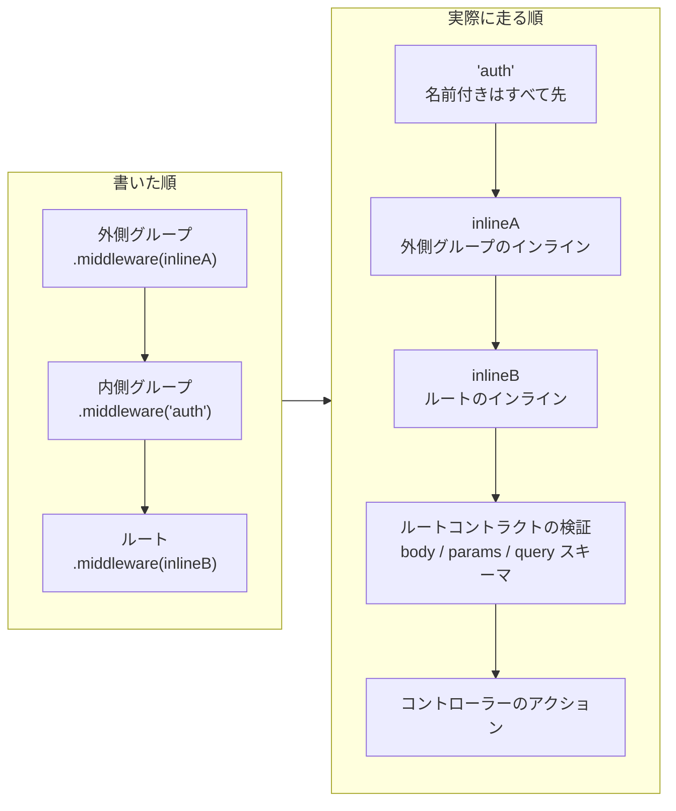

# ミドルウェアガイド

Guren のルートとアプリケーションは Hono のミドルウェアモデルを共有しつつ、よく使うケースで Laravel 風の書き心地を提供します。`Application` インスタンスにグローバル登録する方法と、ルート DSL で個別に付与する方法があります。

## グローバルミドルウェア

```ts
// src/app.ts
import { createApp, defineMiddleware } from '@guren/core'

const requestTimer = defineMiddleware(async (ctx, next) => {
  const started = performance.now()
  await next()
  const duration = Math.round(performance.now() - started)
  console.log(`${ctx.req.method} ${ctx.req.path} -> ${ctx.res.status} (${duration}ms)`)
})

const app = createApp()
app.use('*', requestTimer)
```

グローバルミドルウェアはルートがマウントされる前に実行されます。プロバイダーは `register()` フック内で `context.app.use()` を使ってミドルウェアを登録できます。

## ルートミドルウェア

```ts
import { Router } from '@guren/core'
import DashboardController from '@/app/Http/Controllers/DashboardController'
import { requireAuthenticated } from '@/app/Http/middleware/auth'

export function registerWebRoutes(router: Router): void {
  router.get('/dashboard', [DashboardController, 'index']).middleware(
    requireAuthenticated({ redirectTo: '/login' }),
  )
}
```

ルートミドルウェアは対象のエンドポイント（またはグループ内の全エンドポイント）だけに適用されます。

`.middleware()` にはハンドラー関数・登録済みのエイリアス名・その両方を混ぜて渡せます。解決は記述順ではなく種別ごとに行われ、そのルートのチェーンに含まれる名前付きミドルウェアがすべて、ハンドラー関数すべてより先に実行されます。これは1回の呼び出し内だけでなくグループをまたいでも同様で、外側グループのインラインハンドラーは内側グループの名前付きミドルウェアより**後**に実行されます（記述の見た目とは逆になります）。相対的な実行順が重要な場合は、すべてエイリアスで統一してください。



最後の 2 段は `.middleware()` では制御できません。ルートに紐づけたスキーマの検証は必ずミドルウェアをすべて通ったあと、アクションの直前に走ります。

また、`guren audit` が名前で報告できるのはエイリアスだけです。フレームワークが認識するガード（`requireAuthenticated()` と `requireGuest()`）はどちらの渡し方でも検出されますが、それ以外のミドルウェアはエイリアス登録しない限り audit からは見えません。

## ビルトインヘルパー

### `defineMiddleware`
Hono ミドルウェアを Guren の型期待値で注釈するユーティリティ。

### `createSessionMiddleware`
セッションオブジェクトをリクエストコンテキストへ付与するファクトリ。既定ではメモリストア（`MemorySessionStore`）を使い、署名付きクッキーで永続化します。

```ts
import { createSessionMiddleware } from '@guren/core'

app.use('*', createSessionMiddleware())
```

各リクエストは `ctx.get('guren:session')` または `getSessionFromContext(ctx)` でセッションにアクセスできます。

`store` には `SessionStore` そのものか、それを返す関数を渡せます。関数は最初のリクエストで実行されるので、ランタイムのバインディング(Workers)や接続(Redis)が要るストアを起動時に組み立てずに済みます。複数のストアを宣言して環境ごとに選ぶには、[認証](./authentication.md#sessionmanager-でストアを選ぶ)ガイドの `SessionManager` を参照してください。

### 認証ガード

`requireAuthenticated` と `requireGuest` は、事前に認証コンテキストがパイプラインへアタッチされていることを前提とした薄いラッパーです。`attachAuthContext` と組み合わせてガード実装を保存します。

```ts
import { attachAuthContext, requireAuthenticated } from '@guren/core'

app.use('*', attachAuthContext(() => authManager.createGuard('web')))
router.get('/settings', [SettingsController, 'index']).middleware(
  requireAuthenticated({ redirectTo: '/login' }),
)
```

認証モジュールは今後強化されますが、現状でもこの契約を使ってカスタムガードを配線できます。
