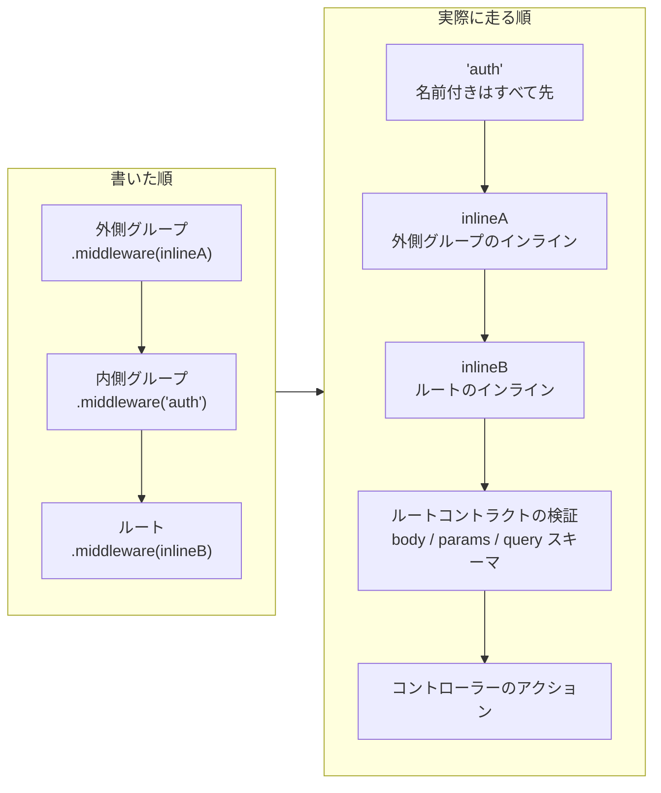

# ミドルウェアガイド

Guren のルートとアプリケーションは Hono のミドルウェアの仕組みをそのまま使っており、よく使う処理は Laravel に近い書き方で登録できます。登録のしかたは、`Application` インスタンスにグローバルに登録する方法と、ルート DSL でルートごとに付ける方法の 2 つです。

## グローバルミドルウェア

```ts
// src/app.ts
import { createApp, defineMiddleware } from '@guren/core'

const requestTimer = defineMiddleware(async (ctx, next) => {
  const started = performance.now()
  await next()
  const duration = Math.round(performance.now() - started)
  console.log(`${ctx.req.method} ${ctx.req.path} -> ${ctx.res.status} (${duration}ms)`)
})

const app = createApp()
app.use('*', requestTimer)
```

グローバルミドルウェアは、ルートがマウントされる前に実行されます。プロバイダーから登録する場合は、`register()` フックの中で `context.app.use()` を呼びます。

## ルートミドルウェア

```ts
import { Router } from '@guren/core'
import DashboardController from '@/app/Http/Controllers/DashboardController'
import { requireAuthenticated } from '@/app/Http/middleware/auth'

export function registerWebRoutes(router: Router): void {
  router.get('/dashboard', [DashboardController, 'index']).middleware(
    requireAuthenticated({ redirectTo: '/login' }),
  )
}
```

ルートミドルウェアは、付けたエンドポイントだけに適用されます。グループに付けた場合は、そのグループ内の全エンドポイントが対象です。

`.middleware()` には、ハンドラー関数と登録済みのエイリアス名のどちらも渡せ、両方を混ぜても構いません。ただし実行順は書いた位置ではなく種類で決まり、ルートのチェーンにある名前付きミドルウェアがすべて、ハンドラー関数より先に実行されます。この規則は 1 回の呼び出しの中だけでなく、グループをまたいでも同じです。そのため、外側のグループに書いたインラインハンドラーは、内側のグループの名前付きミドルウェアより**後**に実行され、見た目の順とは逆になります。実行の前後関係が問題になる場合は、すべてエイリアスでそろえてください。



図の最後の 2 段は、`.middleware()` では順番を動かせません。ルートに紐づけたスキーマは、ミドルウェアがすべて終わったあと、アクションの直前に必ず検証されます。

エイリアスには、`guren audit` の報告に名前が出るという利点もあります。フレームワークが認識するガード（`requireAuthenticated()` と `requireGuest()`）はどちらの渡し方でも検出されますが、それ以外のミドルウェアはエイリアスとして登録しないと audit には見えません。

## ビルトインヘルパー

### `defineMiddleware`
Hono のミドルウェアに、Guren が想定する型を付けるためのユーティリティです。

### `createSessionMiddleware`
リクエストコンテキストにセッションオブジェクトを付けるファクトリです。既定ではセッションをメモリストア（`MemorySessionStore`）に保存し、署名付きクッキーで引き継ぎます。

```ts
import { createSessionMiddleware } from '@guren/core'

app.use('*', createSessionMiddleware())
```

各リクエストの中では、`ctx.get('guren:session')` か `getSessionFromContext(ctx)` でセッションを取り出せます。

`store` には `SessionStore` そのものか、それを返す関数を渡します。関数はリクエストのたびに呼ばれるので、ランタイムのバインディング（Workers）や接続（Redis）が必要なストアを起動時に組み立てずに済みます。組み立てが重い場合は自分でメモ化してください（`SessionManager` はメモ化します）。複数のストアを宣言して環境ごとに切り替えたい場合は、[認証](./authentication.md#sessionmanager-でストアを選ぶ)ガイドの `SessionManager` を参照してください。

### 認証ガード

`requireAuthenticated` と `requireGuest` は薄いラッパーで、パイプラインのもっと手前で認証コンテキストが付けられていることを前提にしています。ガードの実装は `attachAuthContext` が保持するので、この 2 つと組み合わせて使ってください。

```ts
import { attachAuthContext, requireAuthenticated } from '@guren/core'

app.use('*', attachAuthContext(() => authManager.createGuard('web')))
router.get('/settings', [SettingsController, 'index']).middleware(
  requireAuthenticated({ redirectTo: '/login' }),
)
```

`redirectTo` が効くのはブラウザからのリクエストだけです。エージェントのツール呼び出し（[エージェントインターフェース](./agent-interface.md)を参照）はリダイレクトをたどれないため、どちらのガードも JSON で拒否を返します。ステータスは `requireAuthenticated` が `401`、`requireGuest` が `403` で、`status` を渡した場合はその値です。このとき、`redirectTo` と一緒に設定した `responseFactory` も使われません。

認証モジュールは今後も手を入れていきますが、今の時点でもこの契約に沿えばカスタムガードを組み込めます。
