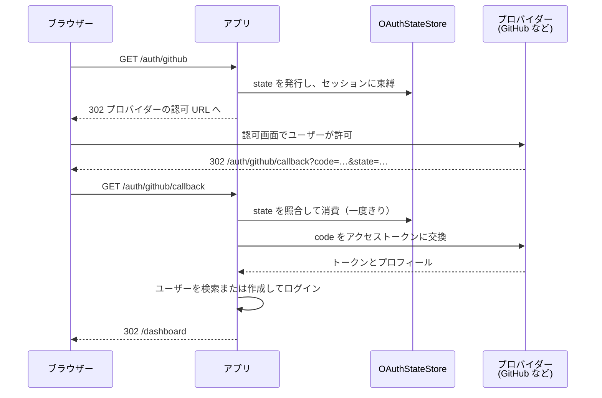

# OAuthガイド

Guren には、「GitHub / Google / Discordでサインイン」のようなログインを作るための OAuth 2.0 認可コードフローが入っています。リダイレクト、CSRF対策を含むstateの管理、トークンの交換、プロフィールの取得は Guren が受け持つので、アプリ側で書くのはログイン用のコントローラーと、セッションへのログイン処理だけです。

## コアコンセプト

- **OAuthManager**: プロバイダーを登録し、認可からコールバックまでの流れを進めます。
- **OAuthProviderConfig**: 1つのプロバイダー（GitHub、Google、Discord、または任意の OAuth 2.0 プロバイダー）について、クライアントID/シークレット、エンドポイント、スコープをまとめた設定です。
- **OAuthStateStore**: CSRFとオープンリダイレクト攻撃を防ぐための、一度しか使えないstateを保管する場所です。デフォルトはメモリですが、複数プロセスで動かす構成では `DatabaseOAuthStateStore`（またはRedis）を使います。
- **プロバイダーファクトリ**: `createGitHubOAuthProviderConfig`、`createGoogleOAuthProviderConfig`、`createDiscordOAuthProviderConfig` を使うと、各プロバイダーの決まったエンドポイントがあらかじめ設定されます。

フロー全体には 4 者が関わります。アプリにはブラウザーから 2 回リクエストが届き、その間で state ストアが「この `state` を発行したのは本当にこのブラウザーか」を確かめます。



## 基本的な使い方

### マネージャーの登録

`config/oauth.ts` では、`defineOAuthConfig` で作った定義を default export します。コールバックは検証済みの env を受け取り、登録するプロバイダーと state ストアを返します。定義はその戻り値から `OAuthManager` を組み立て、コンテナに `oauth` として束縛します。このファイルは `bunx guren add oauth` で生成できます。

```ts
// config/oauth.ts
import { DatabaseOAuthStateStore, defineOAuthConfig, type OAuthProviderConfig, createGitHubOAuthProviderConfig, createGoogleOAuthProviderConfig, createDiscordOAuthProviderConfig } from '@guren/core'
import { oauthStates } from '../db/schema.js'

export default defineOAuthConfig((env) => {
  // 3つのキーがすべて設定されたプロバイダーだけを登録します。設定が
  // 途中のプロバイダーは、プロバイダー側ではなくアプリ側で失敗します。
  const providers: Record<string, OAuthProviderConfig> = {}

  if (env.OAUTH_GITHUB_CLIENT_ID && env.OAUTH_GITHUB_CLIENT_SECRET && env.OAUTH_GITHUB_REDIRECT_URI) {
    providers.github = createGitHubOAuthProviderConfig({
      clientId: env.OAUTH_GITHUB_CLIENT_ID,
      clientSecret: env.OAUTH_GITHUB_CLIENT_SECRET,
      redirectUri: env.OAUTH_GITHUB_REDIRECT_URI,
    })
  }

  if (env.OAUTH_GOOGLE_CLIENT_ID && env.OAUTH_GOOGLE_CLIENT_SECRET && env.OAUTH_GOOGLE_REDIRECT_URI) {
    providers.google = createGoogleOAuthProviderConfig({
      clientId: env.OAUTH_GOOGLE_CLIENT_ID,
      clientSecret: env.OAUTH_GOOGLE_CLIENT_SECRET,
      redirectUri: env.OAUTH_GOOGLE_REDIRECT_URI,
    })
  }

  if (env.OAUTH_DISCORD_CLIENT_ID && env.OAUTH_DISCORD_CLIENT_SECRET && env.OAUTH_DISCORD_REDIRECT_URI) {
    providers.discord = createDiscordOAuthProviderConfig({
      clientId: env.OAUTH_DISCORD_CLIENT_ID,
      clientSecret: env.OAUTH_DISCORD_CLIENT_SECRET,
      redirectUri: env.OAUTH_DISCORD_REDIRECT_URI,
    })
  }

  return {
    providers,
    // 認可リダイレクトとコールバックは別のプロセスに届くことがあるので、
    // 両者を結びつける state はメモリではなくデータベースに置きます。
    stateStore: new DatabaseOAuthStateStore(oauthStates),
  }
})
```

各プロバイダーは `OAUTH_<PROVIDER>_CLIENT_ID`・`_CLIENT_SECRET`・`_REDIRECT_URI` の3つのキーを読みます。これらのキーは `config/env.ts` で宣言してください（[設定](./configuration.md#環境変数を宣言する)を参照）。`guren add oauth` を使えば、宣言も済んだ状態になります。`_REDIRECT_URI` には、`https://your.app/auth/github/callback` のようなコールバックの完全な URL を設定します。キーがそろっていないプロバイダーは登録されず、そのプロバイダーでフローを開始すると `OAuth provider "github" is not configured.` という例外が投げられます。

定義は `createApp({ config })` の配列に加えます。

```ts
// src/app.ts
import { createApp } from '@guren/core'
import database from '../config/database.js'
import env from '../config/env.js'
import oauth from '../config/oauth.js'

const app = createApp({
  env,
  config: [database, oauth],
})
```

OAuth をサービスプロバイダで設定しているアプリも、そのまま動きます。詳しくは[サービスプロバイダを使うアプリ](./configuration.md#サービスプロバイダを使うアプリ)を参照してください。

### ログインコントローラー

```ts
import { Controller, type OAuthManager } from '@guren/core'
import { z } from 'zod'
import { User } from '@/app/Models/User'

const CallbackQuerySchema = z.object({
  code: z.string(),
  state: z.string(),
})

export default class GitHubOAuthController extends Controller {
  private oauth(): OAuthManager {
    return this.make<OAuthManager>('oauth')
  }

  async start() {
    // セッションを渡すとフローがこのブラウザに束縛されます。
    // 詳細は下の「stateをブラウザに束縛する」を参照してください。
    const { url } = await this.oauth().authorize('github', {
      redirectTo: this.query('redirect_to'),
      session: this.auth.session(),
    })
    return this.redirect(url)
  }

  async callback() {
    const { code, state } = this.validateQuery(CallbackQuerySchema)
    const { profile, redirectTo } = await this.oauth().handleCallback('github', {
      code,
      state,
      session: this.auth.session(),
    })

    let user = await User.where('githubId', profile.id).first()
    if (!user) {
      user = await User.create({ email: profile.email, name: profile.name, githubId: profile.id })
    }

    await this.auth.login(user)
    return this.redirect(redirectTo ?? '/dashboard')
  }
}
```

### ルート

```ts
import { Router } from '@guren/core'
import GitHubOAuthController from '@/app/Http/Controllers/Auth/GitHubOAuthController'

export function registerWebRoutes(router: Router): void {
  router.get('/auth/github', [GitHubOAuthController, 'start'])
  router.get('/auth/github/callback', [GitHubOAuthController, 'callback'])
}
```

## stateをブラウザに束縛する

`state` は推測できず、一度しか使えません。それでも、それだけでは**別のブラウザに持ち込まれてしまいます**。攻撃者はまずアプリでフローを開始し、自分のプロバイダーアカウントで認可を済ませます。受け取った `code` は使わずに取っておき、あとは訪問者に次のURLを開かせるだけです。

```
https://your.app/auth/github/callback?code=<攻撃者のもの>&state=<攻撃者のもの>
```

この `code` と `state` の組には、どのブラウザがフローを開始したかを示す情報が何も無いので、コールバックは成功し、訪問者は**攻撃者のアカウント**にログインさせられます。そのあと訪問者が書いた投稿やアップロードしたファイル、登録した決済手段は、すべて攻撃者が読めるアカウントに入ってしまいます。

フローの開始時とコールバック時の両方でセッションを渡せば、この攻撃を防げます。

```ts
// フロー開始時
const { url } = await this.oauth().authorize('github', { session: this.auth.session() })

// コールバック時
await this.oauth().handleCallback('github', { code, state, session: this.auth.session() })
```

`authorize()` はフローごとに新しい値を作ってセッションに入れ、そのハッシュだけを state と一緒に保存します。`handleCallback()` はセッションからその値を読み出し（同時に削除し）、束縛が一致しない state を拒否します。セッションに書き込むことで、初めて訪れたユーザーのセッションもプロバイダーとの往復の間に消えずに残ります。そのため、コールバックのリクエストは同じセッションを持って戻ってきます。

束縛は state ごとに保持されるので、同じブラウザで複数のフローを同時に進めても（タブを2つ開いた場合や、プロバイダーを選び直した場合など）、お互いを無効にすることはありません。

`this.auth.session()` が `undefined` を返す場合（セッションミドルウェアが無いときなど）は、state は束縛されないまま処理されます。動かなくなることはありませんが、この攻撃からは守られません。

束縛をセッション以外の場所（暗号化Cookie、ネイティブアプリのセキュアストレージなど）に置きたい場合は、`bindTo` を使って自分で管理します。そのブラウザだけが提示できる値を `authorize()` に渡し、同じ値を `handleCallback()` にも渡してください。`session` と `bindTo` の両方を指定した場合は、`bindTo` が優先されます。

束縛したstateには短いマーカーが付きます。束縛されていることがストアだけでなくstate自体にも記録されるので、`binding` を保存できないストアを使っている場合は、ほかのブラウザでも使えるstateを黙って受け入れず、コールバックを拒否します。stateを自分で指定した場合も含めて、`authorize()` が返した `state` をそのまま使ってください。

> [!WARNING]
> `session` も `bindTo` も渡さずに `authorize()` を呼んでも、これまでどおり動きます。以前のAPIで書いたアプリが壊れることはありませんが、プロセスごとに一度警告が出ます。また、束縛を使い始めるまでは上の攻撃を受ける状態のままです。`make:auth` と `oauth` ブループリントは、束縛を使うコードを生成します。

## ログイン後のリダイレクト

フローの開始時に `redirectTo`（ユーザーがもともといたページなど）を渡すと、その値はプロバイダーとの往復の間も保持され、`handleCallback` の戻り値として返ってきます。

```ts
const { url } = await this.oauth().authorize('github', {
  redirectTo: '/settings/billing',
  session: this.auth.session(),
})
// ...後で、コールバック内で:
const { redirectTo } = await this.oauth().handleCallback('github', {
  code,
  state,
  session: this.auth.session(),
})
return this.redirect(redirectTo ?? '/dashboard')
```

`redirectTo` は自動でサニタイズされます。アプリ内の相対パス（`/settings/billing`）は常に許可されますが、絶対URLはホストが `allowedRedirectHosts` に含まれていなければ捨てられます。ログインしたユーザーを外部サイトへ飛ばすリンクを、攻撃者に作らせないための仕組みです。

許可するホストのリストは、定義の `stateConfig` に、プロバイダーや state ストアと並べて書きます。

```ts
// config/oauth.ts の defineOAuthConfig コールバック末尾
return {
  providers,
  stateStore: new DatabaseOAuthStateStore(oauthStates),
  stateConfig: {
    allowedRedirectHosts: ['app.example.com', '*.example.com'], // ワイルドカード対応
  },
}
```

## 組み込みプロバイダー

プロバイダーのエンドポイントとデフォルトのスコープはファクトリが設定するので、定義から渡すのは3つのキーだけです。上の `config/oauth.ts` では、3つのプロバイダーをすべて登録しています。

| プロバイダー | ファクトリ | キー |
|----------|---------|------|
| GitHub | `createGitHubOAuthProviderConfig` | `OAUTH_GITHUB_CLIENT_ID`, `OAUTH_GITHUB_CLIENT_SECRET`, `OAUTH_GITHUB_REDIRECT_URI` |
| Google | `createGoogleOAuthProviderConfig` | `OAUTH_GOOGLE_CLIENT_ID`, `OAUTH_GOOGLE_CLIENT_SECRET`, `OAUTH_GOOGLE_REDIRECT_URI` |
| Discord | `createDiscordOAuthProviderConfig` | `OAUTH_DISCORD_CLIENT_ID`, `OAUTH_DISCORD_CLIENT_SECRET`, `OAUTH_DISCORD_REDIRECT_URI` |

使わないプロバイダーは、そのブロックと `config/env.ts` のキーを削除してください。

### 任意の OAuth 2.0 プロバイダー

ファクトリの無いプロバイダーでは、エンドポイントを直接指定します。ユーザー情報のレスポンスを整形する必要があれば、`mapProfile` 関数も渡します。`config/oauth.ts` の `providers` に追加し、`OAUTH_GITLAB_*` の3つのキーを `config/env.ts` で宣言してください。

```ts
// config/oauth.ts の defineOAuthConfig コールバック内
if (env.OAUTH_GITLAB_CLIENT_ID && env.OAUTH_GITLAB_CLIENT_SECRET && env.OAUTH_GITLAB_REDIRECT_URI) {
  providers.gitlab = {
    clientId: env.OAUTH_GITLAB_CLIENT_ID,
    clientSecret: env.OAUTH_GITLAB_CLIENT_SECRET,
    redirectUri: env.OAUTH_GITLAB_REDIRECT_URI,
    authorizeUrl: 'https://gitlab.com/oauth/authorize',
    tokenUrl: 'https://gitlab.com/oauth/token',
    userInfoUrl: 'https://gitlab.com/api/v4/user',
    scopes: ['read_user'],
    mapProfile: (raw, token) => ({
      id: String(raw.id),
      email: raw.email as string | undefined,
      name: raw.name as string | undefined,
      avatar: raw.avatar_url as string | undefined,
      token,
      raw,
    }),
  }
}
```

`createOAuthManager()` でマネージャーを自分で組み立てた場合は、同じオブジェクトを `manager.registerProvider('gitlab', config)` で登録できます。[後述のテスト](#テスト)では、組み込みのファクトリを使って同じことをしています。

## プロバイダーによるメールアドレスの検証状態

プロバイダーがメールアドレスを返しても、そのアドレスが検証済みだとは限りません。多くのプロバイダーは検証状態を別のフィールドで返しており（Google は OIDC の `email_verified`、Discord は `verified`）、プロフィールでは `profile.emailVerified` として読めます。

| 値 | 意味 |
|----|------|
| `true` | プロバイダーが検証済みと報告している |
| `false` | プロバイダーが未検証と報告している |
| `undefined` | プロバイダーがこの情報を返していない（アプリ側で方針を決める） |

`false` の場合は、アカウントの**新規作成**を拒否してください。未検証のアドレスをそのまま受け入れると、自分のものではないメールアドレスを名乗れてしまいます。重複したメールアドレスを拒否するコールバックでは、本来の持ち主がそのアドレスで二度とログインできなくなります。このチェックはアカウントを作る処理にだけ入れてください。そうすれば、すでに紐付いているアカウントが、あとから検証状態が変わったことで締め出されることもありません。

```ts
if (!user && profile.emailVerified === false) {
  throw ValidationException.withMessages({
    message: 'Your provider has not verified this email address.',
  })
}
```

組み込みのプリセットは、それぞれのキーをすでに宣言しています。自分で登録するプロバイダーが標準以外のキー名を使う場合は、`emailVerifiedKey` を設定してください。デフォルトでは OIDC の `email_verified` を読み、値が boolean のときだけ検証状態として扱います。

```ts
const discordish: OAuthProviderConfig = {
  // ...
  emailVerifiedKey: 'verified',
}
```

`mapProfile` はプロフィールの変換をすべて受け持つので、`mapProfile` を使うプロバイダーでは `emailVerified` も自分で設定することになり、`emailVerifiedKey` は無視されます。GitHub の `/user` には検証状態のフィールドが無いので、`emailVerified` は `undefined` のままです。ただし、メールアドレスが非公開のときのフォールバックが動いた場合は別です。`/user/emails` は検証済みのプライマリアドレスしか返さないからです。

`fetchFallbackEmail` は、メールアドレスを含まないレスポンスに対して呼ばれます。そのため、上のキーの値はフォールバックが返したアドレスの検証状態を示しません。文字列をそのまま返すと検証状態は何も示されず、`undefined` のままです。検証状態を示したい場合は、オブジェクトを返してください。

```ts
fetchFallbackEmail: async (token) => ({ email: await lookupEmail(token), emailVerified: true }),
```

## Stateストレージ

コールバックを元のリクエストと結び付ける一度きりの `state` の値は、サーバー側に保存されます。デフォルトの `MemoryOAuthStateStore` は、1つのプロセスで動かす開発環境なら問題なく使えます。ロードバランサーの後ろやサーバーレスのように複数のプロセスで動かす本番環境では、共有のストレージが必要です。そうしないと、stateを発行したのとは別のプロセスにコールバックが届くことがあります。

ほとんどのアプリでは、`DatabaseOAuthStateStore` を選んでおけば十分です。アプリがすでに使っているデータベースにstateを保存するので、インフラを追加する必要はありません。`guren add oauth` と `make:auth --oauth` は、このストアを定義の `stateStore` に渡すコードを生成します（[マネージャーの登録](#マネージャーの登録)を参照）。ストアが読み書きするのは `oauth_states` テーブルです。

```ts
// db/schema.ts（sqliteダイアレクトの例）
export const oauthStates = sqliteTable('oauth_states', {
  stateHash: text('state_hash').primaryKey(),
  provider: text('provider').notNull(),
  redirectTo: text('redirect_to'),
  expiresAt: integer('expires_at', { mode: 'timestamp_ms' }).notNull(),
  binding: text('binding'),
})
```

`binding` 列には、[stateをブラウザに束縛する](#stateをブラウザに束縛する)で使うハッシュが入ります。この列が無いと、ストアは束縛を保存できません。束縛したstateがすべて束縛の無い状態で戻ってくるので、`handleCallback` は「Invalid or expired OAuth state」として拒否します。どのストアが原因かは、コンソールの警告に出ます。`session` / `bindTo` を使う前に、この列を追加してください。

stateの行が消えるのはコールバックが届いたときなので、途中でやめたサインインの行は残ったままになります。`guren add oauth` が登録するコンソールコマンド `oauth-states:prune` を定期実行すれば、期限切れの行をまとめて削除できます。このコマンドは、`oauth` に束縛されたストアに対して `OAuthManager.pruneExpiredStates()` を呼びます。すでにRedisを運用しているアプリなら、引き続きRedisも使えます。Redisではキーが自動で期限切れになります。`REDIS_URL` は `config/env.ts` で宣言してください。

```ts
// config/oauth.ts
import { defineOAuthConfig } from '@guren/core'
import { createRedisClient, RedisOAuthStateStore } from '@guren/core/redis'

export default defineOAuthConfig((env) => ({
  providers: {
    // マネージャーの登録と同じく、プロバイダーごとに1エントリ
  },
  stateStore: new RedisOAuthStateStore(createRedisClient({ url: env.REDIS_URL })),
}))
```

キャッシュやキューのドライバと違って、`stateStore` にはファクトリではなく値そのものを渡します。そのため、このクライアントは最初のサインインのときではなく、アプリの起動時に接続します。

## 設定オプション

```ts
interface OAuthProviderConfig {
  clientId: string
  clientSecret: string
  redirectUri: string
  authorizeUrl: string
  tokenUrl: string
  userInfoUrl: string
  scopes?: string[]
  tokenAuthMethod?: 'client_secret_post' | 'client_secret_basic'
  userInfoMethod?: 'GET' | 'POST'
  mapProfile?: (raw: Record<string, unknown>, token: OAuthTokenResult) => OAuthUserProfile
  emailVerifiedKey?: string      // 検証状態を持つユーザー情報のキー（デフォルト: 'email_verified'）
}

interface OAuthStateConfig {
  expiresIn?: number             // stateのTTL（ミリ秒、デフォルト: 10分）
  stateLength?: number           // ランダムstateのバイト数（デフォルト: 24）
  hashAlgorithm?: 'sha256' | 'sha512'
  allowedRedirectHosts?: string[] // 許可する絶対URLの redirectTo ホスト（ワイルドカード対応）
}
```

## テスト

```ts
import { describe, test, expect } from 'bun:test'
import { OAuthManager, MemoryOAuthStateStore, createGitHubOAuthProviderConfig } from '@guren/core'

describe('GitHub OAuth', () => {
  test('stateを含む認可URLを生成する', async () => {
    const oauth = new OAuthManager({ stateStore: new MemoryOAuthStateStore() })
    oauth.registerProvider('github', createGitHubOAuthProviderConfig({
      clientId: 'test-client',
      clientSecret: 'test-secret',
      redirectUri: 'http://localhost:3000/auth/github/callback',
    }))

    const { url, state } = await oauth.authorize('github')

    expect(url).toContain('github.com/login/oauth/authorize')
    expect(url).toContain(`state=${state}`)
  })
})
```

## ベストプラクティス

1. **state検証を省略しない**: `handleCallback` はstateを自動で検証し、使用済みにします。`code` だけを信用する独自のコールバックは書かないでください。あわせて、`session`（または `bindTo`）も必ず渡してください。stateを検証するだけでは、同じブラウザでフローが始まったかどうかまでは分かりません（[stateをブラウザに束縛する](#stateをブラウザに束縛する)を参照）。

2. **`allowedRedirectHosts` を明示的に設定する**: 設定しなければ、`redirectTo` にはアプリ内の相対パスだけが許可されます（いちばん安全なデフォルトです）。ログイン後に別のドメインへリダイレクトする場合に限って、ホストを追加してください。

3. **本番環境では共有のstateストアを使う**: `MemoryOAuthStateStore` が正しく動くのは、1回のログインのリクエストがすべて同じプロセスに届く場合だけです。`DatabaseOAuthStateStore`（インフラの追加は不要）か `RedisOAuthStateStore` を使ってください。

4. **アカウントはメールアドレスではなくプロバイダーIDで照合する**: プロバイダーの `profile.id` を、ユーザーモデルに（`githubId` のような列で）保存してください。メールアドレスは未検証のこともあり、プロバイダーをまたいで同じアドレスが使われることもあります。

5. **スコープは必要最小限にする**: 各プロバイダーファクトリは、デフォルトで小さめのスコープ（GitHubなら `read:user user:email`）を要求します。必要なときだけ広げてください。
