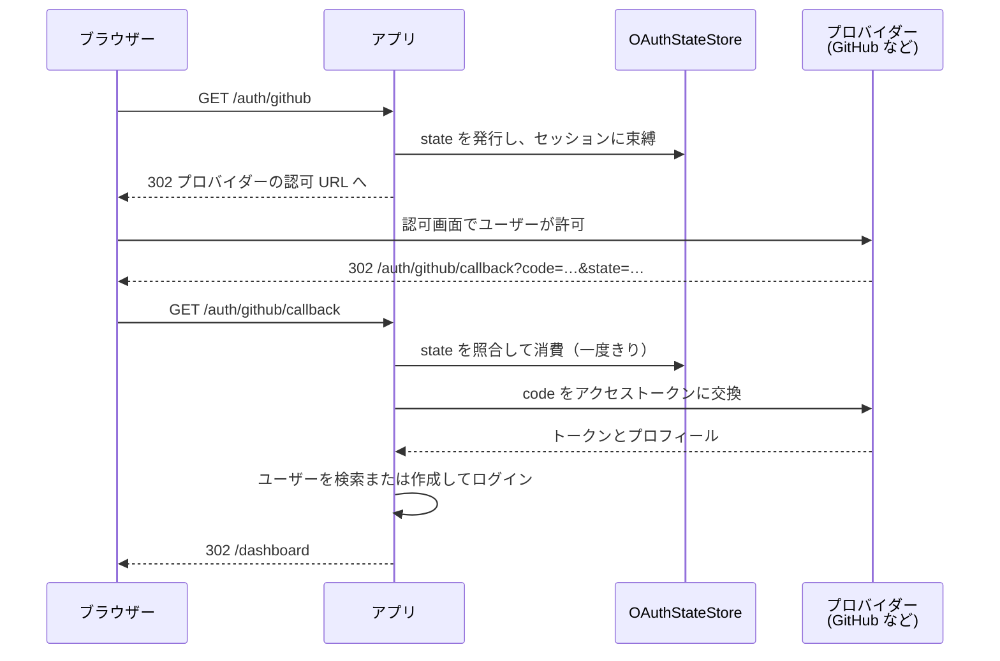

# OAuthガイド

Guren には「GitHub / Google / Discordでサインイン」のようなログインを実装するための OAuth 2.0 認可コードフローが用意されています。リダイレクト、CSRF対策込みのstate管理、トークン交換、プロフィール取得までは Guren 側で行うので、ログインコントローラーとセッションへの組み込みだけを書けば済みます。

## コアコンセプト

- **OAuthManager**: プロバイダーを登録し、認可からコールバックまでの流れを進めます。
- **OAuthProviderConfig**: 1つのプロバイダー（GitHub、Google、Discord、または任意の OAuth 2.0 プロバイダー）のクライアントID/シークレット、エンドポイント、スコープ。
- **OAuthStateStore**: CSRFとオープンリダイレクト攻撃を防ぐ、一度限りのstateの保管場所。デフォルトはメモリで、マルチプロセス構成では `DatabaseOAuthStateStore`（またはRedis）を使います。
- **プロバイダーファクトリ**: `createGitHubOAuthProviderConfig`、`createGoogleOAuthProviderConfig`、`createDiscordOAuthProviderConfig` が、各プロバイダーの既知のエンドポイントをあらかじめ埋めてくれます。

フロー全体には 4 者が登場します。アプリはブラウザーを 2 回受け取り、その間に state ストアが「この `state` を発行したのは本当にこのブラウザーか」を答えます。



## 基本的な使い方

### マネージャーの登録

`config/oauth.ts` は `defineOAuthConfig` の定義を default export します。コールバックは検証済みの env を受け取り、登録するプロバイダーと state ストアを返します。定義はそれをもとに `OAuthManager` を組み立て、コンテナに `oauth` として束縛します。このファイルは `bunx guren add oauth` が生成します。

```ts
// config/oauth.ts
import { DatabaseOAuthStateStore, defineOAuthConfig, type OAuthProviderConfig, createGitHubOAuthProviderConfig, createGoogleOAuthProviderConfig, createDiscordOAuthProviderConfig } from '@guren/core'
import { oauthStates } from '../db/schema.js'

export default defineOAuthConfig((env) => {
  // 3つのキーがすべて設定されたプロバイダーだけを登録します。設定が
  // 途中のプロバイダーは、プロバイダー側ではなくアプリ側で失敗します。
  const providers: Record<string, OAuthProviderConfig> = {}

  if (env.OAUTH_GITHUB_CLIENT_ID && env.OAUTH_GITHUB_CLIENT_SECRET && env.OAUTH_GITHUB_REDIRECT_URI) {
    providers.github = createGitHubOAuthProviderConfig({
      clientId: env.OAUTH_GITHUB_CLIENT_ID,
      clientSecret: env.OAUTH_GITHUB_CLIENT_SECRET,
      redirectUri: env.OAUTH_GITHUB_REDIRECT_URI,
    })
  }

  if (env.OAUTH_GOOGLE_CLIENT_ID && env.OAUTH_GOOGLE_CLIENT_SECRET && env.OAUTH_GOOGLE_REDIRECT_URI) {
    providers.google = createGoogleOAuthProviderConfig({
      clientId: env.OAUTH_GOOGLE_CLIENT_ID,
      clientSecret: env.OAUTH_GOOGLE_CLIENT_SECRET,
      redirectUri: env.OAUTH_GOOGLE_REDIRECT_URI,
    })
  }

  if (env.OAUTH_DISCORD_CLIENT_ID && env.OAUTH_DISCORD_CLIENT_SECRET && env.OAUTH_DISCORD_REDIRECT_URI) {
    providers.discord = createDiscordOAuthProviderConfig({
      clientId: env.OAUTH_DISCORD_CLIENT_ID,
      clientSecret: env.OAUTH_DISCORD_CLIENT_SECRET,
      redirectUri: env.OAUTH_DISCORD_REDIRECT_URI,
    })
  }

  return {
    providers,
    // 認可リダイレクトとコールバックは別のプロセスに届くことがあるので、
    // 両者を結びつける state はメモリではなくデータベースに置きます。
    stateStore: new DatabaseOAuthStateStore(oauthStates),
  }
})
```

各プロバイダーが読むのは `OAUTH_<PROVIDER>_CLIENT_ID`・`_CLIENT_SECRET`・`_REDIRECT_URI` の3つのキーで、`config/env.ts` で宣言します（[設定](./configuration.md#環境変数を宣言する)を参照）。`guren add oauth` を使えば宣言まで済みます。`_REDIRECT_URI` には `https://your.app/auth/github/callback` のようなコールバックの完全な URL を設定します。キーがそろっていないプロバイダーは登録されず、そのフローを開始すると `OAuth provider "github" is not configured.` がスローされます。

定義は `createApp({ config })` に並べます。

```ts
// src/app.ts
import { createApp } from '@guren/core'
import database from '../config/database.js'
import env from '../config/env.js'
import oauth from '../config/oauth.js'

const app = createApp({
  env,
  config: [database, oauth],
})
```

サービスプロバイダで `oauth` を束縛しているアプリもそのまま動きます。[サービスプロバイダを使うアプリ](./configuration.md#サービスプロバイダを使うアプリ)を参照してください。

### ログインコントローラー

```ts
import { Controller, type OAuthManager } from '@guren/core'
import { z } from 'zod'
import { User } from '@/app/Models/User'

const CallbackQuerySchema = z.object({
  code: z.string(),
  state: z.string(),
})

export default class GitHubOAuthController extends Controller {
  private oauth(): OAuthManager {
    return this.make<OAuthManager>('oauth')
  }

  async start() {
    // セッションを渡すとフローがこのブラウザに束縛されます。
    // 詳細は下の「stateをブラウザに束縛する」を参照してください。
    const { url } = await this.oauth().authorize('github', {
      redirectTo: this.query('redirect_to'),
      session: this.auth.session(),
    })
    return this.redirect(url)
  }

  async callback() {
    const { code, state } = this.validateQuery(CallbackQuerySchema)
    const { profile, redirectTo } = await this.oauth().handleCallback('github', {
      code,
      state,
      session: this.auth.session(),
    })

    let user = await User.where('githubId', profile.id).first()
    if (!user) {
      user = await User.create({ email: profile.email, name: profile.name, githubId: profile.id })
    }

    await this.auth.login(user)
    return this.redirect(redirectTo ?? '/dashboard')
  }
}
```

### ルート

```ts
import { Router } from '@guren/core'
import GitHubOAuthController from '@/app/Http/Controllers/Auth/GitHubOAuthController'

export function registerWebRoutes(router: Router): void {
  router.get('/auth/github', [GitHubOAuthController, 'start'])
  router.get('/auth/github/callback', [GitHubOAuthController, 'callback'])
}
```

## stateをブラウザに束縛する

`state` は推測できず一度しか使えませんが、それだけでは**別のブラウザに移し替えられてしまいます**。攻撃者はまずアプリでフローを開始し、自分のプロバイダーアカウントで認可を済ませます。そして受け取った `code` を未消費のまま持っておき、訪問者に次のURLを開かせるだけです。

```
https://your.app/auth/github/callback?code=<攻撃者のもの>&state=<攻撃者のもの>
```

この組み合わせには「どのブラウザが開始したか」を示す情報が何もないため、コールバックは成功し、訪問者は**攻撃者のアカウント**にログインさせられます。その後に訪問者が書いた投稿、アップロード、登録した決済手段は、すべて攻撃者が読めるアカウントに入ります。

開始時とコールバック時の両方でセッションを渡せば塞げます。

```ts
// フロー開始時
const { url } = await this.oauth().authorize('github', { session: this.auth.session() })

// コールバック時
await this.oauth().handleCallback('github', { code, state, session: this.auth.session() })
```

`authorize()` はフローごとに新しい値を発行してセッションに保持し、そのハッシュだけを state と一緒に保存します。`handleCallback()` は値を読み戻し（同時に削除し）、束縛が一致しない state を拒否します。セッションへの書き込みには、初回訪問者のセッションをプロバイダーとの往復をまたいで残す役割もあります。そのおかげで、コールバックのリクエストが同じセッションを持って戻ってきます。

束縛は state 単位で保持されるので、同じブラウザで複数のフローを並行させても（タブを2つ開く、プロバイダーを選び直す）互いに無効化しません。

`this.auth.session()` が `undefined` を返す場合（セッションミドルウェアが無い等）は、そのまま未束縛で通ります。動かなくなることはありませんが、保護もされません。

束縛をセッション以外の場所に置きたい場合（暗号化Cookie、ネイティブアプリのセキュアストレージなど）は、`bindTo` で自分で管理します。そのブラウザだけが提示できる値を `authorize()` に渡し、同じ値を `handleCallback()` にも渡してください。両方指定した場合は `bindTo` が優先されます。

束縛済みのstateには短いマーカーが付きます。束縛されているという事実がストアだけでなくstate自体にも乗るため、`binding` を保存できないストアでは、転送可能なstateを黙って受け入れるのではなくコールバックを拒否します。自分でstateを指定した場合も含めて、`authorize()` が返した `state` をそのまま使ってください。

> [!WARNING]
> `session` も `bindTo` も渡さない `authorize()` は従来どおり動くので、以前のAPIで書かれたアプリは壊れません。ただしプロセスごとに一度警告を出しますし、束縛を使い始めるまでは上記の攻撃に晒されたままです。`make:auth` と `oauth` ブループリントは束縛版を生成します。

## ログイン後のリダイレクト

フロー開始時に `redirectTo`（ユーザーが元々いたページなど）を渡すと、プロバイダーとの往復を経ても保持され、`handleCallback` から返ってきます。

```ts
const { url } = await this.oauth().authorize('github', {
  redirectTo: '/settings/billing',
  session: this.auth.session(),
})
// ...後で、コールバック内で:
const { redirectTo } = await this.oauth().handleCallback('github', {
  code,
  state,
  session: this.auth.session(),
})
return this.redirect(redirectTo ?? '/dashboard')
```

`redirectTo` は自動的にサニタイズされます。アプリ相対パス（`/settings/billing`）は常に許可されますが、絶対URLは `allowedRedirectHosts` にホストが含まれていない限り破棄されます。攻撃者がログイン後のユーザーを外部サイトへ飛ばすリンクを細工するのを防ぐためです。

許可リストはマネージャーの `stateConfig` に含まれますが、`defineOAuthConfig` が受け取るのは `providers` と `stateStore` だけです。許可リストが必要なアプリは、サービスプロバイダの `register()` で `oauth` を束縛し、`createApp({ config })` から `config/oauth.ts` を外します。同じキーを二重に束縛すると起動に失敗するためです。

```ts
// app/Providers/OAuthProvider.ts
import { createOAuthManager, DatabaseOAuthStateStore, ServiceProvider } from '@guren/core'
import { oauthStates } from '../../db/schema.js'

export default class OAuthProvider extends ServiceProvider {
  register(): void {
    this.container.singleton('oauth', () => {
      const manager = createOAuthManager({
        stateStore: new DatabaseOAuthStateStore(oauthStates),
        stateConfig: {
          allowedRedirectHosts: ['app.example.com', '*.example.com'], // ワイルドカード対応
        },
      })
      // config/oauth.ts と同じく、各プロバイダーを manager.registerProvider() で登録します。
      return manager
    })
  }
}
```

## 組み込みプロバイダー

各ファクトリがプロバイダーのエンドポイントとデフォルトのスコープを埋めるので、定義から渡すのは3つのキーだけです。上の `config/oauth.ts` は3つとも登録しています。

| プロバイダー | ファクトリ | キー |
|----------|---------|------|
| GitHub | `createGitHubOAuthProviderConfig` | `OAUTH_GITHUB_CLIENT_ID`, `OAUTH_GITHUB_CLIENT_SECRET`, `OAUTH_GITHUB_REDIRECT_URI` |
| Google | `createGoogleOAuthProviderConfig` | `OAUTH_GOOGLE_CLIENT_ID`, `OAUTH_GOOGLE_CLIENT_SECRET`, `OAUTH_GOOGLE_REDIRECT_URI` |
| Discord | `createDiscordOAuthProviderConfig` | `OAUTH_DISCORD_CLIENT_ID`, `OAUTH_DISCORD_CLIENT_SECRET`, `OAUTH_DISCORD_REDIRECT_URI` |

提供しないプロバイダーは、そのブロックと `config/env.ts` のキーを削除してください。

### 任意の OAuth 2.0 プロバイダー

ファクトリの無いプロバイダーには、エンドポイントをそのまま指定します。ユーザー情報レスポンスを正規化する必要があれば `mapProfile` 関数も渡します。`config/oauth.ts` の `providers` に追加し、`OAUTH_GITLAB_*` の3つのキーを `config/env.ts` で宣言してください。

```ts
// config/oauth.ts の defineOAuthConfig コールバック内
if (env.OAUTH_GITLAB_CLIENT_ID && env.OAUTH_GITLAB_CLIENT_SECRET && env.OAUTH_GITLAB_REDIRECT_URI) {
  providers.gitlab = {
    clientId: env.OAUTH_GITLAB_CLIENT_ID,
    clientSecret: env.OAUTH_GITLAB_CLIENT_SECRET,
    redirectUri: env.OAUTH_GITLAB_REDIRECT_URI,
    authorizeUrl: 'https://gitlab.com/oauth/authorize',
    tokenUrl: 'https://gitlab.com/oauth/token',
    userInfoUrl: 'https://gitlab.com/api/v4/user',
    scopes: ['read_user'],
    mapProfile: (raw, token) => ({
      id: String(raw.id),
      email: raw.email as string | undefined,
      name: raw.name as string | undefined,
      avatar: raw.avatar_url as string | undefined,
      token,
      raw,
    }),
  }
}
```

`createOAuthManager()` で自分で組み立てたマネージャーなら、同じオブジェクトを `manager.registerProvider('gitlab', config)` で登録できます。[後述のテスト](#テスト)では組み込みファクトリで同じことをしています。

## プロバイダーによるメールアドレスの検証状態

プロバイダーがメールアドレスを返したからといって、そのアドレスを検証済みだと主張しているわけではありません。多くのプロバイダーは検証状態を別のフィールドで報告しており（Google は OIDC の `email_verified`、Discord は `verified`）、プロフィールでは `profile.emailVerified` として読めます。

| 値 | 意味 |
|----|------|
| `true` | プロバイダーが検証済みと報告している |
| `false` | プロバイダーが未検証と報告している |
| `undefined` | プロバイダーがこの情報を返していない（アプリ側で方針を決める） |

`false` の場合はアカウントの**新規作成**を拒否してください。未検証のアドレスをそのまま受け入れると、所有していないメールアドレスを名乗れてしまいます。重複メールを弾くコールバックでは、本来の所有者がそのアドレスで二度とログインできなくなります。チェックは作成パスだけに置いてください。そうすれば、既に紐付け済みのアカウントが後からの状態変化で締め出されることもありません。

```ts
if (!user && profile.emailVerified === false) {
  throw ValidationException.withMessages({
    message: 'Your provider has not verified this email address.',
  })
}
```

組み込みプリセットは自分のキーを宣言済みです。自前で登録するプロバイダーが標準以外のキー名を使う場合は `emailVerifiedKey` を設定してください。デフォルトでは OIDC の `email_verified` を読み、boolean の値だけを有効な情報として扱います。

```ts
const discordish: OAuthProviderConfig = {
  // ...
  emailVerifiedKey: 'verified',
}
```

`mapProfile` はマッピング全体を担うので、これを使うプロバイダーでは `emailVerified` も自分で設定することになり、`emailVerifiedKey` は無視されます。GitHub の `/user` には検証状態のフィールドがないため、`emailVerified` は `undefined` のままです。例外はメールアドレス非公開時のフォールバックが動いた場合で、`/user/emails` は検証済みのプライマリアドレスしか返さないためです。

`fetchFallbackEmail` が呼ばれるのは、メールアドレスを含まないレスポンスから上記のキーを読んだ後です。そのため、キーの値がフォールバックの戻り値まで保証することはありません。文字列をそのまま返した場合、検証状態は主張されず `undefined` のままです。主張したい場合はオブジェクトを返してください。

```ts
fetchFallbackEmail: async (token) => ({ email: await lookupEmail(token), emailVerified: true }),
```

## Stateストレージ

コールバックを元のリクエストに結びつける一度限りの `state` 値は、サーバー側で保存されます。デフォルトの `MemoryOAuthStateStore` は単一プロセスの開発環境なら動きますが、複数プロセス（ロードバランサー、サーバーレス）構成の本番環境では共有ストレージが要ります。そうしないと、コールバックがstateを発行していないプロセスに届いてしまうことがあります。

ほとんどのアプリでは `DatabaseOAuthStateStore` を選んでおけば十分です。アプリが既に使っているデータベースにstateを保存するので、追加のインフラは要りません。`guren add oauth` と `make:auth --oauth` は、これを定義の `stateStore` に渡します:

```ts
// config/oauth.ts
import { DatabaseOAuthStateStore, defineOAuthConfig } from '@guren/core'
import { oauthStates } from '../db/schema.js'

export default defineOAuthConfig(() => ({
  providers: {
    // マネージャーの登録と同じく、プロバイダーごとに1エントリ
  },
  stateStore: new DatabaseOAuthStateStore(oauthStates),
}))
```

```ts
// db/schema.ts（sqliteダイアレクトの例）
export const oauthStates = sqliteTable('oauth_states', {
  stateHash: text('state_hash').primaryKey(),
  provider: text('provider').notNull(),
  redirectTo: text('redirect_to'),
  expiresAt: integer('expires_at', { mode: 'timestamp_ms' }).notNull(),
  binding: text('binding'),
})
```

`binding` 列は[stateをブラウザに束縛する](#stateをブラウザに束縛する)で使うハッシュを保持します。この列が無いとストアは束縛を保存できません。束縛済みのstateがすべて未束縛で戻ってくるため、`handleCallback` は「Invalid or expired OAuth state」として拒否します。原因のストアはコンソールの警告が示します。`session` / `bindTo` を使う前に列を追加してください。

state行が消えるのはコールバックが届いたときなので、途中で放棄されたサインインの行はそのまま残ります。`guren add oauth` が登録するコンソールコマンド `oauth-states:prune` をスケジュールすると、期限切れの行をまとめて削除できます。このコマンドは `oauth` に束縛されたストアに対して `OAuthManager.pruneExpiredStates()` を呼びます。既にRedisを運用しているアプリなら、Redisも引き続き使えます。Redisはキーを自分で期限切れにします。`REDIS_URL` は `config/env.ts` で宣言してください:

```ts
// config/oauth.ts
import { defineOAuthConfig } from '@guren/core'
import { createRedisClient, RedisOAuthStateStore } from '@guren/core/redis'

export default defineOAuthConfig((env) => ({
  providers: {
    // マネージャーの登録と同じく、プロバイダーごとに1エントリ
  },
  stateStore: new RedisOAuthStateStore(createRedisClient({ url: env.REDIS_URL })),
}))
```

キャッシュやキューのドライバと違い、`stateStore` はファクトリではなく値です。そのためこのクライアントは最初のサインイン時ではなく、アプリの起動時に接続します。

## 設定オプション

```ts
interface OAuthProviderConfig {
  clientId: string
  clientSecret: string
  redirectUri: string
  authorizeUrl: string
  tokenUrl: string
  userInfoUrl: string
  scopes?: string[]
  tokenAuthMethod?: 'client_secret_post' | 'client_secret_basic'
  userInfoMethod?: 'GET' | 'POST'
  mapProfile?: (raw: Record<string, unknown>, token: OAuthTokenResult) => OAuthUserProfile
  emailVerifiedKey?: string      // 検証状態を持つユーザー情報のキー（デフォルト: 'email_verified'）
}

interface OAuthStateConfig {
  expiresIn?: number             // stateのTTL（ミリ秒、デフォルト: 10分）
  stateLength?: number           // ランダムstateのバイト数（デフォルト: 24）
  hashAlgorithm?: 'sha256' | 'sha512'
  allowedRedirectHosts?: string[] // 許可する絶対URLの redirectTo ホスト（ワイルドカード対応）
}
```

## テスト

```ts
import { describe, test, expect } from 'bun:test'
import { OAuthManager, MemoryOAuthStateStore, createGitHubOAuthProviderConfig } from '@guren/core'

describe('GitHub OAuth', () => {
  test('stateを含む認可URLを生成する', async () => {
    const oauth = new OAuthManager({ stateStore: new MemoryOAuthStateStore() })
    oauth.registerProvider('github', createGitHubOAuthProviderConfig({
      clientId: 'test-client',
      clientSecret: 'test-secret',
      redirectUri: 'http://localhost:3000/auth/github/callback',
    }))

    const { url, state } = await oauth.authorize('github')

    expect(url).toContain('github.com/login/oauth/authorize')
    expect(url).toContain(`state=${state}`)
  })
})
```

## ベストプラクティス

1. **state検証を省略しない**: `handleCallback` は自動的にstateを検証・消費します。`code` だけを信頼するカスタムコールバックを実装しないでください。併せて `session`（または `bindTo`）も必ず渡してください。state検証だけでは「同じブラウザでフローが始まったか」は分かりません（[stateをブラウザに束縛する](#stateをブラウザに束縛する)を参照）。

2. **`allowedRedirectHosts` を明示的に設定する**: 設定しない場合、アプリ相対パスの `redirectTo` のみが許可されます（最も安全なデフォルト）。ログイン後に別ドメインへリダイレクトする場合のみホストを追加してください。

3. **本番環境では共有stateストアを使う**: `MemoryOAuthStateStore` は同じログインからのすべてのリクエストが同一プロセスに届く場合にのみ機能します。`DatabaseOAuthStateStore`（追加インフラ不要）か `RedisOAuthStateStore` を使ってください。

4. **メールアドレスではなくプロバイダーIDでアカウントを照合する**: プロバイダーの `profile.id`（例: `githubId`）をユーザーモデルに保存してください。メールアドレスは未検証だったり、プロバイダー間で使い回されたりする場合があります。

5. **必要最小限のスコープをリクエストする**: 各プロバイダーファクトリはデフォルトで小さめのスコープセット（例: GitHubの `read:user user:email`）を使用します。必要な場合のみ拡張してください。
