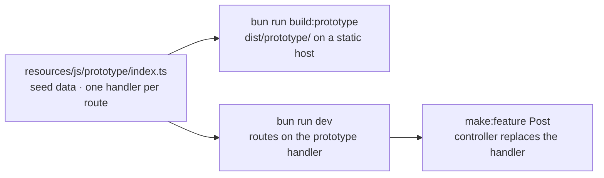

# プロトタイプファースト

文書として書かれた仕様は議論の的になりますが、顧客がクリックできる仕様には訂正が返ってきます。プロトタイプモードを使うと、バックエンドがまだ何も存在しない段階で機能の画面を作れます。サーバーの要らない静的ファイルホストに置いて顧客に触ってもらい、そのあと同じコードからバックエンド開発を始められます。見せたページが、そのまま出荷するページになります。

仕組みはファイルひとつです。`resources/js/prototype/index.ts` の **fixture** が、ページコンポーネントに対して型付けされたメモリ上のシードデータから、ルート名ごとに Inertia の visit に答えます。ブラウザではサーバーの代わりを務め、サーバー上ではまだ書いていないコントローラーの代わりを務めます。しかも他のすべてと同じルートマニフェストとページの `Props` に対して型検査されるので、プロトタイプとバックエンドが食い違えば `bun run typecheck` が必ず指摘します。



## インストール

```bash
bunx guren add prototype
```

最初から組み込んで雛形を作ることもできます:

```bash
bunx create-guren-app my-app --prototype
```

`add prototype` は fixture モジュールを書き、`package.json` にスクリプトを 2 つ足し、オプションを 2 箇所に配線します:

| 何を | どこに |
|---|---|
| `resources/js/prototype/index.ts` | fixture: `state` と `routes` が空の `definePrototype({ … })` |
| `dev:prototype`、`build:prototype` | `vite --mode prototype` と、`codegen && check --prototype && vite build --mode prototype` |
| `prototype: import.meta.env.GUREN_PROTOTYPE ? { load, base } : undefined` | `resources/js/app.tsx` の `startInertiaClient()` に渡す |
| `prototype: () => import('../resources/js/prototype/index.js')` | `src/app.ts` の `createApp()` に渡す |
| `ImportMetaEnv.GUREN_PROTOTYPE` | `resources/js/vite-env.d.ts` に宣言 |

`GUREN_PROTOTYPE` は `vite --mode prototype` ではリテラルの `true`、それ以外のすべてのビルドではリテラルの `false` として定義されます。そのためクライアント側の分岐と fixture の import は本番ではデッドコードになり、ブラウザで visit に答えるランタイムが本番バンドルに入ることはありません。コマンドは冪等なので、アップグレード後にもう一度実行しても、すでにあるものは変わりません。`bunx guren add prototype --remove` はスクリプトと 2 行の配線を取り除き、fixture は削除せずに残します。

## fixture

`routes` の各エントリは `.guren/routes.gen.ts` のルート名をキーにして、そのルートの visit に答えます:

```ts
import { apiRoutes, definePrototype } from '@guren/inertia-client/prototype'
import type { ApiRoutes } from '@/.guren/api-client.gen'
import { pages } from '@/.guren/pages.gen'
import { routeManifest } from '@/.guren/routes.gen'
import type { PostData } from '@/resources/js/types/Post'

export default definePrototype({
  manifest: routeManifest,
  api: apiRoutes<ApiRoutes>(),

  shared: {
    auth: { user: { id: 1, name: 'Demo User', email: 'demo@example.com' } },
  },

  state: () => ({
    posts: [
      { id: 1, title: 'First post', body: 'Hello', published: true },
      { id: 2, title: 'Draft', body: 'Not yet', published: false },
    ] as PostData[],
    nextId: 3,
  }),

  routes: {
    'posts.index': ({ state, page }) => page(pages.posts.Index, { posts: state.posts }),

    'posts.show': ({ state, params, page, notFound }) => {
      const post = state.posts.find((item) => item.id === Number(params.id))
      return post ? page(pages.posts.Show, { post }) : notFound()
    },

    'posts.store': ({ state, body, errors, redirect, flash }) => {
      if (!body.title) return errors({ title: 'Title is required.' })
      const post: PostData = { id: state.nextId++, ...body, published: false }
      state.posts.unshift(post)
      flash('success', 'Post created.')
      return redirect('posts.show', { id: post.id })
    },
  },
})
```

| フィールド | 意味 |
|---|---|
| `manifest` | `.guren/routes.gen.ts` の `routeManifest`。`routes` のキーと各ハンドラーの `params` を型付けし、ブラウザは URL をこれに照合します |
| `api` | `apiRoutes<ApiRoutes>()`、型だけのマーカー。ルートの `body` スキーマから各ハンドラーの `body` を型付けします |
| `shared` | `shareInertiaProps()` と同じく、すべてのページが自分の props の下に受け取る props。デモユーザーがあると保護された画面に到達できます。ゲストとして歩くなら `user: null` にします |
| `state` | シードデータのファクトリ。ブラウザはこのオブジェクトをリロードをまたいで `sessionStorage` に保持します。`persist: 'local'` ならタブをまたいで保持、`persist: false` ならメモリ上だけです |
| `notFoundPage` | `notFound()` と一致しない URL に対して描画するページ契約。ブラウザでは 200、サーバーでは 404 です。無ければサーバーと同じく Inertia のエラーダイアログが出ます |
| `routes` | ルート名ごとにハンドラーひとつ。マニフェストに無い名前は型エラーです |

ハンドラーは `{ params, query, body, state, shared }` と、答え方 5 つを受け取ります:

| 呼び出し | 顧客に見えるもの |
|---|---|
| `page(pages.posts.Show, props)` | そのページ。`props` はページの `Props` を満たす必要があるので、コンポーネントにフィールドを足すと、コントローラーを落とすのと同じ `tsc` の実行で fixture も落ちます |
| `redirect('posts.show', { id })` | 遷移先ルートのハンドラーが走り、そのページがその URL で表示されます。303 を追った結果と同じです |
| `errors({ title: '…' })` | 元のページを `errors` 付きでもう一度。`validateBody()` の失敗が作るのと同じ形です。ブラウザでは第 2 引数でエラーバッグを指定できます |
| `notFound()` | 404 ダイアログ、または `notFoundPage` |
| `location('https://…')` | 外部 URL へのフルページ遷移 |

`flash(key, value)` は次のページにフラッシュメッセージを載せます。`body` に入るのは、どちらのランタイムでもフォームが送った生のボディで、スキーマを通した結果ではありません。強制変換が欲しければ自分でスキーマを呼んでください。

**2 つのランタイムが違うところ。** サーバーは同じ文脈を本物のリクエストから組み立てますが、4 箇所だけ制約がきつくなります。どれもサーバーがコントローラーに対して行うのと同じ振る舞いです。`FormData` のボディはブラウザでは繰り返しキーを配列にしたプレーンオブジェクトとして届きます(`tags[]` 形式の入力や複数ファイルのフィールドも失われません)が、サーバーは `validateBody()` と同じく繰り返しキーの最初の値だけを残します。`errors()` はサーバーではエラーバッグを取りません。`ValidationException` に無いからです。`notFoundPage` はブラウザでは 200、サーバーでは 404 です。そして `flash()` はサーバーではセッションに書くので、セッションミドルウェアの無いアプリでは何もしません。

`bunx guren make:feature Post --fields "title:string,body:text,published:boolean" --prototype` がこれを全部書いてくれます。ページコンポーネント、バリデーター、`PostData` をエクスポートする `resources/js/types/Post.ts`、そして fixture に追記される 7 つのエントリ(index、create、show、edit、store、update、destroy)です。モデル、マイグレーション、Resource、コントローラーは書きません。登録すべきルートは、コントローラーの代わりに `prototype` を置いた形で出力されます。

## 歩く

```bash
bun run dev:prototype
```

これは Vite だけで、Bun のサーバーは動いていません。すべての `text/html` リクエストにプロトタイプのシェルが返り、クライアントが fixture を読み込み、すべての Inertia の visit はタブの中で答えられます。フォーム、リダイレクト、バリデーションエラー、フラッシュメッセージはすべてシードデータを相手に動きます。

**リセット。** 状態はタブの `sessionStorage` に保存されるので、リロードしても顧客の操作は残り、新しいタブはシードから始まります。任意の URL に `?prototype.reset=1` を付けて開くと、保存された状態を捨ててフラグ無しの URL をリロードします。モジュールはシェルにボタンを置くための `resetPrototypeState()` もエクスポートしています。決定的にリセットできないデモは顧客の前で使えないので、リセットのリンクはプレゼンターの手が届くところに置いてください。

**動かないもの。** ブラウザのランタイムが横取りするのは Inertia の visit だけです:

- 素の `<a href>`、ネイティブの `<form>` 送信、`window.location`、直接の `fetch()` は fixture に届きません。静的ホストでは SPA フォールバック(URL から始まるフルリロードで、`persist: false` の状態は失われます)か 404 に当たります。`<Link>`、`useForm()`、`router.visit()` を使ってください。
- Deferred props、`mergeProps`、`once` props、`encryptHistory`、アセットバージョンのハンドシェイクは再現されません。現時点では Guren 自身のサーバーもそれらを出しません。
- ブラウザではミドルウェアが走りません。`auth` で守られたルートは、ハンドラー自身が `shared.auth.user` を確認しない限りゲストからも到達できます。
- プリフェッチと `cacheFor` はクリックより先に GET ハンドラーを走らせるので、GET ハンドラーには副作用を持たせないでください。

これらは `guren check` には見えません。このリストがチェックです。

## 出荷する

```bash
bun run build:prototype
```

このスクリプトはマニフェストを再生成し、`guren check --prototype` を走らせ、`dist/prototype/` をビルドします:

```text
dist/prototype/
├── index.html        # the shell, <meta name="robots" content="noindex, nofollow">
├── 404.html          # a copy of index.html, for hosts that serve it on unknown paths
├── _redirects        # /*  /index.html  200, for hosts that read it
├── *.js, *.css       # the hashed bundle, the fixture included
└── …                 # everything under public/, minus the ordinary build's own output
```

このディレクトリを任意の静的ホストにアップロードします。どのホストでも必要なことはひとつだけで、ファイルに対応しない URL に `index.html` を返すことです。顧客は `/posts/3` をリロードするからです。

| ホスト | SPA フォールバック |
|---|---|
| Cloudflare Pages | `_redirects` を読みます。設定不要 |
| Netlify | `_redirects` を読みます。設定不要 |
| GitHub Pages | 未知のパスに `404.html` を返します。設定不要ですが、プロジェクトページは `/<repo>/` の下に置かれます。後述のサブパスの注意を参照 |
| Cloudflare Workers Static Assets | `wrangler.jsonc` の `assets` バインディングに `"not_found_handling": "single-page-application"` を設定 |
| Vercel | デプロイするディレクトリの `vercel.json` に `{ "rewrites": [{ "source": "/(.*)", "destination": "/index.html" }] }` を追加 |
| S3 + CloudFront、nginx、その他のファイルサーバー | not-found の応答を状態 200 の `index.html` に対応付ける |

**サブパスの下で。** GitHub のプロジェクトページやプレビュー URL は、プロトタイプを `/` ではなく `/repo/` から配信します。base を Vite プラグインに渡してください:

```ts
import { defineConfig } from 'vite'
import guren from '@guren/core/vite'

export default defineConfig({
  plugins: [guren({ prototype: { base: '/repo/' } })],
})
```

あるいはビルドに `--base /repo/` を渡します。アセット URL、`page.url`、ルートの照合はすべて同じ値を使い、ひとつのオリジンで別々の base に置かれた 2 つのプロトタイプは、状態を別々に保ちます。

**シェル。** 生成される `index.html` は最小限です。中身は `<div id="app">`、モジュールスクリプト、そして `noindex` の meta タグ(プロトタイプは索引されるべきものではないため)だけです。`setInertiaDocument()` はサーバー側の呼び出しで静的ビルドからは読めないので、favicon、フォントのリンク、テーマのプリペイントスクリプトは `resources/js/prototype/index.html` に書きます。このファイルがあれば生成されるシェルの代わりに使われます。自分で書くときも `noindex` のタグは残してください。

> [!WARNING]
> **ホストしたプロトタイプは、前に何かを置かない限り公開されています。** fixture は保護された画面に到達できるよう「サインイン済み」のデモユーザーを同梱しており、ビルドの中の何も、誰が見ているかを知りません。それ自体は漏洩ではなく、裏に本物のデータはありません。しかし固定のデモアカウント付きの顧客向け URL は漏洩と見誤られやすく、シードデータには索引されたくないものが含まれるかもしれません。ホストのアクセス制御を使ってください。Cloudflare Access、Vercel のデプロイ保護、Netlify のパスワード保護、あるいは自前サーバーの basic 認証ルールです。

## バックエンドを作っている間

同じ fixture がサーバー上でも答えるので、実装途中のアプリも `bun run dev` で描画され続けます。コントローラーの代わりに `prototype` ハンドラーでルートを登録します:

```ts
import { Router, prototype } from '@guren/core'
import PostController from '../app/Http/Controllers/PostController.js'
import { PostPayloadSchema } from '../app/Http/Validators/PostValidator.js'

export function registerWebRoutes(router: Router): void {
  router.get('/posts', [PostController, 'index']).name('posts.index')
  router.get('/posts/:id', prototype).name('posts.show')
  router.post('/posts', { name: 'posts.store', body: PostPayloadSchema }, prototype)
}
```

`prototype` ルートはミドルウェアを走らせ、契約を強制し(`params`、`query`、`body` のスキーマは fixture が何かを見る前に 422 で答えます)、それから本物の shared props パイプラインの下で、その名前の fixture エントリを走らせます。fixture の `shared.auth` はサーバー自身のリゾルバーの *下に* 適用されるので、本物のセッションがデモユーザーに勝ち、fixture によって誰かがログインすることはありません。`page()` は `this.inertia()` と同じ経路で描画し、`redirect()` は名前付きルートへの 303、`errors()` は `ValidationException` を投げ、`notFound()` は 404 です。

boot 時にはルールが 3 つあり、どれもルートを名指しするハードエラーです:

- `prototype` ルートには名前が必要です。fixture がそれをキーにしているからです
- 名前付きの `prototype` ルートにはすべて fixture のエントリが必要です
- `createApp()` に `prototype` オプション(`add prototype` が書いたローダー)が必要です

**本番では動かない。** サーバー側の状態はプロセスにつきひとつのオブジェクトで、すべてのリクエストが共有します。自分の開発サーバーにはそれで十分ですが、それ以外の用途には足りません。本番の boot(`NODE_ENV=production`)は、`prototype` ハンドラーのルートがひとつでも残っていれば起動を拒否し、`bunx guren doctor` はそれらのルートをデプロイのブロッカーとして報告します。この拒否は `GUREN_PROTOTYPE_ROUTES=1` で上書きできます。意図して fixture に支えられたサーバーを動かす場合のための逃げ道です。顧客に見せるのは、これではなく静的ビルドの方です。

`bunx guren context` はまだ fixture 上にあるルートを **prototype backlog** として一覧するので、次の画面の実装を頼まれたエージェントは、コントローラーとルートの差分を取る代わりにこの一覧を読みます。

## `guren check --prototype`

内容で活性化します。fixture も `prototype` ルートも、`app.tsx` に配線されたローダーも無いアプリは何も報告しません。`--arch` や `--docs` と同じく、このフラグはスイートを選び、exit code を決めます。それが `build:prototype` をこのチェックでゲートできる理由です。

| ルール | レベル |
|---|---|
| 名前の無い `prototype` ルート | error |
| fixture にエントリの無い、名前付きの `prototype` ルート | error |
| 存在しないルートを名指しする fixture エントリ | error |
| メソッドとパスを共有する名前付きルートが 2 つ | error。URL のマッチャーが区別できません |
| `.agent()` を宣言した `prototype` ルート | error。何も実装していないアクションをツールマニフェストが宣伝してしまいます |
| `prototype` ルートがあるのに `createApp()` に `prototype` が無い | error |
| ローダーが `app.tsx` に配線されているのに fixture ファイルが無い | error |
| fixture にエントリの無い、名前付きの GET ルート | warn。プロトタイプでは到達できない、として一覧 |

fixture はソースから、`definePrototype(` の呼び出しを起点に読まれます。動的に組み立てた fixture(spread、計算されたキー)は、通過ではなく「読めない」と報告されます。CLI の中でアプリのコードが実行されることはありません。

## 昇格する

仕様が固まったら、フラグ無しで `make:feature` を実行します:

```bash
bunx guren make:feature Post --fields "title:string,body:text,published:boolean"
```

`posts.*` のルートが `prototype` ハンドラーに乗っているアプリでは、これがモデル、Resource、コントローラーを書き、プロトタイプ時に書いたページとバリデーターはそのまま残します。Resource の `toArray()` は既存の `PostData` に対して型付けされるので、顧客が見た形が、そのままシリアライザーが満たすべき契約になります。`db/schema.ts` にテーブルを足し、マイグレーションを流し、`routes/web.ts` の各 `prototype` をコマンドが出力する `[PostController, 'action']` に置き換えてください。fixture のエントリは残って `build:prototype` に答え続けるので、バックエンドをルート単位で差し込んでいく間も、顧客のリンクは動き続けます。

すべてのルートにコントローラーが付いたら、`bunx guren add prototype --remove` でローダーの配線を外します。fixture ディレクトリは用済みなら削除し、次の機能のために残しても構いません。

## 次のステップ

- [チュートリアル第 15 章](../tutorials/15-prototype-first.md)は、コースのブログでこのやり方の機能開発を最初から最後まで行います。
- [フロントエンドガイド](./frontend.md): fixture が描画するページコンポーネントと型付きリンク。
- [CLI リファレンス](./cli.md): `add prototype`、`make:feature --prototype`、`check --prototype`。
- [デプロイガイド](./deployment.md): バックエンドができたあとのサーバーの出荷。
