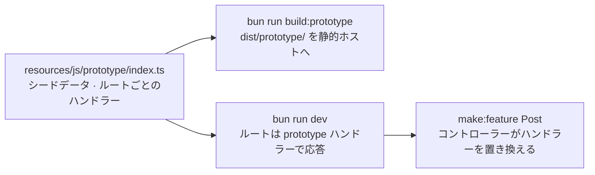

# プロトタイプファースト

文書で書いた仕様は議論になりがちですが、顧客が実際にクリックできる仕様なら具体的な訂正が返ってきます。プロトタイプモードを使うと、バックエンドがまだ何もない段階で機能の画面を作れます。作った画面はサーバーのいらない静的ファイルホストに置いて顧客に触ってもらい、そのあと同じコードからバックエンドの開発を始められます。顧客に見せたページが、そのまま出荷するページになります。

仕組みはファイル 1 つだけです。`resources/js/prototype/index.ts` に置く **fixture** が、ページコンポーネントに合わせて型付けしたメモリ上のシードデータを使い、Inertia の visit にルート名ごとに応答します。ブラウザではサーバーの代わりに、サーバー上ではまだ書いていないコントローラーの代わりに動きます。fixture もほかのコードと同じルートマニフェストとページの `Props` で型検査されるので、プロトタイプとバックエンドが食い違えば、必ず `bun run typecheck` で指摘されます。



## インストール

```bash
bunx guren add prototype
```

雛形の生成時に最初から組み込むこともできます。

```bash
bunx create-guren-app my-app --prototype
```

`add prototype` を実行すると、fixture のモジュールが作られ、`package.json` にスクリプトが 2 つ追加され、2 か所にオプションが組み込まれます。

| 追加されるもの | 場所 |
|---|---|
| `resources/js/prototype/index.ts` | fixture 本体。`state` と `routes` が空の `definePrototype({ … })` |
| `dev:prototype`、`build:prototype` | それぞれ `vite --mode prototype` と、`codegen && check --prototype && vite build --mode prototype` |
| `prototype: import.meta.env.GUREN_PROTOTYPE ? { load, base } : undefined` | `resources/js/app.tsx` の `startInertiaClient()` に渡す |
| `prototype: () => import('../resources/js/prototype/index.js')` | `src/app.ts` の `createApp()` に渡す |
| `ImportMetaEnv.GUREN_PROTOTYPE` | `resources/js/vite-env.d.ts` で宣言 |

`GUREN_PROTOTYPE` は、`vite --mode prototype` ではリテラルの `true`、それ以外のビルドではすべてリテラルの `false` として定義されます。そのため本番ではクライアント側の分岐と fixture の import がデッドコードになり、ブラウザで visit に応答するランタイムが本番のバンドルに入ることはありません。このコマンドは冪等で、アップグレード後にもう一度実行しても、すでにあるものは変わりません。`bunx guren add prototype --remove` を実行すると、スクリプトと 2 行の組み込みが取り除かれます。fixture は削除されずに残るので、不要なら手で消してください。

## fixture

`routes` の各エントリは `.guren/routes.gen.ts` のルート名をキーにしていて、そのルートへの visit に応答します。

```ts
import { apiRoutes, definePrototype } from '@guren/inertia-client/prototype'
import type { ApiRoutes } from '@/.guren/api-client.gen'
import { pages } from '@/.guren/pages.gen'
import { routeManifest } from '@/.guren/routes.gen'
import type { PostData } from '@/resources/js/types/Post'

export default definePrototype({
  manifest: routeManifest,
  api: apiRoutes<ApiRoutes>(),

  shared: {
    auth: { user: { id: 1, name: 'Demo User', email: 'demo@example.com' } },
  },

  state: () => ({
    posts: [
      { id: 1, title: 'First post', body: 'Hello', published: true },
      { id: 2, title: 'Draft', body: 'Not yet', published: false },
    ] as PostData[],
    nextId: 3,
  }),

  routes: {
    'posts.index': ({ state, page }) => page(pages.posts.Index, { posts: state.posts }),

    'posts.show': ({ state, params, page, notFound }) => {
      const post = state.posts.find((item) => item.id === Number(params.id))
      return post ? page(pages.posts.Show, { post }) : notFound()
    },

    'posts.store': ({ state, body, errors, redirect, flash }) => {
      if (!body.title) return errors({ title: 'Title is required.' })
      const post: PostData = { id: state.nextId++, ...body, published: false }
      state.posts.unshift(post)
      flash('success', 'Post created.')
      return redirect('posts.show', { id: post.id })
    },
  },
})
```

| フィールド | 意味 |
|---|---|
| `manifest` | `.guren/routes.gen.ts` の `routeManifest`。`routes` のキーと各ハンドラーの `params` の型はここから決まり、ブラウザは URL をこれと照合します |
| `api` | `apiRoutes<ApiRoutes>()`。型のためだけのマーカーで、ルートの `body` スキーマから各ハンドラーの `body` の型が決まります |
| `shared` | `shareInertiaProps()` と同じく、すべてのページが、自分の props より下の優先度で受け取る props。デモユーザーを入れておくと、保護された画面にも入れます。ゲストとして操作するなら `user: null` にします |
| `state` | シードデータを作るファクトリ。ブラウザはこのオブジェクトを `sessionStorage` に保存し、リロードしても保持します。`persist: 'local'` にするとタブをまたいで保持し、`persist: false` にするとメモリ上だけに持ちます |
| `notFoundPage` | `notFound()` と、どのルートにも一致しない URL で描画するページ契約。ブラウザでは 200、サーバーでは 404 で返ります。指定しなければ、サーバーと同じく Inertia のエラーダイアログが出ます |
| `routes` | ルート名ごとに 1 つのハンドラー。マニフェストにない名前を書くと型エラーになります |

ハンドラーは `{ params, query, body, state, shared }` と、次の 5 つの応答方法を受け取ります。

| 呼び出し | 顧客に見えるもの |
|---|---|
| `page(pages.posts.Show, props)` | そのページ。`props` はページの `Props` を満たす必要があります。コンポーネントにフィールドを足すと、コントローラーが失敗するのと同じ `tsc` の実行で fixture も失敗します |
| `redirect('posts.show', { id })` | 遷移先ルートのハンドラーが実行され、そのページがその URL で表示されます。303 をたどったときと同じ結果です |
| `errors({ title: '…' })` | 元のページを `errors` 付きでもう一度表示します。`validateBody()` が失敗したときと同じ形です。ブラウザでは第 2 引数でエラーバッグを指定できます |
| `notFound()` | 404 のダイアログ、または `notFoundPage` |
| `location('https://…')` | 外部 URL へページ全体を遷移 |

`flash(key, value)` は、次のページにフラッシュメッセージを載せます。`body` には、どちらのランタイムでもフォームが送った生のボディが入り、スキーマを通した結果にはなりません。型の変換が必要なら、スキーマを自分で呼んでください。

**2 つのランタイムの違い。** サーバーは同じコンテキストを本物のリクエストから組み立てますが、次の 4 点では制約が厳しくなります。どれも、サーバーがコントローラーに対して行う処理と同じ振る舞いに合わせたものです。

- `FormData` のボディは、ブラウザでは繰り返しキーを配列にしたプレーンオブジェクトとして届きます（`tags[]` 形式の入力や複数ファイルのフィールドも失われません）。サーバーは `validateBody()` と同じく、繰り返しキーの最初の値だけを残します
- `errors()` は、サーバーではエラーバッグを受け取りません。`ValidationException` にエラーバッグがないためです
- `notFoundPage` は、ブラウザでは 200、サーバーでは 404 で返ります
- `flash()` は、サーバーではセッションに書き込みます。そのため、セッションミドルウェアのないアプリでは何もしません

ここまでの内容は、`bunx guren make:feature Post --fields "title:string,body:text,published:boolean" --prototype` を実行すればまとめて生成されます。生成されるのは、ページコンポーネント、バリデーター、`PostData` をエクスポートする `resources/js/types/Post.ts`、そして fixture に追記される 7 つのエントリ（index、create、show、edit、store、update、destroy）です。モデル、マイグレーション、Resource、コントローラーは生成されません。登録すべきルートは、コントローラーの代わりに `prototype` を指定した形で出力されます。

## 歩く

```bash
bun run dev:prototype
```

このとき動いているのは Vite だけで、Bun のサーバーは起動していません。`text/html` のリクエストにはすべてプロトタイプのシェルが返り、クライアントが fixture を読み込んで、Inertia の visit にはすべてタブの中で応答します。フォーム、リダイレクト、バリデーションエラー、フラッシュメッセージも、シードデータを相手にすべて動きます。

**リセット。** 状態はタブの `sessionStorage` に保存されます。リロードしても顧客の操作は残り、新しいタブはシードの状態から始まります。任意の URL に `?prototype.reset=1` を付けて開くと、保存された状態を捨て、このフラグを外した URL でリロードします。シェルにリセット用のボタンを置けるよう、モジュールは `resetPrototypeState()` もエクスポートしています。決まった状態に戻せないデモは顧客の前では使えないので、リセットのリンクは説明する人がすぐ押せる場所に置いてください。

**動かないもの。** ブラウザのランタイムが横取りするのは Inertia の visit だけです。

- 素の `<a href>`、ネイティブの `<form>` の送信、`window.location`、直接の `fetch()` は fixture に届きません。静的ホストでは SPA フォールバック（その URL からのフルリロードになり、`persist: false` の状態は失われます）か 404 になります。`<Link>`、`useForm()`、`router.visit()` を使ってください。
- Deferred props、`mergeProps`、`once` props、`encryptHistory`、アセットバージョンのハンドシェイクは再現されません。現時点では、Guren のサーバー自体もこれらを出力しません。
- ブラウザではミドルウェアが動きません。`auth` で保護したルートでも、ハンドラーが `shared.auth.user` を自分で確認しない限り、ゲストのまま入れます。
- プリフェッチと `cacheFor` はクリックより前に GET ハンドラーを実行するので、GET ハンドラーには副作用を持たせないでください。

これらは `guren check` では検出できません。このリストで確認してください。

## 出荷する

```bash
bun run build:prototype
```

このスクリプトはマニフェストを再生成し、`guren check --prototype` を実行してから、`dist/prototype/` をビルドします。

```text
dist/prototype/
├── index.html        # the shell, <meta name="robots" content="noindex, nofollow">
├── 404.html          # a copy of index.html, for hosts that serve it on unknown paths
├── _redirects        # /*  /index.html  200, for hosts that read it
├── *.js, *.css       # the hashed bundle, the fixture included
└── …                 # everything under public/, minus the ordinary build's own output
```

このディレクトリを好きな静的ホストにアップロードします。どのホストでも、ファイルに対応しない URL に `index.html` を返す設定だけは必要です。顧客が `/posts/3` でリロードすることがあるからです。

| ホスト | SPA フォールバック |
|---|---|
| Cloudflare Pages | `_redirects` を読むので設定不要 |
| Netlify | `_redirects` を読むので設定不要 |
| GitHub Pages | 未知のパスに `404.html` を返すので設定不要。ただしプロジェクトページは `/<repo>/` の下に置かれます。後述のサブパスの注意を参照 |
| Cloudflare Workers Static Assets | `wrangler.jsonc` の `assets` バインディングに `"not_found_handling": "single-page-application"` を設定 |
| Vercel | デプロイするディレクトリの `vercel.json` に `{ "rewrites": [{ "source": "/(.*)", "destination": "/index.html" }] }` を追加 |
| S3 + CloudFront、nginx、その他のファイルサーバー | not-found の応答を、ステータス 200 の `index.html` に対応付ける |

**サブパスに置く場合。** GitHub のプロジェクトページやプレビュー URL では、プロトタイプが `/` ではなく `/repo/` から配信されます。この場合は Vite プラグインに base を渡してください。

```ts
import { defineConfig } from 'vite'
import guren from '@guren/core/vite'

export default defineConfig({
  plugins: [guren({ prototype: { base: '/repo/' } })],
})
```

ビルドに `--base /repo/` を渡しても構いません。アセットの URL、`page.url`、ルートの照合はすべて同じ値を使います。1 つのオリジン上に別々の base で 2 つのプロトタイプを置いた場合、状態はそれぞれ別に保存されます。

**シェル。** 生成される `index.html` は最小限の内容で、`<div id="app">`、モジュールスクリプト、`noindex` の meta タグだけが入っています（プロトタイプは検索エンジンに登録させるものではないため）。`createApp({ inertia: { document } })` はサーバー側の設定で、静的ビルドではアプリを構築しません。そのため、favicon、フォントのリンク、テーマのプリペイント用スクリプトは `resources/js/prototype/index.html` に書きます。このファイルがあれば、生成されるシェルの代わりに使われます。自分で書くときも `noindex` のタグは残してください。

> [!WARNING]
> **ホストしたプロトタイプは、手前に何かを置かない限り誰でも見られます。** fixture には保護された画面に入るための「サインイン済み」のデモユーザーが含まれていて、ビルドのどこにも閲覧者を確認する仕組みはありません。裏に本物のデータはないので、それ自体は情報漏洩ではありません。しかし、固定のデモアカウントが付いた顧客向けの URL は漏洩と誤解されやすく、シードデータにも検索エンジンに載せたくない内容が含まれているかもしれません。ホストのアクセス制御を使ってください。Cloudflare Access、Vercel のデプロイ保護、Netlify のパスワード保護、自前のサーバーなら basic 認証のルールなどがあります。

## バックエンドを作っている間

同じ fixture がサーバー上でも応答するので、実装が途中のアプリでも `bun run dev` で画面が表示され続けます。ルートを登録するときは、コントローラーの代わりに `prototype` ハンドラーを指定します。

```ts
import { Router, prototype } from '@guren/core'
import PostController from '../app/Http/Controllers/PostController.js'
import { PostPayloadSchema } from '../app/Http/Validators/PostValidator.js'

export function registerWebRoutes(router: Router): void {
  router.get('/posts', [PostController, 'index']).name('posts.index')
  router.get('/posts/:id', prototype).name('posts.show')
  router.post('/posts', { name: 'posts.store', body: PostPayloadSchema }, prototype)
}
```

`prototype` ルートでは、まずミドルウェアが実行され、次に契約が検査されます（`params`、`query`、`body` のスキーマに合わなければ、fixture に渡る前に 422 を返します）。そのあと、本物の shared props のパイプラインの中で、ルート名に対応する fixture のエントリが実行されます。fixture の `shared.auth` はサーバー自身のリゾルバーより *下の* 優先度で適用されるので、本物のセッションがあればそちらがデモユーザーより優先され、fixture によって誰かがログイン状態になることはありません。`page()` は `this.inertia()` と同じ経路で描画し、`redirect()` は名前付きルートへの 303、`errors()` は `ValidationException` を投げ、`notFound()` は 404 を返します。

boot 時には次の 3 つのルールが検査されます。違反はどれもルートを名指しするハードエラーになります。

- `prototype` ルートには名前が必要です。fixture は名前をキーにしているためです
- 名前付きの `prototype` ルートには、すべて fixture のエントリが必要です
- `createApp()` に `prototype` オプション（`add prototype` が書いたローダー）が必要です

**本番では使えない。** サーバー側の状態はプロセスごとに 1 つのオブジェクトで、すべてのリクエストが共有します。手元の開発サーバーならこれで十分ですが、それ以外の用途には向きません。本番の boot（`NODE_ENV=production`）では、`prototype` ハンドラーのルートが 1 つでも残っていると起動を拒否し、`bunx guren doctor` もそれらのルートをデプロイを妨げる問題として報告します。あえて fixture で動くサーバーを立てたい場合は、`GUREN_PROTOTYPE_ROUTES=1` でこの拒否を上書きできます。ただし、顧客に見せるのはこのサーバーではなく静的ビルドのほうです。

`bunx guren context` は、まだ fixture で応答しているルートを **prototype backlog** として一覧にします。次の画面の実装を頼まれたエージェントは、コントローラーとルートを突き合わせなくても、この一覧を読めば済みます。

## `guren check --prototype`

このチェックは、対象になる内容があるときだけ働きます。fixture も `prototype` ルートもなく、`app.tsx` にローダーも組み込まれていないアプリでは、何も報告しません。`--arch` や `--docs` と同じく、このフラグは実行するチェックを選び、終了コードを決めます。`build:prototype` がこのチェックの結果でビルドを止められるのはそのためです。

| ルール | レベル |
|---|---|
| 名前のない `prototype` ルート | error |
| fixture にエントリのない、名前付きの `prototype` ルート | error |
| 存在しないルートを名指しする fixture エントリ | error |
| メソッドとパスが同じ名前付きルートが 2 つある | error。URL のマッチャーが区別できません |
| `.agent()` を宣言した `prototype` ルート | error。何も実装していないアクションを、ツールマニフェストが公開してしまいます |
| `prototype` ルートがあるのに、`createApp()` に `prototype` がない | error |
| ローダーが `app.tsx` に組み込まれているのに、fixture のファイルがない | error |
| fixture にエントリのない、名前付きの GET ルート | warn。プロトタイプでは入れないルートとして一覧に出ます |

fixture はソースから読み取られ、`definePrototype(` の呼び出しを起点に解析されます。動的に組み立てた fixture（スプレッド構文や計算されたキー）は、合格にはせず「読めない」と報告されます。CLI がアプリのコードを実行することはありません。

## 昇格する

仕様が固まったら、フラグを付けずに `make:feature` を実行します。

```bash
bunx guren make:feature Post --fields "title:string,body:text,published:boolean"
```

`posts.*` のルートが `prototype` ハンドラーで動いているアプリでは、このコマンドがモデル、Resource、コントローラーを生成し、プロトタイプの段階で作ったページとバリデーターはそのまま残します。Resource の `toArray()` は既存の `PostData` で型付けされるので、顧客が見たデータの形が、そのままシリアライザーが満たすべき契約になります。

あとは `db/schema.ts` にテーブルを追加してマイグレーションを実行し、`routes/web.ts` の各 `prototype` を、コマンドが出力する `[PostController, 'action']` に置き換えてください。fixture のエントリは残って `build:prototype` に応答し続けるので、バックエンドをルートごとに差し込んでいく間も、顧客に渡したリンクは動き続けます。

すべてのルートにコントローラーが付いたら、`bunx guren add prototype --remove` でローダーの組み込みを外します。fixture のディレクトリは、もう使わなければ削除し、次の機能で使うなら残しておいて構いません。

## 次のステップ

- [チュートリアル第 15 章](../tutorials/15-prototype-first.md): 講座のブログを題材に、この方法で 1 つの機能を最初から最後まで作ります。
- [フロントエンドガイド](./frontend.md): fixture が描画するページコンポーネントと型付きリンク。
- [CLI リファレンス](./cli.md): `add prototype`、`make:feature --prototype`、`check --prototype`。
- [デプロイガイド](./deployment.md): バックエンドができたあとのサーバーの出荷。
