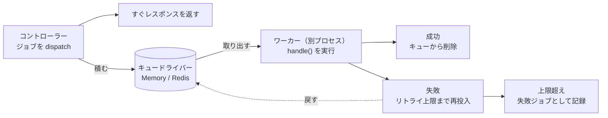

# キューガイド

キューを使うと、メール送信、アップロードの処理、外部 API の呼び出しといった時間のかかる処理を、リクエストの処理から切り離せます。コントローラーはジョブをディスパッチしてすぐにレスポンスを返し、ジョブはあとからワーカープロセスが取り出して実行します。

おすすめの書き方は、`@guren/core` から queue API を import し、ドライバを `config/queue.ts` で設定することです。コントローラーではジョブのディスパッチだけを行います。

## コアコンセプト

- **Job**: 非同期に処理する作業のひとまとまりを表すクラス。`handle()` メソッドを定義し、リトライの挙動も指定できます。
- **Worker**: キューからジョブを取り出して実行する常駐プロセス。リトライ、失敗の処理、グレースフルシャットダウンを受け持ちます。
- **Driver**: ジョブを保存するバックエンド。Guren には Sync、Memory、Redis のドライバが付属しています。
- **QueueManager**: 複数のキュードライバを設定し、取り出すための中央のレジストリ。

ディスパッチする側とワーカーは別々のプロセスで、間にあるキューを通して非同期にやり取りします。リクエストはジョブをキューに積んだ時点でレスポンスを返し、ジョブの実行はあとでワーカーの都合に合わせて行われます。



## ジョブの作成

新しいジョブは CLI で生成します。

```bash
bunx guren make:job SendWelcomeEmail
```

実行すると `app/Jobs/SendWelcomeEmailJob.ts` が作られます。

```ts
import { Job } from '@guren/core'

interface SendWelcomeEmailPayload {
  userId: string
  email: string
}

export class SendWelcomeEmailJob extends Job<SendWelcomeEmailPayload> {
  // キューのメッセージに記録される名前（デフォルト: クラス名）
  static jobName = 'SendWelcomeEmailJob'

  // キュー名（デフォルト: 'default'）
  static queue = 'emails'

  // 最大リトライ回数（デフォルト: 3）
  static maxAttempts = 5

  // バックオフ戦略: 'exponential' | 'linear' | number (ms)
  static backoff: 'exponential' | 'linear' | number = 'exponential'

  async handle({ userId, email }: SendWelcomeEmailPayload): Promise<void> {
    // ジョブのロジックをここに記述
    console.log(`${email}にウェルカムメールを送信中`)
    // await mailService.send(...)
  }

  // オプション: ジョブが完全に失敗した時に呼ばれる
  async failed({ userId, email }: SendWelcomeEmailPayload, error: Error): Promise<void> {
    console.error(`${email}へのウェルカムメール送信に失敗:`, error.message)
  }
}
```

### ジョブ設定

| プロパティ | デフォルト | 説明 |
|-----------|-----------|------|
| `jobName` | クラス名 | キューのメッセージに記録される、変わらない名前 |
| `queue` | `'default'` | このジョブを積むキューの名前 |
| `maxAttempts` | `3` | 失敗とみなすまでの最大リトライ回数 |
| `backoff` | `'exponential'` | リトライまでの待ち時間の決め方 |

**バックオフ戦略：**
- `'exponential'`: 2^attempt × 1000ms (1秒, 2秒, 4秒, 8秒, ...)
- `'linear'`: attempt × 1000ms (1秒, 2秒, 3秒, ...)
- `number`: ミリ秒単位の固定の待ち時間

### ジョブ名を固定する

ジョブをディスパッチすると、ジョブの名前がキューのメッセージに書き込まれ、ワーカーは
その名前をもとにクラスを探し直します。デフォルトではクラス名がそのまま名前になるので、
次の 2 つのケースでは、キューに残っているメッセージのクラスが見つからなくなります。

- **クラス名を変えた場合。** 古い名前で積まれたメッセージのクラスが見つからなくなります。
- **識別子を短い名前に置き換えるバンドルを使った場合。** デプロイしたクラス名が `a` のような
  名前になり、`a` として登録されます。そのため、名前を置き換えていないビルド（または
  置き換え結果の異なるビルド）が書き込んだメッセージは、どのクラスにも結び付かなくなります。
  デプロイ側の注意点は [サーバーレス](./serverless.md) を参照してください。

`jobName` を宣言すれば、どちらのケースでも名前が変わらないように固定できます。

```ts
import { Job } from '@guren/core'

export class SendWelcomeEmailJob extends Job<{ userId: string }> {
  // クラス名が最終的に何になろうと 'SendWelcomeEmailJob' として積まれる
  static jobName = 'SendWelcomeEmailJob'
  static queue = 'emails'

  async handle({ userId }: { userId: string }): Promise<void> {
    // ...
  }
}
```

名前を固定したあとは、クラス名を自由に変えて構いません。キューに残るのは `jobName` だけで、
`registerJob()` もこの文字列をキーにし、ワーカーもこの文字列でクラスを探します。`make:job` は
生成したクラス名を `jobName` に書き込むので、生成したジョブは最初から名前が固定されています。
別の名前にしたい場合は、最初にディスパッチする前に書き換えてください。`jobName` を
書いていない手書きのジョブは、クラス名で探されます。

JavaScript の static メンバーは継承されますが、サブクラスは親の `jobName` を
**継承しません**。サブクラスで宣言するまでは、サブクラス自身のクラス名で探されます。

```ts
class BaseJob extends Job<void> {
  static jobName = 'BaseJob'
}

class DerivedJob extends BaseJob {}                  // 'DerivedJob' として積まれる
class ProxyJob extends BaseJob {
  static jobName = BaseJob.jobName                   // 'BaseJob' として積まれる
}
```

この規則がなければ、両方のクラスを登録したときにレジストリの同じエントリに入り、後から登録したクラスが先のクラスを上書きしてしまいます。

1 つの名前に対応できるクラスは 1 つだけです。登録済みの名前で別のクラスを登録すると、`registerJob()` が両方のクラス名を挙げた警告を 1 度だけ出し、ワーカーは後から登録したクラスを実行します。2 つのモジュールがそれぞれ `SendMail` を宣言した場合や、上の `ProxyJob` を `BaseJob` と一緒に登録した場合がこれに当たります。サブクラスが親と同じ名前を使えるのは、親を登録しないときだけです。どちらかのクラス名を変えるか、`jobName` を固定してください。

フレームワーク自身のジョブは `SendMailJob`、`SendNotificationJob`、`QueuedEventJob`、`GenerateVariantsJob`（attachments）、`RunAgentJob`（`@guren/plugin-ai`）という名前を使うので、アプリのジョブには別の名前を付けてください。同じクラスをもう一度登録するだけなら、警告は出ません。名前の衝突に対する警告は、将来のメジャーバージョンで例外に変わる予定です。

永続キューにメッセージが残っているジョブの `jobName` を変えたり新しく付けたりすると、クラス名を変えたのと同じことになります。先にキューを空にするか、残っているメッセージがなくなるまで旧名の登録を残しておいてください。

## ジョブのディスパッチ

### ファサードを使用（推奨）

`queue` としてバインドされているのは、`config/queue.ts` で設定した `QueueManager` です。`Job.dispatch()` はマネージャーのデフォルトドライバをコンテナから自分で解決するので、マネージャーをバインドしてドライバを登録しておけば、ディスパッチの準備はそれだけで済みます。ワーカーに渡したりキューの中身を調べたりするためにドライバが必要なときは、マネージャーを解決してドライバを取り出します。

```ts
// Resolve the queue manager from the container
const Queue = app.container.make('queue')

// Access the default driver
const driver = Queue.driver()

// SendWelcomeEmailJob.dispatch(payload) の明示形。同じメッセージを
// 既定アプリケーションではなくこのマネージャー経由で積む
await Queue.dispatch(SendWelcomeEmailJob, { userId: 1 })
```

### 直接セットアップ

`Job.dispatch()` はコンテナを通してマネージャーを見つけます。マネージャーを `queue` としてバインドしているのは `config/queue.ts` です。`bunx guren add queue` を実行すると、この定義が書き出され、`config/env.ts` に `QUEUE_CONNECTION` が宣言され、定義が `createApp({ config })` に追加されます。

```ts
// config/queue.ts
import { defineQueueConfig, MemoryDriver, SyncDriver } from '@guren/core'

// QUEUE_CONNECTION=sync はディスパッチ時にジョブをその場で実行する（デフォルト。
// ワーカープロセス不要）。'memory' はワーカー向けにジョブを積む。
const drivers = {
  sync: () => new SyncDriver(),
  memory: () => new MemoryDriver(),
}

export default defineQueueConfig((env) => {
  // 起動時に検査する。マネージャーはどんな名前も受け付け、最初のディスパッチで投げる。
  if (!Object.hasOwn(drivers, env.QUEUE_CONNECTION)) {
    throw new Error(
      `QUEUE_CONNECTION="${env.QUEUE_CONNECTION}" is not a declared driver. Declare it in config/queue.ts or use one of: ${Object.keys(drivers).join(', ')}.`,
    )
  }

  return { default: env.QUEUE_CONNECTION, drivers }
})
```

コールバックには検証済みの環境変数が渡されます。そのため、`QUEUE_CONNECTION` をはじめ、コールバックで読むキーはすべて `config/env.ts` で宣言しておく必要があります（[設定ガイド](./configuration.md)を参照）。

この定義は queue をバインドするだけで、ジョブの登録はしません。ワーカーはメッセージに書かれた名前からジョブクラスを探すので、ジョブの登録はプロバイダの `boot()` で行います。`guren add queue` はそのプロバイダも書き出します。

```ts
// app/Providers/JobsProvider.ts
import { ServiceProvider, registerJob } from '@guren/core'
import { ProcessWelcomeSequenceJob } from '../Jobs/ProcessWelcomeSequenceJob.js'

// config/queue.ts が queue をバインドし、ここでは実行するジョブを登録する。
export default class JobsProvider extends ServiceProvider {
  register(): void {}

  boot(): void {
    // 自分では何もディスパッチしないワーカーも含め、起動したすべてのプロセスで登録する。
    // キューのメッセージが持つのはジョブの名前で、クラスではない。
    registerJob(ProcessWelcomeSequenceJob)
  }
}
```

定義とプロバイダの両方をアプリに追加します。

```ts
// src/app.ts
import queue from '../config/queue.js'
import JobsProvider from '../app/Providers/JobsProvider.js'

const app = createApp({
  env,
  config: [database, http, queue],
  providers: [JobsProvider],
  routes: registerWebRoutes,
})
```

キューをサービスプロバイダで設定しているアプリも、そのまま動きます。[サービスプロバイダを使うアプリ](./configuration.md#サービスプロバイダを使うアプリ) を参照してください。

どこにもバインドされていないマネージャーは、`Job.dispatch()` からは見つけられません。その場合は `await queue.dispatch(SendWelcomeEmailJob, payload)` のように、マネージャーを通して明示的にディスパッチしてください。`setQueueDriver()` でそのマネージャーのドライバを固定する方法もまだ使えますが、2.23.0 で非推奨になっており、3.0.0 で削除されます。

準備ができたら、アプリケーションのどこからでもジョブをディスパッチできます。

```ts
import { SendWelcomeEmailJob } from '@/app/Jobs/SendWelcomeEmailJob'

// 即座にディスパッチ
await SendWelcomeEmailJob.dispatch({
  userId: '123',
  email: 'user@example.com',
})

// 遅延付きでディスパッチ（5分後）
await SendWelcomeEmailJob.dispatchAfter(5 * 60 * 1000, {
  userId: '123',
  email: 'user@example.com',
})

// オプション付きでディスパッチ
await SendWelcomeEmailJob.dispatch(
  { userId: '123', email: 'user@example.com' },
  {
    queue: 'high-priority',
    maxAttempts: 10,
    delay: 30000, // 30秒
  }
)
```

## ワーカーの実行

### CLIを使用

次のコマンドで、ジョブを処理するワーカーを起動します。

```bash
# デフォルトキューを処理
bunx guren queue:work

# 特定のキューを処理（優先度順）
bunx guren queue:work --queue=high-priority,default,emails

# カスタム設定で処理
bunx guren queue:work --sleep=500 --timeout=120000 --max-jobs=100
```

**CLIオプション：**

| オプション | デフォルト | 説明 |
|-----------|-----------|------|
| `--queue` | `default` | カンマ区切りのキュー名 |
| `--sleep` | `1000` | ジョブがないときに待つ時間（ms） |
| `--timeout` | `60000` | ジョブのタイムアウト（ミリ秒） |
| `--max-jobs` | `0` | 停止するまでに処理するジョブの最大数（0 = 無制限） |

### キャンセルと配信の保証

`--timeout` に達すると、ジョブの `this.signal` が中断されます。
中断できる I/O には、このシグナルを渡してください。

```typescript
async handle(payload: { url: string }) {
  await fetch(payload.url, { signal: this.signal })
}
```

ワーカーは、`handle()` が終わるのを待ってから、再試行するか失敗と確定するかを決めます。
シグナルを無視する処理は、タイムアウトを過ぎても実行を続けます。その処理がそのまま正常に
終わった場合、ジョブは再試行されず、完了として扱われます。
JavaScript ではプロセス内で動いている処理を外から強制的に止められないので、止まらなくなった
ワーカーはプロセスの監視ツールで終了させてください。`stop()` は停止を要求し、
ワーカーのタイムアウト時間まで待ちます。`start()` は、実行中の処理が
終わるまで完了しません。

Redis の予約は、キャンセル中も含め、処理の実行中はずっと更新されます。ドライバーのエラーで更新に失敗した
場合は、次のハートビートでもう一度更新を試みます。予約が別のワーカーに移っていた場合は
シグナルを中断し、処理が終わったあとも完了の通知や返却は行わずに `jobFailed` で報告して、
次のジョブに進みます。そのジョブは、予約の期限が切れたあとで
改めて取り出されます。古いワーカーは、別のワーカーに移った予約を削除したり、返却したり、
失敗として確定したりはできません。Redis 上の状態の変化はアトミックに行われます。Redis は単一のインスタンスで使うか、
Redis Cluster を使う場合はプレフィックスに共通のハッシュタグを含め、すべての
キューのキーを同じスロットに置いてください。

配信は「少なくとも一度」の保証です。外部に書き込んだあと、完了を通知する前にプロセスが
落ちることがあるので、決済やメール送信などの外部への書き込みには冪等性キーを使ってください。
`SqsDriver` は `ChangeMessageVisibility` で予約を更新します。更新をキューの属性と合わせるため、
オプションに同じ `visibilityTimeout`(秒)を渡してください。期限付きの予約を使う独自の
ドライバーでは、`heartbeatInterval` と `extendReservation(job)` を実装するか、キャンセル処理まで含めた実行時間より
長い予約期限を設定してください。ドライバーの例外で `start()` が失敗した場合も、
実行中の状態は解除されます。監視側でバックオフを入れて再起動して構いません。

### コードによるワーカー

より細かく制御したい場合は、コードからワーカーを作成できます。

```ts
import { Worker, MemoryDriver, createQueueManager, registerJob } from '@guren/core'
import { SendWelcomeEmailJob } from '@/app/Jobs/SendWelcomeEmailJob'

// セットアップ
const queue = createQueueManager({
  default: 'memory',
  drivers: {
    memory: () => new MemoryDriver(),
  },
})
const driver = queue.driver()

// ジョブクラスを登録（ワーカーがジョブを見つけるために必要）
registerJob(SendWelcomeEmailJob)

// ワーカーを作成して起動。`container` は各ジョブの this.make() の解決元で、
// `guren queue:work` は起動したアプリの container を渡す
const worker = new Worker(driver, {
  queues: ['high-priority', 'default', 'emails'],
  sleep: 1000,
  timeout: 60000,
  maxJobs: 0,        // 0 = 無制限
  stopWhenEmpty: false,
  container: app.container,
}, {
  // オプションのイベントハンドラ
  jobProcessed: (job) => console.log(`処理完了: ${job.name}`),
  jobFailed: (job, error, willRetry) => {
    console.error(`失敗: ${job.name}`, error.message, willRetry ? '(リトライ予定)' : '')
  },
  workerStarted: () => console.log('ワーカー開始'),
  workerStopped: () => console.log('ワーカー停止'),
})

// 処理を開始
await worker.start()

// グレースフルシャットダウン（現在のジョブ完了を待機）
await worker.stop()
```

## 設定

### QueueManagerを使用

複数のキューバックエンドを使うアプリケーションでは、それぞれのドライバを `config/queue.ts` で宣言し、どれをデフォルトにするかは `QUEUE_CONNECTION` で選びます。

```ts
// config/queue.ts
import { defineQueueConfig, MemoryDriver, RedisDriver } from '@guren/core'
import { createRedisClient } from '@guren/core/redis'

export default defineQueueConfig((env) => ({
  default: env.QUEUE_CONNECTION,
  drivers: {
    memory: () => new MemoryDriver(),
    // ファクトリはドライバを最初に解決したときに実行されるため、Redis に接続するのは
    // このドライバが使われたときだけ。
    redis: () => new RedisDriver(createRedisClient({ url: env.REDIS_URL })),
  },
}))
```

`default` を環境変数から決める場合は、上の雛形にあるドライバ名のチェックを残しておいてください。ドライバは、バインドされたマネージャーから取り出します。

```ts
const queue = app.container.make('queue') // QueueManager

// デフォルトドライバを解決
const driver = queue.driver()

// 特定のドライバを取得
const memoryDriver = queue.driver('memory')
```

### Redisドライバ

本番環境では、ジョブを永続化し、複数のサーバーで共有できるように Redis ドライバを使います。

```ts
import { RedisDriver } from '@guren/core'
import { createRedisClient } from '@guren/core/redis'

// config/queue.ts の `drivers` のエントリ。`env` はコールバックの引数
redis: () =>
  new RedisDriver(createRedisClient({ url: env.REDIS_URL }), {
    prefix: 'myapp:queue:', // キープレフィックス（デフォルト: 'queue:'）
  }),
```

`REDIS_URL` は `config/env.ts` で宣言します。`@guren/core/redis` を import すると ioredis も読み込まれるので、Redis を使う設定ファイルでだけ import してください。

### Syncドライバ

Sync ドライバは、ディスパッチしたプロセスの中でジョブをその場で実行するので、ワーカーは要りません。開発環境のデフォルト（`QUEUE_CONNECTION=sync`）で、ジョブが失敗すると `dispatch()` の呼び出しからそのままエラーが投げられます。

Sync キューにはジョブが待つ場所がないので、リトライのバックオフは効きません。Sync ドライバに戻されたジョブは、`backoff` の設定で計算される待ち時間に関係なく、すぐに再実行されます。リトライのタイミングを確かめたい場合は、Memory か Redis のドライバとワーカーを使ってください。

```ts
import { SyncDriver } from '@guren/core'

// config/queue.ts の `drivers` のエントリ
sync: () => new SyncDriver(),
```

## 失敗したジョブ

`maxAttempts` を超えて失敗したジョブは、失敗したジョブを保存するストアに移されます。

### 失敗したジョブの表示

```bash
bunx guren queue:failed
```

またはコードから取得できます。

```ts
const failedJobs = await driver.getFailedJobs()
// またはキューでフィルタ
const failedEmails = await driver.getFailedJobs('emails')
```

### 失敗したジョブのリトライ

```bash
# 特定のジョブをリトライ
bunx guren queue:retry <job-id>

# 全ての失敗したジョブをリトライ
bunx guren queue:retry --all
```

またはコードからリトライできます。

```ts
await driver.retryFailedJob(jobId)
```

### 失敗したジョブのクリア

```bash
bunx guren queue:flush
```

またはコードから削除できます。

```ts
await driver.deleteFailedJob(jobId)
```

## テスト

テストでは Memory ドライバを使い、ジョブを同期的に処理します。

```ts
import { describe, test, expect, beforeEach } from 'bun:test'
import { MemoryDriver, createQueueManager, registerJob, processJob, clearJobRegistry } from '@guren/core'
import { SendWelcomeEmailJob } from '@/app/Jobs/SendWelcomeEmailJob'

describe('SendWelcomeEmailJob', () => {
  let driver: MemoryDriver

  beforeEach(() => {
    const queue = createQueueManager({
      default: 'memory',
      drivers: {
        memory: () => new MemoryDriver(),
      },
    })
    driver = queue.driver()
    clearJobRegistry()
    registerJob(SendWelcomeEmailJob)
  })

  test('ジョブが正常に処理される', async () => {
    // ジョブをディスパッチ
    await SendWelcomeEmailJob.dispatch({
      userId: '123',
      email: 'test@example.com',
    })

    // ジョブがキューに入っていることを確認
    expect(await driver.size('emails')).toBe(1)

    // ジョブを処理
    const processed = await processJob(driver, 'emails')
    expect(processed).toBe(true)

    // キューが空であることを確認
    expect(await driver.size('emails')).toBe(0)
  })
})
```

## ベストプラクティス

1. **ペイロードに型を付ける**: ジョブのペイロードにインターフェースを定義し、型安全にする。

2. **1 つのジョブには 1 つの役割を持たせる**: ジョブの役割は 1 つに絞り、複雑なワークフローは複数のジョブをつないで組み立てる。

3. **失敗にきちんと対処する**: `failed()` メソッドを実装し、エラーのログ、アラートの送信、後片付けを行う。

4. **キューを使い分ける**: 優先度や種類ごとにキューを分ける（例：`emails`、`exports`、`notifications`）。

5. **タイムアウトを適切に設定する**: 実行に時間がかかるジョブには、それに見合った `timeout` の値を設定する。

6. **キューの長さを監視する**: キューに溜まっているジョブの数を追い、ボトルネックを見つける。

7. **ジョブの処理をテストする**: ジョブハンドラのユニットテストを書き、本番に出る前にエラーを見つける。
