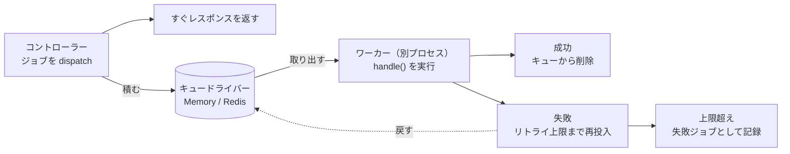

# キューガイド

Guren には、時間のかかるタスクをバックグラウンドで処理するキューが組み込まれています。メール送信、アップロード処理、外部API呼び出しといった重い処理を抱えながらレスポンスを速く保つには、この仕組みが欠かせません。

推奨パターン: `@guren/core` から queue API をインポートし、ドライバは `config/queue.ts` で構成します。コントローラーではジョブのディスパッチだけを行います。

## コアコンセプト

- **Job**: 非同期で処理される作業のひとまとまりを表すクラス。`handle()`メソッドを定義し、リトライの挙動も指定できます。
- **Worker**: キューからジョブを取り出して実行する常駐プロセス。リトライ、失敗、グレースフルシャットダウンを担当します。
- **Driver**: ジョブのストレージバックエンド。GurenにはSync、Memory、Redisドライバが付属しています。
- **QueueManager**: 複数のキュードライバを設定し、まとめて取り出すための中央レジストリ。

ディスパッチとワーカーは別々のプロセスで、キューを挟んで非同期に動きます。リクエストはジョブを積んだ時点で返り、実行はワーカーの都合で後から行われます。



## ジョブの作成

CLIを使用して新しいジョブを生成します。

```bash
bunx guren make:job SendWelcomeEmail
```

`app/Jobs/SendWelcomeEmailJob.ts` が作成されます。

```ts
import { Job } from '@guren/core'

interface SendWelcomeEmailPayload {
  userId: string
  email: string
}

export class SendWelcomeEmailJob extends Job<SendWelcomeEmailPayload> {
  // キュー名（デフォルト: 'default'）
  static queue = 'emails'

  // 最大リトライ回数（デフォルト: 3）
  static maxAttempts = 5

  // バックオフ戦略: 'exponential' | 'linear' | number (ms)
  static backoff: 'exponential' | 'linear' | number = 'exponential'

  async handle({ userId, email }: SendWelcomeEmailPayload): Promise<void> {
    // ジョブのロジックをここに記述
    console.log(`${email}にウェルカムメールを送信中`)
    // await mailService.send(...)
  }

  // オプション: ジョブが完全に失敗した時に呼ばれる
  async failed({ userId, email }: SendWelcomeEmailPayload, error: Error): Promise<void> {
    console.error(`${email}へのウェルカムメール送信に失敗:`, error.message)
  }
}
```

### ジョブ設定

| プロパティ | デフォルト | 説明 |
|-----------|-----------|------|
| `jobName` | クラス名 | キューのメッセージに記録される安定した名前 |
| `queue` | `'default'` | このジョブタイプのキュー名 |
| `maxAttempts` | `3` | 失敗前の最大リトライ回数 |
| `backoff` | `'exponential'` | リトライ遅延戦略 |

**バックオフ戦略：**
- `'exponential'`: 2^attempt × 1000ms (1秒, 2秒, 4秒, 8秒, ...)
- `'linear'`: attempt × 1000ms (1秒, 2秒, 3秒, ...)
- `number`: ミリ秒単位の固定遅延

### ジョブ名を固定する

ジョブをディスパッチすると、その名前がキューのメッセージに書き込まれ、ワーカーは
その名前からクラスを引き直します。デフォルトではクラス名がそのまま使われるので、
次の2つのケースで処理中のメッセージを解決できなくなります。

- **クラスのリネーム。** 旧名で積まれたメッセージが解決できなくなります。
- **識別子をマングルするバンドル。** デプロイされたクラス名が `a` のような名前に
  なり、そのまま `a` として登録されます。すると、マングルしていないビルド（または
  別のマングル結果）が書き込んだメッセージが孤立します。デプロイ側の注意点は
  [サーバーレス](./serverless.md) を参照してください。

`jobName` を宣言すると、両方のケースで名前を固定できます。

```ts
import { Job } from '@guren/core'

export class SendWelcomeEmailJob extends Job<{ userId: string }> {
  // クラス名が最終的に何になろうと 'SendWelcomeEmailJob' として積まれる
  static jobName = 'SendWelcomeEmailJob'
  static queue = 'emails'

  async handle({ userId }: { userId: string }): Promise<void> {
    // ...
  }
}
```

固定したあとはクラス名を自由に変更できます。永続化されるのは `jobName` だけで、
これが `registerJob()` のキーになり、ワーカーもこの文字列で解決します。`jobName` を
持たないジョブは従来どおりクラス名で解決されるので、この設定はオプトインです。

JavaScript の static メンバーは継承されますが、サブクラスは親の `jobName` を
**継承しません**。自分で宣言するまでは自身のクラス名で解決されます。

```ts
class BaseJob extends Job<void> {
  static jobName = 'BaseJob'
}

class DerivedJob extends BaseJob {}                  // 'DerivedJob' として積まれる
class ProxyJob extends BaseJob {
  static jobName = BaseJob.jobName                   // 'BaseJob' として積まれる
}
```

この規則がないと、両方のクラスを登録したときにレジストリの同じエントリへ潰れてしまい、
後から登録したほうが先のものを追い出します。

すでに永続キューにメッセージが残っているジョブの `jobName` を変更・追加するのは、
リネームと同じことです。先にキューを空にするか、バックログが消えるまで旧名の登録を
残してください。

## ジョブのディスパッチ

### ファサードを使用（推奨）

`queue` バインディングは、`config/queue.ts` が構成した `QueueManager` です。`Job.dispatch()` はそのデフォルトドライバをコンテナから自分で解決するので、マネージャーをバインドしてドライバを登録すればディスパッチに必要な準備は終わりです。ワーカーに渡すときやキューを調べるときは、マネージャーを解決してドライバを取り出します。

```ts
// Resolve the queue manager from the container
const Queue = app.container.make('queue')

// Access the default driver
const driver = Queue.driver()

// SendWelcomeEmailJob.dispatch(payload) の明示形。同じメッセージを
// 既定アプリケーションではなくこのマネージャー経由で積む
await Queue.dispatch(SendWelcomeEmailJob, { userId: 1 })
```

### 直接セットアップ

`Job.dispatch()` はコンテナを通してマネージャーを見つけます。マネージャーを `queue` としてバインドするのは `config/queue.ts` です。`bunx guren add queue` はこの定義を書き出し、`config/env.ts` に `QUEUE_CONNECTION` を宣言して、定義を `createApp({ config })` に追加します。

```ts
// config/queue.ts
import { defineQueueConfig, MemoryDriver, SyncDriver } from '@guren/core'

// QUEUE_CONNECTION=sync はディスパッチ時にジョブをその場で実行する（デフォルト。
// ワーカープロセス不要）。'memory' はワーカー向けにジョブを積む。
const drivers = {
  sync: () => new SyncDriver(),
  memory: () => new MemoryDriver(),
}

export default defineQueueConfig((env) => {
  // 起動時に検査する。マネージャーはどんな名前も受け付け、最初のディスパッチで投げる。
  if (!Object.hasOwn(drivers, env.QUEUE_CONNECTION)) {
    throw new Error(
      `QUEUE_CONNECTION="${env.QUEUE_CONNECTION}" is not a declared driver. Declare it in config/queue.ts or use one of: ${Object.keys(drivers).join(', ')}.`,
    )
  }

  return { default: env.QUEUE_CONNECTION, drivers }
})
```

コールバックには検証済みの環境変数が渡されるので、`QUEUE_CONNECTION` をはじめ読み取るキーはすべて `config/env.ts` に宣言しておきます（[設定ガイド](./configuration.md)を参照）。

定義は queue をバインドしますが、ジョブの登録はしません。ワーカーはメッセージに書かれた名前からジョブクラスを引くので、登録はプロバイダの `boot()` に残します。`guren add queue` はそのプロバイダも書き出します。

```ts
// app/Providers/JobsProvider.ts
import { ServiceProvider, registerJob } from '@guren/core'
import { ProcessWelcomeSequenceJob } from '../Jobs/ProcessWelcomeSequenceJob.js'

// config/queue.ts が queue をバインドし、ここでは実行するジョブを登録する。
export default class JobsProvider extends ServiceProvider {
  register(): void {}

  boot(): void {
    // 自分では何もディスパッチしないワーカーも含め、起動したすべてのプロセスで登録する。
    // キューのメッセージが持つのはジョブの名前で、クラスではない。
    registerJob(ProcessWelcomeSequenceJob)
  }
}
```

両方をアプリに追加します。

```ts
// src/app.ts
import queue from '../config/queue.js'
import JobsProvider from '../app/Providers/JobsProvider.js'

const app = createApp({
  env,
  config: [database, http, queue],
  providers: [JobsProvider],
  routes: registerWebRoutes,
})
```

キュー をサービスプロバイダで設定しているアプリもそのまま動きます。[サービスプロバイダを使うアプリ](./configuration.md#サービスプロバイダを使うアプリ) を参照してください。

どこにもバインドされていないマネージャーは `Job.dispatch()` から見つかりません。その場合は `await queue.dispatch(SendWelcomeEmailJob, payload)` のように、マネージャー経由で明示的にディスパッチします。`setQueueDriver()` でドライバを固定する方法も残っていますが、2.23.0 で非推奨になり、3.0.0 で削除されます。

その後、アプリケーションのどこからでもジョブをディスパッチできます。

```ts
import { SendWelcomeEmailJob } from '@/app/Jobs/SendWelcomeEmailJob'

// 即座にディスパッチ
await SendWelcomeEmailJob.dispatch({
  userId: '123',
  email: 'user@example.com',
})

// 遅延付きでディスパッチ（5分後）
await SendWelcomeEmailJob.dispatchAfter(5 * 60 * 1000, {
  userId: '123',
  email: 'user@example.com',
})

// オプション付きでディスパッチ
await SendWelcomeEmailJob.dispatch(
  { userId: '123', email: 'user@example.com' },
  {
    queue: 'high-priority',
    maxAttempts: 10,
    delay: 30000, // 30秒
  }
)
```

## ワーカーの実行

### CLIを使用

ジョブを処理するワーカーを起動します。

```bash
# デフォルトキューを処理
bunx guren queue:work

# 特定のキューを処理（優先度順）
bunx guren queue:work --queue=high-priority,default,emails

# カスタム設定で処理
bunx guren queue:work --sleep=500 --timeout=120000 --max-jobs=100
```

**CLIオプション：**

| オプション | デフォルト | 説明 |
|-----------|-----------|------|
| `--queue` | `default` | カンマ区切りのキュー名 |
| `--sleep` | `1000` | ジョブがない時のスリープ時間（ms） |
| `--timeout` | `60000` | ジョブのタイムアウト（ミリ秒） |
| `--max-jobs` | `0` | 停止前の最大ジョブ数（0 = 無制限） |

### キャンセルと配信の保証

`--timeout` に達すると、ジョブの `this.signal` が中断されます。
中断に対応する I/O にはこのシグナルを渡してください。

```typescript
async handle(payload: { url: string }) {
  await fetch(payload.url, { signal: this.signal })
}
```

ワーカーは `handle()` が終了するまで、再試行や失敗確定を待ちます。
シグナルを無視する処理はタイムアウト後も実行を続けます。
JavaScript では任意のプロセス内処理を強制停止できないため、停止しない
ワーカーはプロセス監視で終了させてください。`stop()` は停止を要求し、
ワーカーのタイムアウト時間まで待機します。`start()` は実行中の処理が
終了するまで完了しません。

Redis の予約はキャンセル中も更新されます。予約の更新に失敗すると
シグナルを中断し、処理の終了後にワーカーを停止します。ジョブは予約期限の
経過後に再取得できます。古いワーカーは別のワーカーへ渡った予約を削除・返却・
失敗確定できません。Redis の状態遷移は原子的です。単一 Redis を使用するか、
Redis Cluster ではプレフィックスに共通のハッシュタグを指定し、すべての
キューキーを同じスロットに置いてください。

配信は少なくとも一度です。外部への書き込み後、完了通知前にプロセスが
終了する可能性があるため、決済・メール送信などには冪等性キーを使ってください。
期限付き予約を使う独自ドライバーでは `heartbeatInterval` と
`extendReservation(job)` を実装するか、キャンセル処理を含む実行時間より
長い予約期限を設定してください。ドライバーの例外で `start()` が失敗した場合も
実行中フラグは解除されるため、監視側でバックオフを入れて再起動できます。

### コードによるワーカー

細かく制御したい場合は、コードからワーカーを作成できます。

```ts
import { Worker, MemoryDriver, createQueueManager, registerJob } from '@guren/core'
import { SendWelcomeEmailJob } from '@/app/Jobs/SendWelcomeEmailJob'

// セットアップ
const queue = createQueueManager({
  default: 'memory',
  drivers: {
    memory: () => new MemoryDriver(),
  },
})
const driver = queue.driver()

// ジョブクラスを登録（ワーカーがジョブを見つけるために必要）
registerJob(SendWelcomeEmailJob)

// ワーカーを作成して起動。`container` は各ジョブの this.make() の解決元で、
// `guren queue:work` は起動したアプリの container を渡す
const worker = new Worker(driver, {
  queues: ['high-priority', 'default', 'emails'],
  sleep: 1000,
  timeout: 60000,
  maxJobs: 0,        // 0 = 無制限
  stopWhenEmpty: false,
  container: app.container,
}, {
  // オプションのイベントハンドラ
  jobProcessed: (job) => console.log(`処理完了: ${job.name}`),
  jobFailed: (job, error, willRetry) => {
    console.error(`失敗: ${job.name}`, error.message, willRetry ? '(リトライ予定)' : '')
  },
  workerStarted: () => console.log('ワーカー開始'),
  workerStopped: () => console.log('ワーカー停止'),
})

// 処理を開始
await worker.start()

// グレースフルシャットダウン（現在のジョブ完了を待機）
await worker.stop()
```

## 設定

### QueueManagerを使用

複数のキューバックエンドを持つアプリケーションでは、各ドライバを `config/queue.ts` に宣言し、デフォルトは `QUEUE_CONNECTION` で選びます。

```ts
// config/queue.ts
import { defineQueueConfig, MemoryDriver, RedisDriver } from '@guren/core'
import { createRedisClient } from '@guren/core/redis'

export default defineQueueConfig((env) => ({
  default: env.QUEUE_CONNECTION,
  drivers: {
    memory: () => new MemoryDriver(),
    // ファクトリはドライバを最初に解決したときに実行されるため、Redis に接続するのは
    // このドライバが使われたときだけ。
    redis: () => new RedisDriver(createRedisClient({ url: env.REDIS_URL })),
  },
}))
```

`default` を環境変数から決める場合は、上のスキャフォールドにあるドライバ名の検査を残してください。ドライバはバインドされたマネージャーから取り出します。

```ts
const queue = app.container.make('queue') // QueueManager

// デフォルトドライバを解決
const driver = queue.driver()

// 特定のドライバを取得
const memoryDriver = queue.driver('memory')
```

### Redisドライバ

本番環境では、ジョブの永続化と複数サーバーでの共有のためにRedisドライバを使用します。

```ts
import { RedisDriver } from '@guren/core'
import { createRedisClient } from '@guren/core/redis'

// config/queue.ts の `drivers` のエントリ。`env` はコールバックの引数
redis: () =>
  new RedisDriver(createRedisClient({ url: env.REDIS_URL }), {
    prefix: 'myapp:queue:', // キープレフィックス（デフォルト: 'queue:'）
  }),
```

`REDIS_URL` は `config/env.ts` に宣言します。`@guren/core/redis` は ioredis を読み込むので、使う設定ファイルでだけ import します。

### Syncドライバ

Syncドライバはディスパッチしたプロセス内でジョブをその場で実行するため、ワーカーは不要です。開発環境のデフォルト（`QUEUE_CONNECTION=sync`）で、失敗は`dispatch()`の呼び出しからそのまま送出されます。

Syncキューには待ち行列が無いため、リトライのバックオフは適用されません。Syncドライバへ戻されたジョブは、`backoff`戦略が算出する遅延に関係なく即座に再実行されます。リトライのタイミングを確認したい場合はMemoryまたはRedisドライバとワーカーを使用してください。

```ts
import { SyncDriver } from '@guren/core'

// config/queue.ts の `drivers` のエントリ
sync: () => new SyncDriver(),
```

## 失敗したジョブ

`maxAttempts`を超えたジョブは、失敗ジョブストアに移動されます。

### 失敗したジョブの表示

```bash
bunx guren queue:failed
```

またはコードから取得できます。

```ts
const failedJobs = await driver.getFailedJobs()
// またはキューでフィルタ
const failedEmails = await driver.getFailedJobs('emails')
```

### 失敗したジョブのリトライ

```bash
# 特定のジョブをリトライ
bunx guren queue:retry <job-id>

# 全ての失敗したジョブをリトライ
bunx guren queue:retry --all
```

またはコードからリトライできます。

```ts
await driver.retryFailedJob(jobId)
```

### 失敗したジョブのクリア

```bash
bunx guren queue:flush
```

またはコードから削除できます。

```ts
await driver.deleteFailedJob(jobId)
```

## テスト

テストには、Memoryドライバを使用してジョブを同期的に処理します。

```ts
import { describe, test, expect, beforeEach } from 'bun:test'
import { MemoryDriver, createQueueManager, registerJob, processJob, clearJobRegistry } from '@guren/core'
import { SendWelcomeEmailJob } from '@/app/Jobs/SendWelcomeEmailJob'

describe('SendWelcomeEmailJob', () => {
  let driver: MemoryDriver

  beforeEach(() => {
    const queue = createQueueManager({
      default: 'memory',
      drivers: {
        memory: () => new MemoryDriver(),
      },
    })
    driver = queue.driver()
    clearJobRegistry()
    registerJob(SendWelcomeEmailJob)
  })

  test('ジョブが正常に処理される', async () => {
    // ジョブをディスパッチ
    await SendWelcomeEmailJob.dispatch({
      userId: '123',
      email: 'test@example.com',
    })

    // ジョブがキューに入っていることを確認
    expect(await driver.size('emails')).toBe(1)

    // ジョブを処理
    const processed = await processJob(driver, 'emails')
    expect(processed).toBe(true)

    // キューが空であることを確認
    expect(await driver.size('emails')).toBe(0)
  })
})
```

## ベストプラクティス

1. **型付きペイロードを使用**: ジョブペイロードにインターフェースを定義して型安全にする。

2. **ジョブは単一責任に**: 各ジョブの役割はひとつに絞る。複雑なワークフローは複数のジョブをつなげて表現する。

3. **失敗を適切に処理**: `failed()`メソッドを実装し、エラーのログ、アラート送信、後片付けを行う。

4. **適切なキューを使用**: 優先度や種類でキューを分ける（例：`emails`、`exports`、`notifications`）。

5. **適切なタイムアウトを設定**: 実行の長いジョブには、それに見合った`timeout`値を設定する。

6. **キューサイズを監視**: キューのバックログを追跡してボトルネックを見つける。

7. **ジョブロジックをテスト**: ジョブハンドラのユニットテストを書き、本番に出る前にエラーを見つける。
