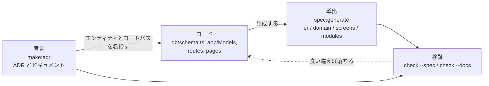

# スペックアンカード開発

AI エージェントがコードを書く速さに、人が手でドキュメントを正しく保つ作業は追いつきません。Guren はこの問題に 1 つの原則で応えます。

> **導出できるものは導出し、できないものは宣言し、常に検証する。**
> (Derived where possible, declared where not, checked always.)

- **導出(Derived)**: コードから裏付けられるものは、コードから生成します。ER 図、ドメインモデル、画面一覧、モジュールマップ、エンティティの完全なコンテキストがこれにあたります。
- **宣言(Declared)**: 意思決定、ビジネスルール、背景のようにコードで表せないものは文書に書き残し、関係するコードへ明示的にリンクします。
- **検証(Checked)**: 導出したものも宣言したものも、機械的に検証します。生成ビューが古くなったり doc リンクが切れたりすれば、コードレビューを待たずにチェックが失敗します。

こうしておけば、コードが変わっても仕様は正しいまま保たれます。人にとっても、リポジトリで作業するどのエージェントにとっても同じです。

3 つの層の関係を図にすると、次のようになります。



## 導出: スペックビュー

スペックビューは次のコマンドで生成します。

```bash
bunx guren spec:generate
```

このコマンドは `docs/spec/` に 4 つの Markdown ビューを生成します。ビューごとに、答える問いが 1 つずつ決まっています。

| ファイル | 答える問い |
|------|--------------------|
| `er.md` | データベースはどんな形か。`db/schema.ts` から作る Mermaid の ER 図で、カラム・型・キーを載せ、エッジはモデルのリレーション宣言から引く |
| `domain.md` | ドメインオブジェクトは何か。モデルをモジュールごとにまとめたクラス図(カーディナリティ付き) |
| `screens.md` | 各画面は何を受け取るか。ページ → Props 型 → そのページを描画するルート |
| `modules.md` | アプリはどう分かれているか。モジュール、そこに属するモデル、モジュール間の依存 |

出力は決定的で、コードを変えずに再生成すればバイト単位で同じ内容になります。そのためファイルはコミットしておき、PR の diff を見ればその変更が仕様をどう変えたかがそのままわかるようにします。ファイルは手で編集しないでください。人の注意に頼らずに済むよう、ドリフトを検出するゲートを用意しています。

```bash
bunx guren check --spec    # メモリ内で再生成し、ドリフトがあれば非ゼロexit
```

## 導出: エンティティコンテキスト

次のコマンドで、1 つのモデルについてプロジェクトが知っていることをまとめて取り出せます。

```bash
bunx guren context User
```

出力には、テーブルとカラム、双方向のリレーション、バリデーションスキーマ付きのルート、コントローラのアクション、Props 付きの Inertia ページ、Resource、Policy、ファクトリ、シーダー、テスト、そしてモデルに紐付いたドキュメントが含まれます。エージェントに渡すときは `--json` を付けます。同じ名前のモデルが複数あるときは `--module <name>` で指定します(`--module app` はアプリルートを指します)。MCP で接続しているエージェントは、`guren_entity_context` ツールから同じ内容を受け取れます。

## 宣言: ドキュメントとコードの紐付け

意思決定やビジネス上の背景は、`docs/`(および `modules/<name>/docs/`)の下に Markdown で残します。このディレクトリは [Open Knowledge Format](https://github.com/GoogleCloudPlatform/knowledge-catalog/tree/main/okf)(OKF)のバンドルです。各文書は YAML frontmatter 付きの Markdown で、フォーマットが必須とするフィールドは `type` だけです。リレーションは、ふつうの Markdown リンクと、Guren が検証する拡張フィールドで表します。

```yaml
---
type: adr
status: stable            # draft | stable | deprecated(省略時 = stable)
entities: [Invoice]
related:
  - app/Http/Controllers/InvoiceController.ts
  - modules/billing/**
generated: { by: human:ada, at: 2026-07-25T09:00:00Z }
verified: { by: human:grace, at: 2026-07-26T09:00:00Z }
---
```

- `entities` には、リンクするモデルをクラス名で書きます。次にそのモデルを触る人が `bunx guren context Invoice` を実行すると、この文書が表示されます。
- `related` は、モデル以外のコードに関わる文書から、そのファイルや glob へ張るリンクです。`entities` と `related` はどちらも、Guren が生産者として OKF に加えている拡張です(OKF は追加のキーを明示的に認めています)。
- 本文中のふつうの Markdown リンクは OKF 自身のリレーションの仕組みで、これも検証の対象です。`[orders](/adr/0002-orders.md)` はその文書が属する `docs/` バンドルのルートから、相対パスは文書の場所から解決します。
- `generated` と `verified` には、誰が書いて誰が確認したかを OKF の actor の書き方(`human:<id>`、`process:<id>`、エージェントなら `<producer>/<version>`)で記録します。エージェントが保守する文書群では、この来歴が文書を信頼する根拠になります。
- モデルとコントローラからは、JSDoc タグで文書へ逆向きのリンクを張れます: `/** @docs docs/adr/0001-billing.md */`(ほかのファイルに書いたタグは読み取りません)
- `issues` には、その文書に関係する GitHub の Issue や Pull Request を書きます: `issues: [412, "acme/shop#398", https://github.com/acme/shop/pull/9]`。番号だけを書くと、アプリ自身のリポジトリ(`origin` リモートから判断)を指します。`#412` の形で書くときは引用符で囲んでください。引用符のない `#` は YAML ではコメントの始まりになり、行の残りが無視されます。タスク一覧、進捗、担当者は Issue の側で管理し、文書には意思決定とこのリンクだけを置きます。`guren check` は読み取れない項目を警告しますが、GitHub には一切問い合わせないので、ゲートはオフラインのまま動きます。

意思決定は、ジェネレータを使って記録します。

```bash
bunx guren make:adr "Billing cycle is end-of-month" --entity Invoice --issue 412
```

これで `docs/adr/` の下に番号付きのファイルができ、frontmatter も記入された状態になります。`--entity` を付けると既存のコードから `entities:` と `related:` が補完され、`--by` を付けると `generated.by` の actor(既定は git の作者)を上書きできます。`--issue`(カンマ区切りで複数指定可)は `issues:` を埋めます。新しく作った Guren アプリには、この規約を説明するシード ADR が最初から入っています。

`bunx guren context Invoice` の出力の最後には **Linked issues** セクションが付き、リンクされた文書が宣言している Issue が並びます。次にそのモデルを触る人が、すでに紐付いている作業に気づけるようにするためのものです。内容は frontmatter だけから読み取ります。`--live` を付けると、`gh` を使って各 Issue の状態、担当者、ラベル、タイトルを問い合わせます(リポジトリごとに 1 クエリで、本文は取得しません。タイトルは外部から来た文章であり、指示として扱いません)。`gh` がない、ログインしていない、応答が遅い、のいずれの場合もセクションにその旨が表示され、オフラインで作った一覧はそのまま残ります。GitHub が原因でコマンドが失敗することはありません。番号だけの参照を `origin` リモートとは別のリポジトリに向けたいときは、`--repo owner/name` を使います。MCP ツールの `guren_entity_context` も、同じ `live` と `repo` の引数を受け付けます。

## 閲覧: ドキュメントビューアー

`bun run dev` を実行すると、読み取り専用のビューアーも `http://localhost:3333/_guren/docs` にマウントされます(`dev` スクリプトの `GUREN_DOCS=1` で有効になります。本番では起動せず、自分のマシンからしかアクセスできません)。ビューアーはバンドル全体を、文書・エンティティ・コードパスをノード、検証済みのリンクをエッジとするインタラクティブなグラフとして描きます。ノードをクリックすると、その文書が frontmatter、信頼度(trust tier)、リンクの検証結果とあわせて開きます。図は `devDependencies` に `mermaid` があれば描画されます(新しいアプリには最初から入っています)。


「自分のマシンからしかアクセスできない」は、前提として期待しているだけでなく、実際に強制しています。ランタイムが接続元をループバックアドレスだと確認できたリクエストだけを処理し、判定できないリクエストは通さずに `403` で拒否します。`bun run dev` はこの情報をランタイムに渡すので、ふだんのワークフローでは追加の設定は要りません。別の方法でアプリを起動していて、ランタイムが接続元を報告できない場合は、拒否のメッセージで `GUREN_ALLOW_UNVERIFIED_PEER=1` が案内されます。この変数は、ネットワークからアクセスできないホストでだけ設定してください。`/_guren/mcp` の MCP エンドポイントも、同じガードで守られています。

ガードが確かめるのは接続元で、呼び出し元のアプリまでは見ていません。接続を手元で終端して開発サーバーへ転送するもの(リバースプロキシ、コンテナのポート公開、ngrok のようなトンネル)はループバックの接続元に見えるので、その背後から来たトラフィックも受け入れてしまいます。`GUREN_MCP=1` で起動した開発サーバーの前にトンネルを置かないでください。MCP エンドポイントはプロジェクトにファイルを書き込めます。

## 検証: ゲート

`bunx guren check` は、route/controller/page の整合性チェックと一緒に、切れた doc リンク(名前が変わった `related` のパス、存在しなくなったエンティティ、行き先を失った `@docs` タグ)と古くなったスペックビューも報告します。オプションなしのコマンドは結果を表示するだけで、CI のゲートとして非ゼロで終了させるにはスイートのフラグを使います。

```bash
bunx guren check --docs    # docリンクのみ
bunx guren check --spec    # スペックドリフトのみ
bunx guren check --arch    # アーキテクチャ境界のみ
```

docs と spec のチェックは、対象があるときだけ動きます。`docs/` も `docs/spec/` も `@docs` タグもなければ結果は 0 件なので、この規約を取り入れるまでは何も赤くなりません。`check --changed`(エージェントハーネスの edit hook が、ルート・コントローラ・モデル・スキーマ・ページを編集したあとに実行するモード)では、その変更が影響しそうな範囲に絞って検証するので、編集のたびに走らせても待たされません。CI ではゲートがすべて走ります。

## なぜエージェントに効くのか

AI エージェントにとって、古いドキュメントはないよりも害があります。書かれている誤りを、エージェントはそのまま信じて読むからです。導出ビューはコードから再生成され、宣言したリンクは check スイートが検証しているので、`bunx guren context Invoice` を実行したエージェントが受け取るコンテキストは、リンクと導出ビューが正しいとチェッカーが確認したものになります(本文が新しいかどうかは文書ごとに宣言します。OKF の `stale_after: <date>` を設定した文書は、その日を過ぎると警告が出ます)。新しいアプリのエージェントハーネスは、この流れをエージェントに教えます。モデルに触る前にエンティティコンテキストを取得する、ファイルを動かしたら同じ変更で frontmatter も直す、構造を変えたらスペックビューを再生成する、といった内容で、edit hook がそれを機械的に守らせます。

## 次のステップ

- [Why Guren](./why-guren.md): フレームワークのエージェントネイティブな設計の中での位置づけ。
- [CLIリファレンス](./cli.md): 全コマンド、フラグ、CI での使い方。
- [アーキテクチャ](./architecture.md): 導出ビューの土台になっている規約。
